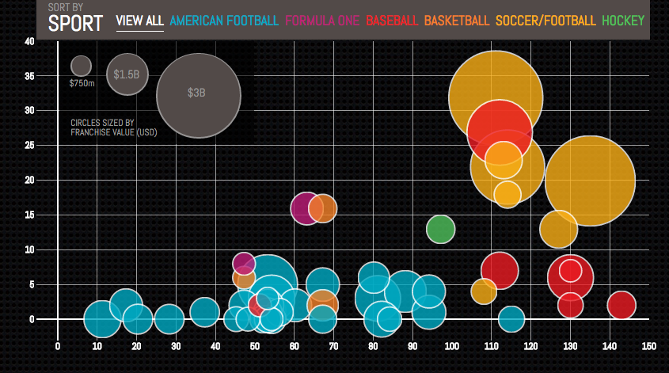
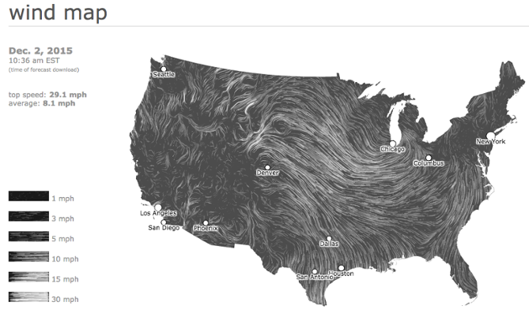
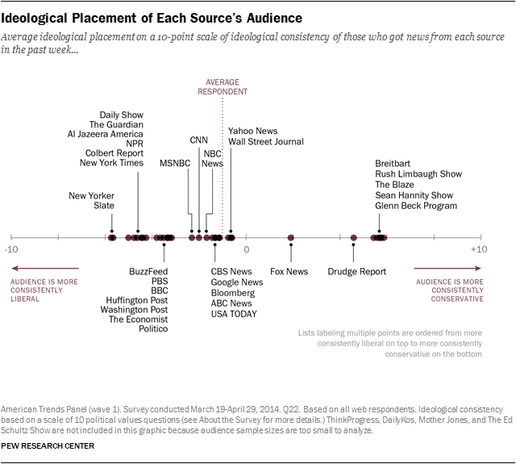
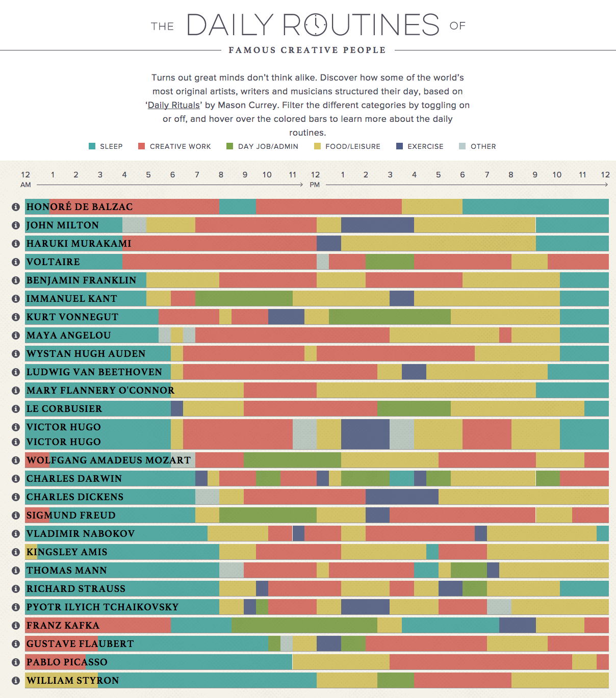
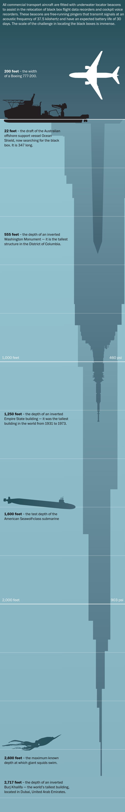

_通过查看一系列数字和统计数据来获得清晰的概念并不容易。您必须以合理、易于理解的方式呈现数据。实验表明，人脑处理视觉信息比处理文本好得多，因此，使用图形、图表能更好的帮助你轻松地解释趋势和统计数据。但并非所有数据可视化都是平等的。为什么有的可视化项目让人着迷，有的可视化看起来像垃圾呢？如何以既引人注目又容易领会的方式组织数据呢？DataFocus将带大家从以下16个数据可视化示例中获取灵感，看看这些示例何以能够传达不同风格和内容的有趣信息。_

## **什么是数据可视化？**

数据可视化是指在视觉上下文中表示数据，如图表或地图，以帮助人们理解该数据的_重要性_。

虽然文本形式的数据可能真的令人困惑，但以可视化格式表示的数据可以帮助人们更快速，更轻松地从数据中提取意义。您可以挖掘出未被发现的模式，趋势和相关性。

数据可视化可以是静态的或交互式的。几个世纪以来，人们一直在使用静态数据可视化，如图表和地图。交互式数据可视化更新一点：它允许人们使用他们的计算机和移动设备深入研究这些图表和图形的细节， 然后以交互方式更改他们看到的数据以及处理方式。

准备好了吗？让我们来看看交互式和静态数据可视化的一些很好的例子。当您准备构建自己的数据可视化时，你可以尝试使用DataFocus的搜索式可视化分析功能，体验一下当下最智能的数据可视化工具。

## **交互式数据可视化的示例** 

### 1）  **为什么公交车会聚集？**

这是一个复杂数据集的精彩示例，看起来就像是个游戏。在这个可视化中，Setosa的人们正在展示如何发生“总线聚集”，即当公共汽车被延迟并且之后导致多辆公共汽车同时到达一个站点时。

单单用数字讲述这个故事将是相当困难的，但相反，他们把它变成了一个互动游戏。当公共汽车沿着路线旋转时，我们可以点击并按住按钮来延迟公共汽车。然后，我们就会观察到，即使短暂的延迟，也会导致公共汽车在一段时间后聚集在一起。

### 2）**世界语言**

DensityDesign的这种互动图形可视化，收集了2,678个非语言学家（也就是我们大多数人）的数据，这个例子允许您探索常见的语言家庭，查看最常用的语言，并查看世界各地的语言。这是一个很棒的视觉叙事：深入学习并以易于理解的方式分解。

### 3）**按年龄组划分的美国人口百分比**

这是如何以令人信服的方式呈现单个数据集的好例子。Pew Research创建了这个动画，以显示人口统计数据随时间的变化。这种类型的微内容很容易在社交上分享或嵌入到博客中，从而扩展了内容的传播范围。

### 4）**NFL的完整历史**

体育世界拥有丰富的数据，但这些数据并不总是有效地呈现（或准确地说，就此而言）。然而，FiveThirtyEight计算了所谓的“Elo评级” - 一种基于游戏结果的简单力量衡量标准，用于评估美国国家橄榄球联盟历史上的每一场比赛。这总共超过30,000个评级。观众可以比较每支球队的Elo，看看每支球队在几十年的比赛中表现如何。

### 5）  **美国感恩节对谷歌航班**

这是一种在给定时间内，将太空中移动的东西进行可视化的好方法。这个由Google趋势提供支持，该趋势跟踪了感恩节前一天飞往美国的航班。从第一天开始，随着时间的推移像电影一样播放，显示在全国各地移动的航班。在没有显示任何数字的情况下，观众可以看到一天中哪些时段更适合国际航班，国内航班以及往返全国不同枢纽的航班。

### 6）  **真正改变世界的是什么？**

“不要只是简单地显示数据，用它来讲故事”？这正是彭博商业的这种可视化所做的，而且它是使故事从头到尾移动的互动部分。可视化的目的是反驳那些声称自然原因可以解释全球变暖的理论。你会看到的第一件事是观察到的温度，从1880年升至现在。当您向下滚动时，可视化将引导您了解与观察到的相比有多少不同因素导致全球变暖，从而增加了更丰富的故事层。作者希望观众得出的结论非常明确。

### 7）**在叙利亚谁与谁在战斗？**

许多不同群体之间的关系可能难以理解 - 特别是当有11个群体时，其中许多群体与他们通常不和的群体在同一侧，反之亦然，这令人困惑。但是使用表格格式和熟悉的视觉效果和颜色，_Slate_的人们将这些数据简化为简单、易于理解和交互的格式。

观看者可以单击任何面，以获得关系的简洁描述。

### 8）**最有价值的体育特许经营权**

这是一个通过添加数据来讲述更深层次故事的示例。这个由第五纵队创建的互动灵感来自_福布斯“_2014年最具价值体育运动50强”排行榜。但是，交互信息还可以让用户看到每个团队参加比赛的年数以及赢得的锦标赛数量，而不仅仅是对列表进行可视化。这提供了一个更全面的视图，了解每个团队作为特许经营的成功历史。

### 9）**美国风图**

这是一个类似于感恩节航班的可视化，这次它实时显示了美国所有当前的风速和方向。这是直观设计的一个很好的例子：速度由缓慢或快速移动的线条表示，方向由线条移动的方向表示。除非您点击地图本身，否则立即清楚一般趋势是什么而不需要数字。此外，将变量数量限制为两个使得更容易遵循。

## **静态数据可视化的示例**

### 10）  **新闻受众政治适应光谱**

通常，当设计师有大量不能遗漏的文本时，他们通常会将这些信息组织到数据表中，以使其更紧凑。分布图可以让观看者看到每个媒体出口在频谱上的位置。在这张谱图上，每个媒体出口之间的距离是显著的。如果这些商店在表格中一个接一个地列出，观众将无法看到每个商店的位置。

### 11）**著名创意人的日常生活**

这种数据可视化是一个非常简单的概念。使用Mason Currey 出版的_Daily Rituals_ 一书中的信息，该网站展示了按时间和活动细分的著名创意的每日时间表。这不仅是一个吸引人得数据可视化例子，它也是一个精彩的品牌编辑。

### 12）**新闻年**

数据可视化以直白和美观的方式传达信息。Echelon Insights用这件作品钉住了它，它在Twitter上展示了2014年最受关注的新闻报道。什么是1.845亿条推文？Rad旋转艺术。

### 13）**深度问题**

当您想要说明比例时，静态数据可视化可以成为您的重点。“ _华盛顿邮报”_ 下面的信息图--非常长...而且这是故意的。在这种情况下，他们展示了通过比较高层建筑的深度，已知哺乳动物的最大高度，泰坦尼克号沉船的深度等等，可以检测出飞机深海信号的疯狂程度。它很好地利用了简单的视觉效果和色彩渐变。最后，将数据添加到新闻报道（在这种情况下，失踪的马来西亚客机）是提供背景的好方法。

_（有关完整尺寸的可视化）_

### 14）**NASA的钱都用到哪儿了？**

这个由GOOD杂志和第五纵队创建的信息图曝光了美国宇航局的五年预算，以显示资金的使用方式和地点。 

### 15）**Caritas Kontakladen年度报告**

并非所有数据可视化都需要设置动画。当用现实生活中的例子可视化现实世界的数据时，结果可能令人惊叹。设计师Marion Luttenberger采用了独特的方法来处理Caritas Kontakladen年度报告中包含的数据。该组织为奥地利的戒毒者提供支持，因此Luttenberger专注于通过现实生活中的视觉传达使命。例如，这个购物车可视化代表了福利接受者每天可以负担的生活必需品的数量。

### 16）**你了解你的数据趋势吗？**

DataFocus展示了一个简单的描述数据随时间变化的方法。新颖的不是这种可视化的类型--这种互动性质的可视化项目已经出现过很多次了。有创意的是，这个可视化作品是一瞬间就可以创造出来的。通过DataFocus的简单搜索就可以实现它，这真的很神奇。

****
