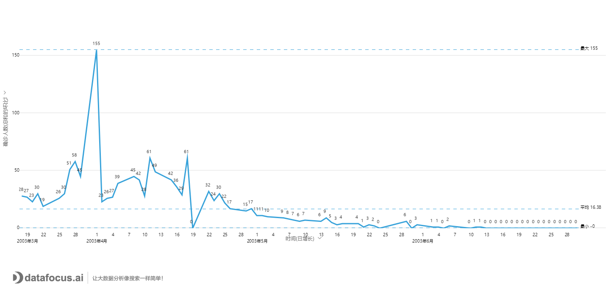
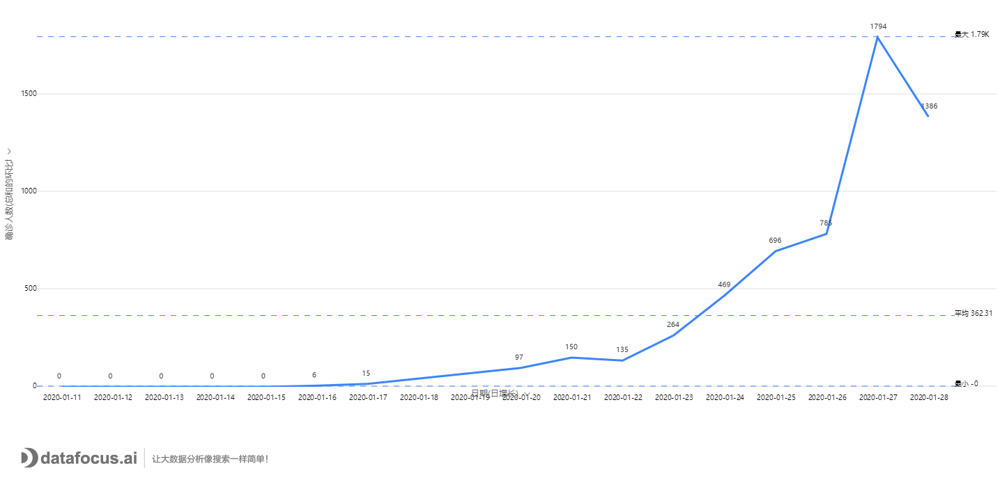

_SARS和2019-nCoV同属于一种引起致病性肺炎的冠状病毒，其传播途径、方式和致病机理有相似性，这是本文对两种病毒的疫情分析的假设前提。本文SARS数据整理自WHO的公开数据；2019-nCoV的疫情数据摘录自国家卫健委公开发布的数据。_

2003年非典疫情回顾

从2002年12月5日，世界首例非典病人被发现，到2003年3月15日，世界卫生组织正式将该病命名为SARS为止，病程持续近8个月，确诊人数8069人。 从下图中可以看出确诊人数在3月25日之后从456例跃升到1323例，原因是WHO统计数据中正式加入了中国大陆的病例统计，到6月1日时，增长明显放缓，进入到7月，病情基本消散。

_2003年全球确诊非典人数统计_

确诊病例的统计数据很难看出疫情传播的趋势，确诊人数的日增长量可以得出更直观的结论。由于香港地区的SARS病例数据较为完整，以香港为例，可以看出一开始即以每天近30例的速度增长，到3月28日之后则开始爆发性增长而达到增长高峰。其后又开始平稳增长直至4月12日达到第二个小高峰、4月17日达到第三个小高峰，之后开始缓慢衰减直至6月中旬开始逐步停止增长。

_2003年香港地区SARS确诊人数日增长量统计_

我们来比较一下2003年香港和大陆地区SARS确诊人数日增长量的数据。如前所述，3月25日的峰值数据是由于第一次加入大陆确诊病例数据导致，可以PASS，往后看，第一次增长高峰大陆地区和香港地区均出现在3月29日，并于4月18日共同进入第二次增长高峰。但从4月23日之后，大陆地区开始了第三波增长高峰，而此时香港病例则开始增长放缓。随后的4月29日，大陆地区则开始了第四波增长高峰，之后才开始放缓增长。

_香港、大陆及全球SARS确诊人数日增长量统计_

2003年的SARS疫情共导致774人死亡，其中大陆地区死亡人数348人，香港地区299人。致死率接近十分之一。从下图可以看出，其中香港地区死亡率最高，达到17%，大陆地区为6.6%，全球平均为9.6%。

_香港、大陆及全球的SARS死亡率统计_

1. nCoV疫情的统计数据分析

第一例2019-nCoV感染患者发现于2019年12月1日，经过医务人员和病毒专家的努力，2020年1月9日确诊为新型冠状病毒。从下图的数据可以看出，从2020年1月10开始，接近一周的时间内，确诊病例一直都没有增加，均为41例。从1月17日开始，病例明显增多，直至迅速爆发。

_国家卫计委统计2019-nCoV确诊人数统计_

_2019-nCoV确诊人数日增长量统计_

从上图可以看出，确诊病例的增长量一开始以较低的斜率增长，之后快速攀升，迅猛增长至日均上千例。这比SARS大很多，说明新型冠状病毒的传染性远超SARS，确诊人数于2月27日出现第一个明显的峰值。考虑到目前病例的确诊存在检测瓶颈，也许我们应该参考疑似病例+确诊病例的数据更为合适。从下图可以看出，2月27日的峰值可能还不是最大值，应该继续观察。

_2019-nCoV确诊、疑似以及确诊和疑似之和的日增长量统计_

与SARS相比，新型冠状病毒的致死率要低得多。从有统计的数据来看，平均致死率绝对低于5%，随着后期确诊病例的增多，死亡率很可能再降低一个数量级。

_2019-nCoV死亡率统计_

值得注意的是，大多数人未注意此次疫情的患者密切接触人数和接受医学观察人数的统计，下图可以看出，疑似人数比确诊人数高出近一倍，而接受医学观察的人数比疑似人数大出一个数量级，这是个潜在的风险点。

_2019-nCoV确诊、疑似及医学观察人数统计_

新型冠状病毒疫情的发展趋势

两种病毒自身的传染性和致病能力有所不同，参考凤凰网的一篇文章，SARS的R值（每个病毒携带者平均可感染的人数）为2.9，由于非典已经结束，这个数据是准确的。排除超级传播者，平均每个非典患者会传染2.9人。而根据国内外专家的研究数据，2019-nCoV的R值在3.8-6.47之间，这说明其传染力要强于非典。

两种病毒的潜伏期不同。SARS潜伏期为3-5天，2019-nCoV的潜伏期为7-14天。此外，非典患者发病基本都会有发烧症状，重症患者较多，容易甄别；2019-nCoV患者存在不发烧的情况，轻症患者较多，这导致排查、隔离效果会打折扣。

此外，两种病毒爆发的环境不同。SARS爆发于2003年，那时候，我国还没有高铁等快速交通工具，个人乘用车保有量0.12亿辆，国内旅行人数8.7亿人次；2019-nCoV爆发于2019年，我国高铁里程3.5万公里，高铁的速度已经是3倍于普通列车速度，乘用车保有量2.6亿辆，全年国内旅行人数超55亿人次。可以预见的是，此次病毒疫情的爆发速度会更快，波及范围会更广。

从数据可以看出，接受医学观察的人数一直呈线性增长态势，这有可能意味着后续疑似和确诊人数的第一个峰值仍然还没有到来，接下来做好隔离，及时发现感染人员仍然是重中之重的任务。

_2019-nCoV接受医学观察人数日增长量统计_

众志成城，抗炎必胜！

如今中国的综合国力、医疗水平较17年前有质的飞跃，应对手段和处置速度也更快，公民的健康意识远超从前，再加上移动互联网和新媒体技术的发展，使得讯息的传播速度要比从前快得多，这也会有力的抵消病毒发展的不利因素。只要大家积极主动做好防护，听取国家、政府和专家的安排和建议，我们战胜此次疫情一定指日可待！
