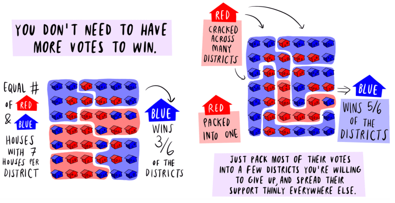
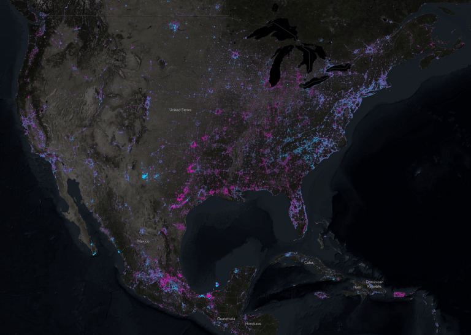
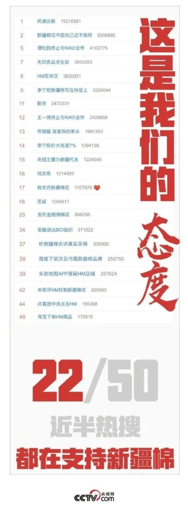
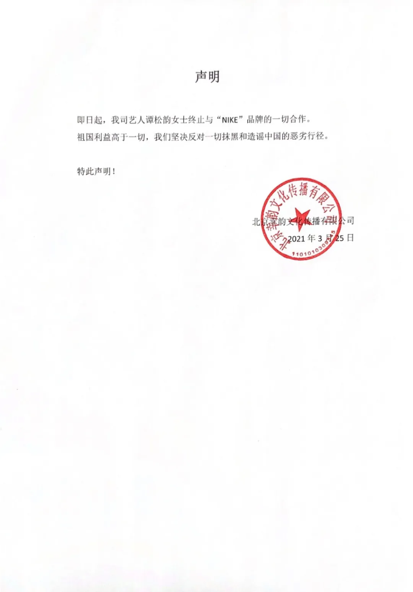
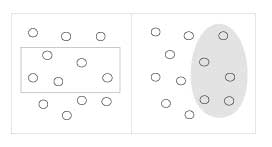

_作者：Nathan Yau_

DataFocus按：可视化快发展成一项平民技术了，但是正如一句话说的--“好看的皮囊千篇一律 有趣的灵魂万里挑一”，优秀的可视化作品能直指内心，给你带来视觉震撼。让DataFocus君带你一起来欣赏2017年10大优秀可视化作品吧。

## 1、改变Gerrymandering的数学

奥利维亚·瓦尔奇（Olivia Walch）用漫画形式解释了格里曼（gerrymandering），这比你在高中生课堂上读到的那一章精彩多了。

## 2、卡西尼号的巡回赛

绕土星运行的卡西尼号卫星准备好撞击土星大气层。国家地理的Nadia Drake和Brian T. Jacobs详细介绍了卡西尼号13年的旅行及其发现的情况。再见，卡西尼！

## 3、你怎么画圆圈？我们分析了100,000张图纸，以展示文化如何塑造我们的直觉

Google Quick，Draw！数据集今年允许了许多有趣的项目。Thu-Huong Ha和Nikhil Sonnad专注于人们如何画圆圈以及它如何随人口统计而变化。我尝试把手绘与不同文化建立联系。

## 4、灯亮＆熄灯

约翰·尼尔森将2012年地球夜间卫星图像与2016年版本进行了比较，以估计世界上新的灯光变化。

## 5、信任的演变

Nicky Case是现实世界系统中的解释者，他深入研究了博弈论和信任的演变。这个游戏_，会让_你学到不少东西。

## 6、破解蛋形的神秘面纱

不同类型的鸟类产下不同形状的蛋，但科学家直到最近才知道为什么。Sarah Crespi和Jia You，运用数据可视化的科学，为你揭晓藏在蛋蛋中的秘密。

## 7、数据草图

也许每个人都应该与Buddy system一起工作。这张数据草图是Nadieh Bremer和Shirley Wu合作的成果。每个月他们都会选择一个主题，创建一个通常非传统的互动图形。

## 8、布丁

这个为期一年的“视觉论文期刊”是一个雄心勃勃的项目，旨在帮助其他人通过数据和图表理解复杂的主题。从可视化角度，编辑角度和商业模式来看，非常有趣。

## 9、这是你一生中发生的每次日全食

日全食有很多图形，但是Denise Lu为华盛顿邮报设计的这张图片是我最喜欢的。

## 夏天真的越来越热了

Nadja Popovich和Adam Pearce使用直方图来描绘夏季气温，这对于广大观众来说并不容易。

荣誉奖：一只愤怒的小鸟

Periscopic的这件作品使用羽毛比喻来表示就职演说中的情感，这是2017年的一个很好的代表。

荣誉奖：Sunsquatch

Joshua Stevens的这张地图显示了大足野人的目击区域和日全蚀路径之间的重叠。 这些数据来自NASA的数据。

最后，你也可以运用DataFocus对你的数据进行分析和可视化展现，不一定能做出上面这些充满个性的图来，但是通过搜索就可以进行可视化呈现，的确值得你去体验。
