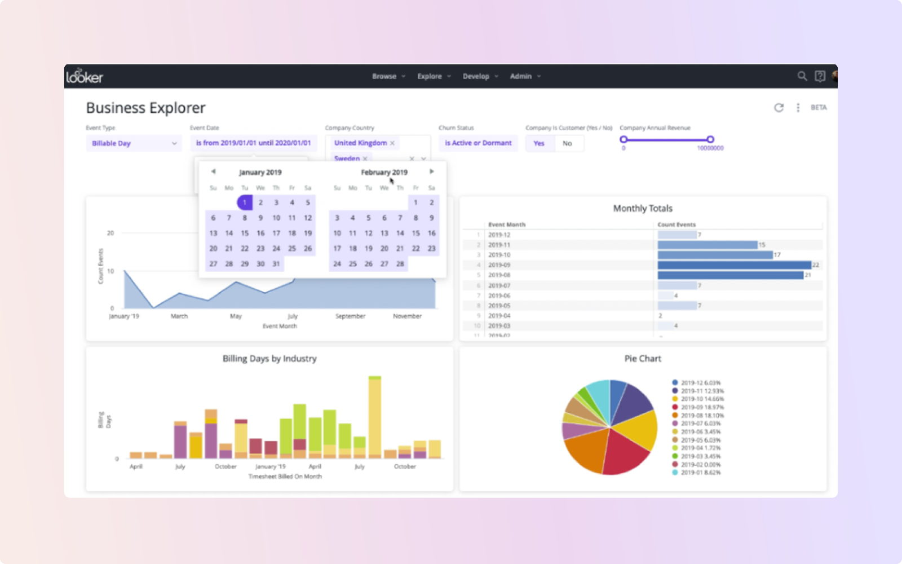

随着数据分析的迅速发展，新锐的BI（Business Intelligence）产品层出不穷。这些产品不仅具备强大的数据分析和可视化能力，还融合了最新的技术趋势和创新理念。在本文中，我将向大家推荐2023年的top10新锐BI产品，其中包括了DataFocus这一颇具潜力的数据分析工具。

**DataFocus** DataFocus是一款备受瞩目的新锐BI产品。它以强大的搜索和问答式交互为核心，帮助用户快速获取数据洞察。通过自然语言查询和智能搜索，DataFocus使非技术人员也能够轻松进行数据分析和探索。其灵活的可视化工具和智能推荐功能进一步提升了用户体验。DataFocus在2023年将成为许多企业的首选BI工具。

**Looker** Looker是一款强大的云端BI平台。它通过强大的数据整合和可视化能力，帮助用户从多个数据源中获取洞察。Looker提供了灵活的自助式分析工具，用户可以根据自己的需求自由探索数据。其团队协作和共享功能使得多人共同分析数据成为可能。Looker在2023年将继续引领BI领域的创新。

**Holistics** Holistics是一款专注于数据可视化和报告的新锐BI工具。它提供了简单易用的用户界面和强大的可视化功能，使用户能够轻松创建和分享数据报告。Holistics支持多种数据源的整合和连接，并提供了丰富的图表类型和报表模板。在2023年，Holistics将成为数据可视化领域的佼佼者。

**Domo** Domo是一款以云计算为基础的综合性BI平台。它通过强大的数据整合和分析能力，帮助用户从各个角度深入了解业务情况。Domo提供了丰富的数据可视化工具和仪表板功能，用户可以快速创建交互式的数据报表和仪表板。Domo在2023年将继续拓展其在BI市场的影响力。

**ThoughtSpot** ThoughtSpot是一款注重自助式分析和搜索的新锐BI产品。它通过自然语言查询和智能搜索，帮助用户快速找到所需的数据和洞察。ThoughtSpot的用户界面简洁直观，使用户能够轻松上手和使用。它提供了交互式的数据可视化工具，用户可以通过拖拽和放置来创建图表和仪表板。在2023年，ThoughtSpot将继续引领搜索式BI的发展。

**Sigma Computing** Sigma Computing是一款强大的云端数据分析平台。它提供了简单易用的界面和强大的自助式分析功能，使用户能够自由地进行数据探索和分析。Sigma Computing支持多种数据源的整合和连接，并提供了高级分析和机器学习功能。在2023年，Sigma Computing将为用户带来更多的数据洞察和价值。

**Pyramid Analytics** Pyramid Analytics是一款以自助式分析为特色的BI工具。它提供了强大的数据整合和可视化能力，用户可以通过自助式分析来探索数据并生成交互式的图表和报表。Pyramid Analytics支持多种数据源的连接，并提供了高级分析和预测功能。在2023年，Pyramid Analytics将继续推动自助式分析的发展。

**Yellowfin** Yellowfin是一款注重数据可视化和报告的新锐BI工具。它提供了丰富的可视化工具和仪表板功能，用户可以轻松创建和分享数据报告。Yellowfin还支持自助式分析和智能报告生成，帮助用户更好地理解和呈现数据。在2023年，Yellowfin将继续创新并满足用户的不断变化需求。

**Tableau** Tableau作为一款领先的数据可视化工具，将继续在2023年保持其领先地位。它提供了丰富的数据可视化和探索功能，用户可以通过拖拽和放置来创建交互式的图表和仪表板。Tableau支持多种数据源的连接，并提供了高级的数据分析和预测功能。在2023年，Tableau将继续为用户提供强大的数据分析和可视化工具。

**Mode Analytics** Mode Analytics是一款以数据科学为重点的新锐BI工具。它提供了强大的数据整合和分析能力，用户可以通过自助式分析来探索数据并进行数据建模和预测。Mode Analytics支持Python和R等常用的数据科学工具，帮助用户更深入地理解和挖掘数据。在2023年，Mode Analytics将继续推动数据科学和分析的发展。

**总结：**

在2023年，新锐的BI产品将继续在数据分析领域发挥重要的作用。这些产品以自助式分析、数据可视化和智能搜索为特点，帮助用户快速获取数据洞察和进行业务决策。其中，DataFocus作为一款备受瞩目的新锐BI产品，通过其强大的搜索和问答式交互功能，为用户提供了快速、智能的数据分析体验。同时，还有Looker、Holistics、Domo、ThoughtSpot等产品，它们在数据整合、可视化、自助式分析等方面都具备卓越的能力。这些新锐BI产品将在2023年持续推动数据驱动决策和业务优化的发展，为企业带来更多的商业价值和竞争优势。无论是在数据探索、可视化还是数据科学等方面，这些产品将为用户提供更加灵活、智能的数据分析解决方案，助力企业在竞争激烈的市场中取得成功。
