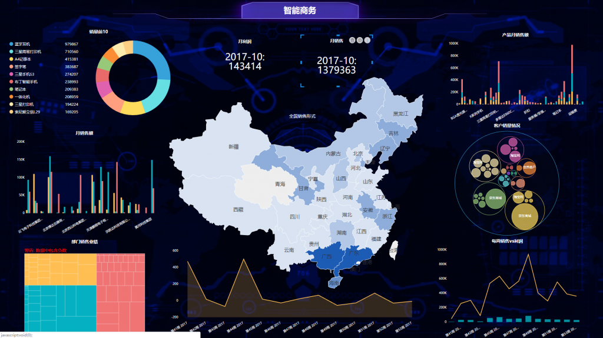

为了设计出大多数人能够使用的可视化数据分析项目，市场中做了一项调研。世界上有10%的男性和1%的女性色盲，这就意味着在可视化效果和仪表盘中这些人无法识别色调光谱。最大的色盲群体为红色和绿色两种色盲症状，所以在datafocus的色调选择中要避免这两种颜色的出现。在datafocus中有一个选择工具会考虑到色盲因素来控制调色板。下面我们讲解这种调色板的设置。

**可视化数据分析中调色板取决于数据的本身**

**在可视化数据分析中大部分数据会分为定量类型和分类数据**

1、分类数据是以不同的称号来为数据分组的，它具有附加的顺序属性这一特性。

2、定量类型是以数值型为主，比如测量的数据、字数等。

3、这些分类数据和定量类型是很难区分开来的，在开发商为了好区分这些数据。在调色板的设置上多下功夫来区分这两者。在使用颜色上表现定量数据的时候一定要仔细才能凸显出这两种的区分。

为了让所有的人都适应可视化数据分析，在调色板的设置上是非常重要的。在大多数人认为色盲只是看到的是灰白色，但是有些颜色他会根本看不见。为了让这些群体能够看见datafocus，所以在调色板的设置中一定要避免红色和绿色，做到人人可视化。
