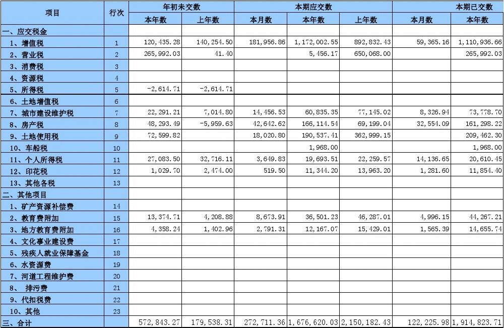
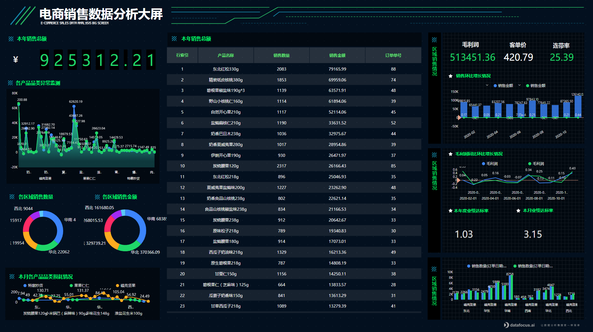
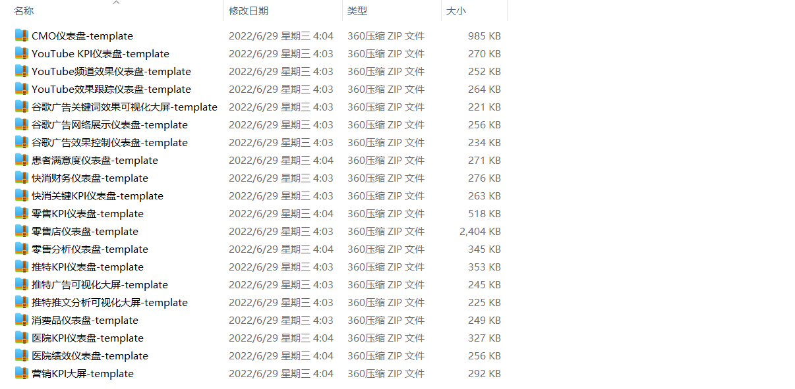
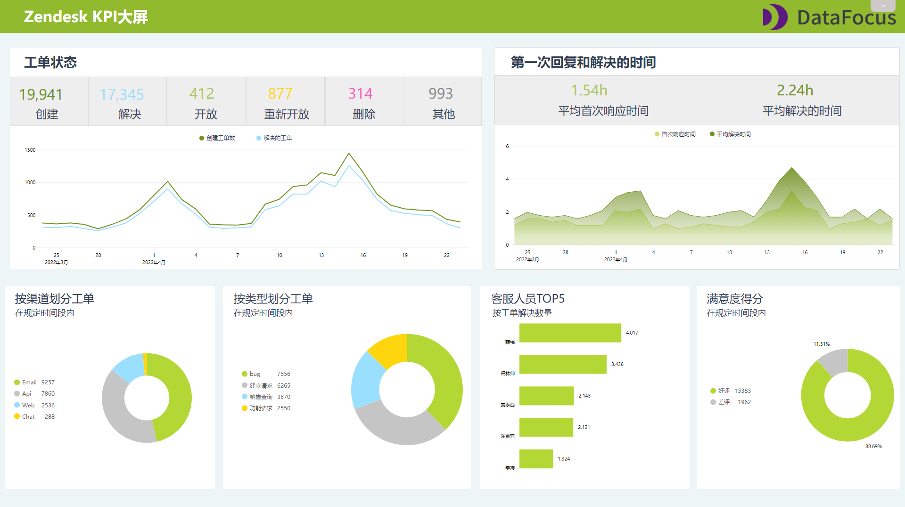

一位从事财务岗位的朋友跟我抱怨：这个月部门的财务状况整体表现不太好，甚至还成为有史以来最低的成绩。老板特意找他聊，让他准备下财务报告好好分析原因。可他辛苦做的财务报告已经被打回去重做好几次了，于是问我该怎么办。

于是我问他，那你做的财务报告做的怎么样了？

他给我展示了那份做了三天的报告，让我提点建议，**图片大致如下**：

我说，数据整理出来展示是为了体现出你分析的价值，而不是复杂数据的堆砌。

可能你的财务统计能力是挺不错的，可是老板要的是你分析结果，所以你的数据分析、汇报等综合能力也得有所提升。当今社会已经不再是只看你的单一能力了，而是需要你成为综合型人才。**就拿做报告这件事来说，你可以清晰地统计出数据，但不会分析，一切都白搭。**

我给他看了下我用搜索式BI工具DataFocus做的报表，**到底哪份报表更能获得老板的认可？**

**相信99%的人都会觉得下面这张报表更优秀。**

也许有人会认为，做财务还需要会数据分析？那不是强人所难吗？光是做好财务计算和统计，就已经够了。

可是并不是这样，老板要的不是数据，而是数据背后的结论。然而大多数人都不明白这个简单的道理，数据本身没有意义，数据背后的分析结果才具有高价值。

**当然，你可以只做好这一部分，但你就真的很难升职加薪。**

试问一下，如果我这位朋友拿着他自己做的报表去汇报效果会如何？

恐怕就只是在介绍这个月部门财务情况的数据如何，而没有留下任何结论。因此听他汇报的领导、同事就只是在接收这一信息，内心并没有什么波澜起伏，甚至都不清楚你到底说了什么。

但如果拿着这份BI工具制作的可视化大屏，领导、同事的目光一下就被吸引进来了，而且大屏上还有文字部分，是你对数据的认知和看法。既美观又有干货，相比那些大量堆砌的数据，可要有吸引力和说服力多了。

这就是可视化大屏的魔力！也是你升职加薪的必备能力。

好了能看到这里的朋友相信也不是要光听这些的，还是希望有所实际的收获的。那么在此，我就奉献出我珍藏已久的可视化大屏模板，关注点赞评论即可在评论区私信”模板”，获取这20份可视化大屏模板。

# 先给个大屏汇总：

# 然后是部分报表展示：

最后还是希望各位职场小伙伴们能培养综合性能力，尤其是数据分析能力，已经成为职场必备技能。
