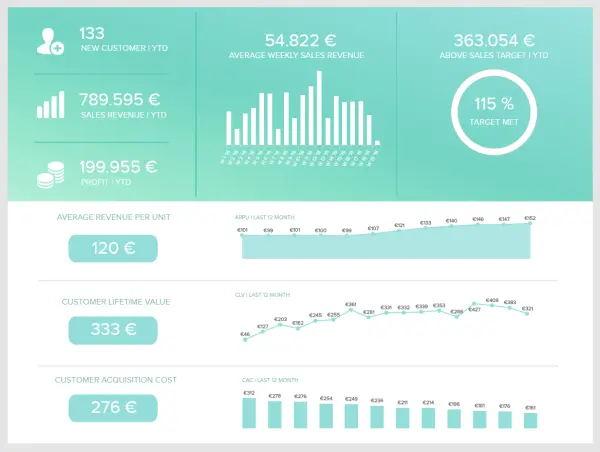
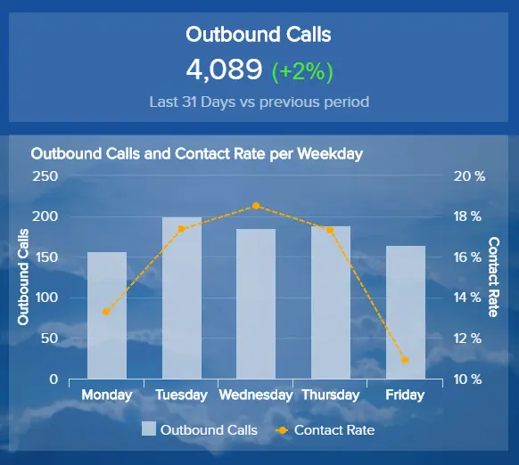
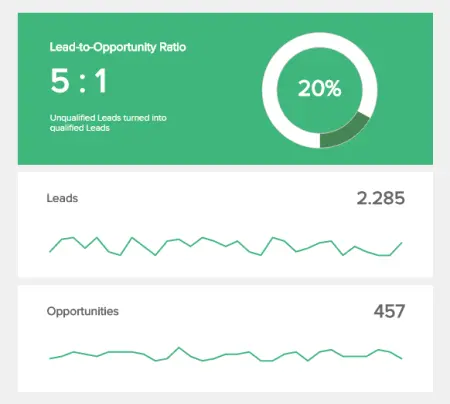
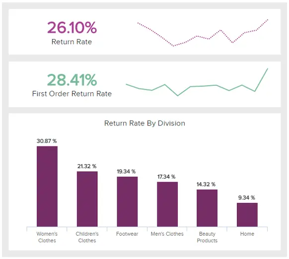
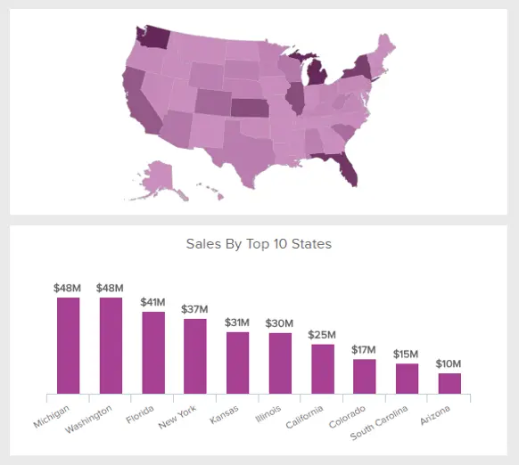
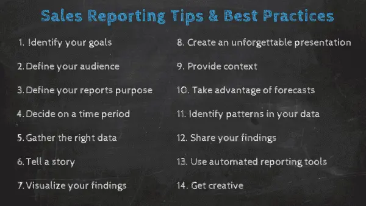

与您的团队一起使用每日、每周和每月销售报告可能是您可以采取的最有力的行动，以提高团队的绩效并产生强大的销售结果。现代销售分析报告为经理和销售代表提供了所有相关销售流程的详细概述，以优化绩效并确保健康的业务增长。由于现代销售报告软件的兴起，[销售报告从未](https://www.datafocus.ai/infos/sales-reporting-software-tools)如此简单，该软件通过提供专业仪表板形式的交互式报告来促进企业的生活，这些仪表板易于创建和理解，每个人都无需任何技术技能。

为了帮助您完成流程，这篇博文将重点介绍通过报告的力量进行销售数据分析，并向您展示：每日、每周和每月销售报告的定义和示例。此外，我们将确切地讨论如何报告销售情况、目的和创建过程，以便您了解每个报告背后的故事，并将它们用作模板或灵感来生成自己的报告。

 

事不宜迟，让我们开始吧。

## 什么是销售报告？

销售报告是一种分析工具，可提供对公司内各种销售活动绩效的见解。借助强大的 KPI，销售团队使用这些报告来查找趋势和见解，以提高其产品和服务的质量。

它们简要介绍了公司在特定时期的演习，以评估情况并确定要做出的最佳决策和要采取的行动类型。这些报告有助于寻找潜在的新市场机会，他们可以通过使用现代在线销售报告软件来改善结果。

它们可以有多种形式：每日销售报告格式将跟踪与日常相关的[销售 KPI](https://www.datafocus.ai/infos/kpi-examples-and-templates-sales)：代表设置的电话或会议数量或创建的潜在顾客。通常，每周销售报告模板可以监视团队完成的交易数量或产生的收入。月度销售报告格式将提供每个销售代表或整个团队活动的更大图景。将所有内容放在[销售仪表板](https://www.datafocus.ai/infos/dashboard-examples-and-templates-sales)上将使您能够自动化数据并专注于以人为中心的任务，而无需耗时的手动计算和重复导出。

报告也有不同的变体，将侧重于不同的方面：一般销售进度，详细说明产生的收入，销售量演变，根据预先设定的销售目标，CLV等进行衡量。还有一些报告侧重于销售代表本身及其销售周期绩效，从潜在客户生成到完成交易。为了帮助您识别各种类型的销售活动报告，下面我们将简要介绍主要报告：

您的机会：[想免费测试现代销售报告软件吗？](https://www.datafocus.ai/console/)立即探索我们的 14 天免费试用版并享受出色的销售报告！

## 每日、每周、每月和季度报告的销售报告示例

## 1\. 8 个月度销售报告模板和示例

月度销售报告用于每月监控、评估、分析和确定销售趋势。它包括对 KPI 的更长期衡量，例如销售周期长度、转换报告和月度进度报告等。

为了更深入地挖掘，我们还将简要介绍一些可以提供帮助的月度销售报告示例。从长远来看，一个月将使您的销售代表更广泛地了解他们的表现，尽管正如我们之前提到的，您可能太长了，无法实施纠正以避免在为时已晚之前错过机会。

1） 销售关键绩效指标报告

我们将从一个销售报告示例开始，重点关注旨在使 C 级高管的生活更轻松的高级指标。这些级别的报告应包括主要指标，例如收入、流失率、利润率、增量销售额等。

这些指标（正如我们在上面的例子中也可以看到的）对于每月跟踪至关重要，因为它们可以改变公司销售策略的过程。销售副总裁、经理和高管可以监控最重要的运营和战略数据，以提高指定销售目标的质量和绩效。通过使用专业的[KPI软件](https://www.datafocus.ai/infos/kpi-dashboard-software)，可以在几分钟内生成此月度销售报告模板。

在上面的示例中，我们可以看到如何在交互式图表的帮助下控制收入和管理，这些图表整合了来自连接数据库的数据，并为您带来了强大的可视化效果，可以讲述即时数据故事。您可以细分成本，监控增量销售，并将结果与上个月进行比较，同时保持数据最新。

2） 销售机会报告

销售经理报告模板应包含机会的管理、开发、监视和分析。这些是漏斗中最突出的线索，需要特别注意和照顾。在专业的 BI 报告工具的帮助下，机会可以在一个中心位置获得，自动数据更新将使您能够实时查看数据，而无需手动优化大量电子表格和静态报告。让我们通过下面的可视化示例来了解这一点：

上面的销售业绩报告示例侧重于各种指标的机会和详细信息。它首先简要概述了当前机会、当前购买价值、平均购买价值以及与上个月相比的胜率。这将立即告诉您您的发展是积极的还是需要额外的调整来改善结果。您可以在下面找到有关流失原因的详细信息，我们可以看到，失去的机会数量最多表明他们选择了竞争对手。您可以使用这些发现来检查竞争对手提供的产品，以及您是否可以相应地调整销售策略，并尝试为您最有前途的潜在客户提供更有价值的东西。

右侧部分阐述了购买价值以及机会，因此您可以跟踪整个月的发展情况，并查看某些高峰期间发生了什么，以重现积极的场景并从消极的场景中学习。

在底部，详细信息将让您知道第一次联系的时间、销售代表、列出的套餐类型、评论以及每个机会的其他细节。这样，您将清楚地看到其他信息，而无需手动搜索电子邮件和电子表格，也无需执行任何手动且耗时的任务。通过采用[商业智能软件](https://www.datafocus.ai/infos/best-bi-tools-software-review-list)，销售经理的关键报告将随时随地集中和访问。此外，您将能够与此仪表板的每个部分共享和交互，这将为您节省无数时间，并最终提高您的生产力水平。

3） 销售周期长度报表

此月度销售报告示例涵盖了您的销售代表的销售漏斗的全部内容，从机会到成交。它将概述每个代表的发展情况，并指出他们在完成交易方面有多好，以及他们需要多长时间才能到达那里。

可视化这些指标将帮助您确定每个人的优势和劣势，为您提供做出相应响应所需的信息。

在我们的销售数据分析示例中，您可以看到平均周期长度为 18 天，而详细信息在此仪表板的下方和右侧显示。像这样的[数据报告](https://www.datafocus.ai/infos/data-report-examples)将确保您全面了解您的周期，同时监控团队中每个销售经理的转化率和周期长度。目标是尽可能缩短销售周期，但这也取决于行业。如前所述，在B2B中，周期长度通常比B2C长得多。从发现机会到完成交易所需的时间越短，您的流程就越有效和有利可图。

4） 销售转化报告

这是一个与前一个模板互补的月度销售报告模板：在达到漏斗的每一步之后，您可以看到您的代表在将潜在客户转化为密封交易方面的效率。

通过分析此漏斗的每个阶段，您有机会确定问题可能发生的位置并解决它，从而提高您的销售转化率。

在我们使用功能强大的[仪表板制作工具](https://www.datafocus.ai/infos/dashboard-creator)创建的销售摘要报告示例中，您可以简单而直接的方式查看潜在客户、机会、谈判、提案和获胜的数量。每月发展显示在顶部，您可以查看过去 30 天内获得了多少转化潜在客户。当您看到某些峰值时，您可以检查当天发生的事情，看看是否可以在下一次会话中应用相同的策略。

您还可以看到 2 个仪表图，这些仪表图可视化了潜在顾客与机会和机会与获胜比率。如果您注意到您的胜利显着增加，您可以放心地假设您的销售代表为您的公司带来了利润。另一方面，如果您发现获胜机会比率停滞不前或下降，您可以检查您的销售代表在销售的后期阶段遇到了什么样的问题。

5） 销售分析报告

我们的下一个示例是在全球范围内销售产品或服务并需要集中查看最新发展的 B2C 业务的完美概述。通过深入了解不同地区的关键收入、利润和产品指标，公司可以提取有关其战略制定的可操作见解，并确定可以改进的地方。

更详细地查看模板，我们得到了一个收入和利润趋势图表，用户可以在其中快速了解每个季度的整体表现。在这种情况下，我们可以看到，与 2022 年第一季度相比，2022 年第二季度的收入和利润大幅下降。现在，仅凭这些数据并不能告诉我们太多关于发生这种情况的原因。要更深入地挖掘，您需要探索报告中包含的其余数据，并从中提取有用的见解。例如，通过按国家/地区和产品图表查看收入，您可以确定表现不佳并影响整体结果的特定地区或产品。在这种情况下，我们可以看到一些收入最高的产品也是利润率最低的产品，这可能意味着可以优化以提高盈利能力的高生产成本。

这个高度互动的销售运营报告可以回答这个问题和许多其他问题。可以轻松筛选此模板中包含的图表，以回答分析过程中可能出现的任何问题。

6） 销售和订单报告

另一个对在线零售商有帮助的月度报告模板。由于要处理的订单如此之多，有时很难跟踪发送的所有内容，但大部分订单都是退回的。增加销量是每个零售商的目标，但设法保持退货流程的循环将在许多层面上为您提供极大的帮助。

在下面的[零售仪表板](https://www.datafocus.ai/infos/dashboard-examples-and-templates-retail)中，首先，您可以查看退回商品的数量，其次分析原因。这是找出问题所在并尽快对其进行故障排除的关键。

如果项目不合适，正如我们在示例中看到的主要退货原因，那么更有效地传达尺寸是有意义的。也许它们在您的在线商店中不够明显，或者它们不符合标准的美国或欧盟尺寸。

这样，您可以轻松提高客户的满意度，我们都知道满意的客户会回来：他/她还可以向他们的朋友和家人推荐您的产品和服务。这几乎就是你想要实现的目标。

7） 外呼报告

电话冷呼叫仍然是销售中使用的最重要的技术之一。这就是为什么我们选择提供这份报告，其中显示了您的出境流程和潜在结果中的各种关键领域。

在这个全面的销售分析示例中，您可以参考出站呼叫趋势、基于联系率的销售团队绩效、已关闭的合同和平均订单价值等生成宝贵的见解。此视觉对象使你能够将发现结果与前一时期进行比较，并了解哪个是执行调用的最有效时刻，以便能够最大化结果和利润。

在我们的示例中，您可以看到联系率在周中最高，而座席表现的详细信息显示在右侧。这些趋势与前一时期相比，令人遗憾的是是负面的。关键是要进一步检查发生了什么，以避免将来出现这种情况。代理商是否需要接受更多教育，或者发生了您无法真正影响或改变的意外事件 - 是时候开始提出其他问题了。

8） 销售业绩报告

作为我们最终的月度报告格式，我们选择了一种显示您的绩效的广泛概述的格式，结合了许多不同的 KPI——如果您决定创建月度报告，这很有用。然而，这里显示的那个更进一步，因为它显示了一年以上的数据;但是你可以获取一个多月的数据。

从您在此期间获得的客户数量到获得客户所需的成本，从每个客户为您带来的平均收入到他们拥有的[终身价值](https://www.datafocus.ai/infos/kpi-examples-and-templates-sales#customer-lifetime-value)，此销售分析报告示例为您提供了一目了然的信息，以快速查看您的团队是否实现了他们的目标。

从实际意义上讲，此[性能仪表板](https://www.datafocus.ai/infos/performance-dashboard-examples)将使您能够跟踪购置成本、每单位平均收入、客户的生命周期价值以及随时间推移的发展。跟踪和定期评估您的绩效非常重要，因为它将创建一个明智的销售环境，让您有机会根据数据做出决策，而不是“预感”或可能花费您大量金钱和时间的假设。

您的机会：[想免费测试现代销售报告软件吗？](https://www.datafocus.ai/console/)立即探索我们的 14 天免费试用版并享受出色的销售报告！

## 2\. 13 个每周销售报告样本和模板

每周销售报告是公司和个人用来跟踪销售业绩和基本 KPI 的衡量工具，例如每周的潜在客户机会比、潜在客户转化率、按渠道划分的销量和每个地区的总销售额等。

一周可以说是衡量个人销售代表绩效的最佳时期。一个月的时间框架通常太长，导致您错过课程纠正机会，直到事后。一天的时间往往太短，无法看到任何真实的、有意义的结果相关信息。当然，衡量销售代表绩效的最佳时期也取决于您的业务模式。您还可以查看我们的资源，了解如何使用[业务报告模板](https://www.datafocus.ai/infos/business-report-examples-and-templates)来扩展您的知识。

在这里，我们将根据B2B和零售角度查看您可以每周跟踪的特定报告和KPI。

### a） 使用这些报告跟踪您的每周 B2B 销售

如前所述，本周是跟踪团队绩效并更详细地了解销售数字的完美跨度。让我们浏览一下您可以在每周会议中使用的顶级报告。

1） 呼出电话数

电话冷呼叫是另一个宝贵的B2B KPI，它可以告诉您哪些工作日最有希望进行呼出呼叫。通常，周二、周三和周四对 B2B 销售特别有价值，但设置自己的基准可能会很有用。

您可以设置每日目标并跟踪一周中的每一天的进度，但要考虑诸如一周中提到的几天或当地时间等因素。

2） 各渠道销量

这是一个更具“战略性”的 KPI，也可以在更长的时间尺度上有效使用。从本质上讲，本报告向您展示了哪些物理领域和客户获取方法带来了最多的收入。

总销量可以轻松查看您应该优先考虑销售工作的位置，以便您可以相应地进行调整。

3） 销售机会得分

评分模型将帮助您为机会设置标准化值，因为根据潜力有不同的分类。这样，您可以更有效地分配资源，并将更多时间花在具有更高潜力的机会上。

正如我们在上面的销售摘要报告中所看到的，高潜力机会的数量对应于深灰色区域和所有机会的 13%。该指标使用现代[仪表板软件](https://www.datafocus.ai/infos/best-dashboard-software-features)创建，将帮助您制定有效的每周策略和行动计划，以确定您的销售代表应该将时间和精力集中在何处。

4） 销售代表关闭的收入

虽然一周可能有点太短，无法获得有意义的收入指标（取决于您的销售周期的长度），但这仍然是一个有用的报告。对于较短[的销售周期](https://www.datafocus.ai/infos/kpi-examples-and-templates-sales#average-sales-cycle-length)，您肯定能够在 2-3 周内按代表查看趋势。

对于较长的销售周期，此报告可能会提供有关您的销售代表倾向于在每月的哪些时间完成销售的一些见解，从而提高您未来预测的准确性。

5） 追加销售和交叉销售率

众所周知，向现有客户额外销售比收购新客户要容易得多。

此每日销售报告示例对于每周跟踪非常有用，因为每天跟踪它的时间跨度太短，无法评估您的强项和最弱点。当您比较每个代表的结果时，您可以看到每个比率并教育其他人实施相同的策略。这样，您的销售数字就会增长，但您很有可能也会提高客户忠诚度和满意度。

6） 客户终身价值

这是您可以在 B2B 销售环境中跟踪的最重要的 KPI 之一，首先是每周一次，然后在几个月内扩展。

它基本上显示了每个客户的预期收入，您可以每周对其进行监控，以查看平均值是上升还是下降。当然，目标是尽可能长时间地保持生命周期价值。

7） 平均购买价值

全面的销售分析报告应包括平均购买价值。每周将此指标与机会数量进行比较是有意义的，因为您可以立即发现两者之间的直接相关性。

在我们的销售报表示例中，我们可以看到机会的数量和平均购买价值分为 3 个类别：基本、高级和专业。这些数字可以帮助您确定是否需要向客户或客户提供额外的激励措施，以增加销售高端产品或服务的机会。如果你把它与前一周进行比较，你可以看到4%的增长，这表明你走在正确的轨道上。

8） 代表参加的客户会议

这对于每周销售活动报告模板非常有用。虽然在一天内，很难从每个代表参加的会议数量中获得有意义的结论，但一周的时间线显示了不同的故事。

这些会议可以是虚拟的，也可以是面对面的，但无论哪种方式，成功的销售代表都会始终如一地举行会议，本报告将向您展示他们的表现。

9） 潜在客户与机会比

每周跟踪此指标可让您评估不合格潜在客户与合格潜在客户的数量。合格的潜在客户通常是一个机会，即导致面对面会议或电话的积极互动，为完成销售创造有利条件。潜在客户与机会比率告诉您在收入方面保持目标所需的潜在客户数量。一旦有了基准比率，您就知道需要创建多少潜在客户才能实现目标增长，同时，您拥有可预测的收入。

这个例子可以用MQLl（营销合格潜在客户）和SQL（销售合格潜在客户）进行评估，因为它将部门互连起来，因为您需要定义哪些是最有前途的潜在客户，可以转化为客户。在几周内，您可以确定哪些潜在客户转化率最高，并相应地调整您的销售和营销策略。

10） 按代表划分的赢利比

此报表显示一个简单的销售 KPI，显示每个销售代表在完成商机方面的效果。虽然可以预料到一些差异，但如果一个代表比其他代表好得多，他们就有可能获得最佳的潜在客户。或者，这个代表可能有一些技能，他们可以教你的其他代表。

如果销售代表没有以与他或她的同事相同的速度关闭，这可能只是侥幸——至少每周一次。但是，如果这些每周报告继续表明相同的趋势，那么这可能是帮助该代表的时刻。

11） 潜在客户转化率

顾名思义，该报告将跟踪最终“获胜”的潜在客户数量，即转化为付费客户的潜在客户数量。这是销售团队最重要的比率之一，因为它为确定团队实现业务目标所需的潜在客户数量提供了基线。这将取决于每个公司和行业，但一般来说，较低的潜在客户转化率会提醒您销售渠道的弱点。

### b） 通过这些报告实践使您的零售额飙升

作为最注重销售的企业之一，零售商还必须每周跟踪、衡量和报告重要的销售价值，以便能够与每日报告相比获得更大的了解。让我们看看哪些是最突出的。

12） 回报率

下一个示例是跟踪回报率的零售销售报表模板。无论是大企业还是小型企业，回报率都可以告诉您很多客户对您的商品的看法。

没有零售商在退回产品时感到满意，因此，每周跟踪这些值将使您能够在将来调查退货原因以及您可以做些什么来改进这些商品或您的整体报价时减少此数字。

13） 各地区总销售额

按地区跟踪您的销售可以告诉您哪些商店（如果您是在线业务，则为客户的位置）表现良好。这样，您将能够比较这些值并根据您的结果实施各种其他营销活动。如果您发现某个特定位置的表现优于其他位置，请查看是什么让它打勾，并投入更多资源以进一步发展。

现在我们已经处理了月度和每周销售报告，并提供了您可以在自己的业务策略中实施的示例，现在是时候通过每日销售报告查看一些更详细的见解了。

您的机会：[想免费测试现代销售报告软件吗？](https://www.datafocus.ai/console/)立即探索我们的 14 天免费试用版并享受出色的销售报告！

## 3\. 前 11 名每日销售报告模板和示例

每日销售报告是企业、销售代表和经理用来提取最相关的日常销售数据的工具，例如已完成交易的数量、客户对话、创造的机会以及许多其他与销售相关的 KPI。

对于每日报告，您不想过于关注与结果相关的指标。相反，您希望更多地关注流程指标。有什么区别？

结果指标是销售代表无法直接控制的收入等。流程指标是您的销售代表可以直接控制的内容，例如他们拨打的电话数量、发送的电子邮件或设置的会议数量。

每天，由于他们无法控制的原因，您的代表只会有一些糟糕的日子和一些好日子。因此，看到一个代表有一个低收入的一天，然后把他们叫到你的办公室，有点为时过早，可以说是微观管理的一个例子。

但是，如果连续几天非常糟糕，或者如果您的代表一周没有按照正常标准表现，那么这是一个非常好的迹象，您可能想问他们发生了什么。也许他们需要学习一些新技能——或者他们的狗刚刚死了，他们的情况很糟糕。无论哪种方式，作为经理，你的职责都是支持他们。以下是您可以在此销售报告模板中跟踪的 B2B 和零售 KPI 的一些示例。

### a） B2B每日报告以控制您的运营

如前所述，销售部门的每一天都是不同的，有很多事情根本无法控制。但是，仔细观察您的日常销售运营，您可以更好地得出结论，哪些在销售过程中有效，哪些无效。现在，我们将重点介绍一些您可以每天跟踪的示例。

1） 代表安排的会议次数

虽然您实际上无法通过纯粹的意志力强迫潜在客户与您安排会议，但您基本上可以控制您设置的会议数量。请注意，我们不会跟踪明确发送的电话和/或电子邮件，因为虽然这些 KPI 可以衡量工作量，但它们也很容易纵。

这包含了一个关于 KPI 的重要教训，甚至是日常 KPI——它们必须服务于您的总体目标。如果您的每日 KPI 衡量的东西对您的总体目标没有帮助，那么它就没有价值。总而言之，很难设置太多的销售会议，这就是此每日销售活动报告模板有用的原因。

2） 按代表划分的客户对话次数

这相当于：“每个代表每天有多少次电话交谈和面对面会议？同样，在其他条件相同的情况下，花更多时间与客户交谈的代表将比不与客户交谈的代表为您的业务带来更多的结果。

当然，这是假设您正确地限定了潜在客户，有时说起来容易做起来难。

3） 按代表划分的领先响应时间

此每日销售报告模板有时可能很棘手且有争议，因为它可能会根据潜在客户类型和实际情况而有很大差异。最佳响应时间应在测试不同的策略后确定。这意味着您应该决定在潜在客户下载免费试用版或白皮书时何时做出反应，而应尽快联系请求报价的潜在客户。

有了基准测试后，您可以每天跟踪销售代表的表现以及他们的平均值。这样，您可以更好地分析对整体策略的影响。

4） 代表的呼出电话数量

您可以跟踪每个代表每天拨打的呼出电话数量，看看他们的绩效效果如何，如果与设定的目标有重大偏差，请采取适当的措施。如前所述，这并不意味着您应该每天对销售代表进行微观管理，而是在需要时为他们提供帮助。

5） 销售机会数量

机会基本上是一个合格的潜在客户，因为它具有良好的响应和互动——这意味着，这不是垃圾邮件地址，也不是假电话号码。商机可以是在会议上结束的对话，为进一步的销售互动铺平道路。

有效的合格潜在客户对于销售以及将机会数量与购买量进行比较非常重要。此销售分析模板将向您展示新机会的潜在购买价值，每天跟踪它及其发展是有意义的，以便您可以轻松确定成功的日子，并尝试在未来优化销售渠道时重新创建流程。

6） 代表创建的接触点数量

这是一个捆绑指标，用于查看：

- 向表现出兴趣的潜在客户发送了多少封电子邮件
- 与表现出兴趣的潜在客户进行了多少电话交谈和/或语音邮件

通过这个指标，我们试图为每个代表提供一个整体的“努力”KPI，而不会让事情变得太容易操纵。这就是为什么指定为了计算电子邮件或电话对话，必须事先与客户联系以将其标识为潜在客户的原因。

7） 代表创建的新潜在客户数量

这是一份非常简单的报告。如果您担心销售代表会通过低质量的潜在客户来增加他们的人数，您可以确定潜在客户的特定资格，并根据这些数字生成报告。

8） 销售/成交数量

非常简单，此KPI计算当天执行的销售数量。这对于拥有大量低附加值商品的小型零售商尤其重要，因此需要完成尽可能多的交易以赚取利润率。

### b） 您应该每天跟踪的零售销售报告

我们接下来将解释的零售[KPI 在零售](https://www.datafocus.ai/infos/kpi-examples-and-templates-retail)行业中是必不可少的。零售商必须跟踪这些 KPI，因为他们需要每天了解其运营、成本和费用才能产生利润。让我们仔细看看它们中的每一个。

9）每日销售总量

这是一份明确的每日报告，侧重于每天实现的销售数量。跟踪非常重要，尤其是在零售行业，因为每日交易量可以指示一周中哪些天表现最佳，以及如何利用这一点来发挥自己的优势。

目标是保持您的每日销量增长，但如果它开始下降，请不要惊慌 - 相反，调查原因并调整您的策略。

10） 平均交易规模

另一个零售 KPI 非常有用，因为您只需查看设备或付款类型即可得出很多关于客户行为的结论。

此 KPI 肯定会有所不同，具体取决于零售商店类型。但是评估此 KPI 可以告诉您如何调整广告和在线商店以满足客户的需求。

11） 每位客户的总订单和平均单位数

必须每天跟踪订单下达，因为零售商需要密切关注他们每天收到的订单数量，以确保有利可图的结果。这将使您能够改进[零售分析](https://www.datafocus.ai/infos/retail-analytics)并评估哪些工作日最繁忙，以避免缺货情况。

每个客户的平均单位数量评估客户购买了多少商品（当然是平均的），这可以设定购买趋势的基调，并为您提供足够的数据来更精确地评估您的销售。

## 4\. 奖金：季度销售报告示例

季度销售报告是一种用于记录三个月内销售指标绩效的工具。一个月的时间通常不足以跟踪战略的成功或发现将导致改进机会的趋势和模式。因此，企业使用季度销售报告模板根据目标、特定市场、地理区域或任何其他相关的销售相关流程跟踪增长。

在通过季度销售报告分析、监控和评估最突出的 KPI 后，经理和销售代表使用结果来定义需要采取哪些步骤才能在下一季度进行改进。作为我们示例部分的奖励内容，我们将向您展示 3 个季度销售报告示例，您可以将其应用于您的业务。

1\. 管道价值预测

我们的第一个季度销售报告示例是管道价值预测。通过分析您的历史数据以发现趋势和模式，这份功能强大的销售报告旨在预测您的业务销售价值以及未来三个月销售代表的绩效。

预测不仅考虑您的销售渠道的价值，还考虑您承诺的交易，其中还可以包括老客户升级他们的合同，以及每个价值的最坏和最佳情况。通过获得这些预测，您可以快速了解您是否正在实现销售目标，或者您是否面临一些表现不佳的问题，并实施策略按时解决这些问题。

2\. 销售额增长

可以说是最重要的季度销售报告之一，销售增长旨在衡量销售代表在过去 12 周（或 3 个月）的收入金额。

这是一个要跟踪的相关销售 KPI，因为它允许您得出有关销售策略的几个结论。例如，如果您的每个销售代表都在为不同的目标群体或市场工作，您可以监控他们中的哪一个带来了更多收入，并将精力集中在该目标上。

3\. 获客成本

在我们的季度报告中，接下来是客户获取成本。顾名思义，CAC旨在跟踪注册新客户所产生的所有费用。这些成本将根据您的业务类型以及您为获取新客户而实施的资源而推迟。这可以是从活动实施到员工工资和其他相关成本。

在上面的报告示例中，我们看到 CAC 跟踪了一年，但是，每季度跟踪一次它将使您能够在更大的问题影响您的整个收入之前微调您的策略。建议在客户订阅后不到一年的时间内收回客户获取成本。这里的目标应该是尽可能降低您的 CAC，同时增加您的客户终身价值。

4\. 每个产品的收入和利润

产品盈利能力可以说是任何提供产品的企业都应该使用的最重要的季度销售报告。当我们谈论一种产品有利可图时，我们的意思是它获得的钱比生产成本多。如果一家企业销售的产品生产成本非常高，但其利润率太低，那么也许不值得付出努力。

在上面的模板上，我们可以看到产品DSLR D520 18MP是利润率最低，收入第二高的产品。而产品FinePix 12.0 MP的收入较低，利润排名第二。这些是重要的见解，可以引导决策者将精力集中在利润更高的产品上，或者调整策略以改善利润最低的产品。

5\. 销售代表的 NPS

在销售方面，客户体验应该是重中之重。客户与销售人员互动的方式或回答问题的方式会显着影响他们的最终购买决定。考虑到这一点，我们的下一个季度报告示例是销售代表的净推荐值，用于跟踪客户对销售员工提供的服务的满意度。

使此销售报告有价值的是其视觉吸引力。只需查看带有红色和绿色箭头的数字，经理就可以轻松了解代表是否表现不佳。此外，过去 6 个月的趋势线提供了对以前绩效的更深入见解，以得出结论并支持正在苦苦挣扎的员工。

## 销售报表的类型

作为上面介绍的示例的摘要，我们现在将介绍任何销售部门都应使用的一些常见类型的报告。根据分析目标、业务类型和其他变量，企业依靠各种类型的报告技术来跟踪其销售工作的成功并确保全面成功。在这里，我们向您展示一些您应该知道的密钥类型。

- 销售漏斗报告：企业使用这种类型的[报告](https://www.datafocus.ai/infos/types-of-reports-examples)来说明他们的客户旅程，从他们第一次与公司联系的阶段到他们实际购买产品或服务的阶段。通常，旅程分为不同的阶段，需要销售代表采取特定行动将潜在客户从一个阶段转移到下一个阶段。这使经理能够评估销售代表在漏斗中进一步推动潜在客户的个人绩效，并评估整个过程并解决可能阻止潜在客户转变为付费客户的任何瓶颈。例如，企业可能意识到潜在客户在提案阶段就已经消亡了。这可能意味着产品或服务没有正确呈现，并可能影响整个销售过程。
- 转化报告：转化报告的性质与漏斗报告类似，转化报告跟踪与将潜在客户转化为新客户的过程相关的所有详细信息。它从您的销售漏斗中获取数据，以了解不同阶段的表现、转化了多少潜在客户以及丢失了多少潜在客户等。与其他跟踪一般收入金额的收入相关报表不同，转换报表跟踪销售部门工作直接产生的收入。它可以每月、每季度或每年生产一次，是发现改进机会的完美工具。
- 预测报告：这种简单而复杂的报告类型使部门能够预测将来给定时间的销售数量。它通过使用预测分析技术来分析过去和现在的数据并生成准确的预测来实现这一点。通过使用这些报告，企业可以发现任何潜在的季节性放缓以及需要事先解决的任何其他瓶颈。此外，预测报告还可以识别管道中的弱点，以便对其进行适当优化。
- 机会报告：这种类型的工具使用 Einstein 的机会分数对 0 到 99 之间的潜在客户进行评级。分数较高的人最有可能成为付费客户，而分数较低的人则不会。企业使用此分数来划分潜在客户，并将更多的人力和金钱资源用于最有可能转化的潜在客户。
- 销售营销报告：这种简单的报告类型跟踪所有致力于增加销售额的营销相关策略的发展。这是一个在两个部门之间使用的绝佳协作工具，因为它允许他们与不同的需求保持联系。例如，营销团队可以跟踪哪个活动对销售团队最成功，并确保生产的材料质量相同。同样的情况也可以反过来，可以丢弃不成功的广告系列以避免浪费资源。
- 销售代理绩效报告： 顾名思义，这些工具用于跟踪和分析销售代表在生产力和盈利能力方面的绩效。这些报告中跟踪的指标通常包括产生的潜在客户数量、关闭的机会和产生的收入等。这些数据使管理人员能够发现任何可能陷入困境的代表，并为他们提供培训机会，并奖励表现最好的人。
- 呼叫报告：作为先前报告类型的扩展，销售呼叫报告跟踪销售代表在观察到的时间段内对潜在客户的访问或呼叫次数。时间可以是每周、每月或每年，具体取决于分析目的。跟踪这些数据有助于经理评估销售代表的目标完成情况，并了解最终转化新客户的呼叫总数的百分比。

在我们阐述了这些销售示例和类型之后，我们现在将解释如何为自己和老板制作一个，提供一些进行有效销售报告实践的技巧，并阐述为什么销售数据报告很重要。

您的机会：[想免费测试现代销售报告软件吗？](https://www.datafocus.ai/console/)立即探索我们的 14 天免费试用版并享受出色的销售报告！

## 如何给老板写销售报告？

上述所有步骤都适用于向老板撰写每日、每周或每月销售报告。然而，这一次你的受众已经定义和具体——你正在为直接和/或高层管理人员写作。因此，在写信给老板时，您应该额外考虑以下事项：

- 专注于对老板来说重要的事情：选择正确的指标。在撰写过程中，您必须牢记为什么您的老板需要该报告，并专注于提供他或她所需的准确信息，以做出最佳的数据驱动决策。在收集数据时，选择对他们来说非常重要的指标：销售增长、之前设定的目标和成就状态、当月或一年的销售收入等。请记住，数据是报告的核心，因此请花一些时间尽可能清晰地收集和组织它。
- 可视化数据以更好地传达数据：为了便于一目了然地掌握，而不是在一系列图表之后相加，您应该选择提供仪表板的概述。为了有效地将所有指标可视化在一起，[在线仪表板](https://www.datafocus.ai/infos/online-dashboard)是关键 - 您可以从不同的仪表板示例和模板中汲取一些灵感。使用此类仪表板的优点是，当它们处理实时数据时，您将始终提供最新信息。不再需要同步和更新文件一百次的压力！
- 不要忘记执行摘要：最后，不要忘记添加执行摘要。该摘要可能位于报告的开头，然后才介绍您的数据和发现，但这仍然是您要写的最后一件事。事实上，它将总结提出的主要见解，但也对下一步提出质疑。高层管理人员并不总是有时间详细介绍，因此这就是为什么您需要一个列出要点的高管销售摘要段落。

现在，您已经掌握了有关如何分析销售数据和创建强大报告的所有详细信息，您需要优化流程并为您的实践带来额外的价值。为了涵盖您在这方面，以下是基本提示，以确保您的业务销售报告具有最高质量。

## 如何制作成功的销售报告：提示和报告最佳实践

对于团队和经理来说，生成销售报告可能是一项棘手的任务。我们已经阐述了如何为您的老板制作报告，但为了能够清楚地撰写您可以讲述故事的数据，您应该遵循这些额外的提示和最佳实践。

生成报告时，您需要牢记最终目标。要掌握报告写作，您需要问自己几个关键问题：您为谁报告，为什么？这是每周检查还是对情况或竞选项目的评估？报告的时间段是多久？您想分享的主要信息是什么？

一旦这些问题找到答案，您就可以轻松相应地表达您的报告。具体操作方法如下：

- 确定您的目标： 如果您没有目标，那么创建可靠的销售报告流程是没有意义的。定义您需要回答的特定问题，并将与最终目标相对应的所有指标联系起来。
- 定义受众：在开始处理报告之前，请考虑谁将阅读以及他们需要了解的内容。还要考虑他们的背景，如果他们熟悉您可能使用的术语。如果您为特定的销售受众或一般销售受众写作，则情况有所不同。
- 定义报告的目的：与高层管理人员分享每月的进度，或者只是与您的团队一起对销售目标进行每周概述和分析。两个报告将具有不同的结构，您将共享的信息也将非常不同。您还可以从报告自动化中受益，并安排特定时间来生成和共享[报告](https://www.datafocus.ai/infos/automated-reporting-system-and-tools)。
- 确定时间段：这意味着您可以创建每日和每月报告，或选择显示上一季度或上一年的数据。您可以根据自己的目标、部门结构或 C 级管理要求自定义我们提供的示例。
- 收集正确的数据：由于您已经设置了要跟踪的特定 KPI，您现在只需要将它们全部编译在一起并在[在线 BI 工具](https://www.datafocus.ai/infos/online-bi-tools)的帮助下进行分析。它们专门设计用于简化您的数据并立即创建引人注目的销售分析报告。
- 讲述故事：如示例部分所示，各种类型的报告根据我们预定义的目标讲述不同的故事。在这方面，您还需要看大局。如果您的目标没有实现，这背后有一个原因——您的客户或客户是否有一个粗糙的业务补丁导致销量下降？
- 可视化并传达您的发现：一旦您分析并从数据中挖掘出见解，最重要的部分就是将这些信息传达给您的受众。使用处理实时数据的专业[商业智能仪表板](https://www.datafocus.ai/infos/bi-dashboard-best-practices)将始终让您在分享见解时了解最新情况。
- 创建令人难忘的演示文稿：人类是视觉动物，通过在单个屏幕上可视化所有数字和相关性，您可以更快地获得见解、模式识别、易于发现的趋势以及与数据的交互性。通过[在线数据可视化](https://www.datafocus.ai/infos/data-visualization-tools)的强大功能完成带有可视化数据的简单销售报表演示时，它更容易消化和有效。
- 提供背景：当我们深入报告思维时，经常被遗忘的一个方面是，数字永远不会说明全部情况。为数字提供一些背景和更大的图片，特别是如果您提供每周销售报告模板，例如：本月、本季度的情况如何？总体趋势是上升还是下降？
- 利用销售预测：我们可以为您提供的最关键提示之一是利用销售预测来做出更好、更明智的业务决策，预测未来的业绩，并就如何管理您的销售策略提供见解

 

11\. 识别数据中的模式：在[在线数据分析](https://www.datafocus.ai/infos/data-analysis-tools)过程中使用公司销售报告时要考虑的一个重要提示是根据结果采取行动。通常，当数字为负数时，组织会做出反应，但是，报告的真正价值在于它可以更深入地了解您的业务。完成销售管理报告后，请仔细检查数据，并找到趋势、模式和模式，以了解发生某些事情的原因。这样，您不仅可以微调您的销售策略，还可以找到新的机会，从而推动您的业务增长。

12\. 分享您的发现：无论您是需要输入您的同事还是向您的销售经理或董事会展示成就和当前见解，这些类型的报告都应该易于共享。这可以通过现代[业务仪表板](https://www.datafocus.ai/infos/dashboard-examples-and-templates)轻松完成。这样，您就可以增强利益相关者之间的协作并提高生产力。

13\. 使用自动化工具： 销售报告的主要好处之一是帮助企业以最有效的方式处理其销售数据。为了帮助您实现这一目标，销售商业智能工具提供了自动化功能，只需单击几下即可自动生成您的报告。通过投资这些类型的[商业智能解决方案](https://www.datafocus.ai/infos/business-intelligence-bi-solutions)来利用您的销售数据，您可以摆脱过去手动报告的痛苦，并从充满实时数据的交互式仪表板中受益，以提取新的业务见解。

14\. 发挥创意！在构建报告时，添加一点乐趣或更个性化的风格，以吸引观众的注意力，让您在演示时更加自信！

这些提示将帮助您创建功能强大的业务销售报告，您可以与同事和主要利益相关者共享。现在您已经了解了从我们选定的示例中创建和使用销售工作报告的每一个细节，我们将讨论为什么这些报告很重要，并回顾本文的关键要点。

## 为什么销售报告很重要？

如果一个销售团队设定了一个雄心勃勃的季度目标，即在新的收入流中关闭六位数，然后在大约两个月后检查进度......只是意识到他们离达到目标还很远。他们可能正在努力实现他们的目标，但仅仅努力工作是不够的。设定目标很好，但它们必须是现实的和可实现的。借助[自助式数据分析工具](https://www.datafocus.ai/infos/self-service-analytics)跟踪您的进度并定期报告切合实际的目标，使销售经理的报告成为可持续业务发展中最关键的部分之一。但这还不是全部：

- 他们提供了一个导航系统：将报告视为引导您的销售团队朝着正确方向前进的“导航辅助”。现代[在线报告软件](https://www.datafocus.ai/infos/online-reporting)将帮助您获得可操作的销售见解，以推动未来的收入并粉碎配额。他们让您的销售团队清楚地了解什么是重要的以及他们应该做什么。
- 它们确保一致的监控：您需要在正确的时间、正确的事情上努力工作。换句话说，你需要带着意图和意识努力工作。这就是我们在本文中介绍的每日和每周销售报告示例将帮助您实现的目标。它们为您提供团队持续表现的指示，以便您可以根据需要纠正问题。
- 他们保持目标简单明了：只要您没有让您的团队负担过多的 KPI，通过使用报告，您可以向员工展示，“嘿，这些数字对我们的成功至关重要。因此，我们将经常跟踪它们。当您的团队有一组简单、清晰的 KPI 示例需要执行时，他们可以将所有精力投入到增加收入上，而不是浪费时间思考下一步应该关注什么。

为了正确看待事情，假设您一直在进行积极的冷呼叫活动以吸引新业务。如果您使用每周报告，您可能会在一周后发现没有人取得任何重大进展。知道了这一点，您可以及时切换到另一种策略，以仍然达到您的每月收入目标。

当然，所有这些信息在很大程度上取决于您的销售周期。如果您有一个非常昂贵的企业软件包，通常需要半年才能完成，那么月度报告将是您的每周报告版本，而您的每周报告将类似于销售周期较短的其他企业的每日报告。

从本质上讲，销售报告提供的是一个路线图，用于跟踪您的进度并监控团队的效率，以开发最有利可图的渠道，并在生产力处于最高水平的同时将成本保持在最低水平。如果您想定期改进销售周期的绩效管理，您还可以阅读我们关于[KPI 记分卡](https://www.datafocus.ai/infos/kpi-scorecard-examples-templates-to-track-performance)的好处和价值的广泛文章。

您的机会：[想免费测试现代销售报告软件吗？](https://www.datafocus.ai/console/)立即探索我们的 14 天免费试用版并享受出色的销售报告！

## 最后，销售报告应该包括什么？

总结这篇冗长而丰富的文章，以下是您可以在销售报告中找到的内容列表：

- 公司销售业务和活动概述
- 跟踪和分析特定的销售KPI以评估所述活动
- 分析 KPI 的确定时间段
- 图形和图表可视化收集的所有数据
- 面向高层管理人员的执行销售摘要

正如我们在其他帖子中所说，重要的是不要一下子被新的业务流程压倒。相反，选择您认为对您和您的团队最有用的 KPI，并实施这些 KPI。然后，在使用这些报告一个月或更长时间后，您可以添加到您的报告中 - 或将其保留在原处。有关更多报告，您可以查看我们之前关于[销售图表和图表](https://www.datafocus.ai/infos/sales-graphs-and-charts-for-managers)的文章，并找到更多灵感！

知道从哪里开始报告是创建有效仪表板的先决条件，这些仪表板将增强您的决策并推动您的业务向前发展。要亲自查看并开始构建自己的报告，请转到我们的 14 天[免费试用](https://www.datafocus.ai/console/)版！
