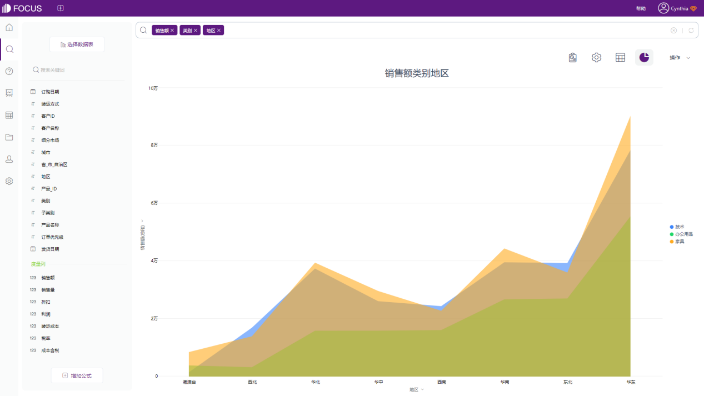
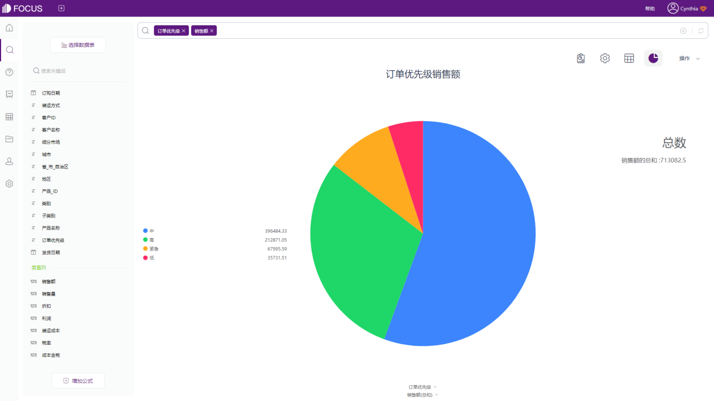

在上篇内容中，已经介绍了柱状图、折线图、条形图和饼图在数据可视化过程中的适用场景以及图表制作的选择标准。接上篇，我们继续唠一唠折线图与面积图，饼图与环图，柱状图与堆积柱状图之间的适用场景。

### 1\. 折线图 VS 面积图

面积图是折线图的一种衍生。在面积图里，X轴和折线之间的区域通常用颜色或阴影填充，以此增加易读性。面积图适合展示时间维度上的变化，或者用于展示累积数据。

### 2\. 饼图 VS 环图

追本溯源，饼图和环图属于是同一种图表类型，但二者的表现形式是不一样的，饼图用每个区块代表该类别占总体的比例大小，所有区块比例之和为1；环图则是用弧长来表示。

从映射角度来说，弧长比面积、角度更易被识别。因此，环图会比饼图更具可读性；同时，可以将关键指标以KPI的形式放置在环图中间，更能引起用户的关注。

### 3\. 柱状图 VS 堆积柱状图

截止目前，上面介绍到的图表类型都只使用了一个属性列，如果在上述基础上再增加一个属性列，就需要引入堆积柱状图了。

堆积柱状图非常适合用来对比不同类别数据的数值大小，同时对比每一类别数据中，子类别的构成及大小。

柱状图能够帮助我们观察“总计”，堆积柱状图却可以同时反馈“总和”和“结构”。

最后总结一下，上述介绍到的图表类型都是数据可视化最基础的图形，可以适用于大部分使用场景，也无需使用专业的工具，通过Excel就可以实现数据可视化。

但当原始数据的数据量逐渐庞大，图表需求逐渐多样化后，Excel就无法满足数据可视化的需求了，需要借助专业的BI可视化工具，例如本篇文章用到的数据分析工具---DataFocus，通过自然语言的搜索就可以得到想要的分析结果，所搜即所得，图表类型也是系统智能匹配，无需高昂的学习成本，无经验的数据分析小白也能快速上手实操。

好的数据可视化结果一定是可以帮助用户更好的理解数据，提升数据表达能力，突出数据的特点，直观易懂。这也是数据可视化需要达到的最终目的。
