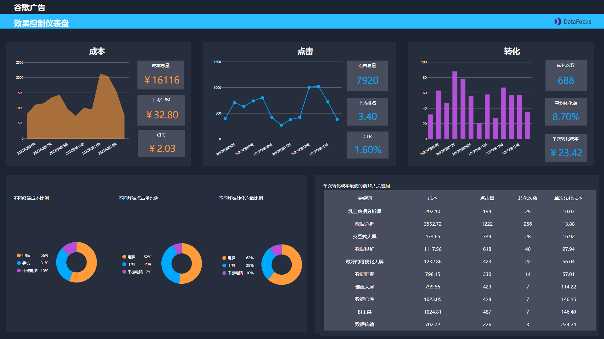

最近有个做海外媒体广告优化的朋友，跟我吐槽说“之前公司海外广告投放这块还没怎么做；现在公司规模起来了，但公司广告优化管理根本跟不上，只见广告成本在烧，但转化效果却不怎么好。”

这其实是大部分出海企业都面临的问题。谷歌广告确实帮助了不少出海企业获取了比其它媒介更多的商机，可谷歌广告的效果并不是搭建好账户就定性了，它需要不断地**根据广告实时数据进行分析、测试和优化**。

**下面是很多企业的广告投放分析现状：**

- **信息零散，无法系统管理，难以统计**
- **广告信息更新速度快，无法保证信息及时更替**
- **没有广告投放管理的工具**
- **广告信息多而杂，分析无从下手，管理效益提升慢**
- **事务性工作花费大量时间**

事实上，做好广告投放管理优化工作可以帮助企业以最小的成本获取最大的收益。并且，如果你是一个有志向进入管理层的广告优化师，那广告投放优化管理分析更是**晋升之路的必备技能**。那怎么才能跟上数字化转型，通过广告投放优化管理，实现最终的业务目标呢？

今天给大家准备了一个广告投放优化管理的解决方案，涉及了**谷歌广告关键词效果、谷歌广告效果控制、谷歌广告网络展示**三张大屏，使用的工具是一款**简单好用的搜索式分析工具DataFocus**，**模板在文末可以下载**。

## **第一张大屏：谷歌广告关键词效果大屏**

谷歌广告关键词效果大屏由点击量分析、点击通过率分析、平均单次点击成本分析组成。

通过这张大屏，不仅清晰地展现了**谷歌广告效果和成本的实时反映**，而且还具体展现了表现最好和表现最不好的前三关键词信息。

- **点击量分析**

大屏左边区域，你可以看到过去9周内的总点击次数、每周点击次数的变化以及与前一期间百分比差异的概况。此外，下方还有获得最多点击和最少点击的3个关键词。这都是在提醒你仔细研究你的关键词，毕竟这些关键词产生了大量点击次数，也因此会消耗大部分预算。

- **点击通过率分析**

你还可以在大屏中间找到关于有关点击通过率（CTR）的信息。点击通过率是广告的实际点击次数除以广告的展现量，是衡量谷歌广告的重要指标，它又会影响到质量得分和最终点击费用。而如果点击通过率低于平均水平，则几乎不可能达到较高的广告排名。

- **单次点击成本分析**

****

最后，在仪表盘中你还可以看到有关点击成本及其质量得分影响的详细分析。单次点击成本是根据广告主在网站或社交媒体上投放的广告所获得的点击量，来确定广告支付的费用。而质量得分是谷歌为每个广告打出的分数，用于衡量关键词、产品信息和用户搜索意向三者之间的相关性。

图表各质量得分的平均CPC很清晰的展现了，**点击成本通常会随着质量得分的增加而降低**。所以你需要考虑广告产品信息与用户搜索是否匹配，以及注意到点击成本。

## **第二张大屏：谷歌广告效果控制大屏**

谷歌广告效果控制大屏是由成本分析、点击分析、转化分析、单次转化成本最低的关键词分析、按终端分的成本点击转化效果分析组成。图表更多分析的是**转化以及每次的转化费用**等。那在企业规模不断扩大、广告成本不断升高的情况下，**如何用更少的成本，产出更多的转化价值**，是企业需要关注的点。

成本、点击不用多说，是广告效果和成本直观的体现，所以重点说说转化分析部分。

- **转化分析**

****

首先，这里的转化是指用户具体的某个行为操作，例如购买产品、官网注册账号或是下载产品白皮书。而转化率受到广告投放与用户搜索的“相关性”影响。所以你不仅需要注意广告内容与用户搜索的相关性，还需要精心设计广告链接着陆页的版面和内容。

此外转化率还直接影响到单次转化成本。若转化率更低，则单次转化成本更高。

- **单次转化成本最低的TOP10关键词分析**

大屏中的这张图表直接展示了转化效果比较好的关键词具体信息，比如成本、点击量、转化次数、单次转化成本。通过一个直观的图表即可评估谷歌广告的关键词效果，并筛选出效果好的。

- **不同终端效果分析**

用户会在不同的终端浏览到广告，所以这一部分的分析很好地评估了不同终端的广告成本、点击、转化效果。

## **第三张大屏：谷歌广告网络展示分析大屏**

谷歌广告效果控制大屏由CPM分析、广告展示分析、KPI总体分析、广告展示转化分析组成。这张大屏更多的是谷歌广告展示情况的分析。广告优化师常常会头疼的问题是，**广告放在哪里展示效果会更好**，但又没办法把不同位置的广告信息整理汇总，而这张大屏可以完美地解决这些问题。

- **CPM分析**

这里主要分析的是每千次展示费用（CPM）指标情况。每千次指标费用是广告展示的关键指标，支付方式不是按点击次数，而是按广告每１０００次展示。这种方式主要是在评估转化率较不错的情况下帮助广告极大地曝光以获取最大收益。

- **KPI概览**

这里涵盖的指标前两个大屏中已经讨论过，分别是总费用、点击次数、点击率、单次点击费用、单次转化费用及转化率。

- **不同展示位置的转化率**

这张图表衡量了用户在不同广告展示的位置成功转化情况，可以看出哪个位置转化效果是最好的。

谷歌广告优化并不是靠一天就能完成的，在套用这套大屏模板后，需要结合企业实际情况，利用大屏钻取、联动等功能对广告信息实时分析，在找到其中优化的关键点后，从而对大屏继续优化。在**广告展示、广告关键词设置、广告效果评估**等方面去全面优化谷歌广告投放，及时跟上企业数字化转型和发展速度。

私信“谷歌广告”可以免费获取这三套大屏模板。
