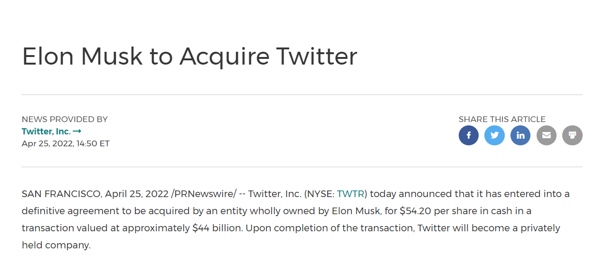
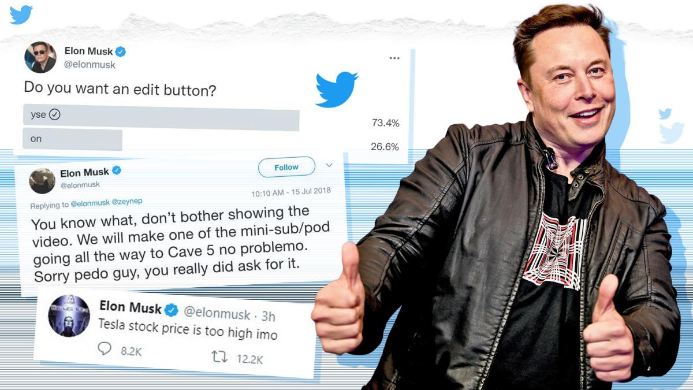
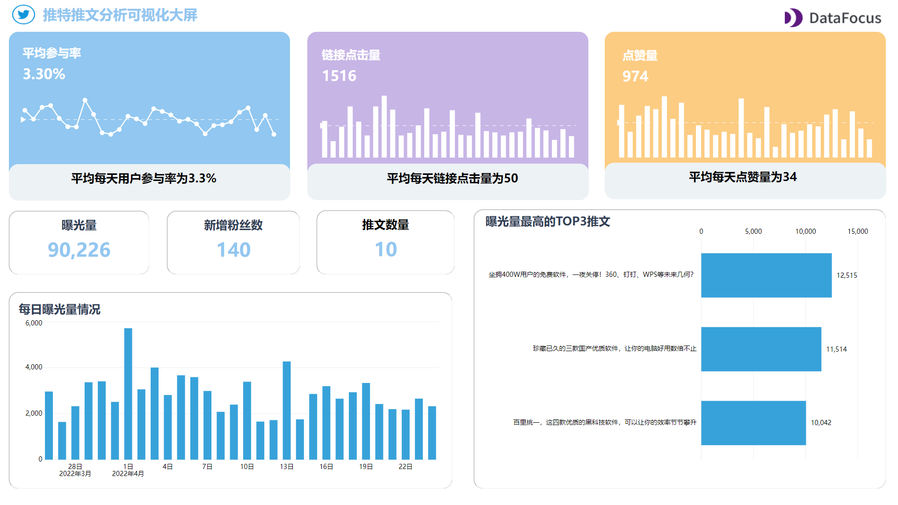

**这家外媒千亿巨头被440亿美元收购了！海外运营未来几何？**

谁曾想到，日活2亿用户、年入35亿美元的外媒巨头推特，竟然真的被收购了！

**2022年4月26日，全球首富马斯克，正式宣布以440亿美元全面收购社交平台推特。**

此后，**推特将成为马斯克的私有财产**。

这项交易已获推特董事会的一致批准，预计将在今年完成。而收购消息一经发布，**推特股价大涨5.66%，报51.7美元，市值394.77亿美元**。

- **挥重金收购推特，马斯克到底图啥？**

据了解，马斯克很早前就已不满推特各种规则，多次发文吐槽批评推特，甚至部分言论遭到平台禁言。

而这次马斯克之所以想收购推特，目的是希望打造一个“言论自由”的网络社交平台，所有人在这个平台上一视同仁，都能自由地发表观点，而不用担心被禁言或封号。

此外，马斯克曾表示他收购推特不是为了钱，而是为了让推特变得更好。曾经被推特封禁的美国前总统特朗普接受福克斯新闻网采访表示，“我希望马斯克收购推特，因为他能改进，而且他是一个好人。”

话说回来，这是到底是作为精明的商人圆滑世事的说辞，还是作为有理想的实干家的豪言壮志？我们也不得而知。

- **马斯克入主推特，变化或将翻天覆地**

不得不说，**世上最强的超能力果然还是钞能力**。以后马斯克就可以按照自己的意愿来改造推特平台了。

首当其冲的是话语环境的改变，在马斯克对言论自由的支持下，内容核审方面或将放宽。这意味着**用户在平台发的内容范围可能更广了，内容敏感性更低了**。

其次是推特的算法或将开源，马斯克认为让黑箱算法推广特定内容的做法是相当危险的。以后的**开源代码可能会直接在推特公开，**以决定哪些推文该推广，哪些又该隐藏。这意味着更注重**用户在平台发的内容质量，不存在“黑幕”了**。

最后也是最重要的是**推特的收入模式或将发生重大改变**。马斯克表示，他将调整公司的收入模式，**减少对广告的关注，可能更多地强调订阅**。目前的推特90%的利润来自广告，模式打破后，变现方式又会变成什么呢？打造内容产品，直接卖内容也不失为一种可能。

虽然马斯克的初衷是好的，建立更自由更平等的社交平台，做一个用户体验更棒的社交产品，可也有不少专家提出质疑，例如**马斯克对言论自由的推崇或将导致平台大大减少遏制仇恨言论、虚假信息、骚扰及其它有害内容方面的工作。**

对产品相对合理的质疑不可小觑，未来推特也可能还会有更多动荡，一切还真不好说。

- **海外运营制胜法宝，以不变应万变**

不管推特平台怎么变化，海外运营精英可从来不慌。

因为他们早有了以不变应万变的制胜法宝，**数据分析的能力**。

经常有做海外运营的朋友跟我吐槽，“每次做出内容投放到推特、Facebook等平台，就没什么反响，数据各种不好，没时间没精力去做内容复盘，也完全没有什么分析思路。”

其实数据分析真的不难，也可以不太费时间和精力。**高效的数据分析能力，有时也依托于一款合适的数据分析工具**。

今天给大家安利一款简单便捷的数据分析工具——**DataFocus，通过搜索就能进行数据分析，完全是所见即所得**，例如搜索“今日”“销售额”，3秒内即可跳出数据KPI“今日的销售额”。

而且这上面有非常多免费的模板，直接套就完事了，省时省事还省钱。

现在简单和大家分享一下，三款用**DataFocus**制作的**推特主题可视化大屏**。（**模板在文末可免费下载**）

## **推特推文分析可视化大屏**

****

推特推文分析可视化大屏主要用于**评估发布的推文效果**。

首先顶部由三个主要指标来跟踪推文效果，平均参与率、总链接点击量、点赞数。其中，平均参与率综合考虑了链接点击量、品牌在主题标签中使用的时间、粉丝量、收藏量、回复量、转发量等等指标，来衡量你与粉丝之间的联系情况。

其次下方曝光量和点赞量需要综合考虑，光有曝光量也不行，同时需要有粉丝互动情况。右边显示的效果最好的三篇推文，是给你推送内容参考的建议，这样的文章类型是被更多受众能接受的。

## **推特广告可视化大屏**

推特广告可视化大屏主要用于**评估并完善推特广告效果**。

**如何用最小的成本，获得最高的转化**，是海外运营最需要关注的点。

大屏中显示的漏斗，总成本、总曝光量、链接点击量和点击率，则是展现了你在投放广告过程中每一步的行动效果，使用成本、内容曝光、点击阅读。大屏还将指标进一步细分，看到每天KPI的变化情况，哪些日子效果不错，哪些日子效果最差，帮助你快速定位到问题。

## **推特KPI可视化大屏**

推特KPI可视化大屏主要帮助你**了解你的受众群体**。**你对你的粉丝了解越多，就越能帮助你达成转化。**

大屏中展现的是粉丝的地区、兴趣、参与话题标签情况。不同地区的文化不一样，对语言熟悉程度不一样、作息规律也不一样，这可以指导你的内容发布时间以及内容方向规划。话题标签和用户兴趣自不用说，直白告诉你用户喜欢的是什么，愿意参与哪些话题。**赢用户者赢天下，是所有企业都明白的道理。**

当然海外运营背后水更深，在套用这几款模板后，需要根据业务的实际情况做调整，根据实时更新的数据利用联动、钻取等功能找到海外运营的发力点，从而撬动整个业务的增长。（**私信“推特”即可获取下载链接**）

总之，万变不离其宗。古人的智慧自有道理，找到不变的规律以预测判断当下的变化趋势，从而把握变化，主动拥抱变化，才是成功之道。

最后，感谢您的阅读，欢迎转发。关注我，更多精彩在主页和评论区~
