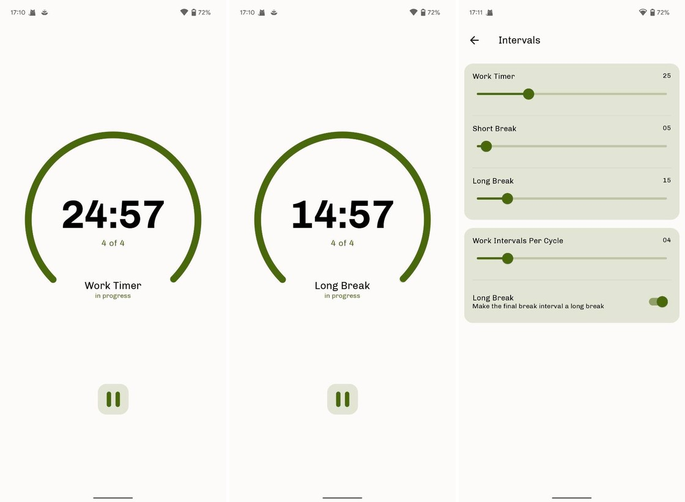
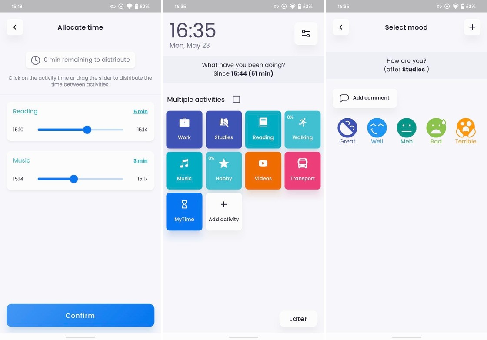
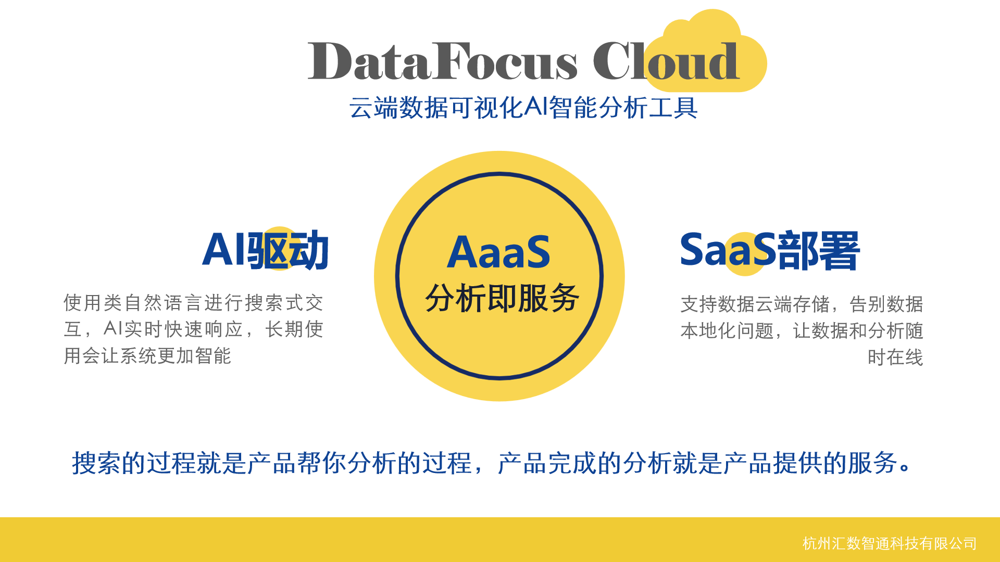

夏日炎炎，当工作事情琐碎、头绪一乱，整个人效率就开始低下。

今天给大家推荐4款使用起来非常清爽的高效工具，每款都是精挑细选。

### 1.

### Refocus

**简单的番茄钟应用**

番茄工作法相信大家都已经耳濡目染了吧。25分钟心无旁骛地工作或学习，再休息5到15分钟，执行起来简单轻松。

Refocus就是这样一款极简的番茄钟应用，界面比较简单清爽。通过计时、统计，来完成你的工作或学习目标，没有别的花里胡哨。

当然如果不太习惯这样的节奏，你可以自由调节时间节点。走完一轮番茄钟后，系统会自动统计下你的工作/学习时长以及完成的番茄钟个数。

总的来说，这是一款简洁美观的App，如果你只需要番茄钟这样简单的功能，那么可以尝试一下Refocus。针对个人，这款App是免费的。

### 2.

### My time

**帮助你养成统计时间的习惯**

明明什么也没做，为什么这么快一天就过去了？流逝的时间都花在哪儿了？

很多人都没有养成统计时间的习惯，面对时间还是抱着无所谓的态度。但其实这样得过且过，非常不利于我们达成目标，实现个人进步。记录下时间并分析时间，便可以帮助你不断优化自己的工作和学习。

当然，每时每刻都手动记录下时间并不现实，这时候就可以用My time这款时间统计App。

下载后使用这款App，首先需要选择最占用你时间的项目，这样可以让时间记录会更有针对性。其它不怎么占用时间地就可以忽略不计了。

此外，My time 还会特别注重你的情绪反馈。当你完成一项记录后，你可以记录下你的情绪是怎么样的。如果一件事长期下来情绪反馈并不是很好，那么可以再调整优化一下。

最后，My time也提供了统计功能，你可以看到自己在各个事项中耗费的时间，也可以看到自己的情绪变化。

这款App是免费下载，但需要付费订阅。

### 3.

### DataFocus

**搜索式数据可视化BI**

工作中常常需要定期汇报工作、项目复盘、出分析报告，大多数人都会用excel记录数据，再对数据进行处理，把处理好的图表放置于PPT中。

可excel和PPT在包含太多数据和内容后就会卡顿，运气不好没保存就得重来。

老板如果提新的要求，你还得反复修改，如果一改数据就真的要大改特改了。

何必那么麻烦，一款数据可视化平台就可以解决了。DataFocus就是一款搜索式分析云BI平台，像谷歌一样搜索关键词，系统就会以自动适配的可视化图表回答，并以秒级响应。

再把图表放置于同一张大屏中，配上文字，汇报、演讲工作都是轻松拿下。而且大屏还是联动的，比如点击组件中的”浙江省”，则整张大屏都是浙江省的数据，这不比PPT香吗？

当然，这款BI工具企业版是付费的，但个人版是免费的。

### 4.

### Amadine

**简单易用的矢量绘图工具**

这款工具是非常适合新手使用的矢量绘图工具。

在功能上，它包括简单的多图层处理，几何形状添加、渐变编辑，你也可以将Photoshop等工具中的素材导入到Amadine中。

矢量图新手也是可以轻松制作，软件提供了多种复杂的手势操作。

熟悉矢量图的朋友可能用起来会更得心应手，比起其它矢量绘图工具效率会更高。

那么，这款软件是付费使用的，可以酌情考虑。

### 小结

不积跬步，无以至千里。

相信坚持使用这些高效的工具，你会感受到自己的进步。那么，你还有什么工具想要推荐？欢迎评论区评论、分享。
