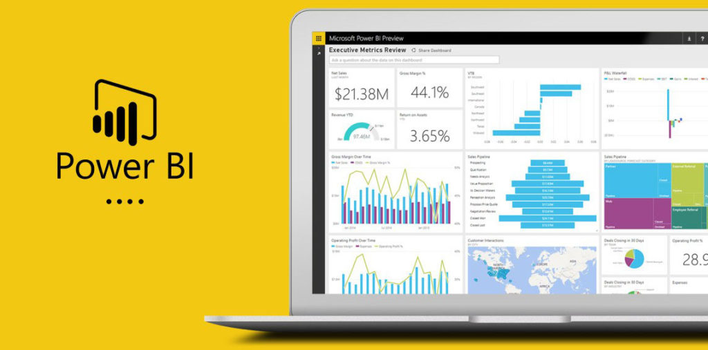

数据分析师一直以来都是非常火爆的岗位，毕竟市场需求一直都在，每年都会有大量的人才涌入这个行业。一方面当然是因为做数据分析有“钱”途，另一方面则是因为这个岗位门槛真的不算高。

现在网上已经出现很多的课程来帮助入门者学习。但因为不同的课程会涉及到不同的数据分析工具，就比如Excel、Sql、python等等，所对应的学习成本也不一样，很多小白根本不知道该选择哪种工具会比较适合自己学习。况且现在市面上还涌现了非常多新奇的数据分析工具，要选择起来就更难了。

所以今天带大家盘点一下目前最主流最火热的数据分析工具，可以根据各自的需求来选择。

**1.**

**Excel**

**入门级办公软件，日常工作必备**

Excel不用多介绍，职场人都知道的国民办公软件。处理数据的功能简单又强大，所以能一直经久不衰。日常中需要数据统计、数据计算、可视化展现，也都能通过这款工具实现。

当然，应付日常生活中微量的数据Excel足够了，但如果要处理大数据就应付不过来了。新手想了解数据分析，可以先从excel入手。

**2.**

**Python**

**入门编程语言**

现在很多企业都在使用Python编程语言，于是有很多数据分析岗位出现了需要会使用Python这样的招聘要求。Python由于语法简单明了，从而受到非常多IT从业者的青睐，同时它也容易上手，非常适合程序员小白入门学习。

学习完这门编程语言后，你就可以通过写代码来实现你想要的分析效果。但如果你只是想学习数据分析的思维，而不想接触代码，那么可以不学。

**3.**

**SQL**

**入门数据库语言**

企业中的数据往往是海量的，且都存放在数据库中。如果长期和数据库打交道，就需要学习SQL语句来实现从数据库中存取数据、清洗数据了。

当然如果还没接触到数据库，那么也可以先不学。

**4.**

**BI工具**

**企业数字化转型必选**

BI即商业智能，它将企业中的数据进行有效整合，经过处理后将数据呈现以帮助企业做出经营决策。

关于BI工具市面上有很多，今天列举三款工具，分别是Tableau、Power BI和DataFocus。

**Tableau**

Tableau是一款交互式数据可视化软件，相比其它BI工具比较不一样的是，它会在导入数据后将数据分为维度和度量两类，维度就是属性列，比如国家、地区等，度量就是数值列，比如销售额、销售量等。然后再将维度或度量拖拽到行或列中，即可生成各种图表与趋势线。

Tableau比较突出的能力在**可视化**上，做出来的图表颜值会很高。缺点就在于操作可能还是比较繁琐，需要逐个拖拽数据字段来实现数据可视化。另外价格很高，就算个人版也要999美元。

**Power BI**

Power BI是微软开发的数据分析与挖掘工具。这款工具的上手难度比较大，对新手不太友好。你需要先学会DAX，你才能学会powerBI。当然BI工具基础的数据清洗、数据处理、数据可视化等功能Power BI都是具备的。

它最大的优势是当你学会DAX后，你可以随心所欲地对数据进行**清洗和加工**，这方面功能会比较强大。但可视化能力就相对比较弱了，图表种类会比较少。不过个人版是免费的。

**DataFocus**

DataFocus是一款国产的搜索式数据分析工具，相比其它BI工具，它会更适合新手，上手很容易。在导入数据后，只需要在搜索框中输入数据关键字段，系统自动会以可视化的形式回答。

它最大的优势就是操作简单，轻松上手，而且数据分析速度很快，**搜索是秒级回应的**。而缺点就是，由于软件是无代码的，没法自主使用代码来实现自己想要的效果。不过个人版也是免费的。

以上就是今天介绍的数据分析工具，可以根据个人实际情况来选择。当然，只要能帮助你解决问题的工具，那都是好工具。
