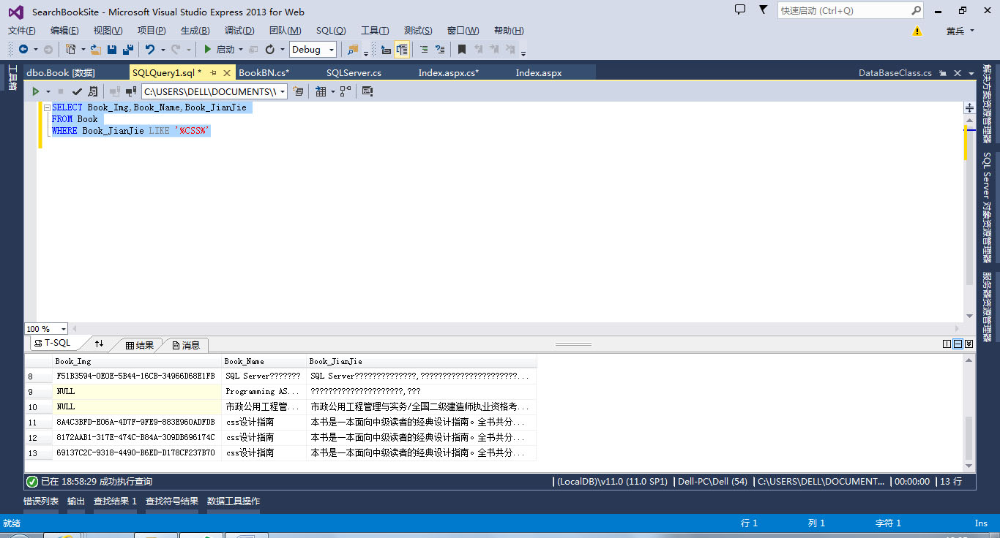

80%的数据人熬着夜做报告，却没时间找答案

李海是一名数据分析师，非常幸运，他在他的职业生涯早期就找到了一份不错的工作，负责定期向首席执行官和他的执行团队汇报业务绩效。

每到星期二上午，就意味着他需要开会汇报每周的成果。同时，每个月都会有绩效考核，他还要进行一次复盘和总结。

不得不说，对于一个还需磨练的年轻人而言，每次走进聪明、成功的商业领袖的房间，内心都会有点忐忑。另外，还需要告诉他们本周或者本月的业务绩效如何，这真的是一件非常头疼的事情。

为了确保数据的准确，为了表述能更清晰，李海常常需要熬夜制作一份报告，同时还要准备好会议期间可能会提出的一些问题及答案。尤其后面准备问答那部分是迄今为止对他而言最具挑战性的。

虽然李海名义上是企业BI团队的一名数据分析师，可是真实的情况是他把大量的时间和精力放在了准备会议需要用的报告上了，这个痛苦让他觉得他从“数据分析师”退化成了“报告制作者”。实际上的数据分析师岗位职责是，分析业务并获得见解，为公司的战略方向提供信息。

不幸的是，**这种工作几乎没有时间**。

提取来自组织不同渠道的数据到报告中，并准备好报告的汇报展示，成为了李海的全职工作。

**为什么这项工作这么花时间？**因为这意味着你每天都需要：

**修改和进行SQL查询，以便从数据仓库提取数据。**

**打开多个装满海量数据的Excel（每次打开都要等待很久，有时还会卡死）。**

**将SQL结果保存到Excel文件中。**

**确保文件链接、视频链接和其中的公式都有效。**

**在每日、每周和每月 Excel 报告中更新多个图表。**

**最终将图表复制/粘贴到PPT中，制作精美的报告。**

当然，有做过类似工作的数据人都能感同身受。

这些工作背后需要的是更多的时间，工作结束之后，李海也能感受到一些有价值的东西，比如一份漂亮的报告，为公司的执行团队讲述一个商业绩效的故事。

似乎这样的工作看上去很美好。

可是渐渐地，李海突然感受到一种特别心力交瘁的感觉。

当执行团队在浏览演示文稿时，每个图表都会引发一系列图表没有回答的问题。

“这一行代表的业务是什么？”

“你能告诉我背后的细节吗？”

“这两个指标对比又是怎样的？”

尽管为制作这些报告花费了大量的时间，可是当一位高管提出一个新问题时，李海也并没有很惊讶。毕竟他是制作这个报告的人，并且花了时间准备了很多预先设想好的问题。

当然更重要的原因是，这样的思考方式自然地代表了人类的思维方式。当我们看到一些有趣的东西时，我们会通过提问来进一步探索。

这就是人类解决问题的办法。

而花几天的时间来进行数据提取、制作报告，是这种探索精神的障碍。

过去的BI技术不允许使用快速和易于访问的方法对大型综合数据集进行临时探索，导致这一问题很难解决。

可是现在，新的技术可以让我们重新思考问题以及为企业提供见解的传统方法。

**近年来，有一些大型企业的报告甚至比人还多！**

**想象一下这些报告背后制作的金钱、时间和复杂繁琐的过程。**当一个人提出一个商业问题时，你要考虑到制作报告的不易，报告完成后的滞后性，那么报告还是提供答案的最佳工具吗？

如果提问者只是想要一个答案，为什么不迅速给他们一个答案，继续下一个问题呢？

最合理的是，让提问者自己回答自己的问题，腾出时间思考下一个问题。

目前自助式BI分析领域已发生了很多创新，组织管理者需要思考如何推动回答问题的过程，为整个业务团队提供问题的答案。是时候引进一种更新、更好的方法来回答您的数据问题了！（文中人名皆为化名）

DataFocus致力于让每个人都成为数据分析精英，采用Google般的搜索式分析，分析者输入关键字段搜索，系统即可做到秒级回应。

您可以立即试用，体验数据分析的敏捷。
