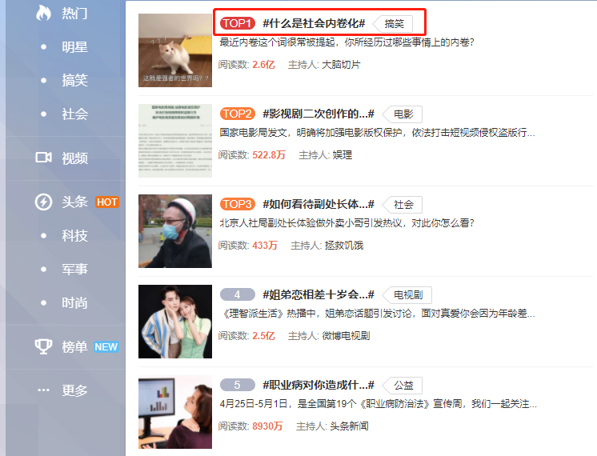

现如今，什么都追求“颜值”，毕竟好看的谁不喜欢，可视化大屏也一样，不漂亮的和漂亮的，相信没有人会去选择不漂亮的。那么既简单又漂亮的，是不是大家更爱了呢？

以前，我做的可视化大屏，因为难看被各种吐槽嫌弃，试问谁不想做好看的大屏，但是好看的大屏做起来太复杂难度太高，我不会呀！你说我能怎么办？我也希望有个“小叮当”，我想要漂亮的大屏马上就给我漂亮的大屏。其实啊，“小叮当”倒是没有，但是最后被我发现了一款“救命”工具——DataFocus。这个工具真得是像我这样好看的做不来，做出来的不好看的人的“救命稻草”。它真得超超超简单！但是功能强大！而且做出来的大屏也很好看，起码比我以前做得好太多太多了，真心地强烈推荐。

就在之前，又在为了可视化大屏而烦恼，无意间看到了这个DataFocus可视化工具，看了他们的视频，觉得好像很简单，做出来效果也不错，就想着试用下，试用了一段时间，真心好用啊，现在我做大屏都离不开DataFocus了，也没有人再吐槽过我的大屏。DataFocus是采用搜索式分析，智能适配图表，只要搜索我想要的信息，系统会智能地实时适配图表展示，而且图表样式丰富，基本可以满足我的所有需求，所有的图表也不需要额外配置，系统全部后台给我配置好，图表还可以直接保存添加到大屏，因此我现在做一个大屏，毫不夸张，只需要10分钟，就可以完成。

下面都是我临时做的一些大屏，只花了几分钟时间就做好了，又漂亮又简单，提高了不少效率。DataFocus确实值得一用。

