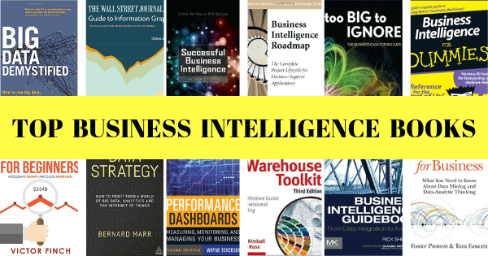
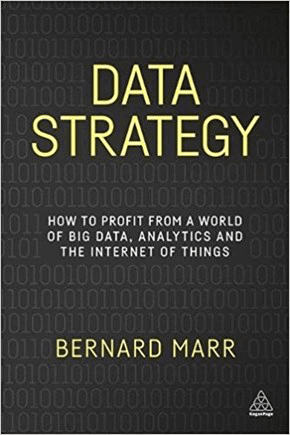
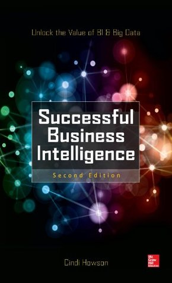
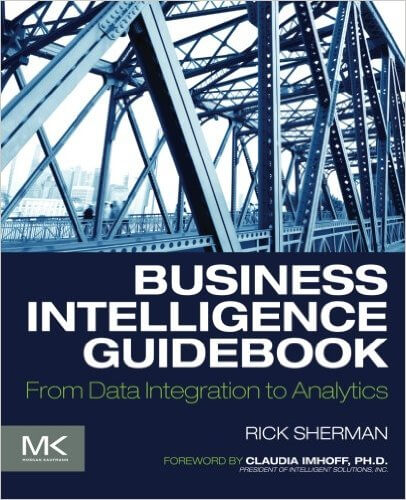
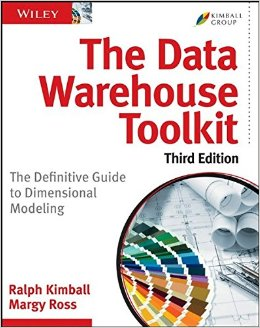

在竞争激烈的数字时代，随着“大数据”超越近年来最大的[商业智能流行语](https://www.datafocus.ai/infos/business-intelligence-buzzwords-2019)之一，成为可持续成功的鲜活驱动力，可以说，是时候加入统计潮流了。

无论是涵盖数据科学、大数据、[在线数据可视化](https://www.datafocus.ai/infos/data-visualization-tools)还是数据分析，以 BI 和仪表板设计为中心的出版物都在全球书店堆积如山**。**在当今时代，要保持成功、竞争力和前沿，跟上最新的 BI 趋势至关重要。但是有这么多商业分析书籍而时间却很少，你如何决定哪些是值得你花时间的？

永远不要害怕——在 DataFocus，我们始终掌握所有数据或 BI 相关的信息，这意味着我们已经进行了大量的研究，并通过大量商业智能书籍来精心挑选最好的。

也就是说，我们选择了 12 部世界上最好的商业智能书籍——这些宝贵的资源不仅赢得了广泛的好评，而且是我们认为呈现的精彩、有令人难以置信的信息和绝对易消化的书籍。

我们的12 本关于商业智能的最佳书籍探索了远远超出该领域初级阶段的广泛主题，提供了一定程度的洞察力，将您的[商业智能技能](https://www.datafocus.ai/infos/bi-skills-for-business-intelligence-career)和信心提升到一个全新的水平。

但在我们揭开智能和商业分析书籍的权威纲要之前，让我们先探索一些事实、数据和见解，这些事实、数据和见解会激发您的灵感，同时引导您在激动人心的 BI 世界中取得成功。

_“数据是您进行分析所需要的。信息是您开展业务所需要的。” – John Owen，一位老牌的 BI 先驱_

## 商业智能：硬道理

这些事实和见解证明了将 BI 作为您正在进行的组织战略的一部分的巨大力量：

- 使用 BI 的品牌或组织做出更好、更快决策的可能性要高出五倍。
- 85%的商业领袖坚信大数据将显着改善他们开展业务的方式。
- 在全球范围内，预计到2020 年，智能手机用户数量将增至10 亿，超过全球基本固定电话用户数量。这种增长带来了丰富的洞察力，如果您精通 BI，您将能够从触手可及的移动数据中榨取每一滴价值。
- 扩展我们之前的观点，目前42% 的公司计划部署基于移动的 BI 作为其增长战略的一部分。

既然我们已经确定了 BI 在数字时代不可否认的重要性，那么让我们来探索一下除了获得成功所需的技能之外，还能帮助您获得知识的书籍。

## 1) Bernard Marr 的《数据战略：如何从大数据、分析和物联网的世界中获利》

根据这本书，目前只有不到 0.5% 的数据被分析和使用。这太惊人了。尽管许多商业领袖仍然对大数据在商业活动中的应用持怀疑态度，但如果有什么书可以改变他们的想法，那就是这本书。

深入研究如何在以最熟练的方式收集和分析大数据的同时创建可持续的 BI 战略，这确实是现代[商业智能和分析书籍的精髓之一。](https://www.datafocus.ai/infos/difference-between-business-intelligence-and-analytics)

更重要的是，除了获得大量基于 BI 的新鲜知识外，这本书由Bernard Marr撰写，还将为您提供有关物联网及其在未来业务分析中的作用的无价信息。

## 2) David Stephenson 博士的《大数据揭秘：如何使用大数据、数据科学和人工智能做出更好的商业决策并获得竞争优势》

大数据在商业智能这块蛋糕中占据了相当大的一部分，David Stephenson 博士在 2018 年提供的这本手册是一本以结果为导向的手册，它拥有同等的耐人寻味、灵感和切合实际的见解，适合当今信息丰富的时代，是目前最优秀的商业分析书籍之一。

您不仅将学习如何处理大数据并使用它来增强您的日常运营，而且您还将获得大量案例研究，将所有技巧、方法和想法融入现实世界。此外，与我们阵容中的许多业务分析书籍不同，“大数据揭秘”还深入研究了新兴技术，包括人工智能 (AL) 和机器学习 (ML) 应用程序。这是世界上关于利用大数据的力量构建 BI 系统的最佳书籍之一。不要错过!

## 3) Dona M. Wong 撰写的《华尔街日报信息图表指南：呈现数据、事实和数据的注意事项》

您是否花费大量时间使用电子表格，或者想知道[哪个图表以自上而下的方式显示数据？](https://www.datafocus.ai/infos/how-to-choose-the-right-data-visualization-types) 那么这本最优秀的 BI 书籍就是为您准备的。

清晰、简洁且易于阅读，这本最精彩的关于业务分析的书籍，将教您如何创建专业图形以展示宝贵的数据驱动洞察力的基础知识。简而言之，这很棒，特别是如果您是在线营销人员或处理大型[营销报告数据集的人](https://www.datafocus.ai/infos/daily-weekly-monthly-marketing-report-examples)。这本书分享了在创建图表时真正重要的事情，而不是专注于让图表浮华——深入探讨如何让你的可视化变得清晰、有效和有意义。作者 Dona Wong 向我们展示了为某些类型的数据选择最好的颜色和字体，同时提供了各种微妙而有用的示例来说明如何显示数据。例如，书中的一个示例演示了如何在 12 点钟位置显示饼图的最大部分。某些读者可能会发现一些信息过于基本；尽管如此，Wong 还是提供了一些无价的基本见解，以及每次准备图表时应遵循的黄金法则。

您可以访问的数据源越多越好。依赖一个指标的企业无法与拥有一系列智能[数据分析工具](https://www.datafocus.ai/infos/data-analyst-tools-software)的企业相匹敌。借助您身边的交互式[在线仪表板](https://www.datafocus.ai/infos/online-dashboard)库，您将能够有效地收集和可视化最新指标。因此，您将能够根据实时数据而不是直觉来做出业务决策，这在当今世界是无价的。这本书是我们名单上最精巧的BI书籍之一。

## 4) Victor Finch 的《数据分析初学者：学习和掌握数据分析的终极指南》《获得正确的商业智慧——加速增长并完成更多销售》

虽然本书主要侧重于针对完全是初学者的 BI 知识，但其令人耳目一新的主题方法为各个级别的人提供了宝贵信息的片段。

本书对商业智能基础知识进行了详尽的介绍，不仅深入探讨了采用数字数据对可持续商业成功的重要性；它提供了一个技巧和想法均衡的组合，帮助您通过所有 BI 活动和计划最大限度地提高投资回报率。

## 5) Wayne Eckerson 的《绩效仪表板——衡量、监控和管理您的业务》

Wayne Eckerson的这本书是帮助您打造数据驱动型商业文化的完美 BI 书籍之一，它总结了与业务仪表板相关的所有内容。Wayne 概述了如何安装和维护真实[业务仪表板](https://www.datafocus.ai/infos/dashboard-examples-and-templates)的有效性。本书对监督团队绩效的技术人员或业务经理特别有用。它适用于数据驱动的人，因此，通过阅读本文，您将允许 Eckerson 帮助您完善您的沟通策略。他了解在整个公司推出 BI 软件的技术和社会影响。如果您是 DataFocus用户，您可能很乐意避免这些痛苦。Wayne 甚至避开了[自助式 BI 工具的办公室政治](https://www.datafocus.ai/infos/self-service-bi-tools)，并专注于有用的知识。

他的书中的许多方面超出了 DataFocus 提供的范围。它在指出维持公司有效仪表板文化所需的业务习惯方面做得很好。它将帮助您的仪表板了解您的业务的运营、战术和战略愿景。你读过的最好的商业分析书籍之一。

## 6) Foster Provost 和 Tom Fawcett 撰写的《商业数据科学：您需要了解的关于数据挖掘和数据分析思维的知识”

这本全面的业务分析书介绍了数据科学的基本原理，并引导您完成从收集的数据中提取有用知识和业务价值所需的分析过程。它充满了实际示例，因此请抛开您高中时的数学技能，并准备好遵循源源不断的数据分析思维。这里包括领先公司使用数据科学模型的成功案例，并说明数据科学解决方案如何帮助他们应对重大业务挑战。

书中涵盖了广泛的主题，从预测建模、识别信息属性和通过渐进属性选择分割数据到估计成本和收益以及计算预期利润——这本关于商业智能的畅销书将带您了解真正的数据科学旅行。

不要被本书中涵盖的高级数据挖掘主题所欺骗——我们保证“商业数据科学”将教给您许多实用技能。您不仅将学习如何改善业务利益相关者和数据科学家之间的沟通，还将更深入地了解如何智能地参与公司的数据科学项目。此外，您将清楚地了解数据科学如何融入您的组织，以及如何利用它来获得竞争优势。这本书还将向您展示如何以数据分析的方式处理业务问题，使用数据挖掘过程以最合适的方式收集良好的数据，让您了解多种数据科学应用，例如在招聘过程中。

## 7) Phil Simon 的《大到不能忽视：大数据的商业案例》

一本以大数据为基础的书籍，《大到不能忽视》(Too big to Ignore)提供了对大数据主题的精彩介绍。也就是说，这本商业智能书并没有概述分析方法，而是解释了大数据是如何以一种清晰、可访问且完全实用的方式工作的。

在这里，您将了解为什么大数据如此重要，以及为什么组织有必要学习如何在日常运营中利用大数据。

Phil Simon在书中穿插免费的专业建议，包括真实案例研究中的[大数据示例](https://www.datafocus.ai/infos/big-data-examples-in-real-life)，分析领先的大数据从业者的想法，同时将大趋势置于实际的现实世界环境中，这将有助于加速您的学习。这本书涵盖了历史事实、相关技术、数据驱动的文化和消费者行为，确实是最适合初学者的商业分析书籍之一，它证明了大数据不是一种时尚，而是一种新兴的现实，它只会在未来几年增长和进化。现在是让更多企业开始欣赏大数据分析带来的附加价值的时候了——这本书将有助于激发您自己基于 BI 的努力。一本值得一看的书。

## 8) Swain Scheps 的《傻瓜商业智能》

这本书是一本关于商业智能的畅销书，它完全兑现了它的承诺：为那些刚接触该领域并寻求无价实用知识的人提供坚如磐石的参考。

这本关于商业智能的畅销书采用循序渐进的学习方法，将帮助您选择合适的技术，以满足您基于bi的目标和愿望。此外，您还将在这里学习一些基本技能，例如理解基本原则、设计、开发您的 BI 计划、创建成功的路线图等等。没有困惑，没有术语，只是来自世界上最好的商业智能书籍之一的合理建议。

## 9) 《成功的商业智能，第二版：释放 BI 和大数据的价值》，Cindi Howson

这本最具信息性的商业智能书籍的独创性在于其作者Cindi Howson设计的调查，他是 Gartner 的研究副总裁和经验丰富的 BI 分析师，他揭示了业内最大参与者使用的分析策略。这不是一篇理论文章，而是一个基于真正有效的 BI 策略的故事。这本宝贵的 BI 书籍展示了许多成功的商业智能方法，因为每个组织都需要不同的 BI 实施，并且没有一个单一的、一刀切的策略。但是，本书中介绍了成功实施共享的每个敏捷 BI 解决方案都应遵循的一些基本原则。

案例研究中提到了一些工具，它们作为最佳原则的例子，而不是提供处方，其余的仍掌握在 BI 从业者手中。但不要担心——Cindi Howson 将通过一系列经过验证的方法来帮助您解决问题，您可以将这些方法应用到基于数据的日常活动中。提供有关如何在您的组织中培养分析文化的建议，以便每个团队成员都能找到相关且可操作的数据，这是一个很好的资源，描述了如何使您的 BI 战略与您公司的业务目标保持一致，提高 [数据质量](https://www.datafocus.ai/infos/data-quality-management-and-metrics) 并跨越各种因素监控其成熟度。

毫无疑问，这是关于构建 BI 系统的最佳书籍之一。

## 10) Larissa T. Moss & Shaku Atre 的《商业智能路线图：决策支持应用程序的完整项目生命周期》

与我们列表中的其他 BI 书籍相比，这本书没有向读者解释大数据，也没有提供解决关于设计的问题的想法。然而，在本书中，作者提供了一个有用的行动计划，将帮助您通过利用数据的力量来发展您的业务实践。

本书的结构鼓励读者立即（几乎实时）开始使用其见解并设计自己的 BI 策略。每章都涵盖了 BI 项目的不同阶段，包括项目流程图、项目角色以及每个步骤所涉及的风险等实际细节。您可能认为其中的某些内容不像我们列表中的其他书籍那样具有创新性，但不要忘记它不是一本学术书籍，而是一本典型的、精心编写的项目手册，可以帮助您提高实践技能。

## 11) Rick Sherman 的《商业智能指南：从数据集成到分析》

这本书非常详细地解释了数据仓库和商业智能的概念。它首先概述了为什么数据在当今的商业世界中如此重要，然后涵盖了 BI 项目的所有方面。从项目、产品架构和数据建模的纯技术方面到大量插图，本书将帮助您理解错综复杂的主题。

此处涵盖的其他主题包括数据集成和 BI 设计，包括与人员相关的问题，例如流程和项目管理。作者Rick Sherman成功地在经验丰富的从业者职位和数据分析初学者手册之间找到了适当的平衡。他对 BI 进行了全面的研究，涵盖了 BI 的业务和技术方面，以及从高级解决方案架构和低级查询设计模式的角度来看的架构基础。无论您作为 BI 从业者的职责是什么，本书中都有与您的特定能力领域相关的章节，提供新技能或激发新想法。

虽然这可能不是一本关于商业智能的畅销书，但它肯定是最好的一本，并且值得你花每一分钟的时间。

## 12) Ralph Kimball 和 Margy Ross 的《数据仓库工具包：维度建模的权威指南》

一本关于商业智能的畅销书《数据仓库工具包》从一小部分关于数据仓库和分析的理论开始，然后是一系列案例研究，展示了如何将理论应用于常见的商业场景。它也是构建 BI 系统的最佳书籍之一。

书中包含 14 个案例研究，这些案例研究来自众多行业，例如电子商务、采购、订单管理、[财务分析](https://www.datafocus.ai/infos/finance-analytics)或人力资源。

乍一看，目录看起来好像特定行业的章节只适用于某些行业，但您很快就会发现这些行业被用作示例，可以帮助读者更好地理解底层设计原则。这本书涵盖了技术和业务方面，并与最先进的实践和主题保持同步。内容涵盖维度建模技术和错误、参差不齐的可变深度层次结构和多值属性的桥接表、项目管理指南以及对提取、转换和加载（[ETL 服务](https://www.datafocus.ai/infos/etl-as-a-service)）系统和设计注意事项的全面回顾。每天处理数据的任何人都必须阅读。

_“如果你愿意倾听，数据会说话。” ——吉姆·伯格森_

总而言之，以下是最适合您阅读的商业智能书籍：

1. 《数据战略：如何从大数据、分析和物联网世界中获利》，Bernard Marr
2. 《大数据揭秘：如何利用大数据、数据科学和人工智能做出更好的商业决策并获得竞争优势》，David Stephenson 博士
3. 《华尔街日报信息图形指南：呈现数据、事实和数据的注意事项》，作者 Dona M. Wong
4. 《初学者的数据分析：您学习和掌握数据分析的终极指南。让您的商业智能正确 - 加速增长并完成更多销售》，Victor Finch
5. 韦恩·埃克森 (Wayne Eckerson) 的《绩效仪表板——衡量、监控和管理您的业务》
6. 《商业数据科学：您需要了解的关于数据挖掘和数据分析思维的知识》，作者 Foster Provost 和 Tom Fawcett
7. 《太大而不能忽视：大数据的商业案例》，Phil Simon
8. Swain Scheps 的《傻瓜商业智能”
9. “成功的商业智能，第二版：释放 BI 和大数据的价值》，Cindi Howson
10. 《商业智能路线图：决策支持应用程序的完整项目生命周期》，作者 Larissa T. Moss 和 Shaku Atre
11. 《商业智能指南：从数据集成到分析》，Rick Sherman
12. 《数据仓库工具包：维度建模的权威指南》，作者：Ralph Kimball 和 Margy Ross

这 12 本书将为您的业务仪表板学习奠定坚实的基础，并且肯定会让您相信数据科学在当今世界以及未来世界中的好处。现在是时候将这些知识付诸实践并开始使用您自己的[仪表板设计工具](https://www.datafocus.ai/infos/dashboard-designer)了。我们就在你身后！

在 DataFocus注册[30天免费试用！](https://www.datafocus.ai/console/)
