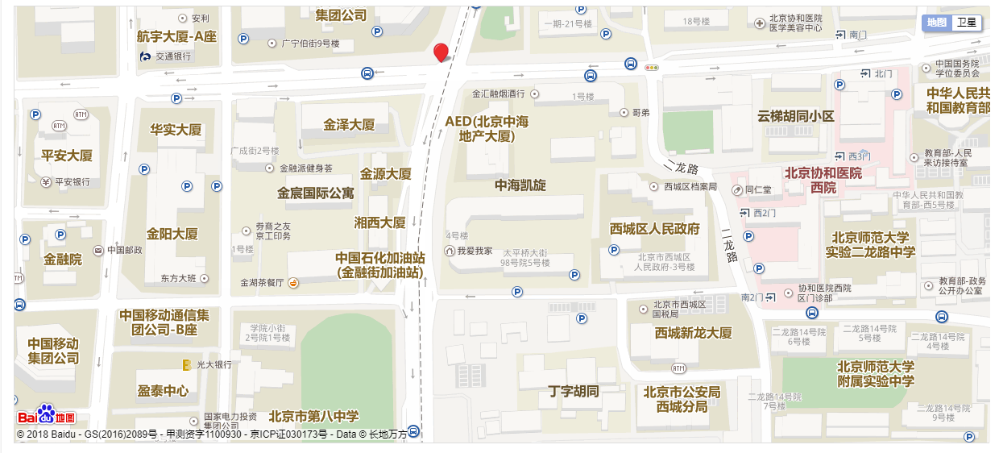

使用DataFocus中文自然语言数据分析系统时，可以经由用户的查询问题自动生成适合数据结构的可视化图表类型，但用户也可以将图表转化成自己需要的类型，我们整理了常用的一些数据图表对应的数据场景，帮助您在探索数据和展示数据时更加的直观丰满。

图表用来显示比较结果的方式大致为高度、大小、角度等。

1 经纬图

适用于有经纬度的数据集。DataFocus内置与百度地图的接口，只要建一张精准的定位信息数据集，上传之后会自动解析，准确定位到地址。百度地图是经纬度分布图，具体到乡镇街道分布都能看得清清楚楚，这是很多人都需要的地图类型，DataFocus地图功能就支持百度地图，可以将数据导入到地图里，得到自己最终需要的可视化报表。

优势：用地图来分析和展示与位置相关的数据，让人一目了然。 

2 组合图

适用于一个属性列和两个数据列的三维数据结构。组合图，顾名思义，就是由两种（柱状图和折线图）的二维图表组合而成的图表形式，常用于展现同一变量的绝对值和相对值，而不适合制作其他图表类型的组合。

优势：特别通用，属于不同图表的组合使用，图表看起来简单直观。 

3 仪表图

适用于一个属性列和一个数据列的二维数据结构。仪表图是为了关注单独一个指标的表现时使用，能给出指标的安全范围和警戒范围。例如将销售额分为三个区域，并分别以黄色、蓝色和红色来区分三个区域，其中黄色表示警戒区域。从下图可以看出东北、中南和西北地区的销售额在警戒区域内，需要引起重视。

优势：能给出指标的安全范围和警戒范围。 

4 雷达图

适用于一个属性列和多个数据列的多维数据结构（四维及以上），但是每个维度必须可以排序，数据点一般6个左右，不能超过50个，太多的话辨别起来有困难。

优势：主要用来了解公司各项数据指标的变动情形及其好坏趋势。 

5 树形图

适用于一个（或多个）属性列和一个数据列的数据结构。树形图，是用于展现有群组、层次关系的比例数据的一种分析工作，它通过矩形的面积、排列和颜色来显示复杂的数据关系，并具有群组、层级关系展现功能，能够直观体现同级之间的比较。

优势：适合用来展示构成项目较多的结构关系，如果它们还可以继续归纳分类的话，还可以展现分类之间的比例大小及层级关系。 

6 词云图

适用于一个属性列和一个数据列的二维数据结构，属性列包含的属性值要尽可能多。

优势：显示词频，可以用来做一些用户画像、用户标签的工作。

7 堆积柱状图

适用于两个属性列和一个数据列的二维数据结构，其中一个属性列作为总体的x轴，另一个则是每个总体的组成部分，数据列则作为显示比较高度的y轴。既可以利用图形高度反应数据的差异，也可以计算各个组成部分的占比情况。

优势：既能看到总体的大小，又能看到组成部分的变化，尤其是当需要看某一单位的综合以及各系列值的比重时，最适合。

8 条形图

适用于一个属性列和一个（或数个，数个时通过图例选中不同的显示效果）数据列的二维数据结构，属性列作为进行类别比较的竖轴，数据列作为显示比较高度的y轴。利用图形长度来反应数据的差异，条形图近似等于将柱状图按顺时针旋转90度。

优势：每个条都清晰表示数据，直观。

9 面积图

适用于一个属性列和一个（或数个，数个时通过图例选中不同的显示效果）数据列的二维数据结构，属性列作为进行类别比较的x轴，数据列作为显示比较高度的y轴。面积图显示各种数值随时间或类别变化的趋势线，尤其适用于强调数量随时间变化的趋势。

优势：强调数量随时间或类别而变化的程度，也可用于引起人们对总值趋势的注意。

10 帕累托图

适用于一个属性列和一个数据列的二维数据结构，属性列作为进行类别比较的x轴，数据列作为显示比较高度的y轴。帕累托图用双直角坐标系表示，左边纵坐标表示频数，右边纵坐标表示频率，分析线表示累积频率。横坐标表示影响质量的各项因素，按影响程度的大小（即出现频数多少）从左到右排列。帕累托图是按照发生频率大小顺序绘制的直方图，表示有多少结果是由已确认类型或范畴的原因所造成。它是将出现的质量问题和质量改进项目按照重要程度依次排列而采用的一种图表，可以用来分析质量问题，确定产生质量问题的主要因素。

优势：通过对帕累托图的观察分析可以抓住影响质量的主要因素。

11 数据透视表

适用于两个属性列和两个数据列的四维数据结构。数据透视表能够将筛选、排序和分类汇总等操作依次完成，并生成汇总表格。每一次改变版面布置时，数据透视表会立即按照新的布置重新计算数据。另外，如果原始数据发生更改，则可以更新数据透视表。

优势：可方便地调整分类汇总的方式，灵活地以多种不同方式展示数据的特征。

