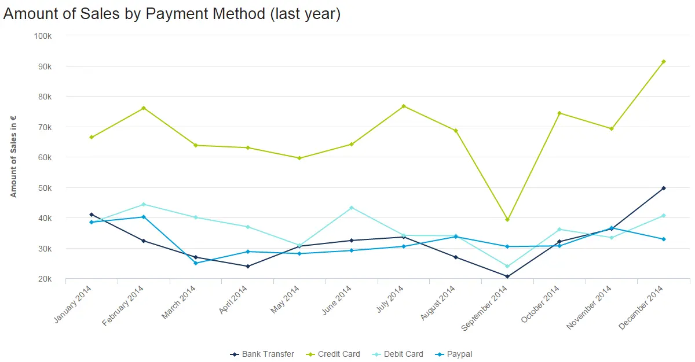
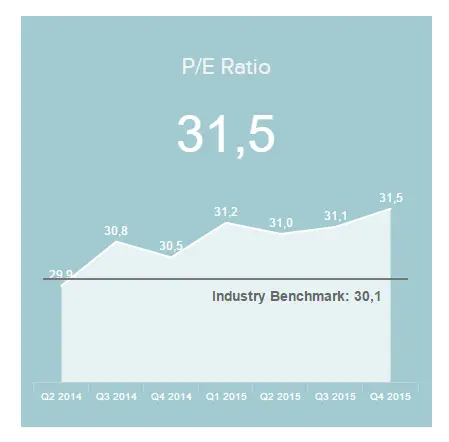
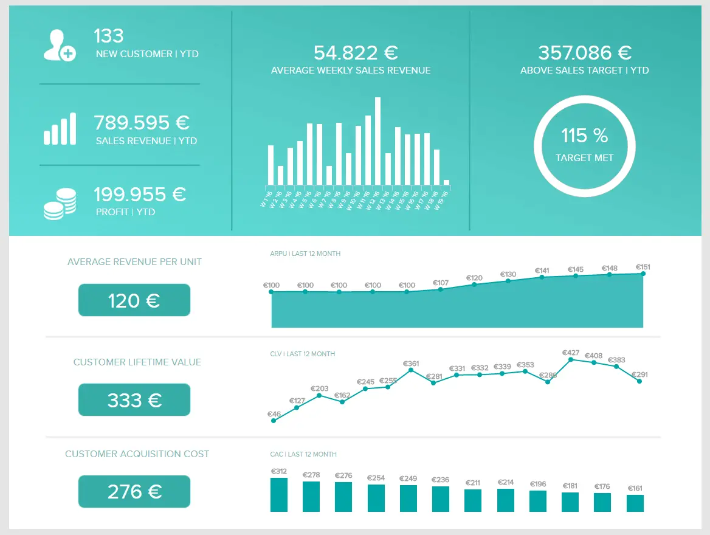

“通过可视化信息，我们将其变成您可以用眼睛探索的景观。一种信息地图。当你迷失在信息中时，信息地图是有用的。

你知道吗？传递到大脑的信息中有90%是视觉的。

关于专业成长、发展和演变，使用数据驱动的见解来制定可操作的战略并实施有价值的举措至关重要。数字数据不仅可以提供对业务关键要素的敏锐见解，而且如果以鼓舞人心、易于理解和合乎逻辑的格式呈现，它可以讲述一个组织内每个人都可以支持的故事。

 

数据可视化方法是指创建信息的图形表示。可视化在数据分析中起着重要作用，并通过利用复杂的数字或事实数字集来帮助实时解释大数据。

当今各行各业的企业似乎可以随时获得无限的数据流，因此挑战在于[数据解释](https://www.datafocus.ai/infos/data-interpretation-methods-benefits-problems)，这是对单个组织及其目的、目标和长期目标的最有价值的见解。

这就是数据可视化的用武之地。

由于人脑处理信息的方式，以图表或图形呈现见解以可视化大量复杂数据比依赖电子表格或报告更容易获得。

可视化提供了一种快速、直观和更简单的方式来普遍传达关键概念 - 并且可以通过进行微小的调整来试验不同的场景。

最近的研究发现，在数据分析中使用可视化可以将商务会议缩短24%。此外，具有可视化功能[的商业智能策略](https://www.datafocus.ai/infos/roadmap-to-a-successful-business-intelligence-strategy)每花费一美元即可获得 13.01 美元的投资回报率。

因此，数据的可视化对于您的业务持续成功至关重要，并帮助您从这种久经考验的分析和呈现重要信息的方法中获得最大可能的价值。为了继续正确看待它的价值，让我们首先列出企业可以从高效的视觉效果中获得的一些好处。

您的机会：[免费试用专业的数据可视化软件！](https://www.datafocus.ai/console/)通过我们的 14 天免费试用体验可视化数据分析的强大功能。

## 数据可视化技能和技术的好处

正如我们在介绍中刚刚提到的，使用视觉效果来提升您的分析策略可以显着提高公司的投资回报率，并通过让每个员工和团队成员参与分析过程使其与竞争对手区分开来。这要归功于现代在线数据分析工具的用户友好方法，这些[工具](https://www.datafocus.ai/infos/data-analysis-tools)允许普通用户在不需要任何技术知识的情况下，在决策过程中以交互式图形和图表的形式使用数据。让我们看一下数据可视化技能可以为组织提供的一些好处。

- 提高参与度：自从业务和分析结合在一起以来，生成报告一直是一项乏味且耗时的任务。不仅充满数字和文本的静态报告很快就会过时，而且对于非技术用户来说也更难理解。您如何让您的员工在他们甚至可能不理解公司目标时积极主动并朝着公司目标努力？将数据可视化放在直观的仪表板中可以使分析过程更加动态和易于理解，同时保持受众的参与度。

- 使数据可访问：跟进可访问性点，假设您是一名以前从未处理过数据的员工，试图从电子表格上的一堆数字中提取相关结论可能成为一项难以忍受的任务。数据可视化通过提供对相关性能见解的轻松访问来减轻他们的负担。通过查看制作精良的图形和图表，员工可以实时找到改进机会并将其应用于他们的战略。例如，您的营销团队可以监控其广告系列的发展，并一目了然地了解是否某些事情没有按预期进行，或者是否超出了最初的预期。

- 它们节省了时间：无论业务规模如何，您很可能正在使用来自各种来源的原始数据。按原样处理这些原始数据可能会带来许多挑战，其中之一是分析和从中提取结论所需的时间。可以花在其他重要的组织或运营任务上的时间。使用正确的数据可视化工具和技术，这不是问题，因为您可以在几秒钟内以令人惊叹的图表快速可视化重要的性能指标。像这样，您可以构建一个完整的故事，查找关系，进行比较，并在数据中导航，以找到隐藏的见解，否则这些见解可能仍未开发。

## 13 种基本数据可视化技术

现在，你已经更好地了解了视觉效果如何增强你与数据的关系，现在是时候了解我们从这种分析实践中提取最大价值所需的顶级技术、方法和技能了。以下是您应该了解的 13 种基本数据可视化技术。

## 1\. 了解您的受众

这是最容易被忽视但至关重要的概念之一。

在宏伟的计划中，万维网和信息技术作为一个概念还处于起步阶段 - 数据可视化是数字发展的一个更年轻的分支。

也就是说，一些最有成就的企业家和高管发现，除了饼图、条形图或整齐呈现的视觉对象之外，他们很难消化更多的东西，也没有时间深入研究数据。因此，确保您的内容既鼓舞人心又适合您的受众是可以想象的最重要的数据可视化技术之一。

组织内的一些利益干系人或客户和合作伙伴会对简单的饼图感到满意，但其他人会希望你更深入地研究你收集的见解。为了获得最大的影响和成功，您应该始终在会议之前对要演示的人员进行研究，并整理您的报告，以确保您的视觉效果和详细程度完全满足他们的需求。

## 2\. 设定目标

就像任何基于业务的追求一样，从品牌故事讲述到数字销售等等 - 通过数据的可视化，您的努力与背后的策略一样有效。

要构建可视化工作，请创建逻辑叙述并向下钻取最重要的见解。在生成[管理报表](https://www.datafocus.ai/infos/management-reporting-best-practices-and-examples)、图形、图表和其他视觉对象之前，设置一组明确的目的、目的和目标非常重要。

通过为特定的活动或追求建立目标，您应该与投资于该项目的其他人坐在协作环境中，除了帮助您实现目标的数据类型之外，还确定您的最终目标。

指导您的工作的最有效方法之一是为您的项目、活动或正在进行的商业工作使用一组预先确定的相关 KPI，并使用这些见解来制作可视化效果。

## 3\. 选择正确的图表类型

我们列表中最有效的数据可视化方法之一;为了成功有效地呈现数据，您必须为您的特定项目、受众和目的选择正确的图表。

例如，如果您正在演示一组时间段内的变化，其中包含多个见解，则折线图是一种有效的可视化方法。此外，线条使一起绘制多个系列变得简单。

折线图示例，用于以清晰易懂的格式显示一年期间的月度销售趋势。

以下是针对不同数据可视化概念的其他六种有效图表类型：

### a） 数字图表

当您希望展示特定关键绩效指标的即时交互式概述时，实时数字图表特别有效，无论是[销售 KPI、](https://www.datafocus.ai/infos/kpi-examples-and-templates-sales)网站访问量、参与度还是演变百分比。

### b） 地图

首先，地图看起来很棒，这意味着它们将激发董事会会议或演示的参与度。其次，地图是一种快速、简单且易于理解的方式，用于呈现大量或复杂的地理信息集，用于多种目的。

### c） 饼图

虽然饼图近年来得到了不好的认可，但我们认为它们形成了一个有用的可视化工具，以易于遵循的格式提供重要的指标。在演示某个变量在静态时间范围内的比例组成时，饼图被证明特别有用。因此，饼图将成为您的可视化库中的宝贵项目。

### d） 仪表图

此示例显示了与财务部门关键活动的损益范围密切相关的运营费用比率，此颜色编码的运行状况指示器可帮助您访问所需的信息，即使一目了然。

仪表图可以有效地与单个值或数据点一起使用。无论是在财务还是执行仪表板报表中用于显示关键绩效指标的进度，仪表图都是展示即时趋势指示的绝佳示例。

### e） 条形图或柱形图

条形图是最常见的视觉对象类型之一，通常用于比较同一类别中的两个或多个值，例如哪种产品在女性部门销售最多。[零售分析工具](https://www.datafocus.ai/infos/retail-analytics)允许您在交互式条形图中可视化相关指标，如下所示。在那里，您可以看到按国家/地区划分的详细销售明细。例如，通过这种方式，您可以一目了然地了解促销工作的重点。

### d） 面积图

当您想要显示不同值如何随时间发展时，面积图是完美的选择。它结合了折线图和条形图，以显示数值如何根据第二个变量而变化。例如，我们可以看到下面跟踪市盈率的面积图。该[财务分析](https://www.datafocus.ai/infos/finance-analytics)指标衡量公司股票与行业基准（第二个变量）相比的价值。它让投资者了解他们将为每美元收益支付多少股票。

要了解更多信息并扩展您的数据可视化技术知识库，您可以探索我们选择[的数据可视化类型](https://www.datafocus.ai/infos/how-to-choose-the-right-data-visualization-types)以及如何以及何时使用它们的简单指南。

## 4\. 利用色彩理论

我们选择的数据可视化技术中最直接 - 为您的表示资产选择正确的配色方案将有助于显着增强您的工作。

色彩理论的原理将对可视化模型的整体成功产生显着影响。也就是说，您应该始终尝试在整个数据可视化中保持一致的配色方案，使用清晰的对比度来区分元素（例如，绿色的正面趋势和红色的负面趋势）。

作为指导，人们总体上使用红色、绿色、蓝色和黄色，因为它们可以轻松识别和破译。

## 5\. 处理您的大数据

随着当今数字世界中可用的大量数据和见解 - 到2020年，地球上每个人每秒将产生大约1.7兆字节的数据- 处理，解释和呈现这些丰富的洞察力确实是一个真正的挑战。

为了帮助您处理大数据并将其分解为最集中、最合乎逻辑和最易于理解的可视化，以下是一些基本提示：

- 发现您和您的组织可以使用哪些数据，确定哪些数据最有价值，并清楚地标记每个信息分支，以便于分离、分析和破译。
- 确保您的所有同事、员工和团队成员都了解您的数据来自何处以及如何访问数据，以确保跨部门顺利处理见解。
- 保护您的数据，让您的数据处理系统变得简单、易理解和更新，使可视化过程尽可能简单直观。
- 确保您使用[的业务仪表板](https://www.datafocus.ai/infos/dashboard-examples-and-templates)在一个易于访问的交互式空间中呈现您最有价值的见解 - 加快可视化过程，同时从您的信息中榨取最大价值。

## 6\. 使用排序、布局和层次结构来确定优先级

继我们之前的观点之后，一旦您对数据进行了分类并将其分解为您认为对组织最有价值的信息分支，您应该更深入地挖掘，创建一个明确标记的数据层次结构，通过使用适合您的系统（颜色编码、数字等）对其进行优先级排序，同时为每个数据集分配一个可视化模型或图表类型，以尽其所能展示它。

当然，您的层次结构、排序和布局将处于不断发展的状态，但通过建立一个系统，您将使您的可视化工作更快、更简单、更成功。

您的机会：[免费试用专业的数据可视化软件！](https://www.datafocus.ai/console/)通过我们的 14 天免费试用体验可视化数据分析的强大功能。

## 7\. 利用词云和网络图

要有效地处理半结构化或绝对非结构化的数据集，您应该咨询网络图或云词的服务。

网络图通常用于绘制网络的图形图表。这种布局风格对于网络工程师、设计师和数据分析师在编译全面的网络文档时非常有用。

与网络图类似，词云提供了一种易于理解的方法来呈现复杂的非结构化信息集。但是，与图形资产相反，词云是使用用于特定文本或主题的单词开发的图像，其中每个单词的大小表示其在信息上下文中的频率或重要性。

## 8\. 谨慎使用文本

到目前为止，我们已经非常清楚地表明，人类大脑比文本更好地处理视觉效果。但是，这并不意味着您应该完全排除文本。在使用数据构建高效图形时，文本的使用在使受众能够理解图表方面起着重要作用。也就是说，应该谨慎使用它并有明确的目的。

您可以在数据可视化中找到的最常见的文本元素通常是标题、标签、图例或工具提示，仅举几例。让我们更详细地看一下它们中的每一个。

- 标题：标题在图形或图表中占据顶部位置，它告诉用户他或她应该在该视觉对象中查找什么。当涉及到字幕时，您应该始终避免冗长。保持简短，并始终添加度量单位。
- 标签：标签描述与图表中的特定数据点关联的值。在这里，保持简短很重要，因为太长的标签会挤满视觉对象并使其难以理解。
- 图例：图例是图表的侧面部分，它显示并提供简要说明，以帮助用户了解所显示的数据。例如，每种颜色的含义。对于传说，一个好的做法是按外观顺序排列它们。
- 工具提示：工具提示是一种可视化技术，允许您向图形添加额外信息以使其更清晰。现在，将它们添加到每个数据点下将完全淹没它们。相反，您应该依靠交互式工具提示，这些工具提示会在用户将鼠标悬停在数据点上时显示额外的文本。

通过遵循这些最佳实践，您将确保您的文本为您的视觉效果带来附加值，而不是使它们拥挤且难以阅读。

## 9\. 包括比较

这可能是我们数据可视化方法中最简短的方法，但它仍然很重要：当您展示您的信息和见解时，您应该包括尽可能多的有形比较。通过同时呈现两个图形、图表和图表，每个图形、图表和图表都显示特定时间范围内相同信息的对比版本，例如 2016 年和 2017 年的月度销售记录彼此相邻显示，您将提供有关数据影响的明确指南，突出显示每个人都可以思考和采取行动的优势、劣势、趋势、高峰和低谷。

## 10.讲述你的故事

与内容营销类似，当您以视觉格式呈现数据以传达重要信息或目标时，讲述您的故事将吸引您的受众，并使人们以最小的努力轻松理解。

科学研究证实，总的来说，人类对一个讲得很好的故事反应更好，通过将这种方法用于你的可视化追求，你不仅会用你的报告和演示文稿让你的同事、合作伙伴和客户眼花缭乱，而且你会增加传达你最关键信息的机会，获得你需要的支持和回应，做出将导致长期增长的改变， 进化与成功。

要做到这一点，你应该整理你的信息，从作家的角度思考，建立一个明确的开头、中间和结尾，以及冲突和解决方案，在你的叙述过程中建立张力，为你的各种可视化增加最大的影响。

## 11.将它们全部合并在一起

在上述观点的基础上进行扩展，为了借助视觉效果实现高效的数据叙事过程，还需要将它们全部合并到一个位置。过去，这是在无休止的PowerPoint演示文稿或Excel工作表的帮助下完成的。但是，由于现代仪表板技术，情况已不再如此。

仪表板是一种分析工具，允许用户在一个屏幕上可视化其最重要的性能指标。这样，您可以通过查看使过程变得乏味的静态图形来避免浪费时间。相反，您可以对它们进行交互和导航，以实时提取相关结论。现在，[仪表板设计](https://www.datafocus.ai/infos/dashboard-design-principles-and-best-practices)有自己的一套最佳实践，您可以探索，但是，它们仍然与本文中提到的实践相似。让我们看一个销售仪表板的示例，以透视所有这些。

如上图所示，此销售[仪表板提供了销售](https://www.datafocus.ai/infos/dashboard-examples-and-templates-sales)部门绩效的完整图片。通过显示当前和历史数据的混合指标，用户可以查看过去以了解某些趋势和模式，并构建有效的故事来支持他们的战略决策。

## 12\. 考虑终端设备

当我们几乎到达富有洞察力的数据可视化方法列表的末尾时，我们不能留下一个基本点。我们生活在一个快节奏的世界，需要在旅途中做出决定。事实上，根据Statista的数据，全球56，89%的在线流量对应于移动互联网流量。考虑到这一点，在构建视觉效果和确保出色的用户体验时，考虑设备的多功能性至关重要。

我们已经提到了将所有视觉对象合并到一个直观的业务仪表板中以讲述完整故事的重要性。在为移动设备生成视觉效果时，同样的原则也适用。考虑到这些屏幕比台式机小，您应该确保只包含有助于传达您想要描绘的信息的图形和图表。您还应该考虑标签和按钮的大小，因为它们在较小的设备上可能更难看到。管理完所有这些点后，您需要在不同的设备上进行测试，以确保一切顺利进行。

## 13\. 在数字时代应用可视化工具

我们生活在一个快节奏、高度互联的数字时代，与过去的纸笔甚至复制粘贴心态相去甚远——因此，要取得巨大的可视化成功，您应该使用数字工具，帮助您做出最佳决策，同时以最有效的方式收集数据， 有效的方法。

特定于任务的交互式[在线仪表板](https://www.datafocus.ai/infos/online-dashboard)或工具提供了一种易于理解、直观、全面和交互式的方法，可以轻松收集、整理、排列和呈现数据 - 确保您的技术在占用最少时间的同时产生最大可能的影响。

您的机会：[免费试用专业的数据可视化软件！](https://www.datafocus.ai/console/)通过我们的 14 天免费试用体验可视化数据分析的强大功能。

## 总结和后续步骤

如本指南所示，数据可视化允许用户和企业使大量相关数据更易于访问和理解。随着市场竞争日益激烈，利用数据分析力量的需求成为一种义务而不是选择，了解这一点的公司将拥有巨大的竞争优势。

我们希望这些数据可视化概念有助于推动您的努力达到新的成功高度。为了增强您正在进行的活动，请探索我们尖端的商业智能和[在线数据可视化](https://www.datafocus.ai/infos/data-visualization-tools)工具。

总结一下我们的详细文章，以下是最佳数据可视化技术的概述：

- 了解您的受众
- 设定您的目标
- 选择正确的图表类型
- 利用色彩理论
- 处理您的大数据
- 使用排序、布局和层次结构确定优先级
- 利用词云和网络图
- 谨慎使用文本
- 包括比较
- 讲述你的故事
- 将它们全部合并在一起
- 考虑终端设备
- 在数字时代应用可视化工具

要更深入地了解可视化技术可以为您做什么，请免费试用我们的[14 天试用](https://www.datafocus.ai/console/)版！
