让我们面对现实吧：每个想要产生潜在客户和收入的严肃公司都需要有一个营销策略来帮助他们追求利润。由于互联网的快速增长，用户可以访问任何类型的信息，帮助他们在品牌、产品或优惠之间进行选择。这使得市场成为竞争激烈的舞台，让最好的人生存下来。

成功战略的一个关键部分是利用现代[商业智能软件](https://www.datafocus.ai/infos/best-bi-tools-software-review-list)并在其核心程序中实施营销报告，这将成为获取客户、研究市场以及为任何组织提供最有价值的信息的详细数据见解的跳动心脏：我们的绩效是否正常？最终，它将提供对相关 KPI 的清晰洞察，并为提高转化率奠定坚实的基础。

 

如果您正在阅读本文，这可能意味着您了解跟踪您的表现及其随时间推移的进展的重要性。无论是在营销、销售、财务还是高管中，报告对于评估您的活动和评估结果都是必不可少的。管理思想家彼得·德鲁克（Peter Drucker）曾经说过，“如果你不能衡量它，你就无法改进它”——他再正确不过了。要知道你是否成功，你首先需要定义成功并跟踪它。正如我们在上一篇关于每日、每周或每月报告[销售报告的](https://www.datafocus.ai/infos/sales-report-kpi-examples-for-daily-reports)博客文章中已经讨论过的那样，在启动和执行营销活动时，您需要弄清楚几件事：您的努力是否得到了回报？你怎么知道？如果你以正确的方式做事，你应该做更多吗？还是彻底改变另一条路？

使用正确的[营销KPI](https://www.datafocus.ai/infos/kpi-examples-and-templates-marketing)（关键绩效指标）是一个良好的开端——现在剩下的就是找到一种方法来组织这一切，以一种有意义并带来价值的方式。这就是为什么我们将提供每月、每周、每天和数字营销报告样本，您可以将其用于自己的促销活动并提升您的营销工作。但首先，我们将从创建此类报告的基本定义和一些提示开始。让我们深入挖掘。

## 什么是营销报告？

营销报告是一种分析工具，它结合了来自社交媒体、网站、广告等的多个营销数据源。营销人员利用它来跟踪其策略的成功并使用专业的 KPI 对其进行优化。

## 为什么营销报告很重要？

为了在当今的数字环境中取得成功，各种规模的企业都必须投资于营销和促销活动，这将使他们在竞争中脱颖而出。也就是说，营销报告将允许您跟踪您的绩效并优化多个营销流程以及其他好处。以下是最好的：

- 连接所有数据源：如果您是营销经理，这意味着您知道收集数据和手动创建报告以监控绩效的痛苦。专业[业务仪表板](https://www.datafocus.ai/infos/dashboard-examples-and-templates)形式的现代营销报告使公司能够整合来自多个来源的数据，并从单一访问点访问营销信息，避免所有手动工作并降低营销报告过程中人为错误的风险。
- 洞察受众行为：它们提供对网站、应用程序、社交媒体帐户等中受众行为和活动的洞察。例如，您可以了解目标客户是使用移动设备还是桌面设备与您的品牌互动，他们愿意在产品或服务上花费多少，哪些渠道最有可能购买，以及其他一些见解，这些见解将帮助您产生有针对性的有效营销活动。
- 跟踪广告系列效果： 广告系列跟踪是营销报告的另一个好处。通过使用现代数字营销报告来监控策略的绩效，您将了解哪些活动成功，哪些活动不成功。通过这种方式，您可以将精力集中在推动成功的事情上，并通过提高绩效来节省金钱和时间。
- 证明营销费用的合理性并定义预算：与企业中的任何其他领域一样，营销有自己的预算，经理需要向首席执行官或其他相关高管说明。通过使用新式报表，您可以证明费用的合理性，并根据过去时期的趋势和历史数据定义预算。我们将在本文后面更详细地看到这个主题。
- 对于全球营销策略：如果您是一家在不同国家或市场运营的企业，那么专业报告将对您特别有用。全球营销策略在很大程度上取决于您所定位受众的语言、地区和人口统计数据。通过现代营销报告，您将能够实时可视化所有这些方面，并根据每个市场的需求使用它们为您的公司制定顶级全球战略。
- 实现业务目标： 最后，营销报告将是实现业务目标的关键角色。投资营销分析工具将使您能够根据真实信息做出更好的决策，而不仅仅是简单的直觉，从而确保您的业务获得健康的投资回报率。

这些要点强调了编写此类报告的重要性，因为它们将节省宝贵的时间，并全面提高准确性。但是，某些类型的报告营销适合不同的时间间隔：输入每月、每周、每天和数字营销报告。让我们深入挖掘并查看细节。

有许多营销报告类型，具体取决于您需要监视和分析的数据。通常，报告是每年、每月、每周或每天完成的，但有时您需要为特定目的创建临时 [KPI 报告](https://www.datafocus.ai/infos/what-are-kpi-reports-examples)。

也就是说，我们将详细介绍营销活动报告，提供数字营销报告模板，并在精心创建的仪表板的帮助下研究营销报告和分析。

但是，让我们从每月营销报告开始，了解一些真实数据。

您的机会：[想免费测试营销报告软件吗？](https://www.datafocus.ai/console/)探索我们的 14 天免费试用版并从出色的营销报告中受益！

## 月度营销报告示例和模板

月度营销报告是营销人员、代理商和经理用来每月显示相关营销结果的管理工具。通常跟踪的指标侧重于网络分析和广告系列效果，例如每次点击费用或每次转化费用。

在这一部分中，我们想强调一个事实，即您还应该继续关注大局。我们已经说过，每份报告都必须与营销的大局相关，并提供与销售的稳定联系，但查看一个月的数据可以提供比其他任何事情都更多的见解。我们在本文下面提供的每周营销报告示例可以实施到更广泛的角度，并用于每月决策。带来最多流量的渠道最终并不总是带来最优质的潜在客户——但在几周过去之前你无法知道。这就是为什么月度营销报告如此有用，它提供了活动中几个关键参数的跨学科概述，您可以联合分析以提高准确性。

### 1） 营销关键绩效指标报告

\*\*点击放大\*\*

我们的第一个数字营销报告模板一目了然地概述了最相关的营销 KPI：成本和收入统计数据。最后，这才是最重要的：我得到了足够的收益吗？

此营销投资回报率报告的设计清晰，可让您专注于核心指标。请记住，像您的CTR（点击率）或会话数量这样的指标应该从其全球性来理解，而不是绝对的事实：增加它们不会系统地产生更多的利润或提高此仪表板上显示的投资回报率（ROI）。这就是为什么你应该更深入地挖掘：分析你每次收购的利润，与[一段时间内的每次收购成本](https://www.datafocus.ai/infos/kpi-examples-and-templates-marketing#cost-per-acquisition)相比。查看哪些广告系列获得了最多的客户，而投入的资金最少。目标是以最低的成本获得尽可能高的投资回报，但您不应忘记整个漏斗并将其与您将创建的其他报告进行比较。

在上面的这个特定示例中，我们可以看到一些指标在一年中每周的表现，例如每次收购的收入，这将帮助您制定未来战略并与运营目标进行整合（稍后会详细介绍）。这是我们的数字营销报告之一，也可以按月查看，只需根据所需的时间段进行过滤即可。

这里的重点是，在我们的[在线数据分析工具](https://www.datafocus.ai/infos/data-analysis-tools)的帮助下查看您的不同活动和渠道是了解大局和了解正在发生的事情的关键。

### 2） 营销首席营销官报告

\*\*点击放大\*\*

这是营销报告模板之一，副总裁、C 级高管和高级管理人员可以利用他们的战略优势，并与屏幕上显示的每个指标进行交互。它显示了目标在月视图中的表现，但用户可以轻松地将此[营销仪表板](https://www.datafocus.ai/infos/dashboard-examples-and-templates-marketing)设置为年度框架。通常，CMO没有时间研究广告活动的每个细节，而是将资源集中在公司的战略目标上，本报告向我们展示了成功所需的指标和见解。

此营销报告模板的布局已明确设置，以便在关键指标已达到其目标或是否需要其他调整时指导查看者。漏斗显示用户、潜在客户、MQL、SQL 和客户的总数，与上一时期相比以及与设定目标的关系。我们可以看到，与上一时期相比，我们的潜在客户数量增加了 4%，但我们仍然错过了目标的 6%。其他指标的结构类似，这使CMO可以清楚地了解战略的哪些部分需要更多关注。

在此在线营销报告格式的右侧，您可以更深入地挖掘相关成本：每个潜在客户、每个 MQL、SQL 和客户以及每个指标的总成本和净收入。这很有用，因为老年人需要了解和控制客户成本和潜在客户的质量。这样，他们可以将他们的发现与整体销售目标进行比较，看看是否存在导致运营水平进行更多调整的不匹配。

### 3） 网站分析报告

下面的营销状态报告为您提供了基于网络分析的营销活动表现的更广泛感觉——尽管正如我们所说，发现问题和调整可能需要很长时间。这就是为什么这些不同的报告中的每一个都应该一起使用，以便尽可能最好地了解整个部门的状态。

\*\*点击放大\*\*

简单地说，网络分析仪表板将跟踪您的所有网站流量详细信息，以获得与用户行为和流量相关的所有方面的详细概述。让我们更详细地研究它。

在此第三个月度营销报告示例中，您可以跟踪基本信息，例如一段时间内的访问者数量、平均会话持续时间、他们访问的页面数和跳出率。这些指标可让您初步了解受众的行为，但它们也可以帮助您从网站上得出其他结论。例如，如果您的跳出率很高，而每次访问的页面数较低，则可能意味着您需要研究UX和UI的不同[元素](https://pixetic.com/blog/what-is-ui-what-is-ux-whats-the-difference/)，以确保您提供最佳体验。

其次，如本文前面所述，监控流量来源同样重要。这样，您可以相应地定制时间和预算。最后，底线是转换。您希望所有这些访问您网站的人都采取行动并转化——无论转化是什么，只要您事先说明：注册时事通讯、开始免费试用、观看视频或购买您的产品。您的月度报告应跟踪这些转化率，并查看它们与初始目标相比的效果。

此网站营销报告基本上整合了您的所有 GA 数据，通常是您必须了解您的网站表现和访问者行为的唯一路线图。监控流量来源，无论是付费、社交、推荐还是自然，都会告诉您潜在买家来自哪里，并了解如何改进您的网站以提供最佳的用户体验，最终增加您的转化率。

### 4） 营销绩效报告

\*\*点击放大\*\*

我们的最终月度报告很好地概述了您所有付费广告活动的效果。你花多少钱？它是否符合最初的计划？这些是您希望通过该报告回答的问题。这个月度营销报告模板还想回答，“我们花了多少钱来获得新客户”？每次转化费用 （CPA） 根据广告系列解决了这个问题，您可以看到哪个最有利可图。借助这些见解，您知道如何以最少的投资获得新客户，然后可以复制该广告系列的最佳实践。

从本质上讲，此营销活动报告模板侧重于付费促销活动的成本，您可以轻松比较，深入了解每个活动的零碎部分，并确定哪种策略最有效。监控总支出预算、点击次数和总流量（仅举几例），肯定会让您了解哪个广告系列效果最好，哪些广告系列没有达到您的期望，以及原因。

多亏了该营销活动绩效报告中收集的数据，您就可以战略性地决定将资金分配到哪里。

## 每周营销报告示例和关键绩效指标

每周营销活动报告用于在中期和每周的基础上收集、监控和生成可操作的营销见解，通常侧重于流量或潜在客户等指标。每周报告是您启动的广告系列或已发布博客的状态检查，例如

每周对您的流量监控将确保性能没有“故障”，这可能会影响整个月的进度。每周报告将收集对整体营销策略至关重要的数据。如果您发现您的频道在日常中的表现不如您预期，那么每周摘要可以为您提供更多见解，并为未来的决策奠定基础。特别是在数字营销报告中，数据每天都在变化，牢记大局对于成功的活动至关重要。

现在，让我们每周处理此类报告的一些新方面。

### 1）博客流量和博客线索报告

据研究，博客文章发布一周后流量可能会下降 90%。这主要是由于您在社交媒体上分享了这篇文章，这解释了短期流量，以及在获得几百名访问者后，根据您的覆盖范围，它可能会显着下降。但是，如果它已针对SEO进行了优化，则不应在第一周后停止对其进行测量，因为它需要几个月的时间才能达到其“巡航流量”，并且每月可以获得数千次访问。跟踪博客流量的每周发展将向您展示它的实际起飞方式。如果您没有立即看到结果，则无需惊慌，但请记住每周进度以了解何时采取特定操作。如果博客文章没有立即产生结果，它不应该影响整个营销策略，在这种情况下，耐心是关键。

我们可以在下面的示例中看到哪些页面的访问者数量最多，但您也可以调整并轻松按潜在客户数量进行过滤。这对于每周跟踪一次非常有用，以查看流量或潜在客户的任何变化是否预示着更长的趋势。

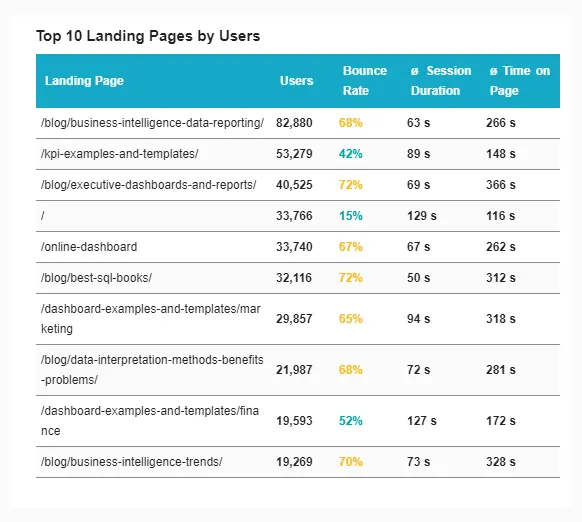

我们现在知道博客对公司有多重要，而不仅仅是在谷歌上的排名。相关性不仅限于公司博客的次数和他们带来的流量，还限于他们产生的潜在客户数量。生成博客潜在客户报告可以快速概述您每周通过文章带来的潜在客户数量。在[媒体分析软件](https://www.datafocus.ai/infos/publishing-media-analytics)的帮助下进一步分析，您可以看到哪一类文章带来的流量最多，然后专注于提高该类别的内容质量，以吸引更多。

请记住，定期搜索引擎更新（例如来自Google的更新）会在每次发生时影响您的流量。有时您可以成为最大的赢家，但有时您需要调整内容以恢复博客性能。

### 2） 每个渠道的网站流量和潜在客户

我们上面描述的内容也可以应用于您的网站流量。将其分解为渠道并分析哪些渠道带来了最多的潜在客户，可能会揭示可能需要更多关注和投资的表现不佳（或相反，表现优异）的渠道。按来源或渠道分组划分的会话数量可以通过多种不同的方式跟踪您的流量，这要归功于您的 GA 帐户中提供的[Google Analytics（分析](https://www.datafocus.ai/infos/kpi-examples-and-templates-google-analytics)）KPI。使用交互式报告工具来每周确定您的绩效可以减少考虑其他操作或简单地决定下一步所需的时间。

确定付费、自然、社交、推荐或任何其他渠道是您的宝石，并增加策略的性能，以增加来自它的流量。虽然记住您的长期绩效是决定您必须以哪种方式调整您的活动和工作的最相关参数之一，但每周摘要可以减少营销专业人员之间的部门间会议次数，并提供一种更快的方法来分析大数据。

### 3） 在线广告效果

如果您选择投资在线广告，您还需要跟踪其表现。最常见的定价模型，[每次点击成本（CPC），](https://www.datafocus.ai/infos/kpi-examples-and-templates-marketing#cost-per-click)如上图所示，被谷歌广告，雅虎搜索营销或Yandex Direct等主要搜索引擎使用。在上面的示例中，我们重点关注每次点击费用和关键字效果以及质量得分，以便更全面地了解我们的付费广告系列。您为广告的每次点击支付固定价格，目标是随着时间的推移降低该价格，而客户获取成本会降低该价格（只要您的转化率不下降）。

当您为您的业务选择最合适的在线广告模式时，您还可以将付款设置为CPM或CPA，这完全取决于您要在哪个平台上做广告，您的营销预算有多大以及您期望的目标。例如，有些程序化广告技术有自己的一组平台来展示您的广告。此外，如果您设置了品牌广告系列，则它与标准付费搜索广告系列有所不同。这完全取决于您的整体营销策略以及它如何与您的一般销售报告保持一致，您必须牢记这一点，因为销售与营销活动直接相关。

在下面的示例中，我们可以看到与周数和频道相关的已花费预算总额。使用这些数据可以深入了解您的投资是稳定的还是需要更多优化才能实现指定目标。这些数据集可以按感兴趣的特定周进行细分，这意味着您可以交互式地跟进第 11 周与第 10 周发生的情况。尽管这些数据也可以在月度或年度报告中使用，但此每周营销报告模板可以作为有关如何跟踪和分析您的工作的输入来源。

现在我们已经浏览了一些每周营销报告模板，让我们转向更短的愿景。每日报告不像月度报告那么常见，尤其是对于 SEO 营销，您不应该考虑太短。但是，让我们通过一些营销报告的示例来了解这一点。

## 每日营销报告示例和 KPI

每日营销报告是在较短的时间内跟踪的一组营销指标，通常用于确认促销活动是否按计划进行且没有问题。本报告侧重于日常流量、社交媒体参与度等。

我们的营销报告模板的一般目的是为您提供工具，以做出更明智的决策。每日报告将帮助您以更快的速度做到这一点。你可以用它来每天早上创建一个行动计划：你前一天完成了什么，今天可以做得更好？它可以让您几乎实时地与数据进行交互，因此您可以确信信息、目标和策略是新鲜且步入正轨的。尽管营销策略的总体结果不会在日常基础上受到影响，但使用这些类型的报告可以提供有关营销活动设置的日常活动的更多详细信息。

每日营销报告还可以让您更快地进行实验：运行小操作来回答小问题。这使每个人都能积极主动地及早发现问题并适应，以避免浪费金钱。此外，您的团队和您自己将完全了解您的数字，从而在必须做出决定时吸引每个人更大的信心。

然而，在日常生活中，很多事情都是你无法控制的——尤其是在营销方面。一天肯定不会决定竞选活动的结果，但连续几天可以表明趋势。虽然您不应该将自己束缚在太多的日常报告中，但每天检查一些活动是最佳实践。以下是您可以每天跟踪的一些 KPI 示例：

### 1） 网站流量

对于入站营销，网站流量是血液和脉搏：您需要吸引特定的受众（新受众或回头客），然后再将他们转变为潜在客户和实际客户。设置当月的流量目标后，您可以将其除以当月的天数，以设置您的每日目标，看看您是否接近该目标。为了获得更高的精度，您可以根据您的业务以及工作日/周末是否受到影响进行调整。监控您的网站流量可以帮助识别突然上升或下降，让您立即采取行动，并应鼓励您与销售团队沟通，销售团队的潜在客户和合格潜在客户的数量也可能受到影响。

您还可以过滤特定于渠道的流量，这意味着您可以立即查找自然流量、推荐、社交媒体、电子邮件或付费搜索等来源，查看哪些渠道表现良好，并密切关注它们与您的目标相关的行为，以便您可以及时优化它们以防止不必要的预算支出。要强调的重要一点是，不要仅仅因为您的日常活动没有按预期执行而改变所有定义的结构或目标。让我们看一个例子。

上面的示例显示了通过特定间隔（在本例中为每天）获得的流量源的确切百分比。虽然自然搜索肯定显示了这种特定性能的最大价值，但不应仅仅因为在特定日期它的表现不佳而忽略显示。但是，如果这种几乎占总流量的 50% 的趋势朝着同一方向发展，那么可以得出结论，部分预算可以针对表现更好的渠道进行优化。

### 2） 参与社交媒体

我们说得永远不够，但参与是关键。为了让您的品牌广为人知并记住您的名字，受众的各种社交新闻提要上的日常活动不仅会增加您随着时间的推移接触到更多人的机会，而且还会增加您与他们互动的机会。没有人讨论一个品牌，其社交媒体上的最后一篇文章是三个月前。在当今多产的讨论和分享渠道（Facebook，Twitter，Instagram，还有LinkedIn，Snapchat和Pinterest）中不活跃正在挖掘自己的坟墓。

找到更适合您的频道，但最重要的是，您可以更好地接触您的受众（50 岁的商人不会使用与青少年相同的频道，他们以某种方式倾向于创造和制造趋势，所以请继续关注）。每天或每隔几天通过它进行沟通。不要为了引起关注而抛出无趣的消息，否则你很容易失去它;制定策略并提供有价值的内容。回答问题，将自己添加到相关组中，与潜在客户或客户互动，并倾听市场和受众的意见。如果需要，请创建[客户仪表板](https://www.datafocus.ai/infos/client-dashboard-report-examples)，并通知所有相关利益相关者有关社交渠道的变化。

虽然这取决于您所属的行业，但社交媒体是一个很好的工具，可以在个人层面上直接互动，并围绕您的产品或服务[建立社区](https://www.forbes.com/sites/forbescommunicationscouncil/2021/03/25/16-inspiring-ways-to-build-a-community-on-social-media/?sh=116d3b2230b9)。话虽如此，建立社区管理策略还可以提供额外的营销活动来源，可以每天跟踪和评估。通过倾听您的客户和客户的意见，您还可以改进您的产品或服务，并产生更多可以在其他营销渠道和活动中利用和实施的想法。

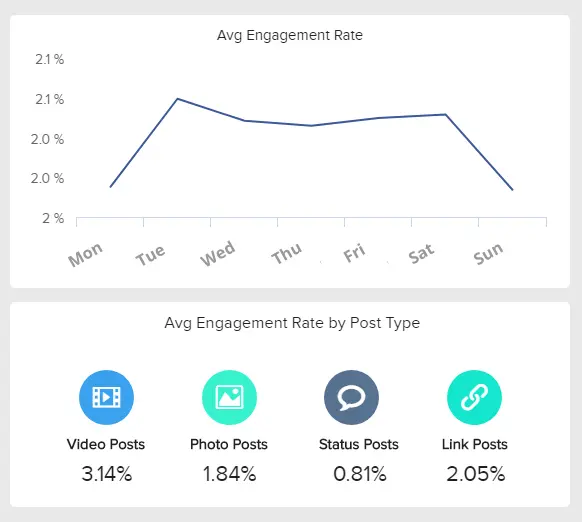

研究表明，在Facebook和Twitter上共享的内容从15分钟到6小时不等 - 这使其成为跟踪的良好日常KPI。在一天的时间里，您可以确定您的帖子的吸引力以及它为您的网站带来了多少流量。尽管在线媒体的指标和算法会定期变化，但社交媒体仍然是营销策略的重要组成部分。根据合适的受众调整您的社交努力可以带来价值和流量。

您还可以查看我们的[社交媒体报告](https://www.datafocus.ai/infos/social-media-reports-examples-and-templates)文章，全面了解不同的SM行为以及如何以最有效的方式利用它们。

### 3） 销售目标和增长

众所周知，您的营销活动对您的销售有重大影响。作为营销人员，您需要不断向销售团队报告，以说明您的预算以及营销活动在收入方面为企业带来的收入。如今，借助使用专业[BI 仪表板软件](https://www.datafocus.ai/infos/bi-dashboard-tools)创建的数字营销报告，您的营销和销售数据可以统一到一个中央访问位置，并提高公司的整体效率。让我们用一个例子来研究这个问题。

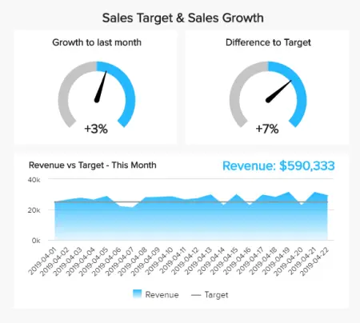

此每日营销报告模板旨在可视化您的业务或客户的销售目标和增长。这是每天跟踪的理想报告，因为它为您提供有关销售绩效以及您是否达到预期目标的持续数据。

首先，报告给出了上个月增长的百分比和目标的差异，这可以让您一目了然地了解您距离完成目标还有多远，或者您是否超过了目标。然后我们看到一个详细的图表，其中显示了与目标线配对的业务的每日收入。重要的是要考虑到，为了确保稳定的增长和可行的收入，您需要设定符合您业务现实的现实销售目标。如果你想从这些数据中提取进一步的结论，你可以将其与以前的时期进行比较，看看你增长了多少。

您的机会：[想免费测试营销报告软件吗？](https://www.datafocus.ai/console/)探索我们的 14 天免费试用版并从出色的营销报告中受益！

## 数字营销报告模板和示例

数字营销报告侧重于监控和评估数字营销工作，通常涉及广告、内容质量或关键字性能。此报告完全依赖于在线工具和软件，例如谷歌广告或数据松。

这些示例还可以帮助企业创建数字营销分析报告。在这个数据驱动的世界中，保持您的数字工作简洁、真实和美观至关重要。数字营销已成为整体战略的必备部分，为了确保您将所有数据集中在一个地方，KPI[仪表板软件](https://www.datafocus.ai/infos/kpi-dashboard-software)可以实时跟踪活动的效果，同时设置警报，以便在特定的[数字营销 KPI](https://www.datafocus.ai/infos/best-digital-marketing-kpis-and-metrics/)改变其路线或表现低于预期时自动通知您。让我们通过一些数字营销报告仪表板来了解这一点。

### 1） 内容质量控制

\*\*点击放大\*\*

我们都知道老内容营销说法：内容为王，语境为王。为了确保您的内容制作和文章参与度正常，这个[内容仪表板](https://www.datafocus.ai/infos/content-reporting-dashboards)形式的数字营销报告示例包含创建成功撰写的文章的最重要数据。使用此模板，您可以清楚地了解发布前后的所有内容阶段，以确保它符合公司要求的质量标准。为此，本报告包含两个关键指标，我们将在下面解释。

- 肉体阅读轻松

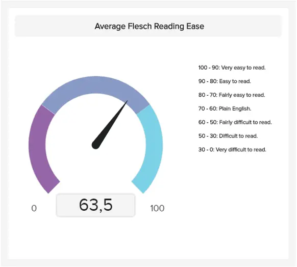

简而言之，Flesch 阅读易用性是几十年来在美国用来衡量文本可读性的分数。通过做一些研究，您可以找出行业基准并在此基础上衡量文本的可读性。

- 故事周转时间

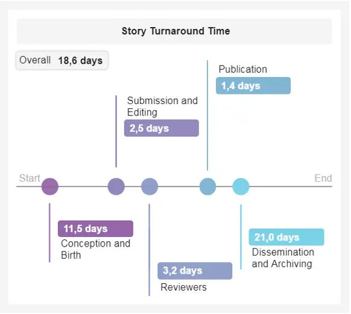

通过查看一个故事需要写多少时间，您可以得出结论，作者是否在挣扎，或者是否没有足够的时间进行审查过程？整个故事的转变可以提供更深入的数据见解，从而推动决策者采取可衡量的行动。

### 2） 谷歌广告数字营销分析报告

谷歌是在线营销人员最受欢迎的平台之一，他们寻找搜索引擎广告（SEA）的可能性，按每次点击成本（CPC）或每千次成本（CPM）付费。我们已经在本文前面扩展了付费选项，但本节专门介绍世界上最大的搜索引擎之一：Google。

大多数营销人员在职业生涯的某个阶段都在谷歌上做过广告。虽然Google提供了许多选项来跟踪和显示您的结果，但它确实有一些限制，可以通过全面的[实时仪表板](https://www.datafocus.ai/infos/live-dashboards)轻松解决。

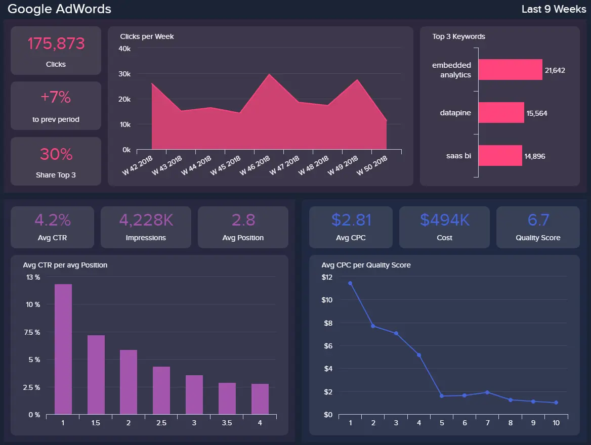

\*\*点击放大\*\*

此信息中心展示了最突出的[Google Ads](https://www.datafocus.ai/infos/kpi-examples-and-templates-google-adwords)指标，这些指标侧重于关键字信息和数据分析。如您所见，系统会将点击次数与上一时间段进行比较，然后是选定周内的效果概览。热门关键字部分将立即让您知道哪种关键字产生的点击次数最多，以及您的大部分预算都花在哪里。此[Google Ads 信息中心](https://www.datafocus.ai/infos/dashboard-examples-and-templates-google-adwords)上每个位置的平均点击率的详细信息值得跟踪，因为它将帮助您为使用的关键字创建基准，您可以在其中查看是否需要进行其他调整或广告系列是否表现良好。

- 点击率 （点击率）

与每个排名的点击率配对，进一步[向下钻取](https://www.datafocus.ai/infos/drill-down-drill-through-reports)数据可以帮助您按点击率可视化前 5 个关键字。这些数据可以帮助您得出更深入的结论，了解用户喜欢您的广告的哪些方面。广告的排名会影响点击率，您应该记住，点击率低于平均水平几乎不可能获得较高的排名。

- 关键字质量得分

质量得分是用于跟踪广告体验质量的 Google Ads 指标。它以 1-10 的等级进行衡量，并考虑（预期的）点击率、广告相关性和着陆页的用户体验进行计算。因此，优化广告的这些方面以确保最佳质量非常重要。

### 3） 社交媒体内容营销报告

我们的下一个数字营销活动报告模板是一个[KPI 记分卡](https://www.datafocus.ai/infos/kpi-scorecard-examples-templates-to-track-performance)，专注于四个流行的社交媒体平台的表现：Facebook、Twitter、Instagram 和 YouTube。正如我们在本文前面提到的，社交媒体是商业营销策略的重要组成部分，因为它可以作为创建围绕您的业务的社区的一种手段，以及您可以在其中与客户互动的空间他们最舒服的地方。

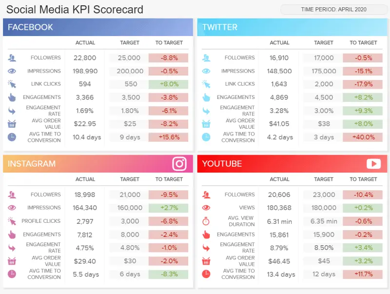

\*\*点击放大\*\*

更深入地了解这份社交媒体营销报告，我们可以看到每个平台分为 7 个指标，这些指标与设定的目标和前一时期进行比较。与此配对，红色和绿色的颜色代码将立即告诉您是否达到了目标，使本报告成为向客户或其他相关利益相关者展示以快速浏览绩效的非常好的工具。例如，我们可以看到 Twitter 的平均转换时间存在问题，比预期的 40 天目标多 +3%，这是需要更详细调查的事情，以了解问题是否与您的帖子、受众、平台或其他方面有关。

- 参与率

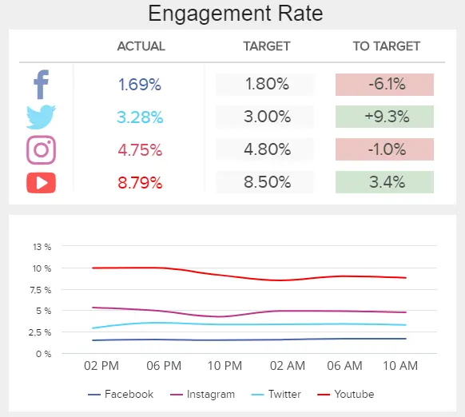

参与率是衡量社交媒体工作成功与否的关键指标。通过比较不同渠道的费率，您可以得出有关客户偏好和实施策略的更深入的结论。

像这样的数字营销报告仪表板将节省任何营销部门在其社交媒体平台上手动报告的时间，并将成为基于最新可用数据的讨论和战略制定的基本支持。

### 4） 谷歌分析营销策略报告

此列表中的下一个示例是来自任何营销人员或网站管理员的关键平台之一的营销分析报告：Google Analytics （GA）。尽管 GA 是一个了不起的工具，它使我们能够从数据中发现很多见解，但它有一些局限性，例如没有足够的可视化类型或高级分析功能，例如机器学习技术。下面的示例是使用 datapine 的专业仪表板[创建器](https://www.datafocus.ai/infos/dashboard-creator)创建的，它包括几个交互式功能，例如向下钻取、钻取和复杂的仪表板筛选器，以便进行更深入的分析。让我们更详细地研究一下！

\*\*点击放大\*\*

这个[谷歌分析仪表板](https://www.datafocus.ai/infos/dashboard-examples-and-templates-google-analytics)充满了运营指标，可让您每天监控网站的性能。在顶部，我们看到一个 KPI 列表，包括会话数和新用户数、跳出率、平均会话持续时间、转化次数和转化率，所有这些都每天、每周和每月进行监控，以便您可以快速了解您的数字是下降还是增加。

与此配对，仪表板包括其他 4 个图表，可让您更详细地查看排名靠前的指标。通过持续监控这些 KPI，您将能够识别绩效、增长机会以及趋势和模式中的瓶颈，这将帮助您在开展营销活动时做好更充分的准备。让我们在下面更详细地看一下两个主要 KPI。

- 跳出率

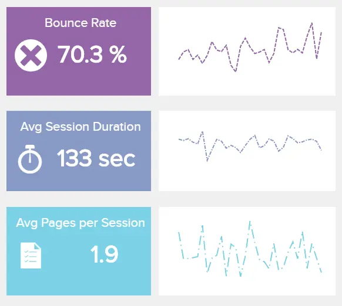

跳出率跟踪仅查看一个页面然后离开的网站访问者的百分比。高跳出率可能意味着您的网站不够吸引人，无法让访问者滚动，或者访问者在该页面上找到了他们正在寻找的内容。因此，详细分析它很重要。

- 进球转化率

在线营销转换是网站访问者执行所需操作，这可以是订阅邮件列表或下载文档或单击CTA等任何内容。按国家/地区跟踪目标完成情况有助于您了解在转化方面应将精力集中在哪个位置。

您的机会：[想免费测试营销报告软件吗？](https://www.datafocus.ai/console/)探索我们的 14 天免费试用版并从出色的营销报告中受益！

### 5） LinkedIn公司页面报告

对于我们的下一个数字营销报告示例，我们选择一个网络来展示报告实践的整体方法：LinkedIn。众所周知，LinkedIn是一个强大的业务网络，可以产生许多B2B促销结果，例如增加参与度，关注者数量以及最终的潜在客户。这就是为什么跟踪社交网络作为促销活动的一部分很重要的原因，因为可能性是无穷无尽的。

\*\*点击放大\*\*

这份内容广泛的报告聚焦了这个社交网络上宝贵的公司业绩。营销报告最佳实践之一包括收集最重要的[LinkedIn指标](https://www.datafocus.ai/infos/kpi-examples-and-templates-linkedin)，并全面研究它们如何相互补充以及可以做些什么来确保最佳结果。

在这种情况下，我们将仔细研究您的公司在获得追随者方面所处的位置。通过了解您的受众，您将有更好的机会根据他们的专业背景（例如行业）创建引人注目的内容和目标（如果您针对软件爱好者或法律专业人士，您肯定会创建不同的内容）。这是我们的[仪表板创意](https://www.datafocus.ai/infos/great-dashboard-design-examples-for-inspiration)之一，可帮助您将所有LinkedIn公司页面数据整合到一个屋檐下，为您提供有关点击率、参与率的详细信息以及最近 5 次更新的简短概述。

- 公司更新统计数据

公司更新统计信息是LinkedIn的数字营销 KPI，用于跟踪您最近更新的点击率和参与率。当然，数字越高越好，因此您可以使用最成功的数字作为受众最喜欢什么的基准。

- 展示次数和覆盖面

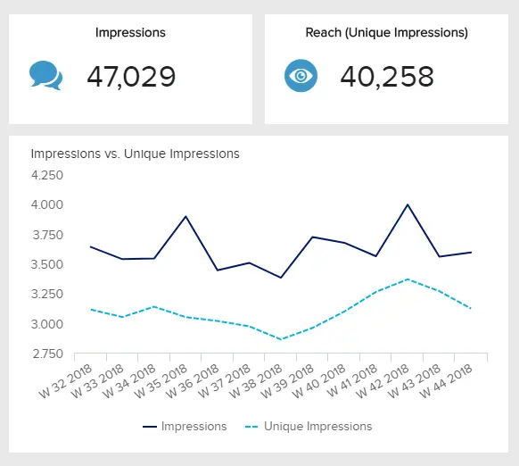

尽管看起来很简单，但展示次数和覆盖面会跟踪您的内容覆盖的人数。这也是了解策略成功与否的一个很好的指标。

### 6） 推特绩效报告

\*\*点击放大\*\*

此数字营销报告模板跟踪与 Twitter 在过去 30 天内的表现相关的所有方面。借助参与率、点击次数、喜欢次数、展示次数、热门推文等相关指标，营销人员能够掌握其策略，并根据报告提供的见解对其进行优化。例如，通过查看热门推文，您可以提取有关受众最喜欢的内容格式和类型的结论，并为他们提供更多内容。让我们在下面更详细地了解两个关键指标。

- 平均链接点击量

您的 Twitter 工作的底线是为您的网站带来更多流量，因此跟踪来自您的帖子的链接点击量是包含在[您的 Twitter 仪表板](https://www.datafocus.ai/infos/dashboard-examples-and-templates-twitter)中的基本 KPI。通过查看特定日期的这些数据，您可以了解哪些内容最吸引人。

- 平均展示次数

作为链接点击量的补充，我们有每天的展示次数。这是一个重要的参与度指标，每天跟踪它可以帮助您了解某些操作（新帖子、影响者协作等）如何影响您的流量。

### 7） 脸书广告报告

\*\*点击放大\*\*

研究表明，92%的营销人员正在使用Facebook投放广告。考虑到这一点，将所有 KPI 组织在视觉上吸引人的报告中，如上面所示是在此平台上取得成功的宝贵做法。上面的[Facebook 仪表板](https://www.datafocus.ai/infos/dashboard-examples-and-templates-facebook)提供了营销人员所需的所有指标的见解，以确保他们的广告策略按预期工作。最重要的是，您可以获得与广告相关的指标摘要，例如展示次数、覆盖人数、频率、每次点击费用和点击率。在底部，您可以细分这些相同的指标，以深入挖掘并提取有用的结论。让我们探讨其中两个关键指标。

- 每次转化费用

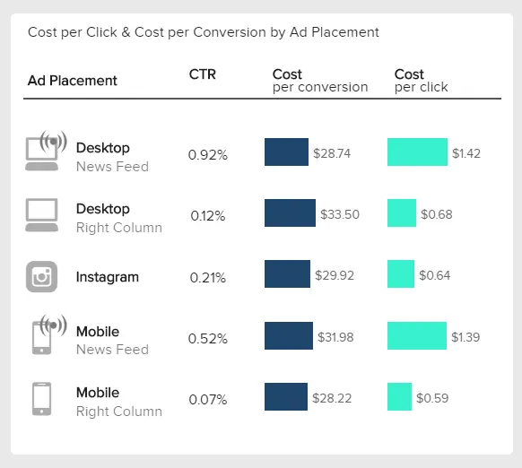

顾名思义，此 KPI 跟踪产生转化的成本。根据渠道、设备和广告类型，费用可能会有所不同。您可以测试不同的广告展示位置，并比较点击率、每次点击费用和每次转化费用，以了解哪种类型的广告效果最佳。

- 广告展示次数和频率

这个最具洞察力的[Facebook KPI](https://www.datafocus.ai/infos/kpi-examples-and-templates-facebook)结合了覆盖人数、展示次数和每周频次，让您了解广告的表现。频次衡量唯一身份观看者看到您的广告的次数。您希望避免频次高于 2，因为广告展示次数过多会导致受众疲劳。如果您的频率为 4，则这些观众转换的可能性非常低。

就像您安排每日、每周和每月营销活动一样，您也将构建每日、每周和每月营销报告。如果您的做法正确并利用一些有效的[数据驱动的营销策略](https://www.datafocus.ai/infos/data-driven-marketing-strategy)提示和技巧，只需单击几下即可生成报告。正如您在本文中看到的，我们收集了一些营销报告模板，这些模板可以轻松用于完善生成数据的效率并减少创建数据所需的时间。

## 数字营销报告最佳实践

我们都听说过那个著名的月底，无论是在机构还是内部，都需要提交报告。当你的键盘燃烧，你的手指试图跟上你的大脑并理解你正在写的所有数据时，使用交互式[在线数据可视化](https://www.datafocus.ai/infos/data-visualization-tools)工具来设置你一直在跟踪的特定时间参数或目标可以带来很多节省的时间，因此，节省很多钱。为了完成这篇关于营销分析报告的有见地的指南，我们将为您提供有关如何编写成功报告以提升您的营销部门的提示列表。

1\. 定义您的营销目标

第一步也是最重要的一步是定义您的营销目标。这将为之后的所有工作奠定基础，因为它将帮助您保持分析的重点和结构化。当然，您的营销目标应该与公司的总体目标相关联，并努力实现这些目标。在这方面的一个好做法是设定长期和短期目标，并围绕这些目标制定战略。

2\. 第一件事 - 组织和优先处理您的营销数据

作为营销人员，您使用许多工具为您提供大量信息。这通常是需要清理和组织的原始数据，以便提供所需的见解。出于这个原因，在使用[在线报告工具](https://www.datafocus.ai/infos/online-reporting)创建营销情报报告之前的第二步应该是定义和准备将进入其中的所有必要数据。一种简单的筛选方法是仅考虑对实现业务目标更有价值的数据。

3\. 构建指标

与任何报告一样，您可能需要创建、构建和实施指标，以讲述有趣且具有教育意义的数据故事，这在我们的数字时代至关重要。在为营销报告选择指标时，它们需要与报告的主题及其最终目标保持一致。例如，每次点击费用或点击率等低级指标不会参与关注客户成本的战略报告。您需要决定要讲述哪个故事以及向谁讲述：您的同事、主管还是副总裁？下一点会详细介绍！

4\. 定义受众

您很可能需要向不同的利益相关者报告您的营销工作。因此，除了为您的最终目标选择正确的指标外，考虑您正在撰写报告的人员也很重要。您的销售部门将需要与您的首席执行官或客户不同类型的报告。为每个利益相关者创建特定的报告将使您的报告过程更加高效和准确，因为您将避免混合可能以误导性结论结束的指标。

5\. 使用交互式视觉效果

一旦您定义了明确的目标、指标和受众，就该开始考虑报告的实际格式了。正如您在我们的示例中所看到的，依靠交互式可视化来使数据更易于理解至关重要。数据分析工具（如 datapine）提供了以交互式仪表板的形式构建报告的可能性[，这些仪表板充满了交互式](https://www.datafocus.ai/infos/interactive-dashboard-features)视觉对象，可以对其进行过滤和探索以获得更深入的结论。

6\. 受益于实时跟踪

可能比任何其他部门都更能从报告过程中包含实时数据中受益。通过依靠实时跟踪，您可以监控广告系列的效果，并立即意识到何时某些内容未按预期工作。这样，您将能够根据真正的见解明智地分配资源。

7\. 设置智能警报

需要手动检查报告以查看数据的最新发展是一项繁琐的任务，可能会占用其他战略任务的时间。出于这个原因，另一个很好的做法是依靠[智能数据警报](https://www.datafocus.ai/infos/business-intelligence-data-alerts)。这些警报旨在在预定义操作完成或发生异常时立即通知您。这样，您可以避免每两秒检查一次报告。

8.不要隐藏你的坏结果

这似乎是一个显而易见的观点，但它非常重要，不能将其排除在此列表中。在从数据中提取可操作的见解时，坏结果与好结果同样重要。毕竟，如果你不知道出了什么问题，你将如何提高你的表现？因此，您永远不应从营销报告中排除不良绩效指标，因为它们只会使您的业务更强大。

9\. 使用专业软件

有无数的报告挖掘您的营销数据;问题通常是，我从哪里开始？是否有任何基本报告可以帮助我更熟悉这些堆积如山的聚合数据？首先，您可能希望为自己配备[营销 BI](https://www.datafocus.ai/infos/business-intelligence-marketing)软件来分析您的所有数据并轻松构建专业报告。

10\. 定期监控您的数据

最后，只有当您定期检查它们并查看您是否走上正轨时，启动具有可实现目标的活动才值得 - 等待活动结束以查看其表现如何，不幸的是，人们常犯的错误，也是最糟糕的做法。正如福布斯的一篇文章所说，“没有'设置并忘记它\[在线营销\]这样的事情”。注意到某些事情在第 7 天而不是第 47 天没有按计划工作，可以节省大量时间，并且浪费更少的钱。

## 营销报告的常见挑战

如果您达到了这一点，那么您已经了解到营销分析和报告的世界提供了无限的可能性。也就是说，它并非没有挑战。为了完成这篇文章，我们将介绍公司在处理营销报告时可能面临的一些常见问题或挑战。让我们深入研究！

- 测量太多

在营销报告方面，您很可能会有大量数据可供分析。这可能来自各种社交媒体渠道或网络分析工具，如谷歌分析或谷歌广告。有了所有这些可用信息，很容易用所有这些数据来填充您的报告进行分析，但是，从长远来看，这确实会损害您的分析。在分析界有一种说法：“当你测量一切时，你什么也没测量”。因此，重要的是只衡量有助于您实现目标的数据。考虑客户的需求和偏好是什么，只选择有助于您得出更深入的结论并提供更好的体验的信息。

- 使用过多的视觉对象（或根本没有视觉对象）

正如您可能已经通过我们的大量示例列表意识到的那样，任何现代营销报告流程都依赖于视觉效果作为关键元素。人脑处理视觉信息的速度比文本快，因此，图形数据的使用成为根本。也就是说，确定要包含多少视觉效果始终是一个挑战。一个常见的错误是添加许多图表并使报告混乱，使其几乎无法理解。好消息是，很多人已经面临这一挑战，并且已经找到了可以遵循的设计最佳实践，以避免使报表混乱。此外，在线数据可视化工具通常包括报告模板，您可以将其用作构建高效快速报告的指南。

- 缺乏数据知识

虽然数据的使用已经存在了几十年，但直到几年前，随着自助服务工具的兴起，分析的大门才向更广泛的受众敞开。每天，越来越多的企业正在实施跨部门交互式报表的使用，作为协作工具。在谈论营销时尤其如此，因为该部门需要与其他团队合作来制定与公司总体目标相对应的战略。然而，缺乏数据知识总是是一个挑战，因为不是每个人都能理解报告中包含的信息。为了避免这种情况发生，重要的是要投资用户友好和直观的工具。通过这种方式，您可以让每个人都能更轻松地将数据整合到他们的日常运营中。此外，评估部门中的数据知识水平并为对此没有信心的员工提供培训实例被认为是一种很好的做法。

- 使用技术术语

扩展上述观点，营销人员在构建报告时面临的另一个巨大挑战是在定义他们将添加到报告中的标签和概念时不考虑他们的受众。相反，这是一个仍然不了解概念的初级员工，或者来自其他部门的团队成员不太熟悉营销术语，每个人都应该能够通过查看来理解您报告上的数据。如果您在没有任何类型的解释的情况下包含太多技术术语，则可能会使报告更难理解，并且分析过程可能会受到损害。为避免这种情况，请确保根据谁将使用报表来调整标签，或者添加简短说明以帮助用户了解信息。

您的机会：[想免费测试营销报告软件吗？](https://www.datafocus.ai/console/)探索我们的 14 天免费试用版并从出色的营销报告中受益！

## 营销报告结论

我们已经回答了什么是营销报告，提供了广泛的示例，分析了各种报告，并为您提供了在创建自己的报告时应关注的提示。为什么最后要进行如此多的数据分析？仅仅因为我们以彼得·德鲁克（Peter Drucker）的名言开始了这篇文章，“没有衡量的东西，就无法改进”。这些报告是切片、切块和分析数据，将连接您的营销活动与最初设定的目标之间的点。他们可以帮助您得出结论 - 但也有教训！– 来自您的广告系列、各种测试和错误。它们可以帮助您发现问题以及抓住和复制成功的机会。

要开始从您的营销数据中受益并创建专业的仪表板，请开始我们的[14 天免费试用](https://www.datafocus.ai/console/)，只需单击几下即可创建报告！
