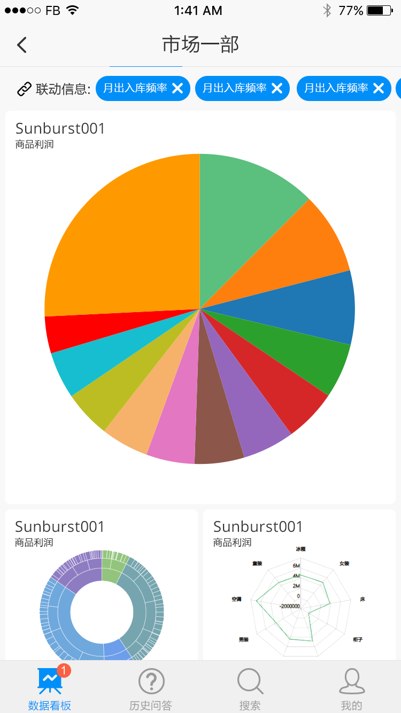

2019年是商业智能BI分析技术的又一个激动人心的年头，在今年商业智能也许会进化出很多有趣的新功能。人工智能AI和机器学习经过多年的发展，已经在许多方面展现了其强大的能力，一个可以看得到的趋势就是商业智能将向大众用户发展。随着DataFocus等一批NLP技术为基础的数据分析平台的出现，大数据分析不再需要软件工程师或者专业的商业数据分析师才能操作，数据分析的工作逐渐扩展到业务人员，这样一方面扩大了商业智能软件的适用范围，一方面也加快了企业数字化的进程。下面我们来分享一下，BI数据分析产品的发展趋势。

数据分析将从独立的、显示的产品，变成无处不在的嵌入式分析能力。以前，数据分析产品都是独立部署的，给用户非常清晰的使用界限，必须登录入系统进行相关的操作。将来的数据分析产品将是一种即取即用的能力。比如，用户会在ERP系统中，或者公司门户中看到的数据图表、数字看板大屏，都是来自于BI工具所产生的链接。在DataFocus中，用户可以将图表生成第三方链接供用户跨系统调用。还有一种场景，就是用户在BI系统中，比如看板中，观察到库存过低，他可以通过按钮直接跳转WMS系统进行订货操作。

调用后可嵌入第三方系统页面

分析变得越来越智能。认知计算这个由IBM热炒起来的概念正在逐渐深入人心，并在工业领域得到实际的应用。从商业智能的领域来看，就是分析工作正在变得越来越自动化。尽管DataFocus等软件已经提供了搜索式的交互方式，将数据分析的工作难度进一步降低到业务人员也可以使用的程度，但是仍然还需要人员去干预。人工智能的终极目标是让人类从一切工作中解放出来。因此，从这个立足点出发，数据分析系统自动的完成数据洞察任务，并将数据分析的结论建议出来。下图是DataFocus的智能洞察结果：

移动化仍然是趋势，但是发展速度比预期要慢。五年前就有人预言商业智能BI移动化会成为必然趋势，如今5年时间已过，移动BI的普及程度并不如预期。原因主要是数据分析的交互性一直是很高的要求，手机屏幕的限制一直抑制了商业智能BI在移动端得到更好发挥的障碍。比如数据看板或可视化大屏，显然并不适合在移动端进行展示。针对中国市场，则有一些新的移动趋势，比如将BI展示集成到企业微信或者钉钉中去，以更好的发挥商业智能BI的协作性。

更好的支持物联网。随着5G、Lora、NBIot等技术的成熟，物联网技术将成为势不可挡的发展趋势。未来将会有数百亿甚至数千亿个终端物联网设备或传感器接入网络，这个规模数百倍于移动互联时代。要在中央计算平台进行如此巨大规模的数据处理是不切实际的，也是很低效的。因此，边缘计算将逐渐引入商业智能分析中，物联网终端进行数据分析，然后将处理过的数据汇入云端进行进一步处理。

增强对实时数据的处理能力。以往的商业智能分析软件，更专注于离线分析。待分析的数据通过定期更新的方式导入数据仓库中，一些早期的技术需要事前构建CUBE，建立数据集市，进一步切片数据，最终才能进行分析。所有的这些分析都是建立在离线的基础之上，不能反映实时的趋势，这一切都会改变。一些高级数据分析工具，如DataFocus可以不用事先建立CUBE和数据集市，也不需要切片数据，甚至可以直接链接数据库进行分析。更进一步的功能，DataFocus专家版将提供实时数据和离线数据的关联查询，这将会是商业智能分析的一大飞跃。

全面引入自然语言处理技术。自然语言处理（NLP）与自然语言查询（NLQ）将使得BI系统更方便的为用户使用。这完全改变了数据分析的交互方式，自10多年以前tableau推出graphSQL一来，又一个里程碑式的跨越。除此之外，更进一步的，BI系统将引入自然语言生成技术（NLG），可以为用户以更容易理解的方式提供见解，允许非技术用户阅读和解释复杂的图表并解释数据集之间的关系。

人工智能技术将使得是数据分析工作变得越来越平明化。这与上面的表述有点儿重复，但是还是需要再次强调一下。机器学习或者AI技术有可能在商业智能领域得到很好的运用。这与自动驾驶和智能问答助理还不一样，AI有可能在驾驶领域永远达不到完美的状态，但是在数据分析领域可不一样。通过自然语言处理技术，BI分析将不再需要任何代码开发，甚至不需要拖拖拽拽去开发，搜索式的交互会变成主流的方式，此外，集成了机器学习功能的商业智能平台如DataFocus，将可以充分发挥机器学习的功用，进行各种预测，预警等。
