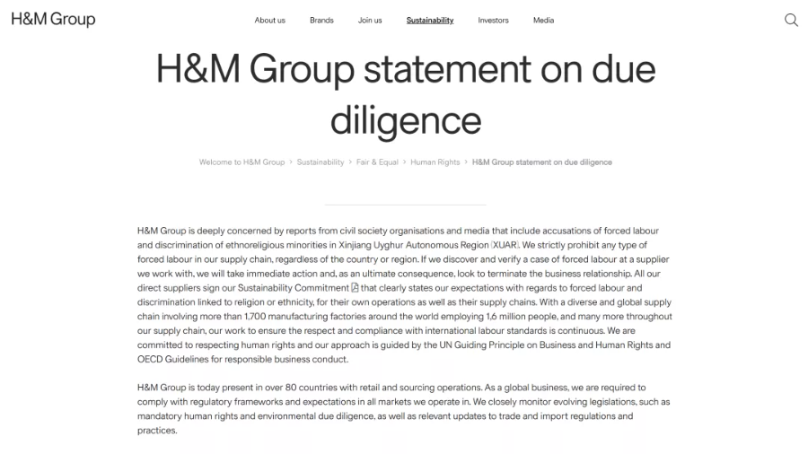

城市的GDP一直是城市经济实力的体现。今天，百度热搜出现“前三季度中国GDP 50强”，相信大家都在关注吧。那今天我们就在原数据的基础上，利用DaTaFocus帮你看数据，了解一下哪些城市表现亮眼，而城市之间又有哪些新变化吧！

**1、GDP50强城市概览**

在DATaFocus中导入数据后，**我们直接点击左侧列名，系统就能自动输入到搜索框中，为您生成所需图表**。从图表看出，十强城市（也叫做塔尖城市）分别为上海、北京、深圳、重庆、广州、苏州、成都、杭州、南京、武汉。

还可以对图标样式和属性进行自定义更改，不管是词云图还是条形图都是3秒切换，只需要点点鼠标，想要的图表就做好了。可以将图表进行保存、分享等。

注：DaTaFocus包含多种图表样式可供选择

注：DaTaFocus包含多种图表样式可供选择

**2、GDP实际增速超3%的城市**

只需输入实际增速、城市、实际增速>=0.03、按实际增速降速排列，**系统自动生成所需图表，排序方式也完全符合要求。**从数据看出**，**在疫情的影响下，依旧有10个城市的实际增速超过了3%（非常了不起的成绩），分别是**西安、南通、南京、杭州、常州、长沙、济南、福州、长春、厦门**，它们基本都来自华东地区以及中西部的强省会，**其中最突出的，是西安市的4.5%。**

**3、哪个省份上榜最多**

**只需输入count (城市）和省份，3秒钟，系统自动生成50强城市的省份分布情况**。从环形图中可以看出，江苏省以9城上榜排名第一，浙江省、山东省分列第二、第三。为这些省份鼓掌~

简单的几个示例，相信已经让您感受到DaTaFocus的特色了吧！没错，**DataFocus就是这样一款可以使用自然语言输入、并自动生成图表的可视化数据分析工具。**它别具一格，区别于市面上传统的数据分析工具，让数据分析摆脱专业的代码和繁琐的语句，**只要你会使用搜索引擎，就可以做数据分析！**

了解更多信息，欢迎访问DataFocus官网：datafocus.ai。还可以免费申请试用哦~
