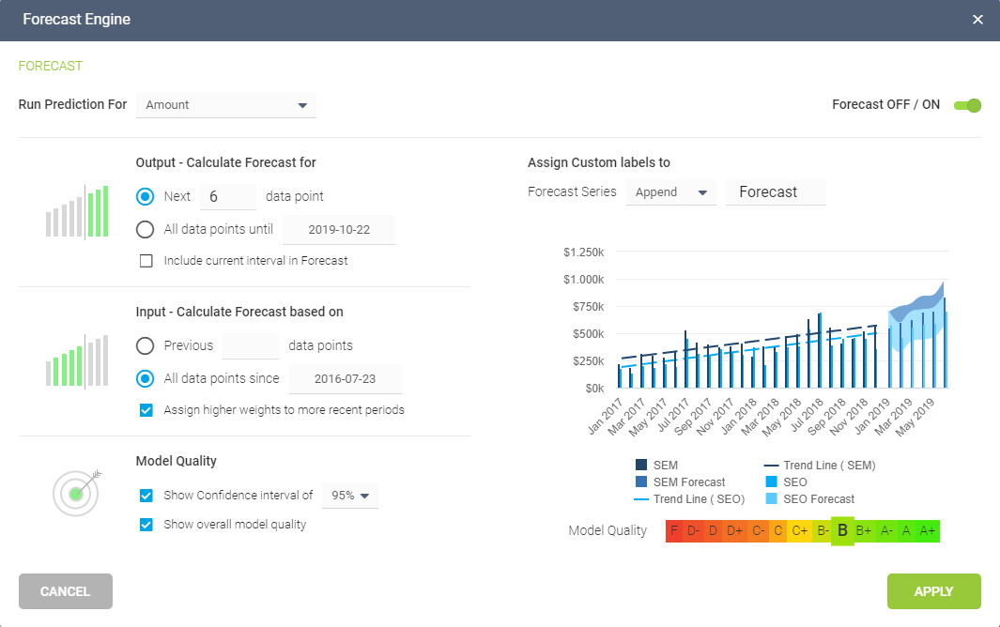

过去的十年，商业智能发生了革命性的变化。数据爆炸并变得变大。就这样，我们都进入了云端。电子表格最终让位于可操作和有洞察力的数据可视化和交互式[业务仪表板](https://www.datafocus.ai/infos/dashboard-examples-and-templates)。自助分析的兴起使数据产品链民主化。突然间，高级分析不再是分析师们的专利。

2021 年对于商业智能行业来说是特别重要的一年。我们在2020年提出的趋势将持续到 2022 年。但 BI 格局正在演变，商业智能的未来正在发挥作用，新兴趋势值得关注。2022 年，[BI 工具](https://www.datafocus.ai/infos/best-bi-tools-software-review-list)和策略将变得越来越定制化。各种规模的企业不再询问他们是否需要增加对商业智能分析的访问权限，而是询问针对其特定业务的最佳 BI 解决方案是什么。

公司不再想知道数据可视化是否能改进分析，而是想知道讲述每个数据故事的最佳方式是什么，尤其是在现代[BI 仪表板软件](https://www.datafocus.ai/infos/bi-dashboard-tools)的帮助下。2022 年将是数据安全和数据发现之年：干净、安全的数据与简单而强大的演示相结合。这也将是 BI 和人工智能的协作一年。我们很高兴看到新的一年会带来什么。继续阅读，了解我们 2022 年的十大商业智能趋势！

## 让我们讨论这 10 个商业智能趋势

 

## 1）人工智能

我们将开始分析人工智能在商业智能中的新特性。Gartner 在其最新的《战略技术趋势》报告中广泛涵盖了这一趋势，将 AI 与工程和超自动化相结合，并专注于 AI 可能发展为易受攻击点的安全级别。

人工智能 (AI) 是一门旨在让机器执行通常由复杂的人类智能完成的工作的科学。通常被视为人类最高的敌人或朋友（例如电影终结者中的天网_、黑客帝国中的机器_或 Tron 的主控制程序），尽管一些著名的科学家和科技企业家提出了合理的警告，但人工智能还没有摧毁我的地步。

虽然我们致力于避免此类不便，但人工智能和机器学习正在彻底改变我们与分析和数据管理交互的方式，同时必须考虑增加安全措施。事实是，无论我们喜欢与否，它都会影响我们的生活_。_

预计在未来几内，人工智能将演变成一种更负责任和可扩展的技术，因为组织将对基于人工智能的系统提出更多要求。根据 Gartner 的 2021 年数据和分析研究，随着 COVID-19 彻底改变商业格局，历史数据将不再是基于人工智能的技术的主要驱动力。作为变化，这些解决方案将需要使用更小的数据集和更具自适应的机器学习，同时还要符合新的隐私法规。这个概念被称为道德AI，其目的是确保组织以不违法的方式使用人工智能系统。许多公司因非法收集用户数据而面临法律问题。Facebook 和 Cambridge Analytica 的丑闻就是一​​个很好的例子。我们将把数据安全作为 2022 年的第二个 BI 趋势来讨论。

企业正在从静态的、被动的、已经发生的事情报告发展为带有仪表板的主动分析，这些仪表板可以帮助企业了解每秒钟发生的事情，并在事情不应该发生时发出警报。诸如基于最先进神经网络的 AI 算法等解决方案在异常检测方面提供了较高的精度，因为它从历史趋势和模式中学习。这样，任何意外事件都将立即注册，系统将通知用户。

AI 在 BI 解决方案中提供的另一个特性是升级的洞察能力。它基本上可以完全自动地分析您的数据集，而无需您付出任何努力。只需选择要分析的数据源和算法应该关注的列/变量（例如，收入）。然后，将运行计算并通过增长/趋势/预测、价值驱动因素、关键领域相关性、异常情况和假设分析返回给您。这是一个令人难以置信的时间收益，因为通常由数据科学家处理的事情将由工具来完成，即使没有强大的 IT 背景，业务用户也可以访问高质量的见解并更好地理解他们的信息。

时间增益也以 AI 助手的形式出现。工具已经开始开发人工智能功能，使用户能够以简单的语言与软件进行交流——用户输入问题或请求，人工智能会生成最佳答案。

对实时[在线数据分析](https://www.datafocus.ai/infos/data-analysis-tools)工具的需求不断增加，IoT（物联网）的到来也带来了无法估量的数据，这将推动统计分析和管理成为重中之重。然而，如今的企业想要走得更远，预测分析是另一个需要密切关注的趋势，我们将在本文后面介绍。

未来商业智能的另一个增加因素是在决斗中测试人工智能。举例来说，一个 AI 将创建一个逼真的图像，另一个将尝试确定该图像是否是人造的。这个概念称为生成对抗网络 (GAN)，可用于在线验证过程，如 CAPTCHA 技术。当决斗发生多次时，人工智能就会变得更聪明，能够评估和破解这种在线安全系统。科技巨头以多种不同方式使用人工智能，这将改变机器学习过程，我们应该在 2022 年密切关注这一过程。

## 2) 数据安全

2021 年，每个人都在谈论数据和信息安全，到2022 年，这两个问题还将继续在世界范围内引起轰动。欧盟 GDPR（通用数据保护条例）、美国CCPA（加州消费者隐私法）和巴西的 LGPD（通用个人数据保护法）等隐私法规的实施，为数据安全和用户个人信息的管理奠定了基础。

此外，欧洲法院最近推翻了名为数隐私保护的法律框架，并没有让软件公司的生活变得更轻松。Shield 是一个法律框架，使公司能够将数据从欧盟传输到美国，但由于最近的法律发展导致该过程无效，总部位于美国的公司无权传输任何欧盟数据主体。

实际上，类似的情况早在2015年就已经发生过了，当时欧盟和美国在这个问题上曾有一段时间没有合法有效的协议。许多美国的（软件）公司争辩说他们使用的是欧洲服务器，根本没有数据传输到美国。然而，从法律的角度来看，即使是这种解决方案也存在问题，因为从理论上讲，美国司法机构甚至可以强制美国公司披露来自欧盟服务器的数据。本质上，位于欧盟的数据需要留在欧盟。在实践中，这意味着在当前情况下，欧盟企业如果使用美国软件供应商为他们存储任何类型数据，他们将在法律灰色地带运营，将面临风险。

考虑到所有这些因素，企业被迫在安全方面进行投资，以遵守新法规，同时也保护自己免受网络犯罪的侵害。事实上，预计未来 5 年全球zai网络安全产品上的支出将达到1.75 万亿美元。这对专家来说并不意外。在 2020 年和 COVID-19 初期，各种规模的公司都被迫从实体转向数字化，为了加速转型，他们依靠在线服务为网络犯罪分子的攻击留下了空隙。根据 2021 年毕马威 CEO Outlook Pulse调查，网络安全风险是未来 3 年 CEO 面临的最大威胁。如下图所示，它从 2020 年的 10% 增加到 2021 年的 18%。

_来源：__毕马威 2021 年 CEO 展望脉搏调查_

[网络安全方面的这种担忧也给SaaS BI](https://www.datafocus.ai/infos/saas-bi)工具带来了挑战，因为他们需要确保他们提供的产品是安全的，客户能信任其敏感数据。就像任何其他云解决方案一样，在线商业智能工具也面临着安全风险。其中包括快速处理数据以提供可能受到法规遵从性影响的实时洞察、将数据从用户系统移动到 BI 工具的云时的漏洞，或者当工具提供来自多个设备的数据访问时，这些设备可能不安全并暴于攻击等等。为了避免这种情况的发生，BI 软件需要明确关注安全性。

帮助 SaaS BI 解决方案保持安全的最新方法之一是网络安全网格架构。网络安全网格是一种可组合且可扩展的安全控制，旨在保护驻留在应用程序、云、物联网等中的数字资产。它寻求在一个人或一个特定点周围建立一个明确的安全边界，采用更加模块化的方法，例如，使用户能够以安全的方式从他们的智能手机访问数据。Gartner 对 2021-2022 年的网络安全预测之一指出，到 2024 年底，采用网络安全网格架构的组织将把安全事件的财务影响降低约90%。由于数据泄露经常出现在新闻、热门行业和普通用户中，对安全产品和服务的需求是可以理解的。

## 3) 数据发现/可视化

在去年，数据发现的影响力有所增加。商业应用研究中心进行的一项调查将数据发现列为 2022 年按重要性等级划分的前 4 大商业智能趋势之一。BI 从业者表明，为商业用户赋能是一个强大且一致的趋势。

_来源：__商业应用研究中心_

从本质上讲，数据发现是从各种内部和外部来源收集数据并使用高级分析和可视化来整合所有信息的过程。这使企业能够通过授权他们以直观的方式分析和操作信息并提取可操作的见解来让每个相关的利益相关者与数据保持联系。为了实现这一目标，各种规模的企业都求助于现代解决方案，例如提供数据集成、交互式可视化、用户友好界的商业智能工具，同时以高效和直观方式处理大量数据的灵活性。

需要考虑的一个基本要素是，[数据发现工具](https://www.datafocus.ai/infos/what-are-data-discovery-tools)依赖于一个过程，然后，生成的发现将带来业务价值。它需要以数据准备、可视化分析和引导高级分析的形式了解数据之间的关系。“对数据发现工具的高需求反映了 BI 世界向增加数据使用和洞察力提取的巨大转变，”研究中心强调说。使用[在线数据可视化](https://www.datafocus.ai/infos/data-visualization-tools)工具执行这些操作正在成为产生相关见解和创建可持续决策过程的宝贵资源。也就是说，企业用户需要的软件是：

- 便于使用的
- 敏捷和灵活的
- 缩短洞察时间
- 允许轻松处理大容量和各种数据

发现您甚至不知道的业务运营趋势，或在发生业务异常时立即采取行动，已成为有效管理各种规模企业的宝贵工具。

数据可视化已经发展成为一种最先进的解决方案，可以在单个屏幕上呈现大量图形并与之交互，无论是专注于开发[销售图表](https://www.datafocus.ai/infos/sales-graphs-and-charts-for-managers)还是综合交互式报告。关键是，数据发现是一个让决策者能够揭示洞察力的过程，通过使用可视化，团队有机会在几分钟内发现趋势和主要异常值。

到 2022 年，仪表板将继续成为主要的视觉交流工具，通过成为项目的分析中心来增强团队之间的协作。但不仅仅是一个可视化工具，[KPI 仪表板](https://www.datafocus.ai/infos/best-kpi-dashboard-examples)将通过基于人工智能的警报和实时数据等技术将其交互功能提升到一个新的水平。由于人类更好地处理视觉数据，数据发现趋势将成为 2022 年最重要的 BI 趋势之一。

## 4) 数据质量管理

由于每秒产生如此多的信息，在执行分析时使用高质量数据已成为一个关键要素，因此，在2022 年，这是一个相关的商业智能趋势。考虑到糟糕的数据质量每年给单个企业损失 9.7 至 1420 万美元，这一趋势的重要性不容忽视，因为数据不足不仅会浪费资源，还会对企业造成严重伤害。数据质量差的一些后果可能包括错误生成的营销预算、企业了解客户行为的准确程度、他们将潜在客户转化为销售的速度，甚至更大的业务决策，例如错误的投资或资源分配。考虑到这一切，[数据质量管理](https://www.datafocus.ai/infos/data-quality-management-and-metrics)(DQM) 为企业有效处理信息提供了一种解脱。

从本质上讲，数据质量管理确保了公司可以通过使用正确的数据进行分析，来做出正确的[数据驱动决策。](https://www.datafocus.ai/infos/data-driven-decision-making-in-businesses)这意味着企业衡量数据质量的方式没有明确的真相，因为这完全取决于上下文。也就是说，为了确保成功的数据管理流程，需要遵循一些指导方针，其中包括数据的准确性、一致性、完整性、及时性和兼容性。这意思是，没有重复或缺失的值，没有不代表所需时间线的过时数据，也没有不一致的数据。数据一致性的一个简单示例是，每个部门的员工总数不超过该组织的员工总数。

从这种富有洞察力的分析趋势中得到的重要启示是，这种趋势不会有任何变化。数据已成为业务成功的关键部分。每一天，公司都在从多个来源收集更复杂的数据，这些数据需要使用正确的工具和流程进行仔细管理。随着定期提出更严格的合规要求，确保所有可用数据都到位。这就是为什么数据质量管理将成为 2022 年商业智能行业的基本趋势之一。

## 5) 预测性和规范性分析工具

未来的商业分析专注于未来，并试图回答以下问题：将会发生什么？我们怎样才能做到这一点？因此，预测性和规范性分析是迄今为止 BI 专业人士讨论最多的业务分析趋势，特别是因为大数据正在成为分析流程的主要焦点，不仅被大企业利用，中小型企业也一样。

**预测分析**是从现有数据集中提取信息以预测未来概率的实践。它是数据挖掘的延伸，只涉及过去的数据。预测分析包括估计未来数据，因此始终包括其定义中出现错误的可能性，尽管随着当今管理大量数据的软件变得更智能、更高效，这些错误逐渐减少。预测分析以可接受的可靠性水平指示未来可能发生的情况，包括一些替代方案和风险评估。应用于商业领域，预测分析用于分析当前数据和历史事实，以便更好地了解客户、产品和合作伙伴，并识别公司的潜在风险和机遇。

各行业以不同的方式利用预测分析。航空公司用它来决定一趟航班以每个价格出售多少张机票；酒店试图预测他们在任何特定夜晚可以预期的客人数量，调整价格从而最大限度地提高入住率并增加收入；营销人员确定客户的反应或购买，并设置交叉销售机会；而银行家则使用它来生成信用评分 - 由一个包含与个人信用相关的所有数据的预测模型生成的数字。现实生活中使用了大量[大数据示例](https://www.datafocus.ai/infos/big-data-examples-in-real-life)，塑造了我们的世界，无论是购买体验还是管理客户数据。

预测分析也必须为每个人用，并且在 2022 年，我们将见证更多的相关性将迎合这一概念。自助分析的可能性正在成为 BI 供应商和公司的标准；双方都可以从中获利，为自己的业务带来更多价值。实际上，预测模型使用数学模型来预测未来发生的事情，也就是预测引擎。用户只需选择过去的数据点，软件会根据历史和当前数据自动计算出预测结果，如下所示：

在不同的预测分析方法中，有两种在数据科学家中比较流行：人工神经网络 (ANN) 和自回归集成移动平均 (ARIMA)。

在**人工神经网络中，**数据的处理方式与生物神经元类似。技术复制了生物学：信息流入数学神经元，由它处理，然后输出结果。这个单一的过程变成了一个重复多次的数学公式。就像人类大脑一样，神经网络的强大之处在于它们能够将神经元集合分层连接在一起并创建多维网络。第二层的输入来自第一层的输出，并且每一层都会重复这种情况。此过程允许在具有大量数据、变量数量或多样性的一组模式中捕获关联或发现规律。

**ARIMA**是一种用于时间序列分析的模型，它应用过去的数据对现有数据进行建模并预测未来。分析包括检查自相关——比较当前数据值与过去值的依赖关系——尤其是选择在进行预测时应考虑到过去的多少步。ARIMA 的每个部分负责模型创建的不同方面——自回归部分 (AR) 尝试通过考虑前一个值来估计当前值。移动平均 (MA) 部分使用预测数据和实际值之间的任何差异。我们可以检查这些值是否是正常的、随机的和平稳的——具有恒定的变化。这些点上的任何偏差都可以洞察数据序列的行为，预测新的异常，或帮助发现肉眼看不到的潜在模式。ARIMA 技术很复杂，从结果中得出结论可能不像更基本的统计分析方法那样简单。但是一旦掌握了基本原理，ARIMA 就为预测分析提供了一个非常强大的工具。

**规范性分析**在未来走得更远。它检查数据或内容，以确定应该做出什么决定以及采取哪些步骤来实现预期目标。它的特点是图形分析、模拟、复杂事件处理、神经网络、推荐引擎、启发式和机器学习等技术。规范性分析试图了解未来决策的影响，以便在实际做出决策之前对其进行调整。这大大改善了决策，因为在预测中考虑了未来的结果。规范性分析可以帮助您优化调度、生产、库存和供应链设计，以最优化的方式交付客户想要的东西，这些都是我们将听到的更多关于 2022 年商业智能的新兴趋势。

## 6) 实时数据与分析

今年对实时数据的需求发生了巨大变化，并将继续作为 2022 年的数据分析趋势之一。自大流行病毒爆发以来，我们已经看到，实时和准确更新是制定应对这种不局势的适当策略的关键。一些国家已经利用数据来做出可能的最佳决策，而公司也遵循这些数据来确保在这些不确定的时期生存。实时访问数据已成为日常生活中的常态，不仅对企业而言，对公众也是如此，我们可以在新闻发布会上看到定义了一些策略的最新信息、图表和统计数据抗击疫情。但不仅如此；创建[临时分析](https://www.datafocus.ai/infos/ad-hoc-reporting-analysis-meaning-benefits-examples)使企业能够掌握变化并适应今年带来的巨大挑战。

在业务中也是如此：预测和警报将不可避免地更多地用于制定适当的业务响应和策略，为未来的努力带来更多变数。此外，实施[实时仪表板](https://www.datafocus.ai/infos/live-dashboards)将帮助公司立即访问有关其业务的相关信息，并在出现任何潜在问题时做出反应。最新数据变得比以往任何时候都更加重要，因为世界已经改变，公司也需要适应。高速数据访问正在成为常态，这也是为什么一些公司能够生存而其他公司不能生存的原因之一。

在2022年，商业分析的趋势肯定会将实时数据作为主要驱动力之一，毫无疑问，我们将看到更多的实时数据。

## 7) 协作商业智能

今天，经理和员工需要以不同的方式进行互动，因为他们面对是一个竞争日益激烈的环境。我们越来越多地看到一种新的商业智能正在兴起：协作式 BI。它是协作工具（包括社交媒体和其他 2.0 技术）与[在线 BI 工具](https://www.datafocus.ai/infos/online-bi-tools)的组合。这是在加强协作的背景下开发的，以应对快速通道业务提供的新挑战，在快速通道业务中完成了更多分析并编辑了报告。在谈到协作式 BI 时，“[自助式 BI](https://www.datafocus.ai/infos/self-service-bi-tools) ”一词很快就出现了，因为这些自助式工具不需要 IT 团队访问、解释和理解所有数据。

这些 BI 工具可以更轻松地生成自动报告，这些报告可以安排在特定时间和特定人员。例如; 它们使您能够设置[商业智能警报](https://www.datafocus.ai/infos/business-intelligence-data-alerts)、共享具有灵活交互级别的公共或嵌入式仪表板。所有这些可能性都可以在所有设备上访问，从而增强决策和解决问题的过程，这对于当今不断变化的环境至关重要。在疫情迫使企业转向在家办公的情况下，协作比以往任何时候都更需要正确的工具来支持。

协作信息、信息增强和协作决策是新[BI 解决方案](https://www.datafocus.ai/infos/business-intelligence-bi-solutions)的重点。但协作 BI 并不仅仅停留在一些文档的交换或更新中。它必须跟踪各种会议、电话、电子邮件交流和想法收集的各种进展。最近的一些见解预测，协作式商业智能将与更大的系统和更大的用户群建立更紧密的联系。团队的表现将受到影响，决策过程将在这个新概念中蓬勃发展。

事实上，预计到 2022 年，协作式 BI 将从仅仅分享见解进一步发展，并将从早期阶段开始。从数据探索开始，扩展都整个分析工作流程，以实现更有效的决策过程，包括每个利益相关者，无论他们身在何处。让我们看看它将如何在 2022 年的商业智能趋势话题中发展。

## 8) 数据素养

随着数据成为各种规模的企业战略决策的基础，理解这些数据并将其作为组织中每个人都可以使用的协作工具的能力对于成功至关重要。也就是说，数据素养将成为 2022 年值得关注的相关数据分析趋势之一。

数据素养被定义为在特定上下文中理解、读取、写入和交流数据的能力。这意味着了解用于分析数据的技术和方法，以及实施的工具和技术。据Gartner称，糟糕的数据素养被列为 CDO 办公室成功的第二大障碍，并补充说，到 2023 年，数据素养将成为推动业务价值的关键。

即使每个人都可以使用的自助服务工具的​已经兴起，数据素养仍然是成功的数据驱动文化的基础。业务领导者负责为整个组织提供所需的培训和工具，以便每个人都有权使用数据和分析。为了实现成功的数据素养流程，需要对员工和管理人员的技能进行仔细评估，以确定薄弱环节和差距。Gartner 建议首先确定可以流利使用数据的用户，充当非技术群体的“中介”，并在数据未能达到其目的的地方确定沟通障碍。掌握了所有这些知识后，创建有针对性的训练实例将变得更容易。

从长远来看，通过适当的培训和正确的工具，不同知识水平的用户将能够执行高级分析并将数据作为他们的主要语言。随着预测分析等技术面向普通用户，数据科学将不再需要由专家来执行——将这些专业人员转移到其他高级任务上，例如机器学习或 MLOps。事实上，据 Gartner 称，预计到 2025 年，数据科学家的短缺将不再是企业采用先进技术流程的障碍。也就是说，数据素养将成为来年 BI 行业的常规话题。

## 9) 数据自动化

如果没有数据（分析）自动化，商业智能主题就不完整。在过去的十年中，我们看到了如此多的数据产生、存储和准备处理，以至于公司和组织都在认真寻找现代数据自动化解决方案，来处理已收集的大量信息。KDNuggets 的一项调查预测，在未来十年，数据科学任务将实现自动化，因此，这是我们需要密切关注的商业智能趋势之一，因为我们不知道它何时会发生。

数十种工具和不同的来源仍然是当今企业面临的瓶颈的一部分。BI 的解决方案使用户能够整合公司管理的所有数据，并提供发现、分析、测量、监控和评估大规模数据的方法。我们在Gartner 预测的将在明年爆发的十大[IT 流行语](https://www.datafocus.ai/infos/technology-buzzwords)中提到了超自动化，我们当然同意这一点。这种新趋势指的是企业通过使用多种工具和技术（如人工智能、机器学习、低代码和无代码工具等）使尽可能多的流程自动化。

商业智能带来了许多自动化的可能性，在 2022 年，我们将看到更多。数据科学家和业务用户之间长期存在的障碍正在慢慢混合成一个一站式服务，以满足公司可能拥有的任何数据需求——从收集、分析、监控、报告和共享结果。一个场景可能包括智能报告——预测分析和自动化报告提高了业务用户自行处理数据的能力，而无需 IT 部门的帮助。另一方面，数据科学家仍将管理需要手动编写脚本和编码的复杂分析。

现在让我们来解决 2022 年我们的最后一个 BI 和分析趋势！

## 10) 嵌入式分析

当数据分析发生在用户的自然工作流程中时，嵌入式分析就是游戏的名称。企业已经认识到将各种 BI 组件（如仪表板或报告）嵌入到他们自己的应用程序中的潜力，从而改进他们的决策过程并提高生产力。以前被电子表格扼杀的公司已经意识到如何利用[嵌入式仪表板](https://www.datafocus.ai/infos/embedded-dashboards)使他们能够在自己的应用程序中提供更高的价值。事实上，根据联合市场研究，嵌入式分析市场预计到 2026 年将达到 775.2 亿美元，与2017 年相比的复合年增长率为 13.6%，这是我们将在 2022 年听到更多的商业分析主题之一。

无论您是需要创建[销售报告](https://www.datafocus.ai/infos/sales-report-kpi-examples-for-daily-reports)还是向客户发送多个仪表板，嵌入式分析正在成为业务运营的标准，到 2022 年，我们将看到更多公司采用它。部门和公司所有者正在寻找专业的解决方案来展示他们的数据，而无需构建自己的软件。通过简单地对所选应用程序贴上白色标签，组织可以向消费者提供一个精美的演示和报告。

不仅仅是将仪表板或 BI 功能嵌入到应用程序中，嵌入分析还允许通过让每个利益相关者参与来进行协作。通过为客户和员工提供在众所周知的环境中操作数据的可能性，可以促进从业务的各个领域提取洞察力。这使其成为这个列表中增长最快的商业智能趋势之一。

美国商业资讯最近发布了一份名为“全球嵌入式分析市场（2021 年至 2026 年）——增长、趋势、COVID-19 影响和预测”的报告，其中提到“组织正在部署嵌入式分析解决方案，以实现收入增长、市场扩张和竞争优势的显著优势”。他们还补充说，嵌入式分析预计将在未来几年在医疗保健行业显着增长。考虑到医院收集的海量数据，以及随着 COVID-19 和远程医疗的互动而变得更大的数据，这导致医疗保健企业“从为服务量付费转向为服务价值付费”。通过使用功能强大的嵌入式[医疗保健分析软件](https://www.datafocus.ai/infos/healthcare-analytics)，医院管理人员可以提取有价值的见解，帮助他们从临床、运营和财务角度优化流程。

这是业务分析的趋势之一，可以立即实现，因为许多供应商已经提供了这种机会，并确保应用程序无缝运行，没有太多复杂性。

## 2022 年的分析和商业智能趋势是什么？

我们在本文中总结了商业智能的未来。以下是我们将在 2022 年讨论的十大分析和商业智能趋势：

1. 人工智能
2. 数据安全
3. 数据发现/可视化
4. 数据质量管理
5. 预测性和规范性分析工具
6. 实时数据和分析
7. 协作商业智能
8. 数据素养
9. 数据自动化
10. 嵌入式分析

## 2022 年成为数据驱动型！

受数据驱动不再是一个理想的；这是现代商业世界的期望。2022 年将是激动人心的一年，我们将摒弃所有炒作，朝着从最先进的[在线商业智能软件](https://www.datafocus.ai/infos/online-bi-tools)中提取最大价值的方向前进。

如果您已准备好开始您的商业智能之旅，或者跟上 2022 年的趋势，那么试用我们的软件进行30 [天的试用](https://www.datafocus.ai/console/)就可以了！
