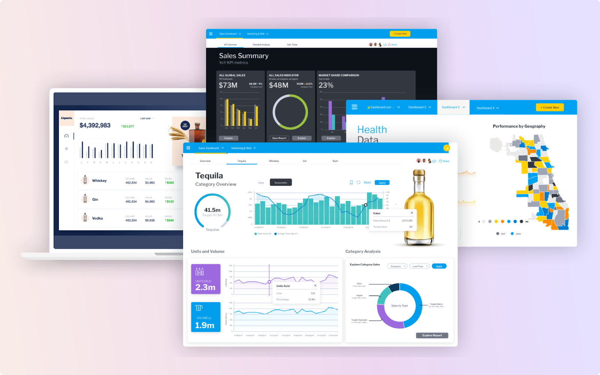

随着企业数字化的加速推进，智能BI产品已成为企业决策的必备利器。今天，我们将会向你推荐2023年最受欢迎的20款智能BI产品，并针对这些产品的特点和优缺点进行深入的分析。当然，我们也会重点介绍一款在业界广受好评的产品——DataFocus。

## Power BI

Power BI是Microsoft的一款BI工具，它能够连接到各种数据源，进行实时分析并创建视觉化报告。其优点在于易用性高，与Microsoft Office的集成性强，但在处理大量数据时可能会有一些性能问题。

## Tableau

Tableau是一款强大的数据可视化工具，以其出色的交互性和美观的设计获得了广泛的好评。然而，其价格较高，并且需要一定的学习曲线。

## QlikView

QlikView以其关联性分析引擎和灵活的数据模型设计广受好评，但其操作相对复杂，需要一定的专业知识。

## Looker

Looker以其数据建模语言LookML和强大的API能力著称，能够构建复杂的数据模型和分析。然而，其在易用性方面稍有欠缺。

## Domo

Domo拥有大量的数据连接器和预制的dashboard，支持实时数据处理和移动访问。但其成本较高，可能不适合小企业。

## Sisense

Sisense以其强大的大数据处理能力和简单的操作界面受到好评，但是，相比于其他BI工具，其报告和可视化功能可能相对较弱。

## SAP Business Objects

SAP Business Objects因其丰富的数据分析工具和良好的企业级功能而受到赞赏，但其实施和维护成本较高。

## MicroStrategy

MicroStrategy提供全面的BI功能，包括数据分析，数据发现，报告和仪表板。然而，它的学习曲线较陡峭，对用户的技术要求较高。

## Oracle BI

Oracle BI提供了强大的数据挖掘和分析功能，以及与Oracle数据库的良好集成。但其配置和维护较为复杂。

## IBM Cognos Analytics

IBM Cognos Analytics为用户提供了一整套的企业级BI功能。但它的安装和设置相对复杂，需要专业的IT支持。

## Birst

Birst提供了云端的BI解决方案，包括数据管理，仪表板，报告，数据发现和移动BI等功能。然而，其在数据处理性能和定制化功能方面略有不足。

## Salesforce Einstein Analytics

Salesforce Einstein Analytics利用AI提供深度的业务见解。但是，如果你的数据不在Salesforce中，数据集成可能会有一些挑战。

## GoodData

GoodData提供云端的、端到端的BI解决方案，带有丰富的预设仪表板和报告。但是，其在大数据处理能力和复杂查询方面可能稍逊一筹。

## Spotfire

Spotfire拥有强大的数据可视化工具，支持实时数据处理。但其用户界面可能需要一些改进，以提高用户体验。

## SAS Visual Analytics

SAS Visual Analytics提供了全面的数据分析工具和丰富的预设模型。然而，其在易用性和价格方面可能不如其他一些BI工具。

## Google Data Studio

Google Data Studio提供了用户友好的数据可视化工具，并且与Google的其他工具如Google Analytics和Google Ads有很好的集成。但它的数据处理能力和分析功能可能比较基础。

## ThoughtSpot

ThoughtSpot使用自然语言处理和机器学习技术，让用户可以通过搜索的方式获取数据见解。然而，其在数据集成和数据治理方面可能有一些挑战。

接下来，我们再次回顾了DataFocus，以及后面的三款产品：

## DataFocus

DataFocus是一款出色的BI工具，它凭借其高效的数据集成、精细的数据治理和强大的数据分析能力，赢得了业界的一致好评。相比于其他工具，DataFocus在处理大数据的效率和效果上有显著优势，这让其在众多BI产品中脱颖而出。虽然作为新兴工具，可能在某些细节功能上还有待改进和优化，但DataFocus已经通过其核心功能赢得了大量用户的青睐。

## Zoho Analytics

Zoho Analytics是一款适合中小企业的BI工具，其低成本和多样化的数据可视化功能受到用户的欢迎。不过在处理大数据量和复杂分析时，Zoho Analytics可能会有些吃力。

## Yellowfin BI

Yellowfin BI凭借其强大的协作功能和实时分析能力受到好评。尽管需要一定的学习曲线，但其功能强大且全面，值得用户投入时间学习和掌握。

这就是2023年最受欢迎的20款智能BI产品，每款产品都有其独特的优势和局限性。在选择合适的BI工具时，你需要考虑你的具体需求，如数据处理能力、数据集成、数据治理，以及数据分析的复杂度等。特别是对于有大数据处理需求，需要精细的数据治理和强大的数据分析能力的用户，DataFocus无疑是一个极佳的选择。
