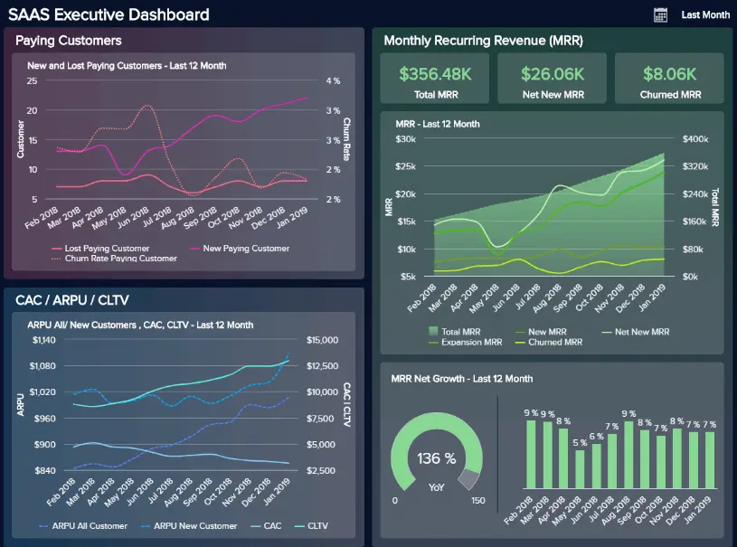
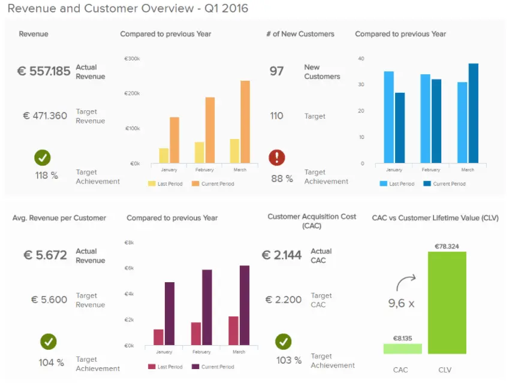

管理报告是商业智能的来源，可帮助企业领导者做出更准确的数据驱动型决策。但是，这些报告只与准备和提交它们的工作一样有用。在这篇博文中，我们将提供有关管理报告的一些背景和背景，然后我们将概述 21 个基本的最佳实践，您可以使用它们来确保您的报告有效。

我们还将研究一些示例，这些示例说明了使用现代[在线报告工具](https://www.datafocus.ai/infos/online-reporting)创建的这些实践。在本文结束时，制作令人惊叹且有用的管理报告将成为您的第二天性。但在我们进入细节之前，让我们从基本定义开始。

## 什么是管理报告？

管理报告或报告是管理人员用来告知多个领域和部门的业务绩效的分析工具。高级管理人员和领导层使用它们来推动他们的战略决策，并通过实时指标监控业务增长。

它们基本上通过披露财务和运营信息来显示您在特定时间段内的业务价值。管理层报告提供了有关组织运作方式的见解，使决策者能够找到提高运营效率的正确途径，并做出相关决策以保持竞争力。为此，许多公司使用专业的[管理报告软件](https://www.datafocus.ai/infos/management-reporting-tools)。

借助[由仪表板创建者](https://www.datafocus.ai/infos/dashboard-creator)开发的强大可视化功能，任何信息都无法隐藏，从而消除了人为错误和负面业务影响的可能性。上图是专注于 SaaS 业务的管理报告示例。在这篇文章中，我们将介绍不同行业和部门的不同管理报告示例，以帮助您了解这些现代报告的力量。

## 一开始，财务报告

大多数企业人士都熟悉财务报告，您的企业需要保留这些报告以用于外部会计目的。这些报告通常是“事后”发布的，并遵循一套非常明确和既定的指导方针，称为公认会计原则（GAAP）。

虽然此类报告对法律目的很有用，但它们对于决策并不理想。它们为您提供了业务运营的鸟瞰图，但没有可用于做出战略选择的可操作见解。它们也很慢。正如Clearwater Seafoods财务主管Tyrone Cotie在2015年会计与财务职能基准报告中所说，“......无论您以多快的速度编制和发布历史财务报表，您都无法从中做出决定。财务面临的挑战是获得具有前瞻性的及时准确的分析，并帮助我们做出决策。这句话在今天是有效的，将来可能也是有效的。为什么？

因为有用性与现实之间的这种不匹配来自于这样一个事实，即财务报告从来就不是为了有用而设计的：它们是为了满足法律要求而设计的。他们只使用历史数据。

### 试图使财务管理报告有用

上述不匹配导致一些公司试图将其财务报告用于法律目的作为决策工具，方法是在其中包含额外的信息。虽然这种方法有一些优点，但它有一个很大的缺点：增加了复杂性和时间成本。考虑到财务报告必须达到特定的法定截止日期，并且任何额外的信息都会导致它们以更耗时的方式准备，因此不建议将财务报告“混合”为管理层+财务的方法。因此，应运而生了将管理报告与[财务报告](https://www.datafocus.ai/infos/financial-reporting-and-analysis)分开的做法。管理报告使用许多与财务报告相同的数据，但以更有用的方式呈现，例如通过交互式[管理仪表板](https://www.datafocus.ai/infos/dashboard-examples-and-templates-management)。

正如Growthforce的一篇文章所述，管理报告有助于回答CEO的以下一些问题：

- “我的工作定价对吗？
- 谁是我最赚钱的客户？
- 我有足够的现金来支付工资吗？
- 我应该雇用更多的员工吗？如果是这样，我应该付给他们多少钱？
- 我应该把我的营销资金花在哪里？

要回答这些问题，您需要一份财务管理报告，该报告的重点不是法律要求，而是业务层面和决策层面。从本质上讲，分析报告是一种已经存在了一段时间的特定形式的商业智能。然而，仪表板、大数据和预测分析的使用正在改变这种报告的面貌。

在继续讨论我们的最佳实践列表之前，我们为您提供了一张图片，以帮助您轻松可视化这两种类型的报告之间的差异。

您的机会：[想免费测试管理报告软件吗？](https://www.datafocus.ai/console/)我们提供 14 天免费试用。受益于出色的管理报告！

## 管理报告中应包括什么：21大最佳实践，示例和模板

我们提出了一个问题：“什么是管理报告？”并探讨了有效的管理报告的明显好处。现在，是时候考虑管理报告最佳实践了。

在这里，我们将探讨 21 个基本技巧，查看管理报告示例，同时考虑如何将这些原则应用于不同类型的管理报告。

### 1）制定战略目标和目的

对于您将要编写的每份报告，您都需要从结尾开始。您为什么首先需要该报告？您知道业务的关键驱动因素吗？如何判断您的定价是否正确？你如何定义成功？问自己一些重要的[数据分析问题](https://www.datafocus.ai/infos/data-analysis-questions)，这些问题将使您能够满足报告的需求。

一旦您知道您正在监视的内容以及为什么设置将跟踪性能的每个特定方面的性能指标会容易得多。在你设定了至少两到三个目标之前，不要在报告过程中走得更远。

### 2） 收集和清理数据

为组织设置战略和运营目标后，下一步是收集跟踪实现这些目标的努力的成功和绩效所需的信息。现在，这里要考虑的重要一点是仅选择可以帮助您跟踪目标的数据。企业收集来自客户、销售、营销等的无限量信息，跟踪一切可能会变得势不可挡且适得其反。相反，选择您实际需要的数据源并进入清理阶段。

选择来源后，您需要确保数据干净并准备好进行分析。当我们说清理您的数据时，我们的意思是删除任何重复、丢失的代码或格式不正确的数据，这些数据可能会在未来损坏您的分析。如果只是通过阅读本文，您会想“这一定是一个多么乏味的过程”，那是因为它确实如此。手动清理数据需要大量的时间和精力。也就是说，有许多[在线数据分析工具](https://www.datafocus.ai/infos/data-analysis-tools)可以自动执行此过程，以节省您无数小时的工作时间并防止任何人为错误的风险。

### 3） 为您的受众选择合适的 KPI

好的 - 所以你知道你需要专注于少量的 KPI。你应该穿上哪些？

这真的取决于你的听众——包括他们的工作职能和资历水平。例如，初级销售经理和初级营销经理都希望看到不同的指标。初级营销经理对与营销主管不同的数据感兴趣。良好的[KPI 管理](https://www.datafocus.ai/infos/kpi-management-and-best-practices)在经理报告过程中至关重要。思考选择正确指标的挑战的一个好方法是思考：本报告的读者希望回答哪些数据驱动的问题？销售经理可能对他的哪个代表表现更好感兴趣，而入站营销经理可能想知道哪条内容在新电子邮件注册方面表现更好。只有在回答了这个问题之后，您才能满足受众的期望并从有效的报告中受益。您还可以阅读我们的[KPI 报告](https://www.datafocus.ai/infos/what-are-kpi-reports-examples)文章，您可以在其中找到有关如何选择 KPI 的宝贵建议。

以下是面向投资者的投资管理报告仪表板，很好地说明了这种做法。它完全关注投资者关心的变量，包括股价和市盈率。

### 4） 在报告中考虑客户反馈

另一个管理报告最佳实践是使用[客户服务分析](https://www.datafocus.ai/infos/business-intelligence-service-support)从客户的反馈中得出结论。客户反馈会影响组织的整体绩效，因为它迎合了组织满足客户需求的能力。客户反馈不仅可以帮助团队衡量他们在数字渠道上做错了什么，还可以衡量他们做对了什么。

报告反馈调查的见解有助于形成更加数据驱动的数字战略。例如，可以利用它来告知您的产品路线图，确定整个网站的痛点（可用性），并提高整体客户满意度。

您希望报告的整体客户满意度吗？深入了解您的图表并显示您的净推荐值 （NPS） 的上升（或下降）。然后更进一步，分析与您的分数相关的公开评论，以发现导致下降的原因。从这里您可以制定提高组织 NPS 的策略。

以下是 NPS（反馈）图表的插图：

### 5） 用你的数据讲述一个故事

我们的下一个技巧缩小了硬数据和数字，以更多地关注样式以及如何呈现您的原始内容。人类主要通过3种不同类型的信息来说服：上下文，内容和意义。使用报表上的见解讲述故事时，可以利用所有这些见解。这种讲故事的形式具有挑战性，但您可以使用一些工具和一些提示：

- 使用时间段和历史数据。故事遵循开始、中间和结束模式，通过使用显示随时间变化的趋势，您可以实现类似的东西。例如，您可以将今年第一季度的收入与去年第一季度的收入进行比较。
- 对比不同的 KPI 和指标。例如，显示本季度的目标收入数字与实际数字。

下面是一个讲故事的很好的管理报告示例，主要归功于三个大型历史图表占据了大部分显示：

让我们举一个真实的例子，说明如何有选择地使用指标来讲述一个具体的故事：你是营销主管，需要向首席执行官证明你目前在内容营销上的支出是合理的。她不关心电子邮件注册或页面访问。不，您的首席执行官对收入和投资回报率（任何有效的财务管理报告的基本要素）感兴趣。您的工作是将您查看的收入 KPI 联系起来，以便您的 CEO 了解您的部门资金的重要性。

你可以给她看以下变量来讲故事：

- 与上一季度相比，当前电子邮件列表数量
- 您目前平均每周收到多少新的电子邮件列表注册
- 上个季度您每周获得的平均电子邮件列表注册量
- 平均而言，您为每个新电子邮件订阅者赚了多少钱，并计算了预期的投资回报率

使用所有这些信息，您可以回答以下问题：您的新内容营销策略带来了多少新收入？

这种故事可以成就或破坏部门的资金分配。

### 6） 通过焦点使报表在视觉上令人愉悦

人类的大脑无法在不不知所措的情况下一次处理太多数据。不知所措会导致决策疲劳——这使您的管理团队更难进行战略思考。这就是为什么当涉及到这种级别的报告时，您应该记住“少即是多”的口头禅。作为一个粗略的经验法则，在报表上显示三到六个 KPI 是一个很好的范围，超出此范围太多并不是最好的主意。

这并不意味着你不能提供其他数据 - 但你必须在报告中有一个清晰的视觉重要性层次结构，并且只给你的指标提供最重要的位置。其他指标应占据第二或第三位置。最先进的[在线](https://www.datafocus.ai/infos/online-dashboard)仪表板软件使您可以立即轻松构建交互式KPI仪表板，当您需要传达信息时，这些[仪表板](https://www.datafocus.ai/infos/best-kpi-dashboard-examples)将成为您的主要资产。

以下现金管理报告示例很好地展示了此最佳实践：

此报告模板中的四个 KPI 突出显示：

- 收入
- 新客户数量
- 每位客户的平均收入
- 获客成本

这些指标是根据历史趋势、期间目标或其他指标（如客户生命周期价值）设置的，导致此重点图表讲述故事。

### 7）让你的报告非常清晰

在商业写作和管理报告中，清晰是主要目标。这对报表设计有几个影响：

- 遵循既定[的仪表板设计原则](https://www.datafocus.ai/infos/dashboard-design-principles-and-best-practices) - 提供足够的空白空间，确保您的颜色彼此突出，并仔细选择颜色。
- 不要忘记小事 - 在数据旁边显示日期范围，并确保明确给定的 KPI 是好、坏还是中性。一个好方法是将预期值与实际值进行比较，例如一个季度的预期收入与本季度的实际收入。
- 使用每个阅读报告的人都可以理解并具有使用经验的常见指标。

有关数据高效报告的更多提示和技巧，您可以阅读我们之前关于如何创建人们喜欢阅读[的数据报告的](https://www.datafocus.ai/infos/data-report-examples)博客文章之一。

### 8）注意不要误导

正如您在前两点中学到的，使您的报表具有视觉吸引力并遵循设计最佳实践是实现成功的管理报告流程的基本方面。在这方面要考虑的另一个重要方面是注意信息的呈现方式，以避免产生误导。作为生成报表的经理，您很可能会拥有多样化的受众，其中可能包括不熟悉其中呈现的数据的人员。因此，遵循一些最佳做法来避免您的报告具有误导性可以帮助您保持工作目标且易于理解。

- 标签：将多个图表和图形集成到报表中时，标签在感知数据的方式中起着重要作用。因此，标签应简短、清晰、简洁。避免编写引导查看者得出特定结论的标签，或可能使图表难以理解的过于复杂的标签。
- 轴心：操纵轴心是媒体和政治家用来操纵公众的[误导性统计数据](https://www.datafocus.ai/infos/misleading-statistics-and-data)的常见形式。在这方面，一个常见的不良做法是以大于 0 的数字开始 X 轴，以夸大两个数据点之间的比较。为避免这种情况，请按照图表最佳实践正确使用轴。
- 樱桃采摘：这意味着只采摘会让你看起来不错的数据。作为经理，你显然想展示企业做得有多棒，然而，只展示好的结果是一种做法，可能会误导观众相信一些不是完全真相的事情。包括糟糕的结果是学习和寻找改进机会的好方法。

### 9）走向数字化！

管理报告的一个重要最佳实践是放弃纸质报告并走向数字化。在线[KPI 报告软件](https://www.datafocus.ai/infos/kpi-reporting)是您企业的重要资产，因为它们提供实时更新功能、节省资金并减少浪费。

这些数字报告可以成为交互式的，使您可以根据需要获得更精细或缩小。更重要的是，它们是协作工具，可让您的团队加入分析培训并共同处理同一报告。我们将为您提供的另一个示例是以下[营销KPI](https://www.datafocus.ai/infos/kpi-examples-and-templates-marketing)报告：

这是管理团队确保可操作的、数据驱动的决策所需的完美报告类型：给出了营销绩效的高级概述。事实上，专注于点击率、网站流量演变或页面浏览量是没有意义的。另一方面，营销部门整体运作方式的大局将得到更多的赞赏：产生的总收入紧挨着总支出、由此产生的利润、投资回报率等。

### 10） 在可视化中取得平衡

我们已经确定，明确您的报告对于成功至关重要。确保管理报表格式易于理解的另一种方法是使页面上的各种可视化效果平衡。我们的 SaaS[执行仪表板](https://www.datafocus.ai/infos/executive-dashboards-and-reports)是视觉平衡管理报告格式的一个很好的例子：

此特定示例的主要重点是从高级角度提供基于 SaaS 的活动的成本、收入和性能稳定性的以客户为中心的视图。

如您所见，我们的 SaaS 执行仪表板提供了 4 个绩效指标（客户获取成本、客户生命周期价值、ARPU 和 MRR），为高级决策者提供简洁的快照，每个可视化都根据他们提供一目了然的信息而不会发生冲突或造成混乱的能力进行选择。

选择[数据可视化类型](https://www.datafocus.ai/infos/how-to-choose-the-right-data-visualization-types)时，请务必考虑基本设计原则，同时还要考虑每个图表、图形或显示是否协同工作以提供基本信息，而不会引起冲突或花费太多时间。

通过考虑以前的管理报告最佳实践，测试可视化选择，并始终考虑核心目标，您将创建一个获得实际结果的管理报告。

### 11） 使您的报告可扫描和可钻取

很明显，在我们的技术驱动时代，通过管理报告系统实现数字化至关重要。而且，正如我们之前提到的，这些系统的两个显着优势是交互式功能和可定制的功能。

通过能够轻松自定义报告，同时利用交互式功能，您可以基于数据可视化选择和设计实践进行构建，以确保您的管理报告模板既可扫描又可钻取。

以这个动态项目管理报告为例：

通过进行自定义并使用交互式函数更深入地钻取到特定的信息袋，此[IT 报告](https://www.datafocus.ai/infos/it-report-templates-and-examples)示例可以有效地快速访问实时项目绩效信息以及基于趋势的综合数据。

以逻辑格式从左上角到右上角以及向下工作项目仪表板，您可以看到[仪表板](https://www.datafocus.ai/infos/project-management-dashboards-examples-and-templates)是完全可扫描和自定义的，以便挑选重要指标。在这里，只需扫描页面，就可以清楚地衡量项目进度、迫在眉睫的截止日期、预算和工作量。

此外，通过利用交互式功能和向下钻取框，可以根据需要更深入地挖掘数据。通过采用可自定义的交互式仪表板功能，您可以灵活地构建您的作品，实时工作或使用月度管理报告工具。如果您想以不同的格式跟踪进度，您可以查看我们的[KPI 记分卡](https://www.datafocus.ai/infos/kpi-scorecard-examples-templates-to-track-performance)文章并以不同的方式组织您的里程碑。

### 12） 提供符合您目标的实时数据

关于主要类型的管理报告，重要的是要了解何时依靠实时见解，知道何时使用这种动态数据是仪表板最突出的功能。

我们已经介绍了讲故事和选择平衡的 KPI 组合（用于过去、预测和实时见解）的重要性。但是，对于任何管理报告样本，重要的是要确保您的实时见解与您的目标完全一致。

我们的下一个管理报告示例以[我们的能源仪表板](https://www.datafocus.ai/infos/dashboard-examples-and-templates-energy)的形式出现 - 这是位置良好的实时见解的主要表示：

能源管理具有挑战性，因为它需要快速响应潜在问题或效率低下，以防止利用现代[能源分析](https://www.datafocus.ai/infos/energy-analytics)解决方案的重大损失或问题升级。如这个最有见地的示例所示，虽然您可以看到数据类型的混合，但实时指标反映了监控能耗和改善断电管理的核心目标。

创建报告时，应执行以下操作，以确保实时数据与主要目标保持一致：

- 重新审视您的关键目标和 KPI 选择，更详细地研究它们，看看您的实时指标是否“讲述故事或描绘画面”，让您的受众从中受益。
- 运行您的报告一周，亲自对其进行测试，以检查您的实时见解是否有助于您实现目标并做出快速、明智的决策。
- 请组织内的其他关键利益干系人测试您的报告并提供他们的反馈。根据他们（和您的）发现，相应地进行调整、更改或自定义。

### 13）尝试预测分析和人工智能技术

遵循实时数据线，我们的下一个最佳实践与高级管理报告系统相关。为了从管理报告中挖掘出最大的潜力，您需要确保投资一种工具，使您的流程更容易、更自动化、更省时。为了帮助您实现这一目标，市场上有几种[业务分析工具](https://www.datafocus.ai/infos/best-bi-tools-software-review-list)可以为您提供这些类型的解决方案。让我们看看使用这些技术可以实现什么。

预测分析：与没有很多其他解决方案不同，DataFocus 提供了一种预测分析工具，该工具采用历史数据来预测您的业务绩效的未来结果。获得这些类型的预测很有价值，因为它可以让您提前为未来做好准备，并在任何潜在问题发生之前发现它们。

人工智能（AI）：正如我们在这篇文章中多次提到的，管理报告应该让你的生活更轻松。因此，拥抱 AI 的强大功能可以将您的管理数据提升到一个新的水平。DataFocus 的智能警报使用神经网络从数据中的趋势和模式中学习，以便稍后在发生异常情况时通知您。您需要做的就是设置预定义的目标或目标，一旦达到目标或某些事情没有按计划进行，警报就会启动。

### 14） 保持仪表板可操作性并不断改进

扩展前一点：无论是财务管理报告、月度管理报告还是任何其他类型的高级仪表板，持续改进将确保您的产品保持相关性和可操作性。

数字世界在不断发展，因此，业务目标、目的、战略和计划总是在变化，以适应周围的环境。为了确保您的报告在可持续的基础上为您服务，您应该定期测试每个报告以检查任何不相关的 KPI，同时寻找任何报告效率低下的情况。只需利用可视化分析工具即可完成此操作，这些[工具使用可视化](https://www.datafocus.ai/infos/visual-analytics)的强大功能来确保您的报告保持正常并提高业务的底线。

此时，您已经为报告制定了框架，并且通过投入充足的时间来进行更新和改进，您将始终领先于竞争对手一步。接受测试！

### 15） 协作开发报告

管理报告系统旨在提供洞察力、清晰度和方向。

为了从管理报告中榨取最后一滴价值，您必须致力于根据周围的情况开发报告——而最好的方法是作为一个团队。

通过对您的公司管理报告计划采取协作方法，您将增加进行调整或增强的机会，从而为您的业务带来真正的好处。

例如，假设您负责财务管理报告。在这种情况下，您应该在组织内创建一个由相关专家组成的紧密工作组，以定期聚集并评估 KPI 或指标的相关性。

通过这种专业视角的组合，您将能够发现任何现有的报告管理系统弱点（过时的可视化、低效的报告布局、不必要的数据等），以确保您的会计管理报告不仅捕获每一个有价值的财务见解，而且以一种为每个用户提供工具的方式工作，以发挥其能力。

由于现代管理报告模板可在多种设备上提供灵活的 24/7 全天候访问，因此如果需要，可以远程协作开发或改进可视化和见解。

### 16）创造一种凝聚力和一致性

关于财务管理报告最佳实践，我们的动态[财务仪表板](https://www.datafocus.ai/infos/dashboard-examples-and-templates-finance)非常出色。通过可扫描的可视化和KPI的平衡组合，旨在深入了解CFO管理的四个主要领域，这个特殊的工具展示了内部管理报告的无与伦比的价值。

在这里，一切都旨在在经济价值、改善的财务业绩和持续的员工满意度之间取得平衡，以合乎逻辑和易于理解的格式呈现，即使在压力下也能快速做出决策。

此 CFO 经理报告模板运行良好的主要原因之一是它具有功能性以及视觉凝聚力和一致性。每个关键元素都整齐地细分在屏幕上，图表一目了然地提供丰富的相关信息。

如您所见，一切都在流动，每个元素都适合正确的位置，颜色和色调具有凝聚力，当您目前需要非常具体的信息块时，您需要查看的位置很清楚。

使用此模板作为工作示例，您也可以将其调整为[首席执行官仪表板](https://www.datafocus.ai/infos/ceo-dashboard-report-examples-and-templates)，您可以在管理中创建各种类型的报告，并在您的脑海中以视觉和实践的一致性和凝聚力为中心。如果某些东西显得不合适或产生摩擦，请回到绘图板并重新开始，直到一切都和谐并提供真正的价值。

您的机会：[想免费测试管理报告软件吗？](https://www.datafocus.ai/console/)我们提供 14 天免费试用。受益于出色的管理报告！

### 17） 有效地划分数据

我们的交互式[IT 仪表板](https://www.datafocus.ai/infos/dashboard-examples-and-templates-it)是一份引人注目的样本管理报告，是一个动态信息工具包，适用于任何领导公司技术创新和进步的人。

无论您是小型、中型还是大型企业（无论您所在的行业如何），我们以 CTO 为中心的管理报告模板都专注于最大限度地减少技术问题、简化基于技术的流程、提高团队流失率、管理新开发等。

除了简化的功能和纯粹的报告能力之外，这个管理报告示例如此强大的关键原因之一是其有效的划分。在我们上次旅行的基础上，在考虑如何划分见解之前，先关注凝聚力，您将始终如一地从管理报告工作中获得最佳收益。

我们之前谈到了这一点，但它是报告的重要组成部分，因此值得更详细地介绍：一旦您承诺了数据和可视化 KPI，请检查每个关键元素如何适应您的报告，并将其放入页面上的“右侧隔间”中。

查看 CTO 仪表板，每个核心信息分支都拆分到一个框，位于一个清晰的副标题下。在每种划分中，都有明确标记的数据、见解和可视化效果。

通过进一步深入了解如何划分报告，您将能够分析一个信息区域或一目了然地抓取整个快照。因此，您将提高业务绩效并简化决策过程。

### 18） 创建可扫描的时间线

员工管理报告可帮助管理人员以明确的方向和完全的信心对业务的特定职能进行重要的改进。

我们的人力资源仪表板是任何现代[人力资源](https://www.datafocus.ai/infos/dashboard-examples-and-templates-human-resources)部门的必备工具，旨在帮助基于人事的经理保持员工的快乐、敬业和积极性。感到受到重视并参与业务的员工通常更有效率、更有创造力，因此以正确的方式照顾您的人才应该是您公司的首要任务之一——也不例外。

在人力资源方面，经理需要处理许多任务，包括选择最佳的薪资系统、进行绩效评估以确保生产力、雇用合适的人才等等。从人才领域的角度来看，我们的人力资源管理报告模板提供了数据驱动型见解的完美风暴，涵盖了员工流动、解雇、人才上升和整体满意度。例如，[人力资源经理的](https://www.datafocus.ai/infos/kpi-examples-and-templates-human-resources)人才满意度 KPI 可让您清楚地了解您的企业是否提供了足够的激励来满足您当前的劳动力需求。

但不仅在这里，您还将深入了解您可能出错的地方，同时利用您的优势并最终在需要时提供正确的奖励、认可、培训和支持。

这个劳动力管理报告示例之所以如此成功，是因为它提供了一个坚实的信息时间表。通过向下或横向工作，您可以轻松获得历史、实时和预测知识的出色平衡。

因此，本报告描绘了一个以数据为中心的时间表，使任何人力资源经理都能检查趋势，了解员工敬业度的波动，并制定可行的策略，在提高生产力的同时提高保留率。

这里的外卖？在考虑一份好的管理报告的内容时，重要的是要看看你的可视化和设计布局如何创建一个时间表，让你制定在当下和将来都有利于业务的计划。

### 19） 嵌入您的报告

当我们即将结束这个富有洞察力的提示和最佳实践列表时，我们不能遗漏一项彻底改变报告领域的技术：嵌入分析。从本质上讲，嵌入报告意味着将[商业智能报告软件](https://www.datafocus.ai/infos/bi-reporting)的所有功能（如仪表板、图表等）集成到公司的现有系统中。

使用这种类型的技术不仅更便宜，因为您的公司不需要投资创建自己的系统，而且还可以提供巨大的竞争优势。[嵌入式仪表板](https://www.datafocus.ai/infos/embedded-dashboards)和报告完全根据组织的颜色、徽标和字体进行定制，使员工和经理能够在熟悉的环境中享受报告系统的所有功能，从而提高生产力和绩效。

### 20） 探索自助式分析工具

财务或管理报告只适用于分析师或科学家的时代早已一去不复返了。在当今数据驱动的时代，如果企业想要完全成功并获得优于竞争对手的优势，他们需要确保组织中的每个人都可以从数据分析中受益。为此，实现自助式商业智能工具可能是答案。

简而言之，自助式 BI 是指公司用来分析和可视化其数据的流程或工具，而无需任何先前的技术技能。DataFocus 等管理报告系统包括一个用户友好的界面以及一个直观的[仪表板设计器](https://www.datafocus.ai/infos/dashboard-designer)，让您和您企业中的任何人都可以可视化来自多个来源的见解，只需单击几下即可创建功能强大的报告。受益于这些类型的解决方案的企业可以将有价值的信息提取到他们的绩效中，并不断发现改进机会。

### 21）鼓励数据驱动的文化

继上一点之后，通过实施自助服务解决方案，您将获得宝贵的好处：为您的企业提供数据驱动的文化。您的公司文化是您的业务运营方式以及企业中每个人如何内部互动或运营的蓝图。当然，您的内部文化将对您的客户、客户和附属公司看待您的业务的方式产生显着影响。

百分之七十八的顶级商业领袖认为公司文化是为公司增加价值的五大因素之一。也就是说，如果您想最大限度地发挥数据驱动型报告工作的力量和更广泛的组织价值，您应该将其作为公司文化的关键组成部分。

如果您将数据的价值并最大限度地利用它作为公司文化的核心，您将使每个人都能够接受和使用报告工具，这些工具将提高他们的绩效，同时使他们的角色更轻松（这反过来又会提高员工满意度）。

为此，您应该定期举行会议，解释数据报告如何使组织中的每个部门受益，同时举办教育研讨会，让企业内的每个人都可以学习如何使用这些工具。

现在让我们回顾一下这些报告的历史，它们来自哪里，以及它们是如何开发的。

## 管理报告的历史和趋势

过去，遗留系统用于准备管理报告，在许多情况下仍然如此。这些系统比财务报告有用得多，但仍然有其缺点。遗留系统在操作和界面上通常具有很强的技术性，这使得大多数非IT人员难以有效使用它们。这在管理层成员想要报告和实际收到报告之间造成了“滞后时间”的情况。

在现代，随着可用数据的广度和深度以惊人的速度增长，这些挑战只会升级。正如安永全球领导者彼得·沃尔默特（Peter Wollmert）在财务总监的一篇文章中所说：“许多\[首席财务官\]受到遗留系统的阻碍，这些系统不允许报告团队从大型、快速变化的数据集中提取前瞻性见解”。

为了正确看待管理报告的兴起，让我们分析一下德勤关于这种管理实践变化的调查结果。正如我们之前提到的，高层管理人员不再满足于静态财务报告，这些报告不能提供业务增长所需的洞察力水平。虽然清楚地了解公司的财务状况至关重要，但现代管理报告提供了企业财务业绩背后的背景和原因，这使得更深入地了解更好的决策根源成为可能。

尽管管理者愿意采用这些报告实践，但调查显示，实际上只有24%的报告时间用于分析和制定策略。原因是今天的企业仍然花费大量时间来构建他们的报告。与此相反，50%的受访者表示他们对交付速度和收到的报告质量不满意。

当今的企业需要的是管理报告系统，该系统将为他们提供内部和外部实时数据的完美组合，以将业务绩效置于上下文中并推动那些急需的业务洞察力。

DataFocus 等工具为企业提供了一个多合一的管理报告系统，他们可以在其中连接所有数据源，以专业[业务仪表板](https://www.datafocus.ai/infos/dashboard-examples-and-templates)的形式创建实时自动报告。通过采用这种类型的技术，经理及其团队可以节省大量手动收集数据和创建报告的时间，并花费所有必要的时间以最具交互性和最有效的方式监控和分析其绩效。

## 为什么写管理报告很重要？

对于任何职能和任何行业，报告都非常有用，它们对公司的良好运作至关重要。

报告在管理中更为重要，因为它具有更高的风险并拥有更大的跨学科决策。一般来说，报告对管理层很重要，原因有很多：它们衡量战略指标以评估和监控绩效，它们设定有关所述绩效的基准，使企业能够通过留下跟踪记录从其活动中学习，并最终加强沟通。以下是管理报告优势的简短列表：

- 衡量战略指标以评估和监控绩效：到目前为止，我们已经了解到，如果企业想要增长，他们需要实施一种方法来衡量他们的绩效，以衡量他们的竞争对手 - 但也有自己的绩效
- 帮助您了解自己的位置：管理风格的报告为您提供正确的指标，以快照您的业务运行状况和演变。您可以将其与竞争对手进行比较，以专注于或重新调整您的战略。
- 设定明确的绩效基准：由于该业绩记录，您可以定期对运营和财务表现进行基准测试。
- 学习和复制 - 或不学习：基准是告诉您哪些有效，哪些无效的指南。从中，您可以了解要开发或避免的最佳和最差做法。
- 加强合作伙伴、投资者、客户和同事之间的沟通。管理类型的报告提高了跨部门不同活动的可见性，并改善了公司内部的沟通。
- 改善协作：作为改善内部沟通的直接结果，高级报告增强了部门间的协作。随着人们齐心协力地朝着共同的目标努力，各部门可以使用管理报告发现在特定项目或计划上进行协作，从而在许多关键领域取得成功。
- 提高敬业度和积极性：精心制作的经理级报告使所有人都可以访问关键公司数据，从而提高个人绩效。当人们以最佳水平表现并因其工作而得到认可时，他们会变得更加投入、鼓舞和积极。反过来，这将提高整个组织的生产力。
- 促进持续的业务增长：可靠的管理报告确实可以提高生产力和决策能力，从而促进一致性和持续的业务增长。如果你随着时间的推移持续增长，你将确保长期的成功——这是管理层报告最强大的好处。

## 管理报告的基本类型

正如我们在这篇文章中提到的，在您的企业中实施现代管理报告系统时，存在巨大的增长可能性。为了最终了解这些强大工具的好处，我们将提到您可以用于不同分析目的的 5 种基本类型的管理报告。

- 外部报告：我们已经在文章开头向您介绍了这种类型的管理报告。顾名思义，这些报告针对的是外部利益相关者，可以是投资者、债权人、供应商和银行家等。这些报告还可用于提供可能影响业务绩效的内容（例如行业趋势）的上下文。
- 内部报告：管理报告类型列表中的下一个是内部报告。这是指需要报告的任何管理任务，并且不应遵循任何法律格式标准。内部报告可用于顶层、中层或较低级别的管理，其频率将根据其主要目标而有所不同。
- 进度或状态报告：详细跟踪项目或目标进度的管理报告。通过使用这种类型的管理报告，您可以跟踪与项目完成相关的所有活动，查看您离最终目标有多远，以及任务是否按预期计划运行。
- 运营报告：这种类型的管理报告旨在跟踪与不同指标的运营或绩效相关的所有方面。它们通常每天、每周甚至每月创建一次，用于优化业务流程、降低成本、发现趋势并改善公司的整体日常运营。
- 分析报告：这种类型的业务报告使用定量和定性数据来分析、评估和过滤公司战略的绩效。他们可以提供预测和趋势，以便更好地制定决策和业务创新。

## 成功的管理报告系统应该包括什么？

在我们生成高效管理报告的 21 个技巧中，我们向您展示了任何值得一提的软件都应该包括的一些功能，例如实时数据、嵌入功能、预测分析技术等。想要在当今快节奏的世界中取得成功的管理报告系统需要通过一系列功能和技术来支持自己，使其在各个方面都更有效率。与我们之前已经介绍的功能配对，其他一些基本功能包括：

- 连接多个数据源的能力

如果您曾经处理过生成报告，那么您必须意识到手动工作是生产力的敌人这一事实。因此，您的管理报告系统应该为您提供只需单击几下即可自动连接多个外部和内部数据源的可能性。管理报告工具（如 DataFocus）提供专业的[数据连接器](https://www.datafocus.ai/infos/data-connectors)，允许用户将所有源合并到一个位置。最好的部分是其中的信息会自动更新，从而消除了过程中的任何类型的手动工作。

- 用户友好且直观

另一个重要功能是用户友好性和可访问性。分析已成为现代企业的强制性实践，这意味着生成报告和分析其中的信息是一项无法再与具有技术知识的人隔离的任务。投资专业软件时，请确保它具有组织中任何人都可以使用的用户友好界面。这样，您将确保所有员工都有权将数据集成到他们的日常生活中。

- 用于浏览报告的交互式筛选器

虽然报表生成是需要考虑的重要部分，但数据探索同样重要。在 PowerPoint 或 Excel 上创建的传统报表通常限制用户只能分析直观可用的信息。现代管理报告应该是交互式的，并提供一组筛选器，允许用户导航数据并从中提取更深入的结论。例如，DataFocus的[向下钻取](https://www.datafocus.ai/infos/drill-down-drill-through-reports)过滤器允许您仅通过单击特定图表来探索较低级别的数据。例如，假设您有一个按产品类别显示销售额的图表。向下钻取将允许您单击特定类别并查看该类别中最畅销的产品。事实证明，这是支持讨论和做出更多改进战略决策的好方法。

- 各种任务的自动化

回到第一点，自动化是实现高效管理报告流程的关键。我们已经讨论过合并您的信息源作为关键的自动化功能。然而，这只是冰山一角。任何有价值的报告系统还应该提供其他自动化功能，例如[报告自动化](https://www.datafocus.ai/infos/automated-reporting-system-and-tools)和共享。这意味着，告诉工具您要生成包含特定数据的报告，并希望在特定日期和时间将其发送给特定收件人，系统应该自行完成。依靠自动化来完成各种任务，否则会花费大量时间和资源，这是将精力集中在发展业务和执行成功战略上的好方法。

您的机会：[想免费测试管理报告软件吗？](https://www.datafocus.ai/console/)我们提供 14 天免费试用。受益于出色的管理报告！

## 如何准备管理报告 – 摘要

为了总结我们在本指南中探讨的主要步骤，并巩固我们对“什么是管理报告”这个问题的理解，这里列出了您应该用来准备可靠报告或概述的十种管理报告最佳实践。通过花时间熟悉这些方法，您将比您想象的更快地提升您的商业智能 （BI） 计划。

事不宜迟，让我们总结一下：

- 设定战略目标：首先定义您想要实现的目标、为什么需要编写该报告以及为谁编写报告。
- 清理数据：确保数据没有任何格式错误或重复，以免以后损坏分析。
- 为您的受众选择合适的 KPI：不同的职位有不同的需求——请记住谁会阅读您写的内容以了解您需要关注的内容。
- 考虑客户反馈：客户是任何企业的支柱，您需要了解您的业务做错了什么，也做对了什么。
- 提高您的讲故事技巧：您手中有需要每个人都理解的硬数据：用一个好的故事来澄清它，并以全面的仪表板为后盾，将更容易传达您的见解。
- 通过焦点使您的报告在视觉上令人愉悦：借助 BI 软件，您可以立即构建引人注目的仪表板，这将是您在传达您的发现时的最佳盟友。
- 清晰是口号：遵循一些演示和设计原则，在阐述报告时保持安全。
- 不要误导：确保遵循设计最佳实践，避免对数据进行不道德的操作，以避免误导受众。
- 迈向数字化：纸质报告已成为过去。将手放在在线仪表板工具上，该工具可让您将数据整合到一个中心位置，并快速流畅地构建包含始终最新信息的交互式报告。
- 取得平衡：为了确保您充分利用集中式数字仪表板，您需要确保可视化在页面上运行良好，并帮助组织内的人员轻松获得一目了然的信息，而不会造成混淆。
- 可扫描性 + 可钻取性 = 成功：通过充分利用数字报告仪表板的交互功能，您可以提高仪表板报告的可扫描性，同时使用过滤器和向下钻取框轻松深入挖掘重要信息。
- 实时数据相关性：实时洞察对任何组织都非常宝贵，但前提是它们必须与您的核心报告目标保持一致。在将报告推广到整个组织之前对其进行测试，检查实时指标的清晰度和相关性。
- 不断改进：数字世界在不断发展。撇开部门、利基或行业不谈，您必须定期测试您的报告，进行更改或自定义以消除任何变得多余或效率低下的数据。永不停止测试;永不停止改进。
- 使用预测分析和 AI：受益于先进的分析技术来发现数据中的趋势和模式，并了解未来的绩效。
- 协作开发报表：在改进和增强报表和仪表板时，应作为一个紧密的团队工作，考虑每个人的想法和观点。这样做将确保您的报告始终有价值并为成功而构建。
- 创造凝聚力和一致性：从视觉和功能的角度来看，专注于创建与您的KPI和可视化的一致性和和谐感将全面提高您的报告成功率。
- 有效地划分数据：除了确保在页面报告布局中创建凝聚力外，还应该划分信息的每个关键分支，创建单独的框和副标题以快速访问有效信息。
- 创建可扫描的时间线：创建仪表板报表时，开发特定时间段内的信息时间线将使您更轻松地在大量关键领域制定战略和计划。
- 使用嵌入分析：使用此技术使您的报表更专业，并且所有利益干系人都可以访问。
- 使用自助式分析：借助直观的自助式 BI 工具，让所有员工参与您的报告流程。
- 鼓励数据驱动的文化：在许多方面，您的公司文化是整个业务的心脏。通过采取措施将尊重和重视数据驱动型报告置于业务核心，您将使每个人都能接受这一概念，从而提高以仪表板为中心的工作的价值。

借助所有这些报告最佳实践，您现在可以执行[在线报告](https://www.datafocus.ai/infos/online-reporting)，以帮助您公司的领导者做出有效的数据驱动型决策。

## 关键要点管理报告

在我们的旅程中，我们考虑了“什么是管理报告”这个问题，概述了管理报告的定义，查看了管理报告示例，探索了最佳实践，并深入探讨了动态数字仪表板的业务促进优势。

很明显，通过拥抱企业可用的大量数字数据并有效利用这些数据，您可以做出管理决策，推动您的组织向前发展，加速您在此过程中取得成功。

简而言之，您应该遵循管理报告示例，手动挑选一些相关的 KPI 来显示并用您的数据讲述一个清晰的故事。协同工作也很重要，创建一个健康的数据驱动创新生态系统，使企业中的每个人都能从管理式报告的无与伦比的力量中受益。知识确实是力量，如果你的企业依靠它运行，你将获得巨大的回报，无论是现在还是长期。

将此概念与我们的[BI 仪表板软件](https://www.datafocus.ai/infos/bi-dashboard-tools)相结合，这将使您能够实时处理数据的演变，同时使您能够创建高效的仪表板，您将推动您的业务在竞争中脱颖而出。

立即通过试用[DataFocus 进行 14 天试用](https://www.datafocus.ai/console/)，完全免费，掌控职业命运，只需点击几下即可开始创建自己的报告！
