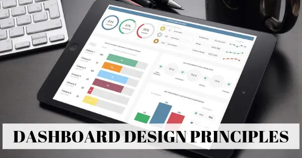
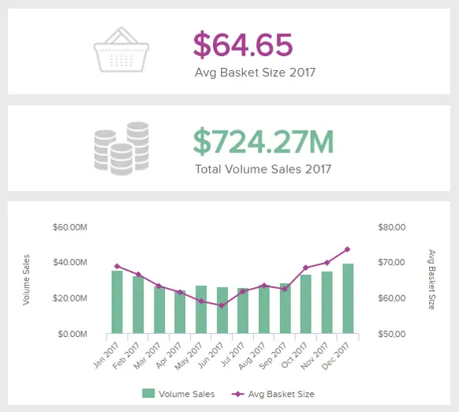
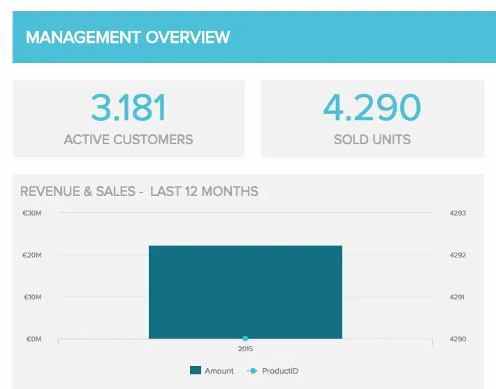

创新、交互式、数据驱动的仪表板工具的兴起使得创建有效的仪表板（如上面介绍的[仪表板](https://www.datafocus.ai/infos/online-dashboard)）变得快速、简单且可供当今具有前瞻性思维的企业访问。进入仪表板设计及其原则的世界。

在数字时代，几乎不需要IT技术人员部门以及合格的图形设计师来创建令人眼花缭乱的数据仪表板。但是，如果您想获得最佳成功，牢牢掌握逻辑判断和战略思维至关重要——尤其是在仪表板设计原则方面。

 

此时，您已经处理了工作的最大部分 - 收集数据、清理数据、整合不同的数据源以及创建有用的指标组合。现在，是时候进入有趣的部分了。

在这里，您可以被自己的创造力冲昏头脑，设计一个漂亮、令人眼花缭乱、色彩缤纷的仪表板。要查看 80+ 能激发您灵感的优秀设计，我们建议您查看我们的实时仪表板页面，我们在其中根据行业、功能和平台创建了一系列[实时](https://www.datafocus.ai/infos/live-dashboards)视觉效果。

不幸的是，你不能玩弄像下一个毕加索这样的设计。应遵循某些仪表板设计最佳做法，以最佳方式显示数据，使其易于分析和操作。

[您的业务仪表板](https://www.datafocus.ai/infos/dashboard-examples-and-templates-)应该是用户友好的，并构成决策过程中的基本帮助。为了帮助您实现数据驱动型成功，我们将深入研究 23 项仪表板设计原则，以确保您开发满足个人业务需求的最全面的仪表板。

事不宜迟 - 让我们开始吧。

您的机会：[准备好自己设计一个令人惊叹的仪表板了吗？](https://www.datafocus.ai/console/)探索我们的 14 天免费试用版并从我们的仪表板设计器中受益！

## 如何设计仪表板 – 增强业务能力的 23 大最佳实践

这 23 个明确的仪表板设计最佳实践将为您提供在可持续的基础上创建引人注目的、以结果为导向[的数据仪表板](https://www.datafocus.ai/infos/data-dashboards-definition-examples-templates-)所需的所有知识。

出色的仪表板清晰、交互式且用户友好。他们需要通过高效的数据可视化一目了然地传达信息，使用户能够提取可操作的见解，识别趋势和模式，并通过友好的[在线数据分析](https://www.datafocus.ai/infos/data-analysis-tools)过程找到改进机会。牢记这些需求，高效仪表板设计 UX 的基础应该是优先考虑最相关的数据，考虑可用性，并以核心业务目标为指导。

仪表板设计原则作为结构化过程的一部分最为有效。在这里，我们将介绍这些分析仪表板设计指南，以确保您不会错过任何重要步骤。

### 1\. 考虑您的受众

关于设计中的仪表板最佳实践，您的受众是您必须考虑的最重要因素之一。您需要知道谁将使用仪表板以及他们将出于什么目的使用它，以便为他们创建最佳的分析工具。

要成功做到这一点，您需要设身处地为观众着想。用户将定期访问其仪表板的上下文和设备将对信息的显示样式产生直接影响。仪表板是在旅途中、在办公桌前静默地查看，还是作为演示文稿显示在大量观众面前？

此外，如果使图表看起来过于复杂，则用户将在数据分析上花费比没有仪表板更多的时间。仪表板上显示的数据分析应提供额外的价值。例如，用户不需要自己做更多的计算来获得他正在寻找的信息，因为他需要的一切都会清楚地显示在图表上。始终尝试将自己置于观众的位置。

也就是说，您永远不应该忽视设计仪表板的目的。您这样做是因为您希望以清晰易近人的方式呈现数据，以促进特定受众的决策过程。如果观众更传统，我们建议您坚持不那么“花哨”的设计，并找到更能引起共鸣的东西。您可以通过直接询问需要仪表板的人来轻松获取所有必要的信息。

\*\*点击放大\*\*

我们可以在上面的仪表板设计模板中看到，销售仪表板为受众提供了触手可及的数据，这对高级管理人员和副总裁来说大多很有趣。

请记住用户将查找哪些数据？哪些信息可以帮助他/她更好地了解当前情况？如果你有两个相对值，为什么不添加一个比率来显示演变或比例，使其更清晰？重要的一点是增加用户将您的号码与前一时期进行比较的可能性。你不能指望所有用户都记得去年的销售结果，或者上个季度的留存率。添加进化比率和趋势指标，将为您的指标增加很多价值，无论是[物流 KPI](https://www.datafocus.ai/infos/kpi-examples-and-templates-logistics)还是采购，并让受众喜欢您。

### 2\. 确定你的目标

下一个仪表板UI设计原则与用户的需求与仪表板的目的之间有直接关系，即建立您的最终目标。相反，您正在创建客户端仪表板或内部报告，您创建的每个[仪表板](https://www.datafocus.ai/infos/client-dashboard-report-examples)都将用于某个目的，并通过数据回答关键问题。在这里，重要的是要考虑到并非所有可用的数据都对分析过程有用，并且将这部分过程弄错可能会使您的进一步努力变得毫无意义。

要正确完成此步骤，您需要仔细考虑哪些指标和数据集将为希望使用此仪表板衡量或实现的目标带来价值。回答以下问题;究竟需要测量什么？谁来衡量它？要测量的时间间隔是多少？可能会为您指明正确的方向。一旦您清楚地了解了报告的主要目标，选择正确的 KPI 就会容易得多。更多关于这一点，请看以下几点！

### 3\. 选择相关的关键绩效指标

对于真正有效的 KPI[仪表板](https://www.datafocus.ai/infos/best-kpi-dashboard-examples)设计，必须根据您的业务需求选择正确的关键绩效指标 （KPI）。确定最终目标并考虑目标受众后，您将能够选择要在仪表板中显示的最佳 KPI。

KPI 将有助于塑造仪表板的方向，因为这些指标将根据业务的特定领域显示相关见解的可视化表示形式。

为了帮助您做出决定，我们在丰富的库中选择了 250 多个[KPI](https://www.datafocus.ai/infos/kpi-examples-and-templates-)示例，用于业务、行业和平台中最重要的功能。一个例子来自零售业：

此[零售 KPI](https://www.datafocus.ai/infos/kpi-examples-and-templates-retail)显示一段时间内的总销售额和平均购物篮大小。该指标对于零售商确定对其产品或服务的需求何时更高和/或更低非常重要。这样，更容易识别表现不佳的区域并做出相应的调整（创建促销、A/B 测试、折扣等）。

### 4\. 用数据讲述故事

遵循有效仪表板设计 UX 的工作流程，是时候开始构建您的数据故事讲述了。

简而言之，[仪表板讲故事](https://www.datafocus.ai/infos/dashboard-storytelling-with-kpis-presentation-examples/)是以可视化方式呈现数据的过程，它将描述数据分析过程的整个叙述，以便有效地理解业务战略和目标。换句话说，有效的讲故事将帮助您以最清晰的方式传达您的信息。

这是一个基本步骤，因为有效的数据故事将缩小更多技术用户与那些不熟悉分析的用户之间的差距。正如福布斯在他们的一篇文章中所说：“讲故事的人使用数据驱动的叙述来启发那些数据分析不可用、无法访问或根本没有充分利用时间的团队成员”。

高效讲述数据故事的一个好做法是事先设计仪表板。根据您的受众和目标规划您将包含哪些图表将帮助您在实际开始构建仪表板时更加专注。这样，您可以避免混合使用可视化效果并查看它们是否有意义，而是根据用户的理解水平和最终目标生成有用的报告。

### 5\. 提供背景信息

如果不提供上下文，您如何知道这些数字是好是坏，或者它们是典型的还是不寻常的？如果没有比较值，仪表板上的数字对用户来说毫无意义。更重要的是，他们不知道是否需要采取任何行动。例如，管理仪表板设计将侧重于易于比较的高级指标，并随后提供可视化故事。

始终尝试提供最大的信息，即使其中一些对您来说似乎很明显，您的听众可能会发现它们令人困惑。命名所有轴和度量单位，并为所有图表添加标题。请记住提供比较值。这里的经验法则是使用最常见的比较，例如，与设定的目标、前一期间或预测值进行比较。这是您应该始终考虑的有效仪表板设计技巧。

您的机会：[准备好自己设计一个令人惊叹的仪表板了吗？](https://www.datafocus.ai/console/)探索我们的 14 天免费试用版并从我们的仪表板设计器中受益！

### 6\. 不要试图将所有信息放在同一个页面上

仪表板设计技巧概述中的下一个是信息问题。这个最黄金的仪表板设计原则是指精度和正确的受众定位。

也就是说，您永远不应该创建一刀切的仪表板，也不应该将所有信息塞进同一个页面。将您的受众视为具有不同需求的一组个人 - 销售经理不需要查看与营销专家、人力资源部门或[物流分析](https://www.datafocus.ai/infos/logistics-analytics)专业人员相同的数据。如果您确实想将所有数据放在一个仪表板上，则可以使用选项卡按主题或主题拆分信息，从而使用户更容易查找信息。例如，您可以将营销仪表板拆分为引用网站不同部分的部分，例如产品页面、博客、使用条款等。但是，与其使用不同的选项卡、过滤器、选择器和向下钻取列表并让用户无休止地点击，不如简单地为每个工作职位创建一个仪表板。[仪表板创建器](https://www.datafocus.ai/infos/dashboard-creator)软件将帮助您做到这一点。

这听起来像是很多工作，但实际上比试图将每个人都可能感兴趣的所有数据塞到单个显示器上要容易得多。当为每个角色提供自己的仪表板时，对筛选器、选项卡、选择器、大量向下钻取的需求将降至最低，并且立即找到重要信息变得更加容易。

### 7\. 选择正确的仪表板类型

要考虑的另一个最佳做法是根据其分析目的了解要构建的仪表板类型。如前几点所述，每个仪表板都应针对特定用户组设计，其特定目的是在业务决策过程中帮助接收者。信息只有在可直接操作时才有价值。接收用户必须能够在自己的业务战略和目标中使用信息。作为仅使用最佳仪表板设计原则的仪表板设计人员，请确保您可以识别关键信息，并将其与不必要的信息分开，以提高用户的工作效率。

作为参考，以下是每个主要分支机构基于业务的活动的 5 种主要[仪表板类型](https://www.datafocus.ai/infos/strategic-operational-analytical-tactical-dashboards/)：

- 战略：一个仪表板，专注于通过分析和基准测试各种基于趋势的关键信息来监控公司的长期战略。
- 操作：一种商业智能工具，用于以更短或更即时的时间尺度监视、测量和管理流程或操作。
- 分析：这些特定的仪表板包含大量综合数据流，允许分析师向下钻取和提取见解，以帮助公司在执行级别取得进展。
- 特定于平台：顾名思义，这种类型的仪表板用于特定于平台的分析。例如，如果您想跟踪社交媒体性能，您可以使用特定指标并生成仅关注该渠道的[LinkedIn仪表板](https://www.datafocus.ai/infos/dashboard-examples-and-templates-linkedin)。
- 战术：这些信息丰富的仪表板最适合中层管理人员，有助于根据跨部门的趋势、优势和劣势制定增长战略，如以下示例所示：

\*\*点击放大\*\*

请记住，您的仪表板需要响应迅速并适合所有类型的屏幕，如果您的仪表板将显示为演示文稿或打印，请确保可以在一个页面中包含所有关键信息。但稍后会详细介绍！

### 8\. 使用正确类型的图表

选择正确的[数据可视化类型](https://www.datafocus.ai/infos/how-to-choose-the-right-data-visualization-types/)的重要性怎么强调都不为过。您可以使用缺少或不正确的图表类型来破坏所有工作。了解要传达的信息类型并选择适合任务的数据可视化非常重要。

以仪表板为中心的图表和可视化效果分为与可视化目的相关的四个主要类别：关系、分布、组合和比较。在选择所需的图表类型之前，了解指标的目的非常重要。在这里，我们将讨论一些最常见的类型及其目标：

折线图非常适合显示整个连续体的变化模式。它们紧凑、清晰、精确。折线图格式对于大多数人来说很常见且熟悉，因此可以轻松一目了然地进行分析。

如果要快速比较同一类别中的项目（例如，按国家/地区划分的页面浏览量），请选择条形图。同样，这样的图表易于理解、清晰且紧凑。

饼图不是完美的选择。它们的精度排名较低，因为用户发现很难准确比较饼图扇区的大小。虽然这样的图表可以立即扫描，用户会立即注意到最大的切片，但在比例方面可能存在问题，导致最小的切片太小，甚至无法显示。使用饼图时的一个好做法是只使用几个切片，这样，您可以确保信息易于理解，并将为您的仪表板带来价值。

迷你图通常没有刻度，这意味着用户将无法注意到单个值。但是，当您有很多指标并且只想显示趋势时，它们运行良好。它们可以快速扫描且非常紧凑。

破译散点图也不是那么容易，因为它们对于知识渊博的用户来说是一种高级可视化类型。他们的目标是找到两个变量之间的相关性。当数据在图表上分布时，结果显示相关性为正、负或不存在。

仪表图是提供上下文的有价值的可视化效果。这些图表的优点在于它们易于解释，因为它们使用各种颜色来表示同一指标的不同值。它们通常用于已知预期值的情况，这样使用仪表板的不同利益相关者只需查看[仪表图](https://www.datafocus.ai/infos/gauge-chart-examples/)即可了解他们所处的位置。例如，监视销售目标或销售增长。

大多数专家都认为气泡图不适合仪表板。即使在上下文中阅读简单信息时，它们也需要用户付出太多的脑力劳动。由于它们缺乏准确性和清晰度，它们不是很常见，用户也不熟悉它们。

### 9\. 仔细选择布局

设计中的仪表板最佳实践不仅仅关注良好的指标和经过深思熟虑的图表。下一步是在仪表板上放置图表。如果您的仪表板是直观组织的，用户将轻松找到他们需要的信息。糟糕的布局迫使用户在掌握重点之前进行更多思考，没有人喜欢在图表和数字的丛林中寻找数据。一般规则是应首先显示关键信息 - 在屏幕顶部，左上角。这种放置背后有一些科学智慧——大多数文化从左到右、从上到下阅读他们的书面语言，这意味着人们会先直观地查看页面的左上角部分，无论你是开发企业仪表板设计还是部门内的较小规模——规则是一样的。

另一个有用的仪表板布局原则是从大局开始。主要趋势应该一目了然。在此揭示的第一个概述之后，您可以继续使用更详细的图表。请记住按主题对图表进行分组，并将可比较的指标彼此相邻放置。这样，用户在查看仪表板时就不必改变他们的思维齿轮，例如，从销售数据跳到营销数据，然后再跳到销售数据。此分析仪表板最佳实践将使您能够以最有意义的方式向最终用户清晰地呈现数据。

### 10\. 优先考虑简单性

仪表板设计的最佳实践之一侧重于简单性。如今，我们可以在图表创建中使用很多选项，并且很容易同时使用它们。但是，请尝试谨慎使用这些装饰。框架、背景、效果、网格线...是的，这些选项有时可能有用，但只有在有理由应用它们时才有用。

此外，请注意您的标签或图例，并注意字体、大小和颜色。它不应该隐藏你的图表，但也应该足够大，以便于阅读。不要在无用的装饰品上浪费空间，例如很多图片。以 Edward Tufte 引入的数据墨水比率概念为指导。Tufte 解释说：“数据墨水是用于呈现数据的不可擦除墨水。如果从图像中删除数据墨迹，图形将丢失内容。因此，非数据墨水是不传输信息的墨水，但它用于刻度、标签和边缘”。数据墨迹比是用于呈现相关数据的墨迹与图表中墨迹总量的比例。此处的目标是尽可能将相关性较低的信息（非数据墨迹）排除在仪表板之外，因为它们会分散视觉对象的主要意图。

您可以查看我们关于如何创建[市场研究报告](https://www.datafocus.ai/infos/market-research-results-and-reports-example/)的示例，其中我们专注于简单性和 3 种不同报告仪表板设计中呈现的最重要的发现。

此外，应用阴影可能会产生相当大的效果，因为它会突出显示仪表板的某些区域并提供更多深度。由于重点是保持简单，因此不要过度使用它，并在真正需要时使用它。设计仪表板应该是一个经过深思熟虑的过程，但最终用户应该看到一个简单的数据故事，其中突出显示了要点，并且要点应该立即清晰。如果不尊重这一点，就会出现更多关于仪表板本身的问题，而不是讨论您要提出的观点和要呈现的故事。这就引出了我们的下一点。

### 11\. 四舍五入你的数字

继续简单起见，对仪表板设计上的数字进行四舍五入也应该是优先事项之一，因为您不希望受众被众多小数位淹没。是的，你想呈现细节，但有时，太多的细节会给人错误的印象。如果您想再显示 5 位小数的转化率，那么将数字四舍五入并避免太多特定于数字的因素是有意义的。或者，如果您想展示您的收入，则无需通过输入美分来做到这一点。850K看起来比$ 850 010，25更简单，视觉效果更好。特别是如果您想实施执行仪表板最佳实践，其中战略信息不需要表示特定数量的每个操作细节。

后者可能会夸大次要元素，在这种情况下，美分，对于有效的数据故事，这在您的仪表板设计过程中并不是真正必要的。

### 12.小心颜色 - 选择一些并坚持它们

毫无疑问，这是所有仪表板设计最佳实践中最重要的之一。

这个特定点似乎与我们到目前为止所说的不协调，但是有一些选项可以根据您的喜好个性化和自定义您的创作。

数据仪表板的交互性质意味着您可以放弃 90 年代的 PowerPoint 样式演示文稿。现代仪表板简约而干净。扁平设计现在真的很流行。

现在，在颜色方面，您可以选择忠于您的公司身份（相同的颜色、徽标、字体）或选择完全不同的调色板。这里重要的是保持一致，不要使用太多不同的颜色——这是学习如何设计仪表板时必不可少的考虑因素。

您可以选择两到三种颜色，然后使用渐变。一个常见的错误是过于频繁地使用高饱和度的颜色。强烈的颜色可以立即将用户的注意力吸引到某个数据上，但如果仪表板只包含高饱和度的颜色，用户可能会感到不知所措和迷茫——他们一开始不知道该看什么。调低大多数颜色总是更好。仪表板设计最佳实践始终强调颜色选择的一致性。

考虑到这一点，您应该使用相同的颜色来匹配所有图表中的项目。这样做将最大限度地减少从用户角度来看所需的脑力劳动，从而使仪表板更易于理解。此外，如果您希望按顺序或组显示项目，则不应以随机颜色为目标：如果类别之间存在关系（例如，潜在客户进度、年级等），则应对所有项目使用相同的颜色，渐变饱和度以便于识别。

多亏了这一点，您的用户只需注意更高强度的颜色象征特定质量、项目或元素的可变显示，这比记住多组随机颜色要容易得多。同样，创建用户可以一目了然的仪表板是您在这里的主要目标。

\*\*点击放大\*\*

在上面的示例中，[制造分析](https://www.datafocus.ai/infos/manufacturing-analytics)显示在一个整洁的生产仪表板中，在仔细考虑几种颜色后选择“深色”主题。

我们关于颜色的最后一个建议是在使用“红绿灯”颜色时要注意。对于大多数人来说，红色意味着“停止”或“坏”，绿色代表“好”或“开始”。在设计仪表板时，这种区别非常有用，但前提是您相应地使用这些颜色。

您的机会：[准备好自己设计一个令人惊叹的仪表板了吗？](https://www.datafocus.ai/console/)探索我们的 14 天免费试用版并从我们的仪表板设计器中受益！

### 13\. 不要过度使用实时数据

在我们的优秀仪表板设计技巧列表中，下一个涉及洞察力：不要过度使用实时数据。在某些情况下，过于详细地显示信息只会导致分心。除非跟踪某些实时结果，否则大多数仪表板不需要持续更新。实时数据用于描绘一般情况或趋势的图景。大多数[项目管理仪表板](https://www.datafocus.ai/infos/project-management-dashboards-examples-and-templates)只能定期更新 - 每周、每天或每小时。毕竟，正确的数据才是最重要的。

此外，您可以实施智能警报，以便在发生任何业务异常时仪表板本身通知您。这样，您的刷新间隔和智能警报将齐头并进，使其成为仪表板设计指南之一，可确保您节省无数工作时间。

### 14\. 与标签和数据格式保持一致

我们关于如何设计仪表板的提示列表中的第 12 个侧重于清晰度和一致性。最重要的是，在功能方面，数据仪表板的主要目的是获得快速提取重要见解的能力。确保标签和格式在 KPI、工具和指标之间保持一致至关重要。如果相关指标或 KPI 的格式或标签大不相同，则会导致混乱，减慢数据分析活动的速度，并增加出错的机会。全面保持 100% 一致对于设计有效的仪表板至关重要。

我们将更详细地介绍白标和嵌入其他一些要点，但在这里重要的是要记住，仪表板设计方法应该详细且准备充分，以生成最有效的视觉效果。这包括清晰的格式和标签。

### 15\. 使用互动元素

任何值得一提的综合仪表板都可以让您轻松深入挖掘某些趋势、指标或见解。在考虑什么是好的仪表板时，将向下钻取、点击过滤器和时间间隔小部件分解到您的设计中至关重要。

向下钻取是一种智能交互功能，允许用户向下钻取与特定元素、变量或关键绩效指标相关的更全面的仪表板信息，而不会使整体设计过度拥挤。它们整洁、互动，让您可以选择在需要时查看或隐藏关键见解，而不是在混乱的数字信息堆中跋涉：

\*\*单击以作为弹出窗口打开\*\*

另一个在剖析数据中至关重要的交互式元素是点击过滤器选项。此功能使用户能够将仪表板中的图表和图形的维度用作临时筛选器值。实际上，这意味着此筛选器只需单击特定的兴趣点即可将数据应用于整个仪表板，如下例所示：

\*\*点击放大\*\*

此示例显示了我们如何仅筛选澳大利亚 10 月份的数据。

查看一段时间内的数据是设计仪表板时要考虑的另一个关键因素。时间间隔小部件将使您能够做到这一点。这是一个简洁的功能，允许您增强各种图表上的单个时间刻度，这意味着您可以轻松地查看跨天、周、月或年的数据，如以下示例所示：

\*\*点击放大\*\*

这些元素在仪表板设计中至关重要，因为它们有助于使仪表板不受太多元素的负担，而交互性使其能够拥有所需的所有数据。有关更多详细信息和顶级交互功能的完整规模，您可以查看我们关于[交互式仪表板](https://www.datafocus.ai/infos/interactive-dashboard-features/)的文章。

### 16\. 此外，使用动画选项

动画选项可以是仪表板元素之一，可在其中提供额外的整洁视觉印象，您可以在其中选择仪表板上特定元素的外观并分配动画选项。其结果是基于所需速度（例如慢速、中速或快速）和线性、摆动、缓入或缓出等类型的简单而有效的自动运动。

此外，现代[仪表板功能](https://www.datafocus.ai/infos/best-dashboard-software-features)包括此选项，因为它为您提供了一个额外的选项来吸引观众的注意力。实质上，每次打开仪表板选项卡或刷新时，动画都会触发并启动。简单。

值得一提的是，尽管动画可以为仪表板带来附加值，但不应过度使用它们。请记住我们在此列表的上一点中谈到的内容，简单是关键！

### 17\. 双倍利润

作为最微妙但最重要的仪表板指南之一，这一原则归结为平衡。空白（也称为负空间）是仪表板设计中元素之间的空白区域。

用户通常不会意识到空间在视觉构图中发挥的关键作用，但设计师会非常关注它，因为当指标、统计数据和见解不平衡时，它们就很难消化。您应该始终将仪表板主要元素周围的边距加倍，以确保每个元素都以平衡的空白区域为框架，从而使信息更容易吸收。

### 18\. 针对多个设备进行优化

针对移动设备或平板电脑的优化是仪表板开发过程中的另一个关键点。通过提供对您最重要见解的远程访问，您可以随时随地回答关键业务问题，而无需召开特殊的办公室会议。快速决策和即时访问等优势确保每个人都可以即时查看数据。

在这里，请记住仪表板布局与桌面上的布局不同是有意义的。[移动仪表板](https://www.datafocus.ai/infos/mobile-dashboards-examples-and-designs/)的屏幕较小，因此元素的位置会有所不同。此外，与桌面版本相比，分析级别不会那么深入，因为这种仪表板需要专注于适合屏幕的最关键视觉效果，通常是高级别的。也就是说，您应该专注于设计特殊的移动专用仪表板，因为这是一种用户友好的方法，可以使使用报告的方式更轻松。

要创建这样的设计，我们建议您修剪所有不相关的盈余并跨设备进行测试。此外，请记住，仪表板设计过程还应包括“更大的手指”元素。不是每个人都有较小的手，按钮应该针对所有手的形状和大小进行优化。此外，我们怎么强调都不为过，只在屏幕上保留最重要的指标和信息，以便它们易于扫描并立即可见。

您的机会：[准备好自己设计一个令人惊叹的仪表板了吗？](https://www.datafocus.ai/console/)探索我们的 14 天免费试用版并从我们的仪表板设计器中受益！

### 19\. 考虑出口与数字的使用

在仪表板设计过程中，您还需要考虑导出。您可以使用仪表板本身并共享它，但如果您计划定期使用导出，则可能需要考虑针对打印边界、更少的颜色和不同类型的线条样式进行优化，以确保即使在黑白打印输出上也能阅读所有内容。因此，在规划数据仪表板设计时，您还需要研究未来的用途以及如何针对不同的导出选项进行优化，或者只是共享仪表板本身及其所有功能和选项。

此外，通过将查看者角色分配给用户，您可以指定公开允许的功能数量，包括过滤器的数量以及特定权限的所有位和详细信息。这样，您就可以完全控制您的数字演示文稿和要共享的分析量。在这种数字情况下，您无需考虑打印，但如果您想创建一个，它肯定会有所帮助。

### 20\. 保持图形完整性

这似乎是一个显而易见的观点，但值得一提，因为它是最重要的仪表板设计趋势之一。图形完整性基本上是指保持数据的真实性。这意味着对值保持客观，而不是使它们看起来有利于分析。

就像我们上面讨论的数据墨水比例一样，这个原理也归功于爱德华·塔夫特。根据这一理论，Tufte提到了一些应遵循的原则，以确保图形完整性。其中，他指出，数据的视觉表示应“与所表示的数字量成正比”。这意味着你不应该对你的图表设计太有创意，因为它可能会导致错误陈述，从而导致对数据的误解。

下图是LinkedIn的一个例子，它准确地显示了忽略这一原则如何影响其他人感知数据的方式。此图表中的比例完全具有误导性，因为 10k 和 529k 之间的比较在视觉上并不准确。数据的图形表示永远不应该帮助误解或撒谎，数据应该自己说话。

\*\*来源www.linkedin.com\*\*

这只是Tufte实施的6个原则之一，我们建议您详细查看它们，因为它们对于在设计过程中保持客观非常有用。

### 21.如果需要，请贴上白色标签并嵌入

在考虑现代仪表板设计的工作流时，另一个关键点是有机会将仪表板贴上白标并将其嵌入到您自己的应用程序或 Intranet 中。考虑到这些选项，您可以考虑使用自己公司的徽标、颜色样式和整体品牌视觉识别元素，并完全调整仪表板，因为它是您自己的产品。

如前所述，[嵌入式仪表板](https://www.datafocus.ai/infos/embedded-dashboards)看起来像您自己的产品，但关键是您根本不需要投资开发过程，只需接管产品并将其用作您自己的产品即可。[嵌入式商业智能](https://www.datafocus.ai/infos/embedded-bi-tools-and-business-analytics-software/)确保对分析过程和数据操作的访问完全在其现有系统和应用程序中完成。许多用户更喜欢此选项，因此当您考虑要在设计中实现哪种仪表板功能时，嵌入和白标是您需要考虑的另外两个选项。

### 22\. 避免常见的数据可视化错误

数据可视化已经从简单的静态呈现发展到现代交互式软件，将视觉感知提升到一个新的水平。它还使普通业务用户和高级分析师能够创建令人惊叹的视觉效果，向任何潜在的受众资料（从该领域的初学者到经验丰富的分析师和战略家）讲述清晰的数据故事。

但积极的发展也带来了一些负面的副作用，比如犯了你可以在各种媒体上看到的错误。[在线数据可视化](https://www.datafocus.ai/infos/data-visualization-tools)不仅仅是为了创建视觉效果，还需要清晰且有效沟通。也就是说，请避免以下常见错误：

- 计算不正确：这些数字加起来应该是一个总数 （100%）。例如，如果您进行调查，并且人们可以选择多个答案，则可能需要除饼图以外的其他形式的视觉效果，因为这些数字不会加起来，并且查看者可能会感到困惑。
- 可视化的错误选择：我们已经提到选择正确类型的图表和仪表板是多么重要，因此，如果要呈现数据之间的关系，散点图可能是最佳解决方案。
- 数据太多：您需要记住的另一点，我们已经详细讨论过，不要在单个图表上放置太多数据，因为查看者不会识别该点。

此外，您还可以熟悉一般设计错误，如果您遵循简单和色彩理论的规则，无论您是需要创建执行仪表板设计还是操作，都可以避免这些错误。

### 23.永不停止发展

最后但并非最不重要的一点是，在我们收集的有效仪表板原则中，根据周围变化调整和发展设计的能力将确保持续分析成功。

使用[仪表板设计器](https://www.datafocus.ai/infos/dashboard-designer)生成报表时，请求反馈至关重要。通过定期请求您的团队提供意见并提出正确的问题，您将能够改进 KPI 的布局、功能、外观、感觉和平衡，以确保始终获得最佳价值。定期征求反馈将确保您和客户（或团队）在同一页面上。正如我们多次提到的，您的受众是您的首要考虑因素，您需要知道如何调整视觉效果以产生价值。

例如，如果您需要提供人力资源仪表板，则要求团队、高管或相关利益干系人向您提供有关[仪表板](https://www.datafocus.ai/infos/dashboard-examples-and-templates-human-resources)的反馈是有意义的，无论是关注员工绩效、招聘还是人才管理。这样，您可以确保尊重仪表板设计的最佳实践并提供出色的视觉效果。

数字世界在不断发展。变化是不断的，有效仪表板的原则取决于不断改进和增强设计工作的意愿。如果不这样做，只会阻碍你们努力的成功。

所以，永远不要停止发展。

您的机会：[准备好自己设计一个令人惊叹的仪表板了吗？](https://www.datafocus.ai/console/)探索我们的 14 天免费试用版并从我们的仪表板设计器中受益！

## 成功设计仪表板的关键要点

那么，什么是好的仪表板？有效的数据仪表板应该引人注目但视觉平衡，精明而直接，易于访问，用户友好，并根据您的目标和受众量身定制。上述所有仪表板设计技巧都形成了一个无懈可击的过程，可帮助您生成可视化效果，从而成倍地增强数据分析工作。此外，仪表板设计应该是您的[商业智能](https://www.datafocus.ai/infos/bi-skills-for-business-intelligence-career/) （BI） 技能之上的樱桃。

您创建的每个仪表板都应该针对一个专注的用户组而存在，其具体目标是帮助用户利用业务决策流程并将数字见解转化为积极的战略行动。

信息只有在直接可操作时才有价值。基于这一原则，最终用户可以使用仪表板提供的信息来增强他们在企业中的个人目标、角色和活动，这一点至关重要。

通过仅使用最佳和最平衡的仪表板设计原则，您将确保组织内的每个人都可以轻松识别关键信息，从而加速业务的增长、发展和演变。这意味着更大的受众、更大的覆盖面和更多的利润——这是成功企业的关键要素。因此，如果您想知道在创建有效的仪表板时建议遵循多少步骤？答案就在这篇文章中。坚持这 23 个步骤，您的仪表板将给您的受众留下深刻印象，但也使您的数据分析生活更加轻松。

总而言之，以下是有关如何设计仪表板的 23 个步骤：

- 考虑您的受众
- 确定您的目标
- 选择相关关键绩效指标
- 用数据讲述故事
- 提供上下文
- 不要试图将所有信息放在同一个页面上
- 选择正确的仪表板类型
- 使用正确的图表类型
- 仔细选择布局
- 优先考虑简单性
- 对数字进行四舍五入
- 小心颜色
- 不要过度使用实时数据
- 与标签和格式保持一致
- 使用交互元素
- 使用动画选项
- 双倍利润
- 针对多个设备进行优化
- 考虑在出口与数字方面的使用
- 保持图形完整性
- 白标和嵌入（如果需要）
- 避免常见的可视化错误
- 不断发展

此外，您还可以查看更多实时仪表板设计示例，并探索各种功能、行业和平台中的完整[仪表板](https://www.datafocus.ai/infos/live-dashboards)库。

准备就绪后，将新获得的仪表板原则付诸实践，提升您的业务前景！立即开始使用数据[松免费试用！](https://www.datafocus.ai/console/)
