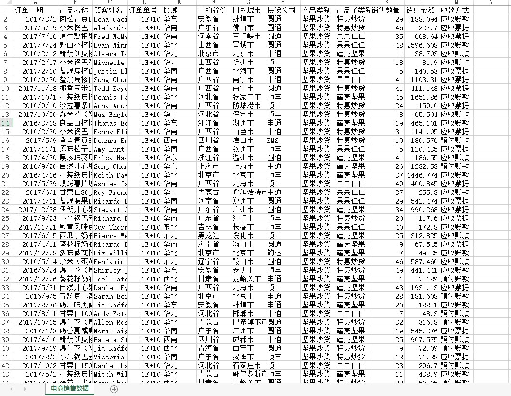
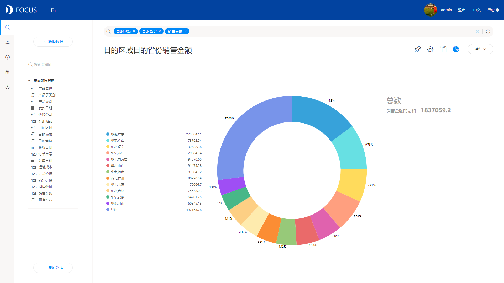
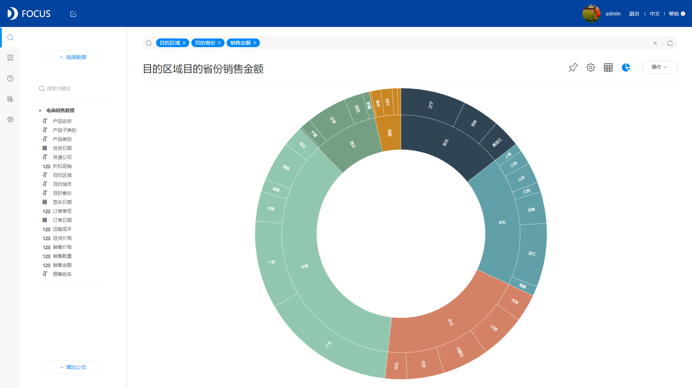

数据分析的结果，最后通常都要用可视化图表来展示，但是每个图表都有自身的缺陷，每个图表无法展示所有的数据。例如饼图，它无法展示多层数据，无法体现出多层数据之间的关系，这时候，它的二叔，旭日图的作用就体现出来了，旭日图相当于多个饼图。

旭日图，也称为太阳图，层次结构中每个级别的比例通过1个圆环表示，离原点越近代表圆环级别越高，最内层的圆表示层次结构的顶级，然后一层一层去看数据的占比情况。旭日图能便于细分溯源分析数据，真正了解数据的具体构成。

如何制作旭日图呢？

目前市场上我知道的能做旭日图的数据分析工具不多，而且操作简单的，制作步骤较少的就更加稀有了，其中我比较认可的一款数据分析工具是DataFocus，它能更方便、更有效率制作出我想要的图表！所以下面就以DataFocus为分析工具制作旭日图。

1、准备数据。先要有完整的数据才能分析，分析后才能可视化展示，这次我们准备如下的数据：

2、数据导入系统。要利用DataFocus进行数据分析可视化展示，必须先把数据导入DataFocus中，直接选择上传本地数据即可。

3、搜索分析。DataFocus独有的搜索分析，使得数据分析以及可视化展示变得非常简单，没有任何难度，只要你会百度搜索，那你就一定会使用DataFocus。在这个例子中，我们直接在搜索框内输入：目的区域 目的省份 销售金额，系统默认显示环图：

4、图表更改。将图表从基础图形中的环图更改为高级图形中的旭日图，以便查看区域与省份之间的层级关系：

如上图，实际制作旭日图只需简单的两步，30秒即可完成，试问还有比这更简单的制作方法吗？
