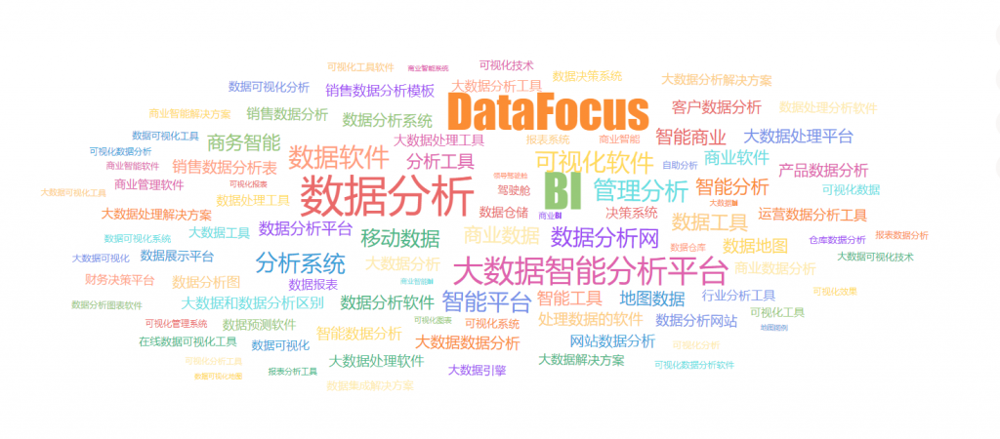

数据可视化就是指将大中型数据集中化的数据以图像处理方式表明，并运用数据剖析和开发设计工具发觉在其中不明信息内容的处理方式。数据可视化技术的基本概念是将数据库中的每个数据项视为图的单一元素，大量数据由数据图像组成。

  
大数据数据可视化是开展各种各样大数据剖析处理的最重要构成部分之一。一旦初始数据流被以图象方式表明时，为此做管理决策就越来越非常容易多了。以便考虑并跨越顾客的期待，大数据数据可视化工具应当具有这种特点：  
\*可以解决不同类型的数据传输  
\*可以利用不同类型的过滤器来调节结果  
\*可以在整个分析过程中与数据集交互  
\*可以连接到第三方软件以接受键入的数据或将键入的数据呈现给第三方软件  
\*可向客户介绍合作方案

<figure>

<figcaption>

数据分析

</figcaption>

</figure>

企业大数据服务平台是为企业打造出的一个集物联网技术数据、业务数据、外界数据于一体的大数据储存，剖析和数据可视化运用的企业大数据管理中心，是企业根据数据驱动器的可持续发展观的原动力所属。虽然事实上存有着成千上万专业用以大数据数据可视化的工具，且他们全是既开源系统又特有的，在这里在其中還是有一些工具主要表现非常明显，由于他们出示了所述全部或是许多 一部分作用。

大屏幕数据数据可视化是当今数据可视化行业的一项热门软件，在其中北京市亿信华辰等极少数企业走在这里行行业最前沿，中国绝大多数数据可视化大屏制做企业的商品依然有人机交互技术能力差，且页面单一，精准定位禁止等缺陷。在其中酷屏是亿信华辰自主研发的新一代数据数据可视化商品，在新一代炫酷3D引擎的助推下，让数据惟妙惟肖，阐释数据立体式美；内嵌近千种部件动画特效，展现实际效果酷炫绚丽；可随意制做炫酷动感的数据图表和大屏幕，真实做到设计方案能走多远，数据数据可视化呈现就能做到多远的人生境界。

以便考虑大伙儿日渐繁杂的剖析要求和更为炫酷的呈现实际效果，历经与顾客的沟通交流、执行精英团队出示的工作经验及其开发设计精英团队的探寻，研发出有着下列三个特性的大屏可视化剖析服务平台-DataFocus。  
1、实际效果炫酷。DataFocus不仅仅仅形状变化多端，只是真实保证给客户产生震撼人心的视觉冲击，内嵌多种酷炫部件，唯有你意想不到的，沒有DataFocus没法做到的；  
2、开发设计周期时间短。DataFocus去除了繁杂的升级流程，通过后台简单一键神级没有任何繁杂操作。业务人员轻松上手，短时间内便可设计出出色的可视化大屏。  
3、回应迅速。适用动态性部分更新，秒级回应，各类实际操作顺畅，即便总数极大，客户也无须担忧卡屏，适用拖动式实际操作，简单易入门。
