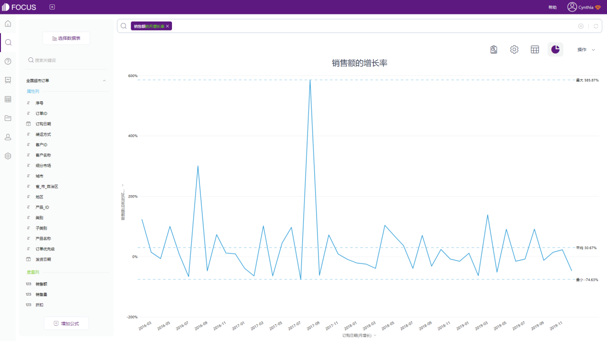
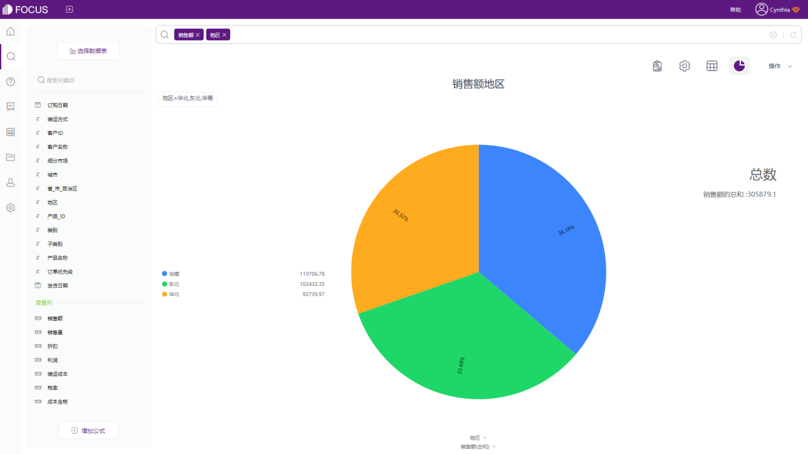

想让人们在海量的数据中，发现数据的规律，或者清晰地发现特异的数据，数据可视化是一个有效的表达方式。数据可视化的目的，是借助于图形化手段，能够更加清晰、有效地传递信息。

数据可视化能让我们更轻松、更清楚地理解数据。这篇文章主要阐述了如何正确地选用数据图表，不混淆它们的概念和作用，从而使图表的呈现符合我们的阅读习惯，提高我们的工作效率。

**如何选择最恰当的图表类型**

在数据可视化分析工作中，最常见的基础图表类型就是折线图、柱状图、饼图及它们的一些变形。那么具体什么场景用什么图形，如何选择最直观的图表类型展现分析结果，在使用图表类型的过程中有什么需要注意的？

基于这些疑问，接下来将带大家一起了解基础图表类型的使用场景，希望能给大家在分析过程中提供一些参考。下面制作的可视化图形都是用DataFocus制作的，因为可以免费使用30天，制作所有的图表类型都不要钱。

### 1\. 柱状图 VS 折线图

柱状图适合用于不同属性列数据之间的对比，利用柱子的高度，反应数据之间的差异；折线图主要用来代表一段时间内的数据变化趋势，通常情况下，折线图的X轴都是时间列。

如果数据的主要需求是展现变化趋势，预测未来情况等，选择折线图；如果数据只是需要对比不同分类，那么选择柱状图，同时需要注意，柱体的数量不要过多，否则会影响柱状图的展示效果。

### 2\. 柱状图 VS 条形图

条形图就是向右旋转90度的柱状图，在大部分情况下，柱状图和条形图是可以互相替换的。

但以下三种情况，更建议使用条形图：

- 涉及排行时，因为人眼对于横向长短的敏感性是高于竖向的，条形图可以更好的对比数值之间的排行差异；
- 列中值较长时，如下图中出现列中值较长的国外人名，使用条形图可以更清晰的展示X轴；
- 背景的高度大于宽度时，当绘制可视化图形的背景画布的高度大于宽度时，可以更好的利用背景的高度展现更多的条形。

其他情况下，基本建议使用柱状图。

### 3\. 柱状图 VS 饼图

从认知角度，应该尽量避免使用饼图，因为人的肉眼对于面积、角度并不敏感，尤其是当不同类别的数值较为接近时，不建议使用饼图或环图。

但有一种情况例外，如果需要强调数据占总体的百分比，例如东北地区销售额占全国的百分比时，建议使用饼图。

随着数据可视化的发展，数据表现形式也越来越丰富多样，如在DataFocus中有40多个图标样式，例如桑基图、雷达图、热力图等等。如果小伙伴真的无法确定使用什么场景使用什么图表类型，也可以关注DataFocus，因为DataFocus系统支持自动推荐图表。在利用DataFocus进行数据分析的过程中，在搜索框输入搜索语句后，系统会智能选择合适的图表显示查询结果，轻松获取图表，非常方便！

篇幅原因，这里先写这么多，欢迎小伙伴关注订阅下篇哦~
