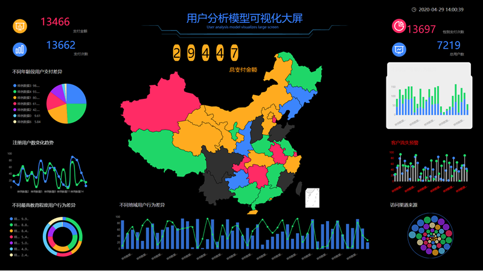

数据，让一切有迹可循，让一切有源。每一天，我们都要产生数据，创造大数据，运用大数据，只是你，还不知所措。

在百度知道和知乎问答中，总有小伙伴在问这样一个问题：“大数据时代，生活和思考发生了什么变化？”、“大数据时代给我们的生活带来了什么好处？”以及“大数据时代的生活将会发生什么变化？”看到大家对大数据的了解、对大数据的认识、对大数据的讨论，我感到非常高兴，这说明大数据已逐渐为大众所接受，也表明大数据产业正逐步走向成熟和普及。

要解决的就是问题。今日不聊行业不聊宏观观点不聊市场规模，只从普通人的角度与大家聊大数据。

要理解大数据，首先要理解数据是什么。百度百科是这样说的：

“数据”是指用来**记录和辨别客观事件的符号**，是对客观事物的性质、状况和相互关系等的物理符号或这些物理符号的组合。这是一个可识别的抽象标志。"

百科中对数据特征的定义是“客观的”、“可识别的”、“符号的”。事实上，数据的最大意义在于提供了“维度”和“可度量”，使我们能够量化复杂的事物。

举例说明如下：

A、小丽是一个美丽而且独立的好女孩；

B、小雅今年22岁，身高165公分，三围88/62/90，瓜子脸，长发，从事文职工作，月薪8000元，曾谈过一次恋爱，英语四级，正在学习茶道与花艺；

A的表述方式是直接总结，如直接以 A的方式介绍小刘，听者就不会直接形成印象，而对具体的情况也不了解；

B的叙述方式是用资料陈述客观事实，年龄和身高可以直接了解小刘的基本情况，三围、体形、瓜子脸、长头发等都可以说明“美丽”，月薪8000元说明独立自立，只谈恋爱一句话简单，四六级已经过了说明英语好，学茶道和花艺兴趣广泛，温婉；

要是有个朋友这样介绍你认识，你还想认识谁？毫无疑问，这是 B。

数据的意义在于使事物变得可测量、客观，数据在维度上可以清楚地描述事实，而且更有说服力。

在这样一个数据时代里，我们的生活究竟得到了什么便利和益处？

**一、节省时间和提高效率**

首先来看一下我们身边经常使用的一些服务，例如快递、外卖和共享单车，这些 APP在后台都有一组“大数据”。通过对快递业后台系统进行数百亿历史地址的预测，用大数据算法做智能分单代替了原来的人工分单，可以最大限度地优化线路，减少人工配单的时间，也可以减少错误操作，节约人力。快递业仅仅是整个物流领域中的一个角落，大数据技术可以帮助整个物流环节的供给和需求相匹配，优化资源配置，另外，根据消费者习惯偏好，大数据可以提前预测消费者的需求，同步商品物流环境和客户的需求，提前计算运输路线和配送路线，缓解物流压力，提高用户满意度。

需求匹配十分重要，就近收取并派发快递，就近送餐，就近扫描二维码解锁共享单车，节省我们盲目一去找时间，其实也让提供生活服务的人节约了工作时间，让工作更有效率。

毫无疑问，这对于企业来说，意味着将更少发生事故和更低的人力成本。

**二、大数据使人们更容易借钱，且让老赖无处遁形**

对一般人而言，开通信用卡需要提供收入资格等证明；而在农村，则需要从信用社贷款，还需要办理不动产抵押等手续。在这个阶段，信用卡很容易被使用，但是使用额度远不能满足剁手的需要。到银行借钱也很不方便，拿钱的时候，排队，填好一大堆的清单等等。

在办理信用卡和贷款时，银行需要“指定资料”，并指定收入证明、指定的不动产证明等。而且，网络金融(如：蚂蚁花呗、蚂蚁借呗和京东白条)，他们需要的数据更多，但这些数据并不需要所有人都可以获得，他们将根据借款者在电子商务中的消费数据、绑定银行卡数据、行为数据等进行评分。

在大数据的支持下，之前不容易借钱或说借钱慢的现象有了很大改观。没错，芝麻分是多少？用支付宝付款和借呗都是基于芝麻积分的信用额度。

大数据使借贷变得简单，对那些依赖于它的人来说，大数据也很重要。2013年11月14日，最高人民法院执行局与中国人民银行征信中心签订了合作备忘录，明确了失信被执行人名单信息纳入征信系统相关工作的实施细则。如今，只要你去中国执行信息公开网上查询一下失信被执行人的信息就行了。

**三、大数据使人变得更聪明**

人类的智慧是无限的，但计算能力和记忆力却是有上限的。以我们最喜爱的《王者荣耀》为例，你知道哪位英雄获得最高的胜利吗？有的将是武则天，有的将是诸葛亮，还有的将是蔡文姬，但通过后台大部分玩家的数据统计，我们可以看出《王者荣耀》的前三个英雄分别是牛魔、蔡文姬和宫本武藏。据这份由官方提供的数据，用户可以做出最佳选择，更有效率地成为王者。

“预测”是大数据的一项重要功能，而预测的基础是历史、现状和相关数据(比如天气)。让事情提前进行预测，从而可以做出最佳的选择，对复杂的部署情况作出反应，这就是大数据的智慧所在。

**四、大数据思维能帮你省钱**

有人说会花钱就会赚钱。实际上，那些会大量使用数据的人，首先学会的是节约。同一种商品，在因特网上有不同的价格；同样飞到洛杉矶的机票，不同的组合，不同的航线，不同的转机计划，花费也各不相同。在“比价网”背后，我们经常看到的是大数据原则的应用。

婶婶们为了省钱而喜欢记帐，我们可以把记帐的过程称为“数据收集”。

每月检查上个月的家庭开支，你就会发现自己的每一笔钱是怎么花的，以及哪一方面的钱花得太多或花得不值，这一过程可以理解为积累(储存)数据的过程。

通过分析每月的开销，可以让你积累“花钱”的经验，避开“花钱”的陷阱，下个月就知道省钱的项目了，这就是数据分析和辅助决策。

类似地，在因特网公司中，每一次广告支出都是要计算投资回报率的(ReturnOnInvestment, ROI)。以《王者荣耀》为例，同样是三百万的广告费，投入不同的用户渠道，带来的收益也不一样。因此，哪种方案的获客成本更低，从而使推广更加有效？

通过大数据分析，您可以计算出每一位用户渠道的价值，以及哪一条渠道最适合您。以最低的市场成本吸引最多的用户，产生最多的产出， ROI越高，说明钱花的地方越合适，省下的广告费还能继续投入，何乐不为？

 

**五、大数据使工作更可量化和更公平**

在工作中也可以运用大数据思维。在工作中经常会遇到两种人，前者喜欢追着领导拍马屁，混日子，后者则兢兢业业，但不容易被人看见。那谁会被提升到直属的领导职位呢？或者拿分数来说话。您每月完成的工作量，开发的新客户数量，收到的订单数量？粉丝数涨了多少？咖啡的销售量是多少呢？等一下，这些都是可以作为证据的证据。为了公司创造更多的价值，提升她的职位加她的工资是理所当然的，也是应得的。

假如你踏踏实实地做一份不受老板欢迎的工作，那么，从现在开始，每天记录下自己的工作情况，收集更多的数据，证明你的工作有成效，然后向老板汇报。资料客观。

**六、大数据思维能帮助你发现隐形的需求**

淘宝网通过一系列消费者数据。在分析了网上购物人群的消费习惯后，预测了网上购物的流行趋势，以地图的形式展示了中国不同地区的消费偏好，其中新疆网友最喜欢网上购物。

这一数据是否表明，在新疆地区，比基尼的消费人群要多得多？但是新疆没有海，每个人都穿着比基尼，要去哪儿？

实际上，并非新疆喜欢穿比基尼的人群基数大，而是新疆实体店卖比基尼太少，所以只能网购。

**大数据的变革**

**大数据教育产业：因材施教和精准扶贫**

2017高考结束了。对那些没能进入大学的孩子们，我们该怎么办？其实，人和人不一样。有些儿童天生智商很高，而且喜欢阅读。但也有更喜欢绘画、手工和打篮球的小朋友。对兴趣不同的学生来说，拥有不一样的智商就显得过于重要了。全都说三十六行，行出状元，对成绩好的学生，当然是多教他们文化课；对其他兴趣爱好不同的学生，我们教他们别的生存技能不行吗？目前阶段，因材施教的教育还不能完全做到，但在不久的将来，必将成为现实。因此，如何区分每一个学生呢？有了大量的数据分析就能做到。

南京工业大学在2016年3月21日有301名学生的餐卡上“莫名”多了钱。南京工业大学最新推出的“暖心快餐卡”，旨在解决学校贫困学生的就餐问题。因此，301个贫困生名单和助学金数额是如何确定的呢？

据介绍，南理工教育基金会对全校所有在校生进行了饭卡刷卡记录的数据分析，分析范围为2015年9月中旬至11月中旬。在这些人中，60多顿每人每月花420元左右的餐费是作为受助人计算的。

此外，广告、制造业、旅游业、体育业、农业、新能源、汽车业等均有不俗的表现，36个主要数据将在后续文章中逐步介绍。

"在大数据时代，尤其是在万物互联的时代，人类获取数据的能力远远超出人们的想象，人类获取数据、再对数据进行加工和处理的速度远远超出人们的想象。无论是 AI (人工智能)还是 MI (机器智能)，我们对于这个世界的认知都将上升到一个新的高度。因此，大量的数据将使市场更聪明。因为大数据，让规划和预测成为可能。”————马云
