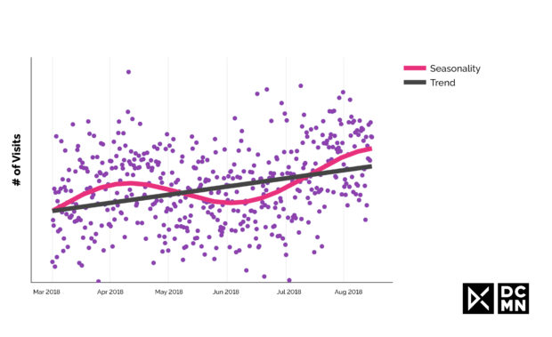
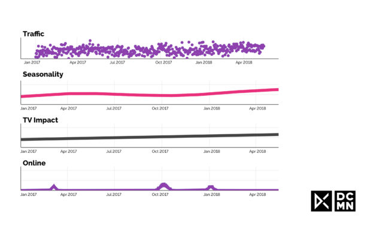

当我们需要衡量营销活动时，我们大多数人已经了解了在线广告系列跟踪，即用Cookie或用户ID来清楚地跟踪用户行为到转化，做成强大的数据集。但是在离线世界中，有一些强大的渠道，如电视和广播，它仿佛一个黑盒子，现金进入，效应出现，但这个过程中可收集的数据很少。长期品牌效应难以分析。

但好消息是，如果你有合适的工具，你可以测量任何东西。以下所有解决方案都使用经过验证的统计分析来解锁您可能认为无法访问的洞察。

**1.即时回应（电视或电台宣传）**

对于客户倾向于使用设备来观看或收听广告的渠道和用例，以及您了解营销活动的确切时间，您可以衡量即时响应。例如，通过电视和广播，您可以获得每个位置播放时间的数据，以及来自您的网站或移动网站或应用的流量和用户数据。您可以使用实时统计算法将播出时间与广告后的用户响应进行比较。

  
**_在灰色窗口的开头播出的电视广告的即时响应。在窗口内超过阈值的所有访问都归因于该点。_**

**KPI**：Web和移动站点访问，应用程序使用或安装。

**方法：**测量访问和安装的峰值，如果它们在播出后直接发生，则显着高于正常的日常交通波动。将此流量归因于这些单独的播出。

**需要注意的事项：**确保过滤流量，因此仅限于来自该特定广告系列的可能性较高的来源。这需要有关用户如何到达您的网站或应用的域知识。此外，流量因营销活动以外的原因而波动。具有基于这些波动动态变化的阈值对于确定细微变化是由于点播还是仅仅是噪声是至关重要的。

**2.短期响应（广播或广告牌活动）**

除了立即响应营销活动外，客户还可以在看到广告后的几小时或几天内做出响应。广播或广告牌广告系列就是这种情况，用户可能会在他们回到家中时访问您的网站或使用该应用，或者他们在周末有空闲时间。他们的反应不会出现在上述立即响应测量的方法中，因此我们需要一个更精确的模型。

  
**_网站访问的长期流量模式。在这个时间序列的最后两周，有一个广播活动正在运行，我们需要确定是否有影响，以及有多少。_**

**KPI**：Web或移动站点访问，应用程序使用或安装，甚至是实体店访问。

**方法：**通过贝叶斯建模，您可以在了解其他因素可能影响广告系列的先验知识时分析客户响应的时间序列数据。它需要涵盖所有可能的影响，饱和趋势，趋势的变化点，季节性的多种模式，以及假期和产品发布等其他外部事件。

**需要注意的是：**这是一种劳动密集型方法，需要大量评估模型的经验，以及领域知识（例如渠道知识和商业模式）。如果没有这个，很难定义最佳参数，并确保在合理的时间内找到最准确的模型。

**3.长期品牌影响力**

营销活动不只是将用户带入您的网站或商店进行一次性活动 - 随着时间的推移，它们将有助于您的品牌的长期价值。不同的渠道甚至可能对彼此的有效性产生累积影响，这使得这是一个具有挑战性的现象。为此，您需要结合使用不同的方法。

  
**_具有两种基本模式的长期流量：趋势和季节性。_**

**关键绩效指标**：品牌知名度和亲和力的长期趋势，以及转化（例如购买和应用活动）。在这里，您可以更专注于进一步向下的漏斗KPI和更高价值的转化，然后可以根据客户的生命周期价值来分析和优化广告系列。

**方法：**衡量长期品牌影响的经过验证的方法是市场调查。在这里，您可以监控消费者对您的品牌的长期意识以及他们在目标群体或一般人群中对其的亲和力。对于稍微复杂的方法，但提供深入见解的方法，您可以再次使用贝叶斯模型来捕获趋势和变化的所有可能来源。首先，清理所有重复季节性模式或可能影响转化的其他事件的时间序列数据，然后检查变化点的长期趋势，并将其与已知的营销活动相关联。

**需要注意的是：**除了短期响应之外，您使用的模型还需要解释长期光环效应，其中一个通道将累积性地提高其他通道的效率。例如，电视广告也会对展示广告和重新定位产生影响，这需要加以考虑。

**4.跨媒体活动**

在特定时间，广告仅在一个频道上投放是很少见的 - 例如，您可以使用广播，广告牌和展示广告来补充电视广告系列。要全面了解所有这些活动，您需要了解每个不同渠道的影响。贝叶斯统计数据再一次得到了拯救。  

  
**_顶行显示长期流量模式，由3种成分组成：从季节性重复模式，长期向上趋势，以及由在线营销活动引起的三次流量颠簸。_**

**关键绩效指标**：每个渠道的个别关键绩效指标可能会有所不同，但在这种方法中，您会仔细查看所有营销渠道的互相关强度，然后是他们与访问和转化的个别关联。

**方法：**与上述方法类似，我们可以使用贝叶斯回归分析来了解每个渠道的影响。通过使用分层模型（例如，将垂直的典型销售模式的历史数据与您自己的销售模式进行比较），您可以处理更复杂的模型并考虑许多不同的渠道和因素。同样，您需要包含对访问和转化为模型参数的其他因素，例如假期或天气模式。

即使使用小型数据集，分层贝叶斯模型也可以提供深入的洞察力，这些数据集在这些情况下是典型的，每个通道每天只有一个数据点。此外，贝叶斯统计提供了模型本身的不确定性度量，以及营销渠道的基准优化。最近这方面的工作已经通过这种建模显示出了很好的效果。

**需要注意的是：**此类分析中的挑战是数据量有限，渠道密切相关，并且必须确定许多个别因素，可能会对用户行为产生影响。
