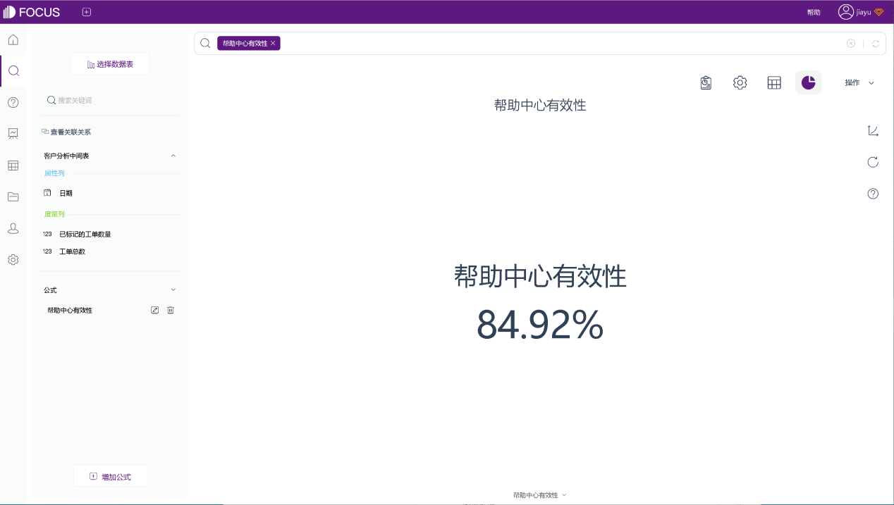

如果你正在研究客户服务指标，你可能会反复听到CSAT、工单积压。虽然这些**通用指标**很有用，但单靠他们并**不能为你提供全面的信息**，从而提升客户服务水平。如果专注于这些而忽略其他鲜为人知的客户服务指标，你将错过有助于改善客户服务策略和团队绩效的重要信息。

用以下这**六个**被低估的**客户服务指标**补充你的分析。每个指标都可以**关注到客户服务团队面临的具体问题**，并借此指出你可以**采取哪些具体措施来提高绩效**，以此来**审视客户服务团队的绩效**。

### 1、避免下一个问题

如果只跟踪服务单的总数，就看不到有多少问题来自同一位客户。下一个问题避免率，旨在关注在特定时间段内提出多个问题的客户数量。使用此指标，你可以分析大量服务中的数据，以查找客户在解决初始问题后为何提出另一个问题的原因。

**下一个问题避免率=在7天内提出2次以上问题单的客户数量/在此期间提出问题的客户总数。**

该指标的**目的，是预测客户将来可能需要哪些帮助**，这样同一个人就不需要再提出其他可能相关的问题。

假设一位客户提了一个问题，因为他们无法打开自己的帐户。客服帮助该客户重置帐户，并向其发送临时密码，然后关闭服务。但过了一会儿，此人再次联系你的团队，因为他们不知道如何更改密码。每次问题的平均解决的时间（ART）可能较低，但客户实际上花费了更长的时间来解决问题，因为他们会提出新的问题。

为了减少重复问题的提出，工作人员应在重置客户帐户后确定客户需要哪些其他信息，并将其与新密码一起发送。这将为你的客户和客户服务团队节省时间和挫败感。

如果你跟踪ART或第一响应时间（FRT）等以速度为中心的指标，那么下一个问题避免率将是一个有用的健康指标。

### 2、升级率

**升级率表示服务助理无法解决的、必须传递到其他支持层的情况。**上报问题给经理或主管，甚至另一个支持团队的专家会在占用时间的同时，使必须在部门之间转移的客户感到沮丧。

**升级率=（从第一层升级的服务单数/服务单总数）x 100**

诚然，你的客户服务团队无法独自解决所有问题，某些问题需要专家帮助。但升级率较高或不断升高的升级率可能表明存在更深层的问题。例如：客户服务团队的知识或培训不足；第一次将客户引导到正确的服务流程效率较低。

无论是缺少知识、权限还是其他原因，让工作人员在转移工单时输入上报原因，这样你就可以**看到最常见的问题并努力减少上报的需要**。

### 3、帮助中心有效性

监控帮助中心的有效性，意味着跟踪客户通过参考你的文档可以解决的问题数量。通过跟踪此数据，你可以了解客户是否在使用你的帮助中心，并找到他们需要的东西。或者你现有的资源是否没有完全解决他们的问题。

每次服务团队关闭服务单时，让其确定是否可以通过帮助中心中的文章来解决此问题，并进行标记。

**帮助中心有效性=已标记的工单数量/总工单数量**

**客户更希望能够自己解决问题，而不是必须寻求客户支持。**改进帮助文档不仅可以提高客户满意度，还可以为团队节省宝贵的时间，使他们能够专注于其他有更大影响的任务。

### 4\. 违反服务水平协议 (SLA)

客户服务团队通常有一套对待客户的服务标准，有时是正式的服务级别协议（SLA），但更多情况下是团队设定的非正式内部标准存在。SLA违反指标衡量的是你的公司未达到这些服务级别的次数百分比。

**SLA 违规百分比=（违反 SLA 的次数/关闭的服务单的总数） \*100%**

要确定 SLA 违规情况，你需要确定最优先的客户服务指标，哪些 KPI 代表你的客户期望的服务类型。

例如，你可能希望团队成员的第一响应时间（FRT）为 20 分钟或更短，或者你可能已经确定一小时是客户将在等待中花费的最长时间。在这种情况下，超过 20 分钟的第一响应时间或超过一小时的保持时间都表明违反了 SLA。

通过跟踪有多少客户体验不佳，不仅将问题带到了最前沿，还有助于查看违反 SLA 的趋势。**多个客户服务人员是否在为同一个SLA目标而苦苦挣扎？还是一位成员正在努力满足客户的多个目标？**如果这是一个影响整个团队的问题，请考虑为所有人员创建培训以帮助他们解决问题。

### 5\. 客户努力分数

**客户努力分数(CES) 是衡量客户在联系你的客户服务团队时解决问题的难易程度**。

通过监控CES，你可以确定支持团队及其流程中需要改进的领域。通过在每个支持请求结束时调查你的客户来衡量 CES。

例如，如果你使用聊天机器人来解决问题，可以将机器人设置为询问：“今天解决你的问题有多容易？”并让客户从 1 到 10 或从“容易”到“困难”进行难易度选择。

**客户努力分数=所有评分之和 / 调查回复数量**

如果你的 CES 一直很高，请考虑与客户联系并跟进调查,以更详细地了解他们遇到的问题，以便你知道需要将改进工作集中在哪里。

### 6\. 每个成员的接触次数

仅仅看每个团队成员解决的单数可能无法向你展示全部情况，尤其是当承担的难度和类型之间存在巨大差异的情况下。

通过**查看每个成员与客户的接触情况**，计算客户服务指标：

**平均每单接触次数=单总接触次数/已解决单总数**

假设在一张工单中，工作人员发送了四个不同的消息：

1、向客户发送消息，告知他们正在审查

2、提出后续问题

3、提供解决方案

4、询问解决方案是否有效

那么，这就是那个工作人员和客户的四次接触。

将公式应用于每个成员以查看他们的平均接触次数，然后比较不同团队成员之间的数据。

如果某个成员的工单接触次数始终多于团队中的其他成员，请考虑调查他们是否经常处理更复杂的工单。他们的平均接触次数可能高于正常水平，因为他们是解决技术问题的专业代理人，或者该成员可能需要培训如何快速解决某些类型的问题。

使用数据分析工具，如DataFocus，**制作数据仪表盘并监控这六个客户服务指标**，可以协助你的团队提高解决客户服务问题的速度和效率。

