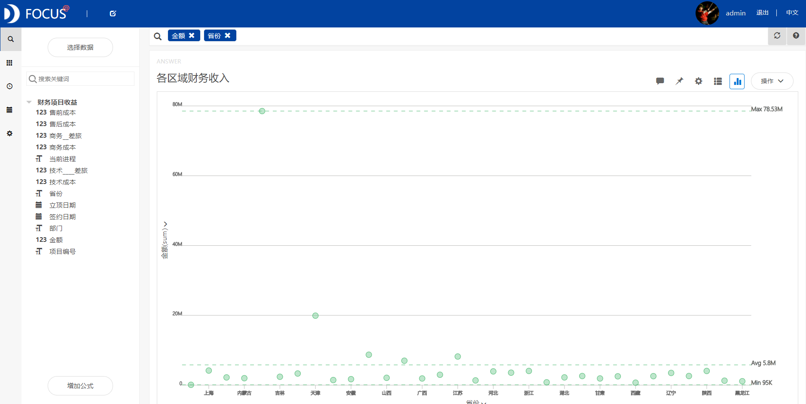
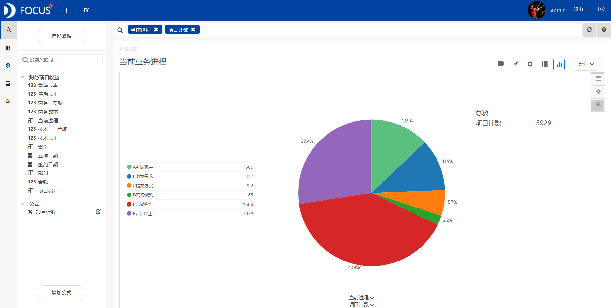
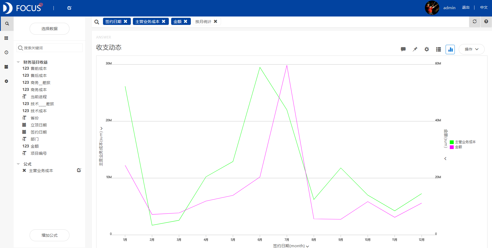
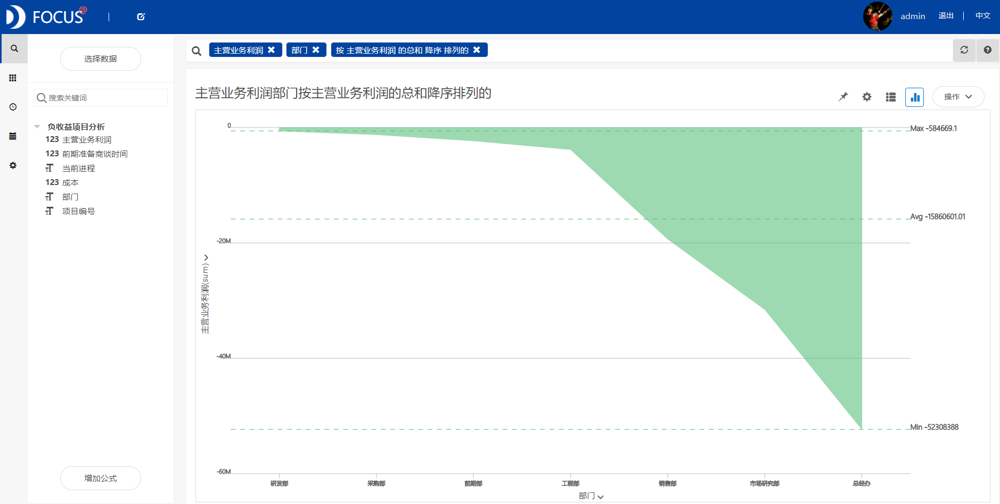

摘要 ：房地产业是进行房地产类投资、开发、经营、管理和服务的行业，属于第三产业。本报告使用datafocus系统，对某房地产公司2010年至2017年的财务数据进行分析。通过各区域财务收入、负利润项目部门分布等分析，得出经济相对较发达地区销售金额高、总经办、市场研究部、销售部、工程部存在的负收益较明显等结论。因此认为通过主动应在保证质量的情况下，合理安排在项目签约和项目实施过程中所需要的支出、降低成本费用、跟进经济较发达地区的动态和政策等措施能更好的提高企业项目的竞争力。

关键词：datafocus；房地产；项目收益；收支动态

一、案例背景

随着人民的生活水平不断提高，购房需求不断增长，房地产业得到飞速发展，取得了令人瞩目的成就。理性的房地产投资的优势是活跃房地产交易，增加市场需求，促进房地产市场的发展，提供房地产租赁市场上的房源，满足市场上的租房需求。某房地产公司想要通过前5年间的财务项目收益情况来了解本企业的项目现状，从而分析在市场上的竞争力。

二、案例问题

由于需要分析2010年至2017年该公司的所有地区的所有项目，约有4000条数据，如果将这些数据用可视化的方式简单明了的展现出来，用EXCEL来进行操作会略显麻烦，使用datafocus产品就可以快速处理大量数据，因此可以极大的减少人力和物力。

三、案例分析

进入datafocus 产品系统，从数据管理页面中导入数据源"财务项目收益"，并在数据看板页面创建新的数据看板，命名为"2010-2017年财务项目收益"。

一、企业总况

1.各区域财务收入

各区域财务收入统计图选择使用散点图。

图 1各区域财务收入

从图1中可以看到，北京的销售金额远远大于其他地区，天津其次，接下去为山东、江苏、广东和上海，均为经济发达地区。

2.当前业务进程

此次统计图选择饼图来展示当前业务进程，运用公式进行项目计数。

图 2前业务进程

如图2所示，在项目进程中完成签约占40.4%，项目终止占27.4%，谈判进程占12.9%，激发需求占11.5%，提交方案占5.7%，商务谈判占2.2%。

3.收支动态

通过折线图方便对比主营业务收入和主营业务成本随月份的变化，其中主营业务成本是添加公式而得。

图 3收支动态

由图3可以看到，主营业务成本较高的月份为1月、6月和7月，较低的月份为2月和3月；主营业务收入较高的月份为7月，较低的二月份为2月、3月、8月和9月。看整体图形可以大致认为，先投入多大的成本，后就可以得到相对应幅度的收入。

4\. 从审核批准到签约各区域所用时长差异

根据位置图中各区域颜色变化的深浅程度可以看到从审核批准到签约各区域所用时长差异。

图 4审核批准到签约各区域所用时长差异

从图4可以看到，辽宁、北京、上海、江苏所用项目出售时间较长，西藏最短。

二、负收益项目分析

有利润企业就有收入，但是通过销售业绩报表显示，有些项目存在负利润状况，所以在此进行项目负收益的具体情况分析。

1.负利润项目

通过添加公式对主营业务利润进行计算，并按主营业务利润降序将数据在柱状图中展示出来。

图 5 负利润项目

如上图5所示，负利润项目还是存在并且数量不少。

由于数据的局限性，选择创建一个新的中间表：（负利润）主营业务利润、（负利润）项目编号、部门、成本（售前成本+售后成本+技术成本+商务成本+技术差旅+商务差旅）、前期准备商谈的时间（签收时间-订单日期）、当前进程。

2.负利润项目部门分布

通过面积图可以清晰的看到各部门在负利润项目中的利润统计。

图6 负利润项目分布

由图6可以看到，总经办、市场研究部、销售部、工程部存在的负收益较明显。

3\. 部门在项目进程中的成本统计

将上述负收益较为明显的部门在项目进程中的成本进行统计，选择使用条形图。

图7 负利润项目分布

从上图7中可以看到，在项目签约和项目实施过程中支出成本较高。

4.进程中成本与前期准备时间的关系

通过折线图方便对比进程中成本与前期准备时间的关系。

图8进程中成本与前期准备时间的关系

由上图8所示，成本和从审核通过到项目签约历程无明显关系。

将这8个结果图导入"财务项目收益"数据看板中，为了使看板具有美观性，对看板进行了布局操作，操作结果如下：

图 9 数据看板

四、结论

1．经济相对较发达地区销售金额高。

2\. 项目进程中完成签约相比较占40.4%，项目终止占27.4%，因此需要争取的潜在项目占比32.2%

3．成本相对较高的月份，收入也相对较高。大致认为，先投入多大的成本，后就可以得到相对应幅度的收入。

4．经济相对较发达地区的签约前期所需要准备的时间较长。

5．存在负收益项目；总经办、市场研究部、销售部存在的负收益较明显；在项目签约和项目实施过程中支出成本较高；进程中成本与前期准备时间无明显相关关系。

五、对策与建议

1．改进企业内部机制，控制存在负收益部门的成本支出。

2．跟进经济较发达地区的动态和政策，缩小签约前期所需要准备的时长。

3．在保证质量的情况下，合理安排在项目签约和项目实施过程中所需要的支出。

4．主动应对市场变化，控制财务风险，提升管理绩效，降低成本费用，积极主动运用各种营销手段，拓展融资渠道，加强企业合作，提升品牌，提高产品品质，与两限房错位竞争。
