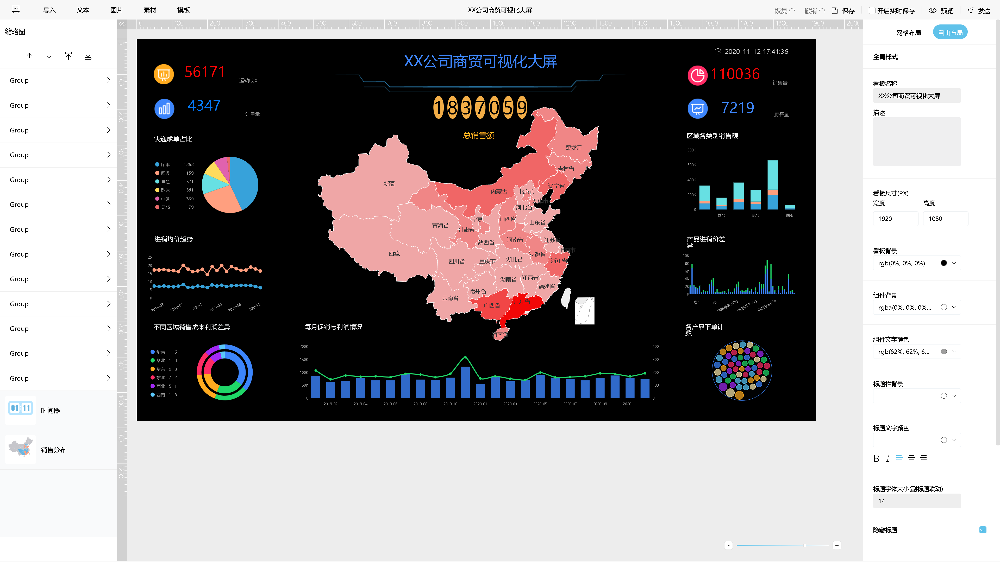

2018年，数据智能（BI）行业实现了稳定快速增长。越来越多的公司正在通过BI工具探索数据的价值并支持业务增长。DataFocus的研究人员根据行业观察和BI应用实践发现了AI与BI将在更多的业务实践中融合。

中国公司的数据应用程序基础往往较弱。然而，在人工智能时代，中国公司有望获得优势。这主要是由于中国对数据收集和应用行为的容忍度。大规模的人工智能训练集使中国的深度学习应用得以迅速发展。与BI应用程序相比，通过深度学习进行数据挖掘似乎有很大不同。前者侧重于结构化数据，通常将数据可视化作为直接结果，而后者侧重于非结构化数据，这不一定产生视觉结果。这两个特征是不同的，有不同的业务需求。

在商业实践中，这两者将呈现出越来越明显的融合趋势，并将应用于更复杂的数据应用，如销售预测和决策制定游戏。例如，在泰国的洞穴救援行动中，救援人员使用BI软件和深度学习平台将不同的数据源整合到救援模型中，预测可能的结果并选择降低风险。还有一条更大的救援路线。

在2019年，我们预测这种趋同将发生在更多地区。越来越多的公司将通过深度学习完成大规模非结构化数据的预处理，并通过BI应用程序使数据更易于理解。提出支持公司决策的方法。

而DataFocus在研究人员的支持中，从2018年就开始布局AI。让DataFocus在数据预测上面可以走的更远，现在基本上都可以实现数据预测，现在已经成功的在几家公司进行了销量预测、控制产量，并且成功的受到了客户的欢迎，我们期待能带来更好的产品。
