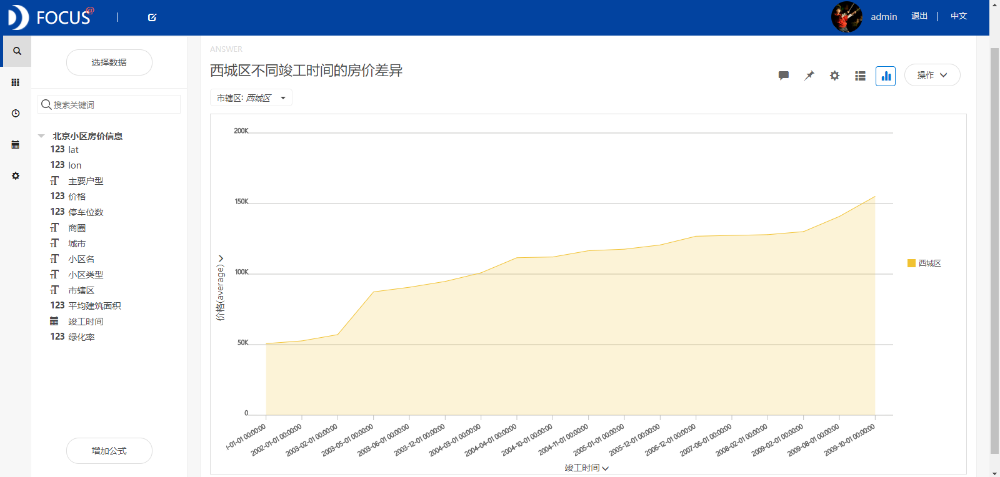
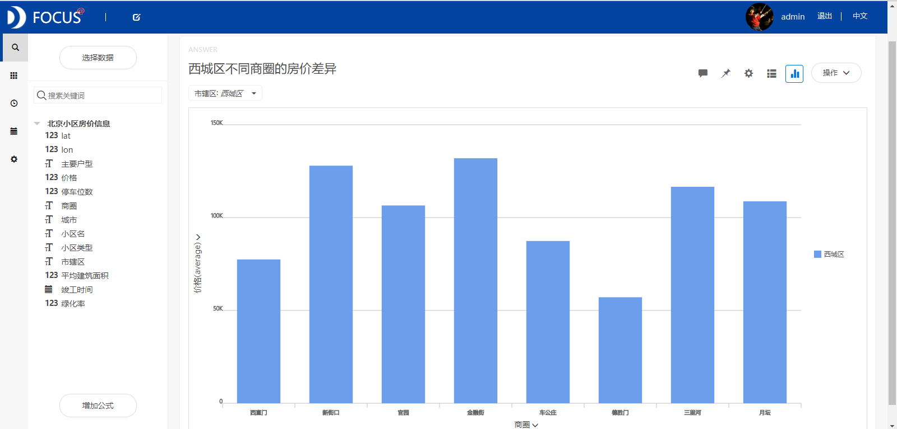
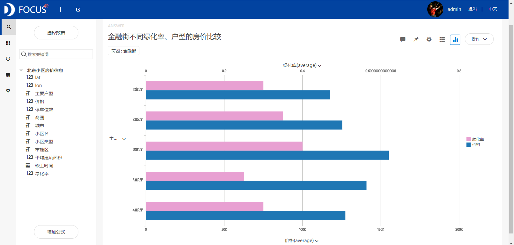
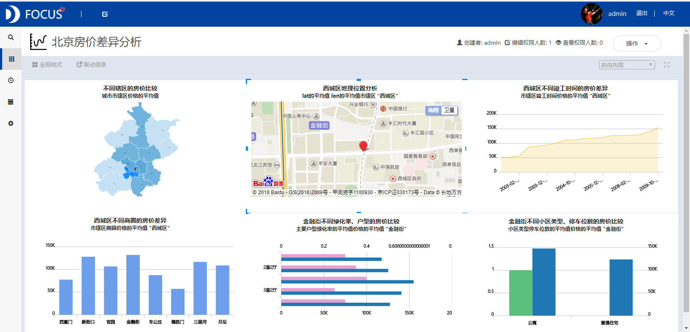

摘要 ：北京作为我国的首都，其房价总体上显著地高于其他地区，但是不同小区的房屋价格存在较大的差异。这种差异可能是由辖区、商圈、竣工时间、户型、绿化率等因素造成的。本文针对这些可能的因素来研究北京市房屋的价格差异。研究结果主要有：西城区的房价最高，这与其地理位置、竣工时间和商圈有着显著的相关关系。近年来，在北京高考文理科排名前十的学校中，有一半位于西城区。所以有很多家长会绞尽脑汁地把孩子弄到西城去读书，这是导致西城房价居高不下的重要因素。其次，西城辖区内的房屋价格随竣工时间的变化呈现缓慢增长的长期趋势。西城区内的金融街商圈的房屋价格最高，而德胜门的最低。

关键词：Datafocus；房价；差异性分析

一、案例背景

在经济社会日益发展的今天，房价是人们共同关注的话题。北京作为我国的首都，是最繁华的城市之一，吸引了许多来自全国各地的人，导致这些年北京的房价在爆发式地增长。虽然北京的房价总体上显著地高于其他地区，但是北京的各个辖区以及内部的商圈里的房屋价格存在着明显的差异，有一些区域的房价还是比较低的。为了帮助房屋建筑商给房屋进行合理的定价以及获得最大的收益，我们需要对这种差异背后的原因进行深入的研究。

二、案例问题

北京市不同小区的房屋价格存在较大的差异。这种差异可能是由辖区、商圈、竣工时间、户型、绿化率、停车位等因素造成的。本文针对这些可能的因素来分析房屋的价格差异。研究的结果可以使房屋建筑商对不同类型的房屋进行比较合理的定价，让更多的人能够购买到价格适度以及类型喜欢的房屋。这些房屋建筑商也可以较快速地将房屋出售出去，减少房屋积压的成本，获得更多的收入。由于北京小区房价数据信息量巨大，用EXCEL操作起来会略显麻烦，使用Datafocus产品就可以快速处理大量数据，还可以将分析结果进行可视化。

三、案例分析

将分析的"北京小区房价信息"CSV文件导入到Focus系统中。

（一）不同辖区的房价分析

为了分析不同辖区的房屋价格差异情况，绘制出位置图如图1所示。从位置图中可以看出西城区的房价最高，其次是东城、宣武和崇文这三个辖区。因此接下来我们针对西城区的房价差异进行研究，研究内容主要包括地理位置、竣工时间和商圈三个方面。 

图1 不同辖区的房价比较

（二）西城区的房价分析

1.地理位置分析

从西城区的经纬图中我们可以看出该辖区内有很多全国著名的大学、中科院以及工程院等。近年来，在北京高考文理科排名前十的学校中，有一半位于西城区。西城的"一本率"持续多年在北京稳居首位。所以有很多家长会绞尽脑汁地把孩子弄到西城去读书，最终导致西城的房价居高不下。

图2 西城区地理位置分析

2.竣工时间分析

利用西城区的房价相关数据，绘制出折线图（见图3）来研究该辖区房价与竣工时间之间的关系。从图中可以发现西城辖区内的房屋价格随竣工时间的变化呈现缓慢增长的长期趋势。

图3 西城区不同竣工时间的房价差异

3.商圈分析

为了分析西城区商圈与房屋价格之间的关系，绘制出柱状图如图4所示。从柱状图中，我们可以看到，金融街的平均房屋价格最高，而德胜门的最低。最高与最低的房价差约为7万人民币，说明商圈对房屋价格的影响较大。

图4 西城区不同商圈的房价差异

（三）金融街商圈的房价分析

从对西城区的商圈分析中得知，金融街的房价最高。因此我们针对金融街这一商圈进行深入研究。研究的主要内容包括户型、绿化率、小区类型和停车位数与房价之间的关系。

1.户型、绿化率综合分析

从金融街商圈内房屋的户型和环境的绿化率出发，比较不同户型和绿化率情况下的房屋价格差异。通过观察条形图可以发现，并非绿化率越高的小区房屋价格会越高。户型为3室1厅的房屋价格最高。

图5 金融街不同绿化率、户型的房价比较

2.小区类型、停车位数综合分析

从金融街的小区类型、停车位数两方面综合分析房价的差异情况，绘制成柱状图（见图6）。从该图中可以看出公寓的房价要高于普通住宅，停车位多的小区房价要高于停车位少的。

图6 金融街不同小区类型、停车位数的房价比较

（四）数据看板

最后将这6个结果图导入"北京房价差异分析"数据看板中，为了使数据看板更为美观，在全局样式中选择第四个预设样本（白色），将标题文字居中展示，图形布局设置为自由布局。操作结果如下：

图7 数据看板

四、结论

北京市不同辖区内的房价呈现出明显的差异性。西城区的房价最高，这与其地理位置、竣工时间和商圈有着显著的相关关系。近年来，在北京高考文理科排名前十的学校中，有一半位于西城区。西城的"一本率"持续多年在北京稳居首位。所以有很多家长会绞尽脑汁地把孩子弄到西城去读书，这是导致西城的房价居高不下的重要因素。其次，西城辖区内的房屋价格随竣工时间的变化呈现缓慢增长的长期趋势。西城区内的金融街商圈的房屋价格最高，而德胜门的最低，最高与最低的房价差约为7万人民币，说明商圈对房屋价格的影响较大。利用绿化率、户型、小区类型和停车位数对从金融街商圈内房价进行综合分析，得知并非绿化率越高小区的房屋价格就会越高，户型为3室1厅的房价最高。

五、对策建议

小区房屋建筑商在对不同类型的房屋进行定价时，应该考虑辖区、商圈、绿化率、小区类型、户型等多方面的情况。对于西城、东城等辖区内的房屋定价要比其他小区更高，因为这些地区的房屋需求很大。对于竣工时间比较晚的房屋定价要高于竣工时间早的。由于房屋价格越高的小区绿化率不一定越高，所以在定价时可不用考虑这方面的因素。
