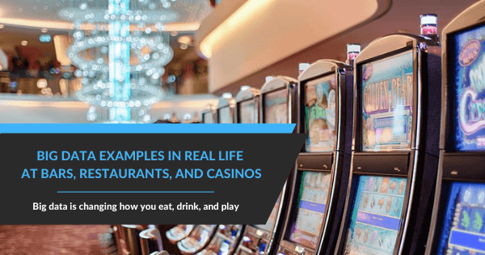
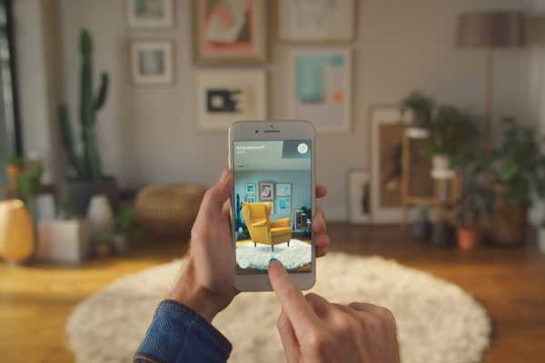

_“你可以有没有信息的数据，但你不能有没有数据的信息。” ——_**_丹尼尔·凯斯·莫兰_**

提到大数据，您通常会想到与银行、[医疗保健分析](https://www.datafocus.ai/infos/healthcare-analytics)或制造相关的应用案例。毕竟，这些都是一些相当庞大的行业，有很多大数据分析的例子，而[商业智能软件](https://www.datafocus.ai/infos/best-bi-tools-software-review-list)的兴起正在满足数据管理的需求。然而，数据分析的使用并不仅限于这些领域。虽然数据科学是一个相对较新的领域，但越来越多的行业开始投身于数据淘金热。

## 什么是大数据的例子？发现 9个真实世界的成功案例

在公共部门和私营部门都可以找到大数据的最佳示例，从有针对性的广告、教育和已经提到的大型行业（医疗保健、制造或银行），到现实生活中的客户服务或娱乐场景。

动机是什么？正如我们将在这里探讨的，包括餐厅、酒吧在内的繁华娱乐和酒店实体正在拥抱数字数据的力量，将其纳入[管理报告](https://www.datafocus.ai/infos/management-reporting-best-practices-and-examples)实践中，并预测客户行为模式，正在收获越来越多的回报效率，改善客户体验，并最终显著提高利润。

虽然这些行业在采用创新方面历来缓慢，但仍有一些领跑者处于领先地位。虽然只有22% 的营销人员表示他们的[数据驱动营销策略](https://www.datafocus.ai/infos/data-driven-marketing-strategy)正在取得显著成果——通过正确的方式利用正确的洞察力，成功是不可避免的。考虑到 2020 年，地球上每个人每秒将产生 1.7 兆字节的数据，酒店业数据驱动的组织增长潜力是巨大的。

大数据可以在一些令人惊讶的领域带来好处。在这里，我们将研究 9 个正在改变娱乐和酒店业面貌的大数据用例，同时也在此过程中改善您的日常生活。

### 1) 大数据让快餐变得更快

我们的第一个大数据示例是快餐行业。当你把车停在当地的麦当劳或汉堡王，发现前面排着很长的队。你开始用手指敲打方向盘，哀叹你的“快餐”之旅将毫无意义，并思考是否应该开车去一个街区外的温迪汉堡。

然而，在你深入思考你的温饱危机之前，你注意到前面的几辆车已经过去了。这条线的移动速度比预期的要快得多，这是什么原因？你耸耸肩，开车到窗口，然后点餐。

**在幕后**

您可能没有意识到，大数据刚刚帮助您更早地获得了那些薯条和汉堡。一些快餐连锁店现在正在监控他们的免下车通道，并相应地改变他们的菜单功能（显示在液晶屏幕上的那些）。它是这样工作的：如果队列真的被备份了，功能将会改变，以反映可以快速准备和服务的条目，从而更快地通过队列。如果行相对较短，那么特性将显示需要更多时间准备的高利润率菜单项。

这就是聪明的快餐。

### 2) 增强型家具购物

接下来，我们有一个来自家具行业的示例。你刚搬进你梦想中的公寓。你对你想要的室内装饰有一个愿景，但你不确定你所有的疯狂想法是否能结合在一起。你去过几十家商店，但你还没有准备买任何东西，因为你担心它在你的新空间里可能看起来不太好。

直到有一天，您的一位好朋友与您谈论宜家应用程序。在那里，您可以浏览最喜欢的家具风格，并将这些物品虚拟地放置在您的房子里，看看它们会是什么样子！不仅如此，您还可以从一系列墙壁颜色中进行选择，看看哪种颜色更符合您的风格。您终于可以看到漂亮的沙发或咖啡桌的外观，而无需购买然后退回一堆物品，所有这些都可以在您自己家中舒适的进行。

资料来源：Architectmagazine.com

**在幕后**

宜家一直以为客户提供最佳体验而闻名。这家零售巨头使用定性和心理数据来更深入地了解客户的行为，并为他们提供最佳体验。例如，他们观察到大多数客户和孩子一起去商店，这通常使他们更难购物。为了解决这个问题，他们实施了有监督的游乐区，这样父母就可以在没有分心的情况下购物。

2017 年，该公司希望通过创建一款增强现实应用程序，让用户无需离开家就可以测试产品，从而将其购物体验更进一步。该应用程序会根据房间尺寸自动实时缩放产品，准确率高达 98%。他们当时面临的问题是人们需要关闭应用程序，并进入宜家的购物应用程序或网站，才能购买他们想要的产品。

几年后，随着 AR 技术的进步，这家零售企业决定将他们的应用程序转变为一个名为 IKEA studio 的新应用。这一次，它重新构想了整个虚拟体验，允许用户使用不同的家具、搁架系统、装饰品甚至墙壁颜色来规划整个空间。然后可以将设计以 3D 和 2D 格式导出，与家人和朋友分享。

这在 COVID-19 时代特别有用，同时使用由大数据驱动的AR技术也让宜家能够推动其可持续发展行动。通过阻止顾客开车到商店购买或搜索他们需要的物品，公司可以通过优化运输和包装流程，更加专注于减少对环境的影响。 绝对是现代购物世界中最伟大的大数据应用之一。

### 3) 自助啤酒和大数据

现实生活中另一个伟大的大数据示例。你走进你最喜欢的酒吧，调酒师没有问：“你要什么？” 而是递给你一张小塑料卡。

“呃……这是什么？” 你问。他摊开双手。“嗯，楼上的人想试试这个新系统。基本上，你自己倒想喝的啤酒，只需先刷这张卡。”

你的眉毛扬起。“所以，从现在开始，我就是我自己的调酒师了吗？”

酒保哼了一声，摇摇头。“我的意思是，如果你愿意，我仍然会为你服务。但是有了这个系统，你可以想喝多少就喝多少。想要四分之一杯您不确定的新印度淡啤酒？或者晚餐吃的有点饱，只想来半杯黑啤酒？别客气，一切都会自动添加到您的账单中，最终和往常一样买单就可以了。”

你点点头，开始看照片。“如果我想把两种不同的啤酒混合在一起”

“不，”酒保说。“永远不要那样做。”

**在幕后**

你可能会认为这个场景来自一些奇怪的基于啤酒的科幻小说，但实际上，它已经发生了。一家名为Weissberger的以色列公司通过两台设备实现了自助啤酒：

1. 连接到酒吧所有水龙头/酒桶上的“流量计”
2. 收集所有这些流量数据并将其发送到酒吧计算机的路由器

通过使用这个系统，可以实现很多很酷的事情。例如，您可以让顾客以“自助”的方式自己倒啤酒。当然，大数据的使用也带来了其他有利可图的可能性。使用流量计根据一天中的具体时间点、一周内的某天等，酒吧老板可以查看哪些啤酒在什么时候出售。其次，还可以使用这些数据来创建利用客户行为的特价商品。

他们还可以使用这些数据：

- 在正确的时间订购新的酒桶，因为他们更准确地知道他们已经供应了多少啤酒
- 看看某些调酒师在斟酒时是否比其他人更“慷慨”
- 看看某些调酒师是否给自己或他们的伙伴免费倒酒

在欧洲，嘉士伯啤酒公司发现，他们在城市酒吧出售的 70% 的啤酒是在晚上 8 点到 10 点之间购买的，而在郊区酒吧出售的啤酒中只有 40% 是在同时间段内购买的。使用这些数据，他们可以制定特定市场的价格和折扣。

嘉士伯还发现，当顾客得到一张磁卡并允许自己倒啤酒时，他们最终会比之前多喝30%的啤酒。这种增加的消费来自于顾客尝试了少量的啤酒，而在他们被限制购买一整品脱或更大的啤酒之前，他们不会购买这些啤酒。

### 4) 消费者决定整体菜单

您是否见过公司使用这样的营销活动：让消费者帮助他们“挑选下一种新口味”？多力多滋（Doritos ）和 激浪（Mountain Dew） 都使用了这种策略，取得了不同程度的成功。其实，基本理念就是：让客户选择他们想要的，然后提供！

大数据让客户可以更直接的说话（无需访问网页）。一篇题为“大数据的大生意”的文章探讨了其中的一些可能性。

**在幕后**

数据分析案例是一家热带冰沙咖啡馆。2013 年，他们冒了一点风险，在他们之前只提供水果冰沙的菜单中引入了蔬菜冰沙。通过跟踪菜品销量数据，该咖啡馆发现蔬菜冰沙很快成为他们最畅销的产品之一，因此他们推出了其他版本的蔬菜冰沙。

将事件深入：热带冰沙咖啡馆能够使用大数据来查看消费者在一天中的什么时间购买的蔬菜冰沙最多。然后，他们可以在特定时间举行营销活动吸引消费者。

### 5) Netflix 上的个性化电影建议

继续我们的大数据行业示例列表，接下来介绍一个关于流媒体服务的示例。今天终于到周五了。辛苦工作一周后，您坐在沙发上，一边喝啤酒或红酒，一边准备看电影。您不知道该看哪部电影或电视节目，但 Netflix 可以满足您的需求。该应用程序根据您通常喜欢看的内容，从您最喜欢的所有类型中提供一系列选择。在短短几分钟内，您就选择了一部完美的电影，并准备开始享受您的夜晚。

**在幕后**

作为一家大型企业，Netflix 处理超过来自1.5 亿用户的大量数据。随着流媒体行业的竞争越来越激烈，这家基于订阅的公司利用所有这些信息为他们的客户提供有针对性的体验。据数据和分析网络称，他们收集的数据包括：

- 查看日期、时间、设备和位置
- 关键字和搜索次数
- 您暂停、倒带、快进和重新观看内容的次数
- 浏览和滚动模式
- 甚至用户完成一部电影或电视节目所花费的时间

通过对他们拥有的海量客户数据应用一系列算法，Netflix 能够预测用户接下来会看什么，而且还根据上述数据提供一系列选项。事实证明，这种方法对 Netflix 来说非常成功，因为 80% 的流媒体内容都是基于他们的推荐算法。

但这还不是全部，Netflix还会根据用户的个人资料选择在某些电影或电视剧中出现的封面图片。它通过使用艺术视觉分析 (AVA) 来实现这一点，“AVA是一组工具和算法，旨在从视频中呈现高质量图像。它能够根据个人用户的年龄和一般偏好，预测哪种商品会引起他们最大的共鸣。” 像这样，您很可能会在自己喜欢的电视节目中看到不同于您的妈妈或朋友在他们自己的个人资料中看到的宣传。

### 6）我们想你！

下一个例子适用于餐馆。想象一下：你正在家里放松，试图决定和你的配偶一起去哪家餐厅吃饭。你住在纽约，工作时间长，而且有很多选择。做这个决定花费的时间比应有的要长一些；你已经度过了漫长的一周，你的大脑被炸了。

突然，一封电子邮件到达您的收件箱。暂时推迟你的食物选择（并在你离开谈话时忽略你配偶的冷眼），你看到一封来自 Fig & Olive 的电子邮件。这是你最喜欢的地中海餐厅，你是常客，但已经一个多月没去光顾了。打开邮件，主题栏是“我们想你！” 当你打开它时，这封邮件传递了两点鑫地：

1. Fig & Olive 想知道你为什么好久没来了。
2. 他们想送您一份免费的面包片，因为他们非常想念您！

“亲爱的”，你惊呼道，“我知道我们要去哪里吃饭了！”

**在幕后**

总部位于纽约的 7 家 Fig & Olive分店一直在使用客户管理软件来跟踪客户的点餐习惯，并提供有针对性的电子邮件活动。例如，“我们想你！” 活动产生了近300 次访问和 36,000 美元的销售额——是公司对大数据投资的 7 倍回报。

### 7) 魔术乐队

MagicBand几乎和听起来一样得异想天开，因为它是由梦幻般的迪斯尼乐园开创的。

想象一下，您正在与朋友、伴侣或孩子一起参观迪斯尼乐园，并且每个人在进入时都会得到一个手腕设备。该设备可以为您提供有关排队时间、娱乐开始时间等关键信息，以及根据您的个性和喜好为您量身定制建议。哦，还有你最喜欢的迪士尼吉祥物之一，它会用名字问候你。它会让你在公园里的时间更加美好和神奇，对吧？

输入MagicBand。

**在幕后**

凭借不断增加的令人肾上腺素飙升的游乐设施、小卖部、游戏厅、酒吧、餐厅和影院 -每年约有1.5 亿人参观其不同的公园 ， 这个酒店品牌利用大数据来提升其客户经验，并在竞争激烈的市场中保持相关性。

随着RFID技术的发展，MagicBand与数以千计的传感器进行交互，这些传感器策略性地放置在各个游乐园周围，收集大量的大客户数据，并对其进行处理，不仅显著提高了客户体验，而且获得了丰富的洞察力，有助于其长期的[商业智能战略](https://www.datafocus.ai/infos/roadmap-to-a-successful-business-intelligence-strategy)。除了整体运营效率之外，大数据真正证明了在当今超连接世界中[商业分析工具的力量。](https://www.datafocus.ai/infos/best-bi-tools-software-review-list)

### 8) 使用智能手机登记入住和退房

如今，我们很多人都离不开智能手机。虽然曾经仅仅是为了接听电话和发送基本短信而开发的，但今天的电信产品本质上是微型计算机，处理大数据流，并在此过程中打破地理障碍。

当您去酒店时，您通常会很兴奋，这意味着您会想入住房间、梳洗一番并享受设施，或者出去探索一下。但是，服务缓慢和排长队最终会严重占用您的时间。此外，一旦您通过登记台，您就有丢失钥匙的风险——造成一个代价高昂且不方便的噩梦。

也就是说，如果您可以使用你的智能手机作为钥匙，自主办理入住和退房手续、预订客房服务以及预订饮品和服务，将会怎样？好吧，你可以在希尔顿酒店坐待这一点。

**在幕后**

2017 年底，这家广受赞誉的酒店品牌在其 10 家最著名的英国分店推出了移动密钥和服务技术，并且由于其成功，这项创新已在国际上传播开来，并将在不久的将来应用到其 4,000 多家分店中。除了让酒店的款待体验更加自主之外，通过该应用程序收集的见解将有助于使酒店的消费者饮酒和就餐体验更加定制化。

希尔顿的这个尖端大数据示例强调了这样一个事实，即通过利用信息的力量以及当今数字世界的连通性，您有可能通过几乎无限的新消费者渠道来改变您的客户体验和传达您的价值主张。

而且，随着事情的发展，我们预计在不远的将来会看到更多的酒店、酒吧、酒馆和餐馆使用这项技术。

### 9）怀旧的转变

几十年前，街机游戏风靡一时，但由于数字游戏的发展，除《罪恶之城》外的许多传统娱乐中心根本无法与沉浸式游戏机竞争，导致大量游戏厅关闭。

但是，随着怀旧和新旧完美结合，您可能已经注意到游乐园正在复兴。似乎那些在游戏厅盛行的时代长大的人都渴望一次怀旧之旅，带着他们的孩子来一次美好的、复古的家庭体验。如果您是这些人中的一员，您可能还注意到，虽然这里有您小时候记得的所有产品，但也有一些尖端的新娱乐和技术驱动的发展，使整个体验更加有趣，流畅和容易导航。

**在幕后**

一家经受住时间考验的娱乐街机连锁店的光辉典范—— 一家名为Timezone的澳大利亚品牌。

Timezone 的Kane Fong在接受 BI Australia 采访时解释道：

“通过利用组织可用的大数据，Timezone 获得了关于客户消费习惯、访问时间、首选娱乐项目以及与各个分支机构地理位置接近程度的宝贵见解。通过收集这些信息，该品牌能够为当地客户量身定制每个分支机构，同时利用消费趋势来加强其长期业务战略。”

大数据正在改变我们吃喝玩乐的方式，使我们作为消费者的生活更轻松、更个性化和更有趣。

更令人惊讶的是，大数据在酒店和娱乐行业的应用才刚刚开始。随人类不断发展收集、组织和分析数据的方式，在不远的将来会出现更多令人难以置信的大数据应用。我们生活在一个激动人心的时代。

[要在现实世界中获得更多令人兴奋的大数据应用，请探索我们对医疗保健](https://www.datafocus.ai/infos/big-data-examples-in-healthcare)、 [物流](https://www.datafocus.ai/infos/how-big-data-logistics-transform-supply-chain)甚至[美式足球](https://www.datafocus.ai/infos/the-power-of-big-data-in-american-football)中的大数据的见解。

如果您想深入了解自己的数据分析，可以试用我们的[在线数据可视化](https://www.datafocus.ai/infos/data-visualization-tools)工具，[免费试用](https://www.datafocus.ai/console/) 30天！
