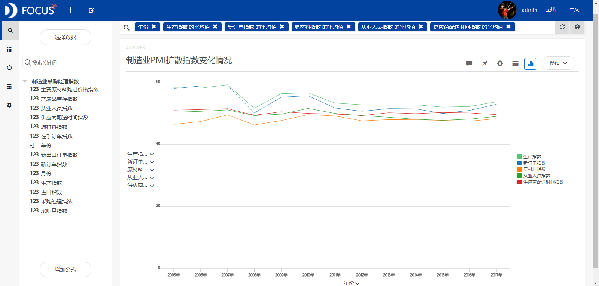
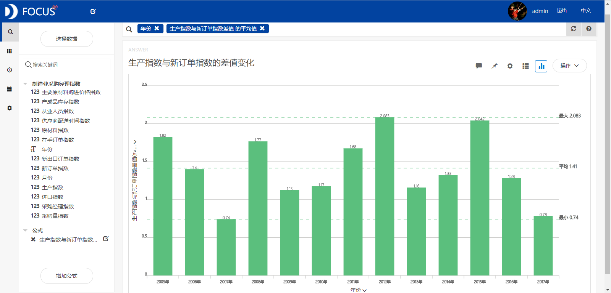
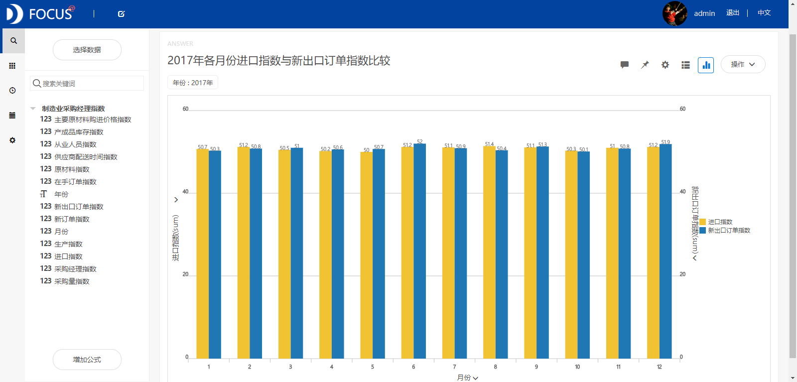
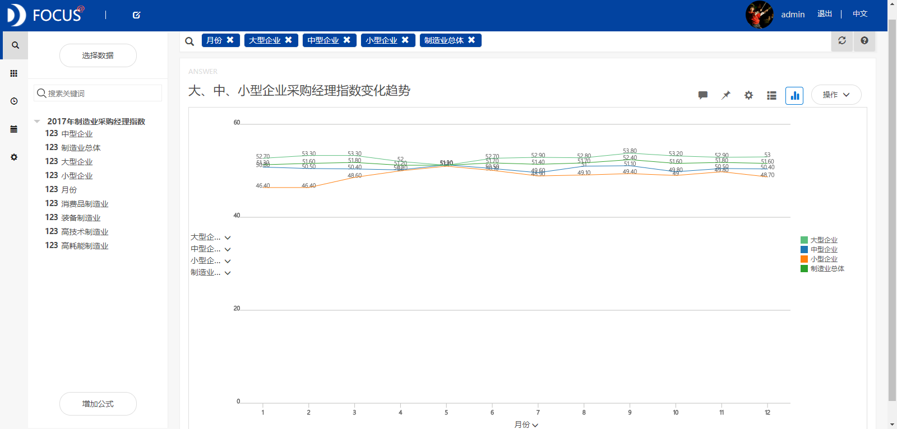

**目的：**研究2005-2017年中国制造业采购经理指数总体变化趋势以及不同制造行业的采购经理指数比较。

**摘要：**制造业采购经理指数（PMI）是国际上通行的宏观经济监测指标，是衡量经济发展的重要指针。本文通过研究主要得出了以下结论：2011-2015年制造业PMI呈现下行态势，到2016年回升。2017年制造业PMI年均值为51.61，是2011年以来的最高值。生产指数和新订单指数对制造业PMI值的影响最大。2017年生产指数与新订单指数的差值为0.78，为2008年之后达到的最小值，表明制造业供求协调性进一步增强。2017年高技术制造业和装备制造业的PMI一直高于制造业总体，表明这些行业的发展要好于总体水平。2017年大、中、小企业发展不够均衡，PMI呈现大型企业明显领先中小型企业的总体特征。

**关键词：**Datafocus,制造业,采购经理指数

**一、案例背景**

制造业采购经理指数（PMI）是国际上通行的宏观经济监测指标，是衡量经济发展的重要指针。近年来，PMI作为国家统计局每月发布的第一个宏观经济数据，客观地反映了中国经济走势，在宏观经济监测预测预警中发挥了风向标作用。制造业PMI等于50为荣枯分水线，制造业PMI大于50时，表明制造业总体扩张；制造业PMI小于50时，通常反映制造业衰退。

**二、案例问题**

制造业PMI是一个综合指数，由5个扩散指数加权而成，即新订单指数、生产指数、原材料指数、从业人员指数和供应商配送时间指数。本文主要研究2005年-2017年我国制造业采购经理指数总体变化趋势，以及针对不同制造行业的采购经理指数进行一定的比较。

**三、案例分析**

将分析的“制造业采购经理指数”CSV文件导入到Focus系统中。

**（一）2005-2017年制造业PMI变化分析**

**1.制造业总体PMI变化趋势**

为了分析制造业PMI随时间的变化趋势，绘制出折线图如图1所示。从折线图中可以看出2011年之前我国制造业PMI年均值大于52（除2008年之外），2011-2015年间制造业PMI呈现下行态势，到2016年回升，2017年升式更趋明显。2017年制造业PMI年均值为51.61，是2011年以来的最高值。这表明2016年我国制造业开始呈现稳中向好的发展态势。 

图1 中国制造业采购经理指数年均值变化趋势

**2.制造业PMI扩散指数变化情况**

通过观察图2 中的折线我们可以发现生产指数和新订单指数的变化趋势与制造业PMI变化趋势比较接近，表明这两个指数对制造业PMI值的影响最大。而原材料指数、供应商配送时间指数和从业人员指数随着时间变化不大。 

图2 制造业PMI扩散指数变化情况

**3.生产指数与新订单指数的差值变化情况**

生产指数与新订单指数的差值反映了生产与需求之间的平衡关系，二者之差加大说明供需失衡加剧，反之表明供需矛盾有所缓解。从图3中我们可以看出2007年差值最小，表明2007年供需较平衡。2017年生产指数与新订单指数的差值为0.78，为2008年之后达到的最小值，表明我国制造业供需两端持续改善，供求协调性进一步增强，这也是我国供给侧结构性改革取得的积极成果。 

图3 生产指数与新订单指数的差值变化情况

**（二）2017年制造业PMI变化分析**

**1.进口指数与新出口订单指数比较**

从柱状图（见图4）中，我们可以看到，2017年新出口订单指数全年均位于临界点上方，总体呈回温上行走势，表明随着世界经济环境总体改善，我国外部需求明显回升。进口指数也均位于临界点之上，表明在国内市场持续回暖的带动下，进口增速稳中有升，对世界经济稳定增长的作用增强。****

图4 2017年各月份进口指数与新出口订单指数比较

**2.不同制造行业PMI比较**

从图5中可以发现2017年1-12月高技术制造业和装备制造业的PMI一直高于制造业总体PMI水平，表明这些制造行业的发展要好于总体水平，扩张动力强劲。消费品制造业PMI在3月份之前小于制造业总体PMI，3月份之后也大于制造业总体水平。表明3月份之后消费品制造业呈现较快的扩张态势。而高耗能制造业的PMI一直小于制造业总体，说明该行业发展水平要低于制造业总体。  图5 2017年不同制造业采购经理指数比较

**3.大、中、小型企业PMI比较**

2017年大、中、小企业发展不够均衡，PMI呈现大型企业明显领先中小型企业的总体特征（见图6）。大型企业PMI均大于制造业总体的PMI，表明大型企业表现出较强的增长潜力。中型企业PMI只有在7月和10月位于临界点以下，其他月份均高于临界点，表明中型企业全年基本保持平稳扩张态势。小型企业PMI只有在5月和6月在临界点以上，指数明显地低于大中型企业。这主要是因为2017年小型企业面临需求偏弱、成本压力上涨等困难。因此政府应落实对小微型企业的扶持措施。 

图6 2017年大、中、小型企业采购经理指数比较

**（四）数据看板**

最后将这6个结果图导入“制造业采购经理指数变化分析”数据看板中，操作结果如下： 

图7 数据看板

**四、结论**

通过分析主要得出的结论有：

2011-2015年间制造业PMI呈现下行态势，到2016年回升。2017年制造业PMI年均值为51.61，是2011年以来的最高值。生产指数和新订单指数对制造业PMI值的影响最大。2017年生产指数与新订单指数的差值为0.78，为2008年之后达到的最小值，表明我国制造业供求协调性进一步增强。2017年新出口订单指数全年均位于临界点上方，总体呈回温上行走势，表明随着世界经济环境总体改善，我国外部需求明显回升。2017年高技术制造业和装备制造业的PMI一直高于制造业总体，表明这些行业的发展要好于总体水平。而高耗能制造业的PMI一直低于制造业总体，说明该行业发展水平要低于制造业总体。2017年大、中、小企业发展不够均衡，PMI呈现大型企业明显领先中小型企业的总体特征。

**五、对策建议**

落实对小微型企业的扶持措施，进一步加强政府对小微型企业发展的指导和引导。深入推进高耗能产业改造升级，加快运用高新技术改造提升高耗能产业，组织好产品深加工，延长产业链，摊薄单位耗能量，提高产品附加值。减小生产指数与新订单指数的差值，进一步协调生产供给与市场需求之间的平衡关系。
