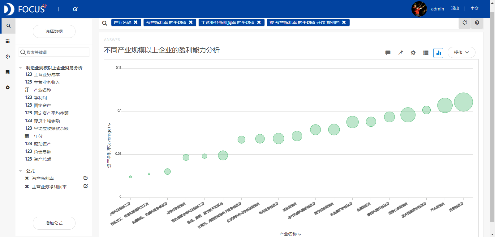
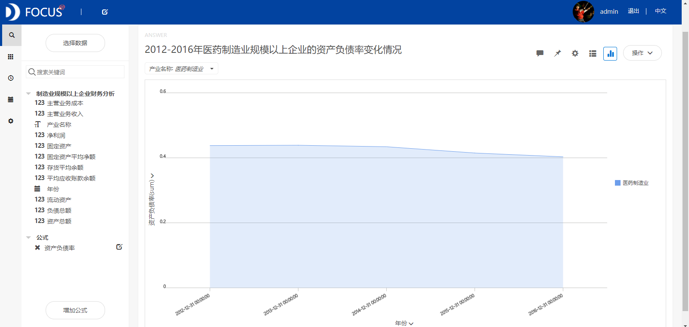

**目的：**研究2012-2016年我国制造业规模以上企业的财务状况。

**摘要：**在我国，制造业占有举足轻重的地位，是我国国民经济的核心和工业化的原动力，是我国经济增长的发动机。本文通过对我国制造业规模以上企业的财务指标分析主要得出了以下结论:制造业不同产业的全部资产和固定资产的经营效率都比较低，企业营运能力欠佳。应收账款周转率普遍最高，表明制造业企业的应收账款变现速度快以及管理效率高。尽管石油加工、炼焦和核燃料加工业的应收账款周转率最高，但却随着时间在逐年递减，表明该产业的企业应收账款变现速度在减慢。医药制造业的偿债能力、盈利能力和发展能力均是最强的，但营运能力较弱。而黑色金属冶炼和压延加工业的企业偿债能力和营运能力最低。

**关键词：**Datafocus,制造业,财务指标分析

**一、案例背景**

改革开放以来，我国制造业相对于其他产业发展较快，成为国民经济增长的主要源泉。如今世界制造业中心正在向中国转移，我国作为制造业大国的地位已经被世界所公认，但我国跟美国、日本等制造业强国相比，仍然存在很大的差距。目前在我国，制造业的规模以上企业就是指主营业务收入在2000万元以上的企业。

**二、案例问题**

应收账款周转率也称应收账款周转次数，是主营业务收入与平均应收账款余额的比值，是反映应收账款周转速度的一项指标。存货周转率是企业主营业务成本与存货平均余额的比率，它是反映企业的存货周转速度和销货能力的一项指标，也是衡量企业生产经营中存货营运效率的一项综合性指标。总资产周转率是企业主营业务收入与资产总额的比率，它反映企业全部资产的利用效率。固定资产周转率是指主营业务收入与固定资产平均净额的比率，它是衡量固定资产利用效率的一项指标。这些指标值均是越大越好。本文旨在分析2012-2016年我国制造业规模以上企业的财务状况，分别从偿债能力、营运能力、盈利能力和发展能力四个方面来分析，从而评价不同产业规模以上企业的财务状况，指出制约某些产业进一步发展的因素，进而提出相关的政策建议。

**三、案例分析**

将分析的“制造业规模以上企业财务分析”CSV文件导入到Focus系统中。

**（一）偿债能力分析**

资产负债率是企业的负债总额与资产总额的比率，它反映了企业偿还长期债务的能力。债权人希望资产负债率越低越好，此时其债权的保障程度就越高。从图1 中我们可以看出医药制造业的偿债能力最高，而黑色金属冶炼和压延加工业的企业偿债能力最低。 

图1 不同产业规模以上企业的偿债能力分析

**（二）营运能力分析**

**1.不同产业的营运能力分析**

营运能力分析是指通过计算企业资金周转的有关指标分析其资产利用的效率，是对企业管理层管理水平和资产运用能力的分析。从图2中我们可以发现制造业整体的总资产周转率和固定资产周转率都比较低，表明制造业规模以上企业的全部资产和固定资产的经营效率都比较低，取得的收入少，企业营运能力欠佳。不同产业的应收账款周转率普遍最高，表明制造业企业的应收账款变现速度快以及管理效率高。其中石油加工、炼焦和核燃料加工业的应收账款周转率最高。 

图2 不同产业规模以上企业的营运能力分析

**2.石油加工、炼焦和核燃料加工业的营运能力变化分析**

筛选出石油加工、炼焦和核燃料加工业，分析2012-2016年其营运能力的变化趋势。从折线图（图3）中可以看到尽管该产业规模以上企业的应收账款周转率在制造业中是最高的，但是却随着时间在逐年递减，这表明该产业规模以上企业的应收账款变现速度在减慢并且管理效率也在降低。

图3 2012-2016年石油加工、炼焦和核燃料加工业的营运能力变化趋势

**（三）盈利能力分析**

为了研究不同产业的盈利能力情况，绘制出气泡图。从气泡图中可以看到，医药制造业的盈利能力最强，黑色金属冶炼和压延加工业的盈利能力最弱。****

图4 不同产业规模以上企业的盈利能力分析

**（四）医药制造业财务分析**

**1.偿债能力变化分析**

通过对比2012-2016年医药制造业规模以上企业的资产负债率的变化情况，研究该产业的偿债能力。从图5中我们可以看出2012-2014年医药制造业的长期偿债能力没有显著变化，而在2015年和2016年企业的偿债能力均有提高。 

图5 2012-2016年医药制造业规模以上企业的资产负债率变化

**2.盈利能力变化分析**

从图6中可以发现2012-2016年间医药制造业的资产净利率逐年减小，表明医药制造企业资产利用的效率在下降，盈利能力和经营管理水平也有所下降。  图6 2012-2016年医药制造业盈利能力分析

**3.发展能力变化分析**

通过在Datafocus中计算资产总额的年增长率得到医药制造业的总资产增长率。从图7中可以看出2013-2016年间医药制造业的总资产增长率均大于14%，也显著地大于制造业总资产增长率的平均水平9.5%。这意味着医药制造业规模以上企业在2013-2016年间的资产经营规模扩张的速度较快，也表明医药制造业的发展潜力较大。 ****图7 2012-2016年医药制造业总资产增长率变化趋势

**（五）数据看板**

最后将这7个结果图导入“制造业规模以上企业财务分析”数据看板中，操作结果如下： 

图8 数据看板

**四、结论**

制造业不同产业的全部资产和固定资产的经营效率都比较低，取得的收入少，企业营运能力欠佳。应收账款周转率普遍最高，表明制造业规模以上企业的应收账款变现速度快以及管理效率高。尽管石油加工、炼焦和核燃料加工业的应收账款周转率最高，但它却随着时间在逐年递减，表明该产业规模以上企业的应收账款变现速度在减慢并且管理效率也在降低。医药制造业的偿债能力、盈利能力和发展能力均是最强的，但营运能力较弱。而黑色金属冶炼和压延加工业的企业偿债能力和营运能力最低。

**五、对策建议**

挖掘创新、积极创收，提高产品的市场占有率，从而提高资产的利用率。加强对固定资产的管理，做到固定资产投资规模得当、结构合理。医药制造业企业偿债能力、盈利能力和发展能力均很强，产业发展潜力巨大，应将其作为制造业中重要的子行业进行培养。而黑色金属冶炼和压延加工业的企业偿债能力和营运能力很低，该行业的企业应该着力提高这两方面的能力。
