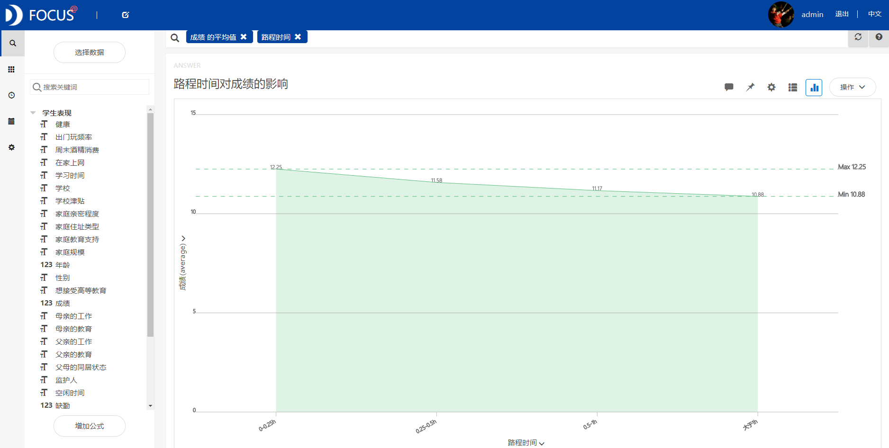
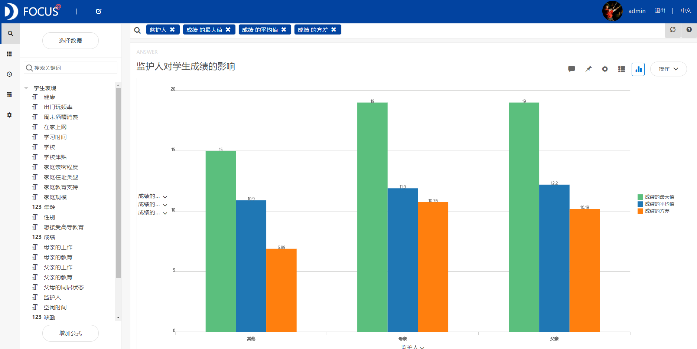
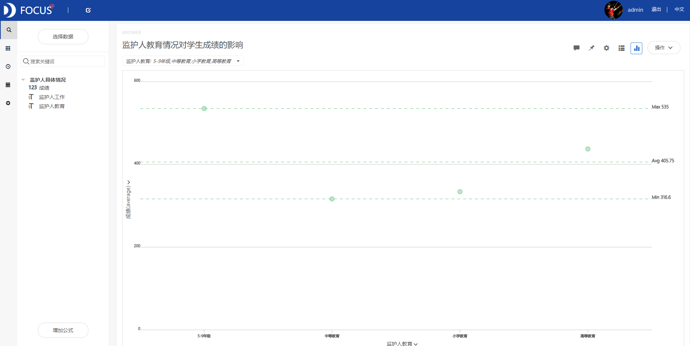

目的 ：探究学生家庭因素对成绩的影响--以美国两所高中为例

摘要 ：学生的学习成绩受到多种因素的影响。本报告使用datafocus系统，对美国两所高中的某一阶段的公开数据进行分析，得到城市与农村的学生成绩有差异；学校与住址的路程所用时间越短，学生成绩越好；监护人教育程度越高，学生成绩越好等相关结论。因此认为有效缩短路程上花费的时间，增加学习时间，家庭成员之间相亲相爱等举措和感情的增进能够一定程度上提升学生的学习成绩。

关键词：datafocus；成绩；路程时间；家庭亲密程度

一、案例背景

国内很多研究都显示，学习成绩的好坏不仅取决于智力因素，而且与众多的非智力因素相关。在学习成绩与非智力因素关系的研究中，社会对家庭因素和学生学习成绩之间的关系也颇为关注。本文主要探究家庭各因素对学生成绩的影响，以美国两所高中某一阶段成绩为例。

二、案例问题

本文研究数据量庞大，用EXCEL来进行操作会略显麻烦，使用datafocus产品就可以快速处理大量数据，进行可视化，因此可以极大的减少人力和物力，并简单明了的展示各条件间的差异。

三、案例分析

进入datafocus 产品系统，从数据管理页面中导入数据源“学生成绩影响因素”，并在数据看板页面创建新的数据看板，命名为“学生非自身因素对成绩的影响”。

1.两所学校成绩对比

首先根据两所学校学生成绩的最大值、平均值、方差做柱状图进行成绩对比。 

图 1两所学校成绩对比

从图1中可以清晰的看到，两所学校学生的成绩最大值均为19，但 Gabriel Pereira学校学生成绩的平均值大于 Mousinho da Silveira的平均值，且Gabriel Pereira的方差小于Mousinho da Silveira，所以总体来说Gabriel Pereira学校学生成绩比较好。

2.家庭住址具体影响分析

(1)学校学生的家庭住址分布类型

显示Y轴百分比的堆积柱状图可以简单明了的展示两所学校学生的家庭住址分布类型。 

图 2 学校学生家庭住址分布类型

由图2所示，Gabriel Pereira的城市学生占比较高，而Mousinho da Silveira的农村学生占比相对较高。

（2）学生家庭住址对成绩的影响

选择折线图呈现不同家庭住址对成绩的影响。 

图 3 家庭住址对成绩的影响

从图3可以看到，城市学生的平均成绩要高于农村学生的平均成绩。

由（1）（2）可以解释为何Gabriel Pereira的学生成绩要相对高一些。

3.路程时间的具体影响分析

（1）学生上学路程花费时间分布

通过条形图方便对比学生在各个不同路程花费时间段的分布。 

图 4 学校学生路程花费时间分布

由图4所示，Gabriel Pereira的学生上学花费时间为O-0.25h的占比较高，而Mousinho da Silveira的学生在0.25-0.5之间的占比较高。

- 路程上花费的时间对成绩的影响

选择折线图呈现不同路程时间对成绩的影响。 

图 5 路程时间对成绩的影响

从图5可以看到，学生上学花费的时间越短，成绩越好。

4.家庭亲密程度对成绩的影响

家庭亲密程度对成绩的影响统计图选择使用面积图。 

图 6 家庭亲密程度对成绩的影响

由上图可知，家庭关系亲密的比不亲密的学生的成绩要好，但是家庭亲密关系非常高的反而比家庭亲密关系较高的学生的成绩稍低，因此认为溺爱对孩子的成绩有影响。

5.学生监护人对学生成绩的影响

根据监护人的不同对学生成绩的最大值、平均值、方差做柱状图进行成绩对比。 

图 7 学生监护人对学生成绩的影响

从图7中可以清晰的看到，父母亲监护人，其孩子的成绩最大值均为19，但监护人为父亲的孩子成绩的平均值大于监护人为母亲的孩子成绩的平均值，且监护人为父亲的孩子成绩的方差小于M监护人为母亲的孩子成绩的，所以总体来说监护人为父亲的学生成绩较好。

接下来分析父母亲具体情况对学生成绩的影响。由于后续分析筛选需要，应建立一个中间表，表中选择三列数据：监护人、监护人工作、监护人教育。其中监护人工作、监护人教育需添加公式如下：

监护人工作：if 监护人=“母亲” then 母亲的工作 else if 监护人=“父亲”then 父亲的工作 else“0”

监护人教育：if 监护人=“母亲” then 母亲的教育 else if 监护人=“父亲”then 父亲的教育 else“0”

6.学生监护人工作情况对学生成绩的影响

选择散点图进行监护人工作情况对成绩的影响探索，筛选删除监护人工作类别中为“0”的类，“0”代表监护人不是父亲或母亲。 

图 8学生监护人工作情况对学生成绩的影响

如上图8所示，当监护人（父亲、母亲）的工作为教师类时，学生的成绩最好，其次为民事服务类工作，学生成绩相对较差时父母工作为护理相关类。

7.学生监护人教育情况对学生成绩的影响

依旧选择散点图进行监护人教育情况对成绩的影响探索，筛选删除监护人教育类别中为“0”的类，“0”代表监护人不是父亲或母亲。 

图 9学生监护人教育情况对学生成绩的影响

从图9可以看到，随着监护人(父亲、母亲)教育程度的提高，学生成绩也相应的上升。 将这9个结果图导入“学生非自身因素对成绩的影响”数据看板中，排版结果如下：  

图 10 数据看板

 

四、结论

1.总体来说，Gabriel Pereira学校学生成绩比Mousinho da Silveira要好，分析原因如下：Gabriel Pereira的城市学生占比较高，Mousinho da Silveira的农村学生占比相对较高，而城市学生的平均成绩要高于农村学生的平均成绩；Gabriel Pereira的学生上学花费时间为O-0.25h的占比较高，Mousinho da Silveira的学生在0.25-0.5之间的占比较高，而学生上学花费的时间越短，成绩越好。

2.家庭关系亲密的比不亲密的学生的成绩要好，但是家庭亲密关系非常高的反而比家庭亲密关系较高的学生的成绩稍低，因此认为溺爱对孩子的成绩有影响。

3.总体来说监护人为父亲的学生成绩比监护人为母亲的学生成绩要好。

4.当监护人（父亲、母亲）的工作为教师类时，学生的成绩最好，其次为民事服务类工作，学生成绩相对较差时父母工作为护理相关类。

5.随着监护人(父亲、母亲)教育程度的提高，学生成绩也相应的上升。

 

五、对策与建议

青少年是祖国的而未来，青少年的教育也关乎着国家未来力量。除了学生个人因素和学校的师资力量因素以外，家庭因素也越来越被认为是影响学生成绩的一个重要因素。为了给青少年提供一个良好的家庭学习环境，提出相关建议如下：

1. 建立健全相关教育政策和机制，提倡教育平等化；
2. 有效缩短路程上花费的时间，增加学习时间；
3. 家庭成员之间相亲相爱，创建友好有爱的家庭氛围；
4. 父亲一定程度上要对孩子成绩上有监督管理作用
5. 监护人要不断提升自己的文化修养和知识层面。
