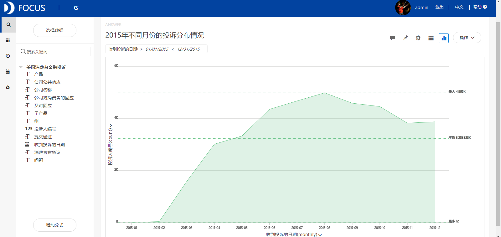
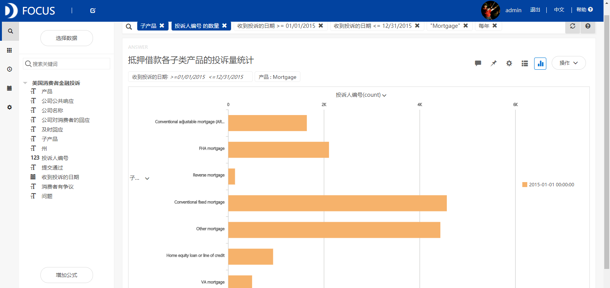
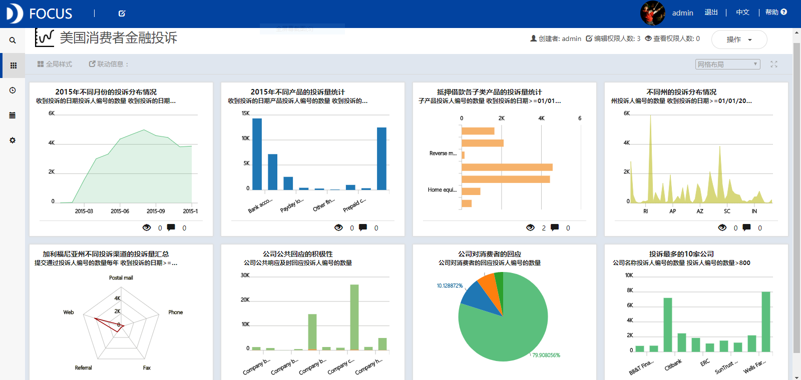

**目的：**分析美国哪些州、哪些公司的金融产品投诉最多，研究投诉量最多的产品类型。

**摘要：**随着银行业务规模和业务种类的扩大，消费者投诉事件呈多发趋势。本文通过对美国消费者金融投诉数据的分析得出了以下结论：2015年8月之前美国消费者金融投诉量呈现出缓慢增长的趋势，并且2015年8月投诉量达到这一年以来的最大值。所有金融产品中Mortgage的投诉最多，其子类产品投诉最多的是Conventional fixed mortgage。此外，加利福尼亚州的消费者投诉是最多的，且在该州通过Web渠道投诉的人所占的比重最大。一些公司对消费者投诉一般不给予公共回应，另一些公司则认为其行为受到合同或法律的授权。

**关键词：**Datafocus,金融业,消费者投诉

**一、案例背景**

随着老百姓的财富积累不断增长，人们对于理财和投资的需求变得更为迫切。在“互联网+”的时代背景下，大量互联网金融理财产品出现，但由于监管不严等原因，部分互联网金融平台操作不规范、公司倒闭、兑付困难的情况时有发生，使得投资者们遭受了一定的财产损失。

**二、案例问题**

随着银行业务规模和业务种类的扩大，消费者投诉事件呈多发趋势。为了增强金融消费者权益保护工作的针对性，加强管理，本文对消费者金融投诉事件进行分析，并提出针对性的建议。

**三、案例分析**

将分析的“美国消费者金融投诉” CSV文件导入到Focus系统中。

**（一）2015年美国消费者金融投诉情况**

**1．不同月份的投诉分布情况**

由于2015年美国消费者金融投诉量最大，因此筛选出2015年的数据来分析不同月份的投诉分布情况。从图1中我们可以看出2015年8月之前消费者投诉量呈现出缓慢增长的趋势，且2015年8月投诉量达到这一年来的最大值。 

图1 2015年不同月份的投诉分布情况

**2.不同产品的投诉量统计**

从图2中我们看到Mortgage的投诉最多，其次是Debt collection和Bank account or service产品项目。 

图2 2015年不同产品的投诉量统计

**3.抵押借款各子类产品的投诉量统计**

从图3中可以看到Mortgage子类产品中投诉最多的是Conventional fixed mortgage，而Reverse mortgage的投诉最少。 

图3 抵押借款各子类产品的投诉量统计

**4.不同州的投诉分布情况**

从图4中可以看到CA(加利福尼亚州）的消费者投诉最多。 

图4 不同州的投诉分布情况

**5.加利福尼亚州不同投诉渠道的投诉量汇总**

筛选出加利福尼亚州的消费者投诉数据，分析不同投诉渠道的投诉分布情况。从图5中可以看到，通过Web渠道投诉的人最多。 

图5 加利福尼亚州不同投诉渠道的投诉量汇总

**（二）公司对消费者投诉的回应**

**1.公司公共回应的积极性**

从图6中我们可以发现，一些公司对消费者投诉一般不给予公共回应，另一些公司则认为其行为受到合同或法律的授权，并且各公司回应投诉的积极性都是很高的。 

图6 公司公共回应的积极性

**2.公司对消费者的回应**

从图7中可以看到公司对消费者的回应方式有四种，回应最多的一种为Closed with explanation，即解释的方式。  图7 公司对消费者的回应

**3.投诉最多的10家公司**

从图8中可以看到被投诉最多的10家公司分别为Ally Financial Inc.、BB&T Financial、Bank of America、Citibank、Ditech Financial LLC、ERC、Select Portfolio Servicing Inc.、SunTrust Banks Inc.、U.S. Bancorp和Wells Fargo & Company，从而表明这些公司面临破产的可能性比较大。 

图8 投诉最多的10家公司

**（三）数据看板**

最后将这8个结果图导入“美国消费者金融投诉”数据看板中，操作结果如下： 

图9 数据看板

**四、结论**

2015年8月之前美国消费者金融投诉量呈现出缓慢增长的趋势，且2015年8月投诉量达到这一年以来的最大值。所有金融产品中Mortgage的投诉最多，其子类产品投诉最多的是Conventional fixed mortgage。此外，加利福尼亚州的消费者投诉是最多的，在该州通过Web渠道投诉的人所占比重最大。一些公司对消费者投诉一般不给予公共回应，另一些公司则认为其行为受到合同或法律的授权，且各公司回应投诉的积极性都很高。

**五、对策建议**

从行业监管入手，规范金融企业的经营行为，规范消费者投诉处理流程，及时有效地解决金融消费者投诉事件，避免造成声誉风险。加大力度普及相关的金融知识，提高公众识别和防范金融风险的能力，进一步维护消费者合法权益，同时加快完善金融消费者保护相关法律体系，进一步构建多元化的纠纷解决和弱势群体保护机制。此外，各公司应该针对消费者投诉最多的产品类型，参考消费者的投诉建议来进一步提高产品质量和服务。
