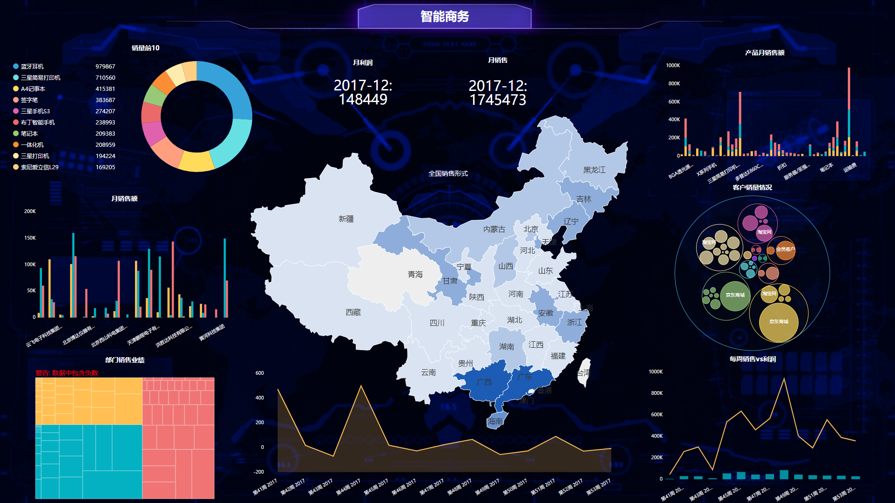

今天我们主要对PowerBI以及DataFocus进行一个对比评测。

**PowerBI**

PowerBI是由微软开发和支持的BI工具，其提供了简单的基于web的界面，界面有点类似于excel，可能会看着很熟悉，PowerBI支持很多控件，由于是微软的产品，故其与微软的主要工具（MS Excel，Azure Cloud Service和SQL Server）等紧密集成。

PowerBI采用的也是传统的拖拽式，只需要将列名拖至相应的位置，即可构建图表或者可视化数据，拖拽的方式也算比较简单，但是对于要分析多个维度时，要拖拽的列或者字段就会过多，拖拽起来可能就会比较麻烦，这时候拖拽的缺点就暴露了。

PowerBI虽然与excel的界面相似，但是对于复杂的业务需求来说，实际操作起来还是不那么简单，还需要一定的学习成本，而且可视化效果一般。

**DataFocus**

DataFocus是国内第一个中文自然语言搜索式分析的BI工具，其最大的特点就是革新了传统的拖拽式，采用自开发的搜索式，并且拥有专利权，这种搜索最大的优势，就在于简单，用户可以直接在搜索框内输入内容，或者直接双击选择字段，字段会自动添加进搜索框，不论分析的维度多少，都不会变得很复杂。

DataFocus的界面简洁，操作简单，图表样式丰富，支持自由调整分析维度，且系统会按照数据的特点自适配图表，非常智能，支持移动端以及私有化部署。也可以设置定时邮件通知，预警功能等。

希望上述对PowerBI和DataFocus的对比分析，能给到正在选型的朋友们一些帮助。
