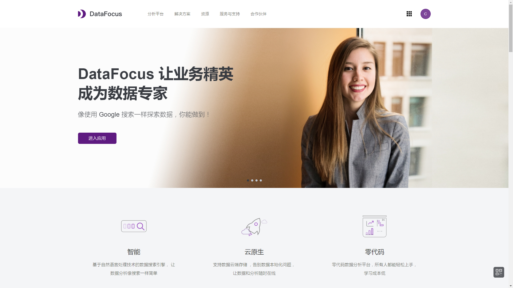

听过人工智能的朋友，还真不一定听说过商业智能这个词。

其实最早在1996年，**全球权威的研究咨询机构Gartner Group**就已经提出商业智能这一概念了。

当时的定义是，为**支持企业决策系统**，由**数据仓库、数据分析、数据挖掘、数据备份和恢复**等部分组成的技术及应用。

还在商业智能发展初期，报表就是企业最大的痛点和需求了。

当时，一般只有IT人员才会使用工具，大多数业务人员都不会使用。

随着数据量指数倍增长，**数据分析速度已经跟不上业务发展速度**。

尤其是财务人员在面对大量数据时，需要耗费大量时间在导入数据这一块，这让企业决策人员根本没有时间思考业务。

## 首批**BI厂商诞生于海外市场**

亟需解决这样的数据需求时，初代BI厂商就于20世纪80、90年代诞生于欧美市场，如美国的MicroStrategy、Microsoft SQL Server、Salesforce，加拿大的Cognos，法国的BussinessObjects等等，它们在全球市场上都形成一定的规模。

再到后来，到了21世纪，在Facebook、YouTube、苹果、安卓等各种社交媒体和手机应用建立起庞大的用户数据库时，硅谷巨头开始入局。

那些曾经的巨头都逐渐开始消失。

IBM收购了Cognos，SAP收购了BO，Oracle收购了Hyperion solutions，成为传统BI三大巨头。

## 国内厂商迎头赶上

虽说当时国内市场份额大部分都被国外厂商占据，但**国内厂商在中国本土市场并非毫无生机**。

就拿报表举例，中国初期的报表并不是无脑引进西方数据系统就好，很多海外系统在报表格式上跟国内并不兼容。

所以当时很多企业选择报表系统的标准就是，**哪家企业对中国式报表友好，就选择哪家企业**。

这就给国内厂商提供了生存发展的土壤。

随着移动互联网的兴起，中国C端消费市场又迎来数据爆发式增长。太多的数字化营销工具日益成熟，这就让国产商业智能赛道竞争更加激烈。

自然语言、机器学习和人工智能技术，都进一步提升了商业智能的算力。

尤其是云计算，企业将自身数据转移到云端，大大降低了BI部署的成本。无论是金融、制造、教育、消费等传统行业，还是电子、信息、新能源等新行业，都能更快提升数据整体质量和价值。

如今疫情当下，众多企业都开始注重降本增效，追求数据驱动业务增长，就有新一批BI厂商出现在大众视野。而其中，**独具特色的搜索式数据分析BI工具DataFocus开始崭露头角。**

## 无代码搜索式BI工具DataFocus崭露头角

和以往BI厂商不同的是，这款DataFocus让业务人员彻底告别Python、SQL等代码，再也不用把时间浪费在调取数据、处理数据上了。

直接像谷歌一样，通过搜索关键词来获取你想从数据中了解的答案，系统几秒内就以可视化数据展现出来。

这等于把分析能力赋予业务人员，再把时间回归到业务本身。

尤其是在企业降本增效的浪潮下，利用DataFocus7分钟就完成可视化大屏，快速跟踪项目任务，复盘项目进展和成果，真正做到以数据驱动业务。

现如今DataFocus已成为国内知名5G供应商，并服务于清华大学、万向集团等知名组织和企业。

### 小结

总的来说，国外BI水平领先国内10年，但并不意味着国内BI毫无机会。回望中国在5G领域的优势，相信中国商业智能终将奋起反击。对此，你怎么看？欢迎评论区评论、转发。
