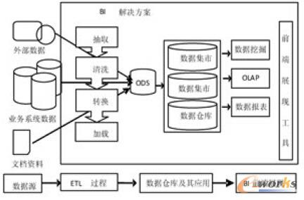
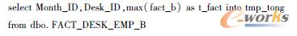
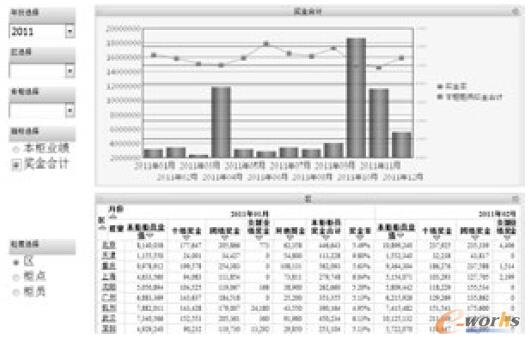

 

**0 引言**

随着经济全球化的发展、信息化时代的来临以及信息存储成本的不断下降，企业的不同情境信息也在飞速地增长丰富，比如供应商信息、产品信息、库存状况、客户信息、订单数据、交易信息、时间和环境信息等等。然而，这些重要的信息资源都分布在ERP/CRM/SCM等业务系统或者平面文件中，形成了一个个的“信息孤岛”。给信息的整合、挖掘并发现其中的知识带来了挑战。统计表明，目前大多数的企业对其进一步的整合利用率及其效果都很低，国内企业数据有效利用率不足7%。因此，充分挖掘隐藏在企业数据资产中的信息和知识，可以利用其巨大商业价值提升企业决策的准确性。另外专业的信息化工具不仅能够保证信息知识挖掘的准确性，还可以及时地把信息和知识体现出来。目前，商务智能BI(Business Intelligence)已成为领先企业与传统企业产生差异化的重要因素。

Gartner Group最早于1996年提出了BI的概念。商务智能系统能够帮助企业获得最准确及时的信息，为企业赢得竞争的优势。它主要是运用OLAP和数据挖掘技术对数据仓库内整理好的多维数据集进行分析和挖掘，数据仓库里面的数据则是通过ETL 工具对分散的信息进行整理、集合后得到的。

根据Gartner最新发布的报告显示，BI市场正在以每年9%的速度增长，预计到2014年市场价值将高达810亿美元，2020年将增长至1360亿美元。Gartner认为，BI市场已经进入爆发期。

从国际范围来讲，BI市场的竞争格局并不复杂。IBM、甲骨文、SAP与微软作为BI领域四大巨头，凭借能够提供ERP等信息管理解决方案的综合性优势，占据了全球BI市场2/3的份额。

(1) IBM的定义(企业界)：商务智能是一系列在技术支持下简化信息收集、分析的策略集合，以充分运用企业的数据资产来制定更好的商务决策。企业的决策人员运用各种查询分析工具、联机分析处理或者是数据挖掘技术来从数据仓库提取有利信息，经过决策人员的行业知识判断，进而做出快速正确决策帮助企业提高利润，增加生产力和竞争力。

(2)Osizak认为(学术界)：商务智能是一系列的概念、方法和流程的集合，其目标不仅是帮助决策，而且是支持企业的战略实施。它的主要任务是面向不同信息源的智能浏览、集中、综合及多维分析。

实际上，商务智能是一个综合的概念，不同的人从不同的角度，会得出不同的见解。从技术角度看，商务智能是以企业中的数据仓库为基础，经由联机分析处理工具、数据挖掘工具以及决策人员的专业知识，帮助企业把运营数据转化成为高价值的可以获取的信息(或者知识)。因此商务智能不是什么新技术，它只是数据仓库、联机分析处理和数据挖掘等技术的综合应用。其技术结构体系如图1所示。

图1 BI技术架构

**1 运营分析系统研究**

从管理学的角度来讲，运营就是对运营过程的计划、组织、实施和控制，是与产品生产和服务创造密切相关的各项管理工作的总称。从另一个角度来讲，运营管理也可以指为对生产和提供公司主要的产品和服务的系统进行设计、运行、评价和改进。那么，运营分析就是运用一定的分析工具和方法对运营过程中产生的数据进行综合研究从而提取里面的信息知识，以揭示企业运营规律和问题，从而辅助决策者进行及时正确地决策。

运营分析的基本思想是：在基于企业内外部数据库而形成的数据仓库已经建立的前提下，通过查询分析、层次分析、联机分析处理、数据挖掘等方法和技术，对客户的各种销售、客户服务、经营、市场营销等一系列运营分析范畴的数据进行统一的提取和分析，以便识别出数据内体现出来的市场机会、并依据各方面的环境信息制定可靠的市场策略，从而改善客户关系、提高企业的市场竞争力。

根据企业的现实业务需求，企业的运营分析可以归纳成如下六大功能模块：综合经营分析，销售分析，人力资源分析，供应链分析，内容分析，统计报表管理，运营分析系统功能模块如图2所示。

 

图2 运营分析系统功能模块

    运营分析为战略决策层提供的应用价值：1)实现垂直透视查询，增强管理透明度，减少信息不对称，强化经营者管理责任。2)能够对资金、存货和下属关键指标进行监控，大大提高了集团的管控能力，降低运营风险。3)能够在一个系统内掌控企业经营的整体信息，告别信息孤岛，实现跨业务领域的多维度分析，优化资源配置。

运营分析为经营决策层提供更好地进行领域内的资源配置，提高资源使用效率;动态监控和多业务主题的灵活查询使得管理的时效性增强，可以捕捉更多的市场机会和更快地进行决策，加快对市场和客户需求的相应;提高运营成本或收入的可预见性，更好地实现经营目标。

运营分析可构建企业统一、集中的运营分析与决策平台；为企业业务数据的信息化管理配置完整的数据分析模型；为企业业务数据分析创造最大的价值空间。

商务智能是对企业海量信息进行汇总、分类，挖掘有价值的信息，是一种将数据转变为信息、将信息转变成知识的工具，并且这种工具能够在恰当的时候，通过恰当的方式，把恰当的信息传递给恰当的人。运营分析是通过处理企业数据流实现商业增值。运营分析的焦点是处理数据流。现在大部分运营分析是与管理财务、需求、供应链交易的企业交易系统结合起来的。在新的分析走向中，推动者并不是数据流本身，而是新的硬件和描述数据的新方法。

通过分析运营分析与商务智能之间的关系可以看到，商务智能可以与运营分析进行整合应用。整合后的运营分析可以以商务智能为技术支撑，依托于商务智能技术实现业务应用，将传统的分析方法借助于商务智能平台来实现。商务智能与运营分析的整合可以为企业提供业务分析，帮助企业迅速制定决策，提高企业竞争优势。

**2 数据仓库的ETL过程**

数据ETL是用来实现对异构数据源进行数据集成的过程，即完成数据的抽取、清洗/转换、加载与索引等数据调和工作。抽取、转换加载过程的目的是为运营分析与决策应用提供一个单一的、权威的数据仓库。因此，要求ETL过程产生的数据是详细的、历史的、规范化的、可理解的、即时的和质量可控的。ETL的过程如图3所示。

 

图3 ETL过程

    数据抽取就是从源系统中获取业务数据的过程。数据的抽取需要充分满足商务智能系统的决策分析需要。为了保证不影响系统的性能，数据抽取时需要考虑很多因素，包括：抽取方式、抽取时间和抽取周期等内容。一般情况下，数据清洗的目的就是选择有缺陷的数据，然后再将它们正确化和规范化，从而达到用户要求的质量标准。其中数据缺陷可能包括以下几种情况：数值重复、数据缺失、数据错误、数据范围混淆、存在“脏”数据和数据不一致性等几种情况。其中数值重复是指标准不唯一，很多数据都代表着相同的含义。数据范围混淆是指相同的数值代表着不同的含义。数据转换是指对抽取出的源数据根据数据仓库模型的需求，进行一系列数据转换的过程。数据转换是整个ETL过程中复杂程度最高的过程，包括对数据不一致性的转换，业务指标的计算和某些数据的汇总，为决策分析系统提供数据支持。数据的加载过程就是将已经转换完成的数据，存放到目标数据库的过程。这是ETL过程的最后一步，需要保证加载工具必须具有高效的性能去完成数据加载，同时还需要考虑数据加载的周期和数据加载的策略。数据加载策略包括时间戳的加载方式、全表对比的加载方式、通过读取日志表进行加载的方式、全表删除后再进行加载的方式。

总之，ETL工作是数据仓库建设的一个重要步骤，它通过对分散的数据进行统一抽取、清洗、转换和加载操作，数据仓库中的数据才能一致、清洁、全面和面向分析决策。因此，必须给予ETL充分的重视。

**3 零售业奖金分析系统的分析和设计**

    **3.1 项目背景**

Janet是法国某化妆品公司的人力资源总监，公司雇佣了数千位美容顾问，负责全国1100余家百货公司的专柜产品销售和护肤彩妆的咨询服务。该行业的流动率很大，Janet除每天忙于招聘和培训新人、协助销售总监和各区区长进行人员调度、处理人员的离职和升迁等事务外，每个月还要面临计算销售人员提成奖金这一难题。这是一个吃力不讨好的工作，奖金时间发放太慢、奖金计算错误率高、计算公式考虑点单一等等问题常被总经理责难。而未考虑人员的出勤、年资、柜阶、职务等因素又常被员工指责奖金制度不公。公司已经导入POS系统与人力资源系统，应该可以协助每个月的提成奖金计算，但由于这个部分只是涉及业务数据和人资数据等基础数据，Janet只能用Excel来计算奖金数据。此外，总经理也时常向她索要提成奖金的历史数据，以便做趋势分析，但存储在Excel文件中的数据在做趋势分析时，计算指标及评估人员贡献度又是一大难题。所以，这个项目需要解决的问题比较多，我们面临的挑战和规划的对策如表1所示。

表1 项目的挑战和对策

 

    **3.2 奖金计算逻辑**

化妆品销售人员的奖金一共包括六大类：个绩奖金、团绩奖金、支援业绩奖金、护肤奖金、活动奖金、奖金调整。如图4所示。

 

图4 员工奖金概览图

    从图4我们可以初步了解到，个绩奖金、支援业绩奖金和团绩奖金是业绩提成奖金，其计算方法是业绩与奖金率的乘积。这三种业绩奖金中，团绩奖金的计算比较复杂，涉及到了很多参数。

    **3.3 数据仓库逻辑模型设计**

星型图因其外观似“倡”而得名，它支持从业务决策者的角度定义数据实体，满足面向主题数据仓库设计的需要，而信息包图又为星型图的设计提供了完备的概念基础。所以数据仓库系统通常是在信息包图的基础上构建星型图，进一步完成逻辑模型设计。同信息包图中的三个对象相对应，星型图拥有三个逻辑实体，即维度、指标和类别。

(1)指标

位于星型图中心的实体是(度量)指标实体，对应信息包图中的分析指标对象，是用户最关心的基本实体和查询活动的中心，为用户的业务活动提供定量数据。每个指标代表一个现实事物在某些相关维度情况下的综合水平。

(2)维度

维度是用来设定指标的情景信息的，它能够完成对指标实体的过滤，起到筛选查询、多维分析的作用。维度一般位于星型逻辑模型图的星角上，对应于信息包图中的维度对象。我们的维度主要有：组织维度(专柜、区域)、柜员维、职位维、时间维(年、月)。设计数据仓库的逻辑模型时，我们设定事实表的最细粒度为专柜、员工、月和职位。

(3) 类别

它对应于信息包图中的类别对象。一个维度内的每个单元就是一个类别，代表维度内的一个独立层次，它要求更加详细的信息才能满足用户进行详细数据查询的需要。

比如，专柜和区域即是组织维度的类别。年和月即是时间维度的类别。另外还有员工和职位类别。

通过以上分析，我们决定混合运用星型模型和雪花模型架构对数据仓库进行建模。选用Erwin 建模工具，对数据仓库的逻辑模型进行建模。

    **3.4 数据仓库物理模型设计**

数据仓库的物理模型设计就是数据仓库逻辑模型在数据库物理系统中的实现过程。它主要完成把逻辑模型各实体表的具体化的任务，例如确定表的数据类型、索引策略、数据存放位置和数据存储分配等。星型图中的指标实体和详细类别实体通常转变为具体的物理数据库表，而维度实体则可能作为查询参考、过滤和聚合数据使用。如图5所示，为数据仓库的物理模型。

 

图5 数据仓库物理模型

    **3.5 ETL设计**

零售业奖金分析系统的业务源数据是客户已经汇整好的Excel平面文件，里面包含了员工考勤数据、POS销售记录、例外调整表格、各种奖金参数控制表格等。系统的ETL过程首先只要考虑把指定目录下面的Excel中的数据抽取到ODS库里面，随后通过数据库存储过程对ODS里面的数据进行清洗转换，再把处理好的数据加载到数据仓库内。

若输入资料Excel中的数据含有格式错误，会导致抽取过程失败，并把详细的错误原因写入Log文件内，以提示客户修改输入资料后重新进行上传。

技术上，可用Perl语言编程实现上述ETL 过程中的抽取过程。在数据仓库服务器上设定任务计划，每隔十分钟对服务器上的输入资料待传区进行检测，若有待传的输入资料则启动Excel解析、然后把Excel里面的数据抽取到ODS库中。最后把抽取结果写入日志区的Log日志内。数据从ODS到数据仓库的清洗和加载可以通过数据库的存储过程来实现。

    **3.6 奖金计算的实现**

数据经ETL过程放入数据仓库后，需要对这些当前细节数据做一些初步的汇总和计算，把计算结果写入数据仓库的事实表中。比如要得到事实表中实际业绩的值，需要对数据仓库当前细节数据中的POS记录按照员工进行汇总，把汇总值赋给事实表中的实际业绩字段。

事实表中其他指标也是按照这样的方法来处理。下面给出部分代码示例：

   

    经过上述步骤后，数据仓库中的维表和事实表数据已经得到了填充。接下来我们便可以用Microstrategy工具定义用来进行报表分析的元素实体和度量。

实体对应于数据仓库维表，实体的ID和DESC分别取自于对应维表中的ID和名称字段。比如，“专柜”实体的DESC实体形式对应于数据仓库表“DIM\_DESK”和“DIM\_Area”中的“Desk\_Name”字段。当实体和度量都定义好后，可以创建一个报表。通过简单的拖拉拽操作，即可快速定义一张数据报表。比如，我们要获取每月每个专柜每个柜员的应发放奖金的情况，可以把“月份”、“区”、“专柜”、“员工”、“员工职务”实体和“本柜柜员合计奖金率”、“本柜柜员奖金合计”、“个绩奖金”、“团绩奖金”、“支援业绩奖金”等度量拖入报表，保存运行报表即可得到“专柜柜员奖金计算汇总表”。如图6所示。

图6 专柜柜员奖金计算汇总表

**4 分析与决策**

至此，系统已经含有了所有的基本实体和度量。基于这些实体和度量，可以组合出很多有趣的报表，利用不同的图表展示方式对报表进行各种数据分析，我们能够比较方便地发现规律和问题，从而做出比较明智快速的决策。下面我们结合各种分析方法对专柜奖金分析体现出来的信息进行归纳梳理，进而形成决策信息。

本分析主题主要呈现全公司、各区、各专柜的业绩、奖金、奖金率在某一年内的月度分布。另外通过年、区、专柜、指标选择、粒度选择等筛选器的互动筛选，可以深度分析业绩、奖金的分布趋势状况。该模块初始运行界面如图7所示。

  

图7 专柜奖金分析

    通过变换图7中的年份选择器的年份值，由上部的柱状图的分布状况我们可以发现：全公司的员工奖金合计值在每年的十月、四月、十一月最高(指标选择为“本柜业绩”时，全公司的员工业绩贡献值也是一样的状况)。我们可以得出这样一个结论：每年的十月、四月、十一月是公司重要的三个月份。所以，每年应该保证对这三个月份的营销资源投入。通过图7知道，全公司每年十月份业绩都是最好的。那么，哪些区、哪些专柜、哪些员工又是业绩贡献最好的呢？

首先，我们点击图7中十月份的柱子，下面区粒度的表格数据会显示出各区十月份的业绩、奖金数据。我们再点击表格内“本柜柜员奖金合计”度量下面的倒三角形，以对奖金合计值进行从大到小排序，结果如图8所示。从排序结果我们可以看到，重庆、广州、上海业绩贡献最高。

我们把区选择器设定为“重庆”，粒度选择器选为“柜点”，再对柜点表格内的奖金合计度量值进行从大到小排序，结果如图9所示。从图9中可以看出，业绩贡献最好的是金观音店、大田湾店、解放碑店。

接着，专柜选择器选定为“金观音店”，粒度选择器选为“柜员”。再对柜员表格内的奖金合计度量值进行从大到小排序，结果如图10所示。

通过上述分析，我们可以得到一个业绩贡献最好的层级链：十月(月份) ->重庆(区) ->金观音店(专柜) ->江孟儒(员工)。从公司资源支持角度，公司可以关注这条层级链；从激励的角度，公司可以以这条层级链为典型，鼓励员工为自己和团队挣得荣誉。

 

图8 奖金合计值排序

 

图9 重庆各专柜奖金值排序

 

图10 金观音店各柜员奖金值排序

**5 结语**

从业务功能的角度，论述了商务智能平台的运营分析和决策支持理论。并通过一个零售业奖金分析主题案例，展示了从需求分析、系统设计、系统实现到分析决策结果展现的整个作业流程。在这其间，灵活运用了上述商务智能相关的业务和技术理论，特别是ETL工具的自主开发，为客户节省了资金也提高了系统的效率。
