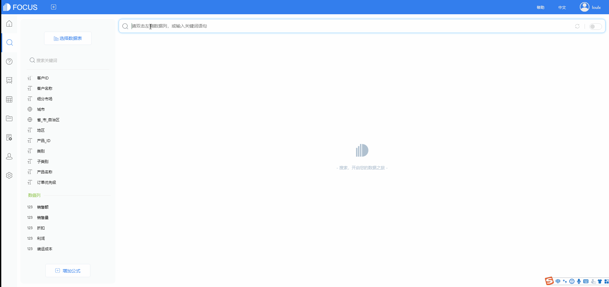

每年，国际权威分析机构Gartner发布的商业智能和分析平台魔力象限报告(《Magic Quadrant for Analytics and Business Intelligence Platforms》以下简称ABI领域魔力象限）都是BI领域最重要的风向标。

今年，Gartner分析师特别指出“分析和BI平台不再以其数据可视化功能与众不同，而这些功能已被同质化……**差异已经转移到平台如何支持增强分析**"。

可见，增强分析将成为BI平台的重要差异，在增强分析的牵引下，BI分析能力会走向更高阶的阶段。

**什么是增强分析？**

增强分析具有将传统数据分析与诸如机器学习（ML）或 （AI）之类的技术合并，以及与NLP进行细微集成的潜力，它可以帮助进行数据准备，洞察发现，共享，部署以及增强用户探索的方式并在BI平台中分析数据。

这种对数据的高级利用、操作和展现不但简化了数据处理过程，而且能够呈现出清晰的结果，为更加复杂的工具提供了资源支持，帮助商业用户做出日常决策，摒弃错误观点，准确快速地开展业务活动。

**增强分析如何改进BI工具？**

在2019甲骨文数据库云大会上，甲骨文业务数据平台相关负责人指出，数据分析发展30年以来，经历了“集中分析时代”、“自助分析时代”再到如今的“增强分析时代”，集中分析以传统BI对数据进行统一治理为特征，自助分析是对数据进行可视化和敏捷分析，而在增强分析时代，自治数据管理平台让业务数据随时在线，通过AI和机器学习提升洞察力。

增强分析主要有两种应用场景，第一是为专业的数据分析师或者数据科学家准备的，支持他们通过数据建模来完善数据分析能力；

第二种是针对普通用户，增强分析可以支持他们访问有效数据，并对理论和假设情况展开测试与验证，从而为分析计划带来更多自动化动能以及创新洞察力。

增强分析是补充而不是替代现有的企业BI，自助BI和数据科学平台。增强分析也可以嵌入到业务应用程序中，以改进决策过程。

**DataFocus的增强数据分析能力如何？**

DataFocus可以说是一款在基因中自带增强分析的数据分析工具。DataFocus中的AI助手可以理解人输入的自然语言，转化成数据问题，便捷地获取结果，高效进行数据洞察。

从诞生之初，DataFocus就在不断打磨NLP技术，将数据分析从拖拽式操作升级成搜索式操作。AI助手在自然语言问答、智能提示、智能预警等多个方向表现出色，尤其在自然语言问答上有着强大的处理能力，可以直接使用上周、今天、前10等语言进行搜索。

DataFocus的智能告警解决人为监控的诸多痛点，定时通过规则及智能算法监控异常指标，通过预设的邮件渠道通知，让分析师可以在数据发生异常波动时能及时被告知、即时处理，以避免更多损失，也能及时抓住机遇。

