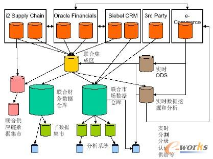
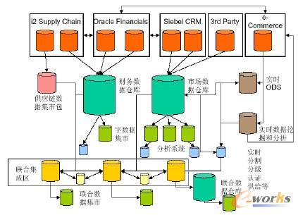
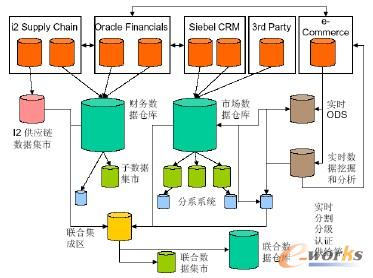
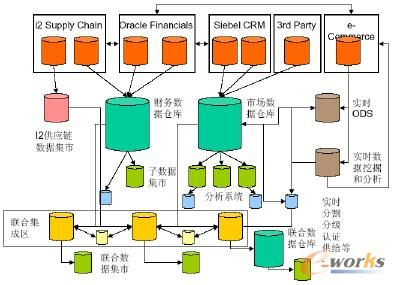
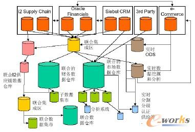

随着商务智能（BI）理论的不断发展，商务智能的系统架构已经从单一的理论衍生出多种架构，如分布式商务智能架构，联合商务智能架构等。下图是BO公司定义的商务智能的基本架构，它是一种开放式的系统架构，可以分布式集成现有的系统。从这个架构中，我们可以比较清楚的看出目前商务智能架构的模式。包括数据层、业务层和应用层三部分。数据层基本上就是ETL过程。业务层主要是OLAP和Data Mining的过程。在应用层里主要包括数据的展示，结果分析和性能分析等过程。在实际应用中，由于每个公司的规模和组织架构的不同，在实施商务智能选择系统架构的时候要结合公司的特点，选者最合适的架构。下面就介绍几种现实系统中的几种BI架构。

## 1、简单的BI架构

这是目前比较常用的商务智能架构，所有的数据集中管理，集中分析，最大的优点是容易管理和部署，系统结构简单，容易维护，适用于小型商务智能系统。缺点是对于跨地域部署比较困难，数据实时性差，可扩展性差。

    简单的BI架构

##    2、联合的BI架构（Federated BI Architecture）

这种架构比较符合实际的需求，能够集成自定义的数据仓库，外包的数据仓库，架构化的数据仓库，非架构化的数据仓库，分析系统等。应用于多数据仓库的集成和管理。特点是适用于加速time-to-market ,需要高层力量的驱动。成功关键因素：共享一致的的重要的Metrics度量和维度；需要提供统一的标准，拥有企业级的ETL工具和集成的元数据；需要贯穿于整个团队的沟通。联合的BI架构包括：集中逆向商务智能架构，分布逆向商务智能架构，集中顺序商务智能架构，分布顺序商务智能架构及混合架构等。

    联合的BI架构（Federated BI Architecture）

 

   

    **2.1 集中逆向BI架构 （Centralized Upstream BI Architecture）**

·通常用于中小组织

·需要良好的保管者的沟通

·需要高级执行者买进

·受限于逆向成功惯例（成功的变化是与任何单一实体的进行尝试是成反比的）

    集中逆向BI架构 （Centralized Upstream BI Architecture）

 

  **2.2 分布式逆向BI架构 （Distributed Upstream BI Architecture）**

·中小组织和大型组织都适用

·是大多数从下至上注重实效表现的逼近系统

·更多的考虑多数人意见

·更多的限制于大多数人意见

·实施团队需要良好的沟通

    分布式逆向BI架构 （Distributed Upstream BI Architecture）

    **2.3 集中式的顺序BI架构 （Centralized Downstream BI Architecture）**

·适用于长期数据仓库项目

·用于紧密配合多管道的在巨大组织中到处存在的DW/DM系统

·经常目标设定为特殊功能组织或行政中心

·需要高层在所有的拥有者进行决策

·需要为已有系统在实施团队和支持团队建进行良好的沟通

    集中的顺序BI架构 （Centralized Downstream BI Architecture）

 

   **2.4 分布式顺序BI架构（Distributed Downstream BI Architecture）**

·适用于大型多元化组织

·容易适应各种不同的冲突

·容易转换到不同的环境

·需要为已有系统在实施团队和支持团队间进行良好的沟通

    分布式顺序BI架构（Distributed Downstream BI Architecture）

    **2.5 混合型BI架构 （Hybrid BI Architecture）**

·比任何理想化模型更接近现实情况

·更适应自然的联盟

·元数据集成更具有挑战性

    混合型BI架构 （Hybrid BI Architecture）
