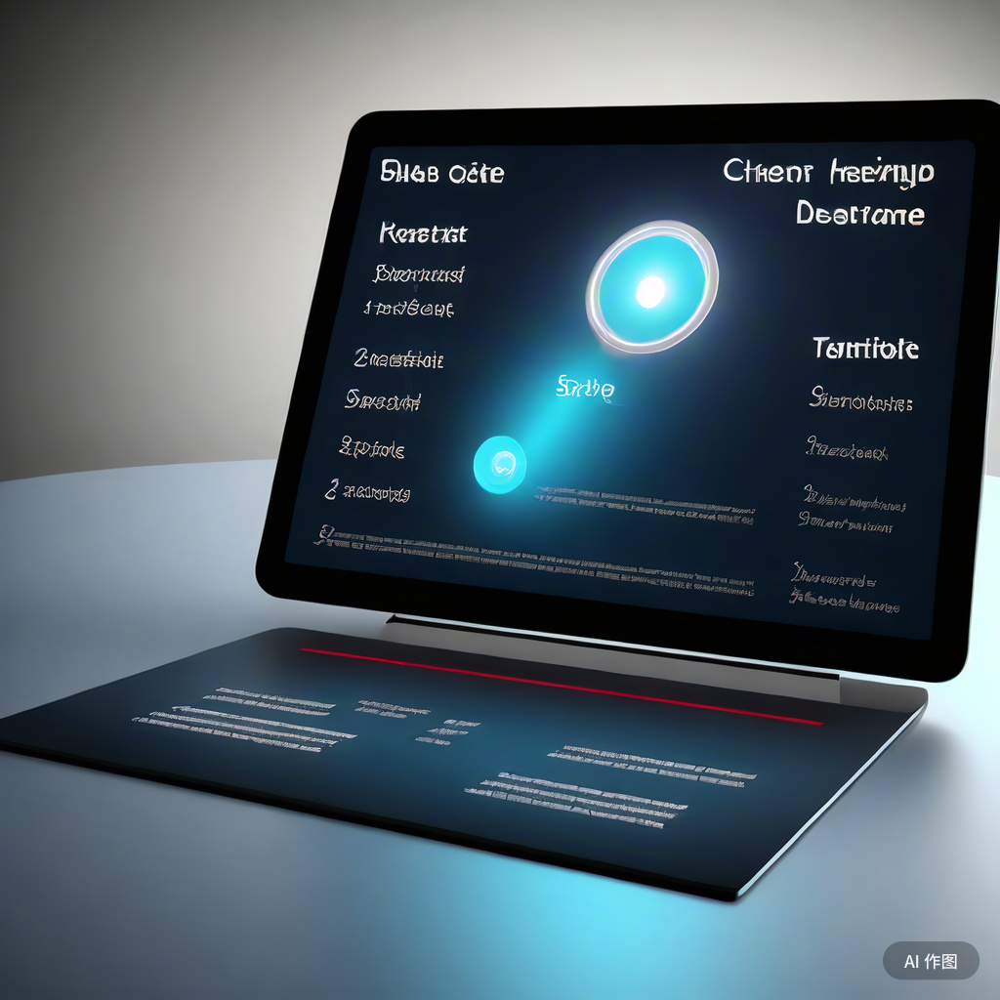

在当今数据驱动的商业环境中，CEO仪表板软件成为了企业高层管理者不可或缺的决策支持工具。一个优秀的CEO仪表板软件应当具备一系列关键功能，以确保管理者能够高效地获取、分析和利用企业运营数据。以下是在选择CEO仪表板软件时应当寻找的关键功能：

**1\. 专业数据连接器**

CEO需要全面了解企业各个部门的运营状况，因此仪表板软件应具备专业数据连接器，能够轻松整合来自不同数据源的信息，如财务、销售、市场等，从而提供一个统一的视图。

 

 

**2\. 先进的交互性**

仪表板应具备高级的交互功能，如数据钻取、时间间隔调整、图表缩放等，以便CEO能够深入探索数据，从不同角度获取洞察。

**3\. 跨设备可访问性**

CEO需要随时随地访问关键业务信息。因此，仪表板软件应支持跨设备访问，包括移动设备、台式机和平板电脑，确保信息的即时性和可达性。

**4\. 白标自定义能力**

为了提升企业形象和专业度，仪表板软件应允许用户自定义界面，包括颜色、徽标和字体等，以匹配企业的品牌形象。

 

**5\. 多种可视化选项**

数据可视化是有效传达信息的关键。仪表板软件应提供丰富的可视化选项，如图表和图形，帮助CEO直观地理解数据并快速做出决策。

**6\. 预测分析和预测功能**

基于历史数据进行预测分析是现代企业管理的重要需求。仪表板软件应具备预测功能，帮助CEO预见未来趋势，规避潜在风险，并制定前瞻性策略。

**7\. 灵活的共享选项**

CEO经常需要与其他高管、投资者或利益相关者分享信息。因此，仪表板软件应提供多种共享选项，包括通过公共URL共享、设置特定权限以及将仪表板嵌入其他应用程序或网站中。

综上所述，一个优秀的CEO仪表板软件应具备数据整合、高级交互、跨设备访问、自定义能力、丰富的可视化选项、预测分析以及灵活的共享功能。这些功能共同为CEO提供一个全面、直观且高效的决策支持平台，推动企业持续发展和创新。
