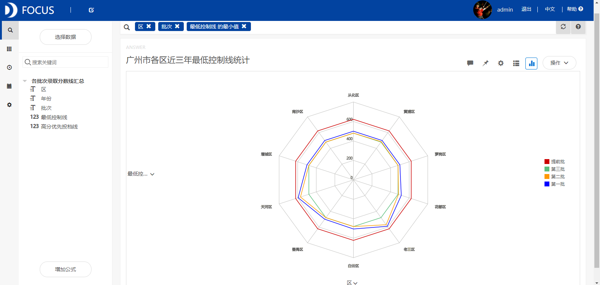
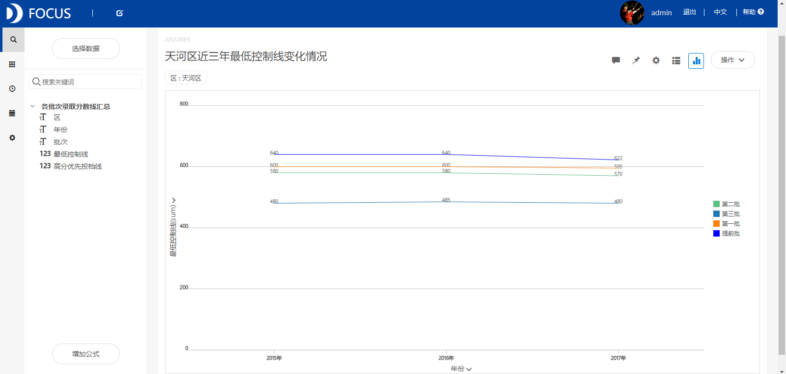
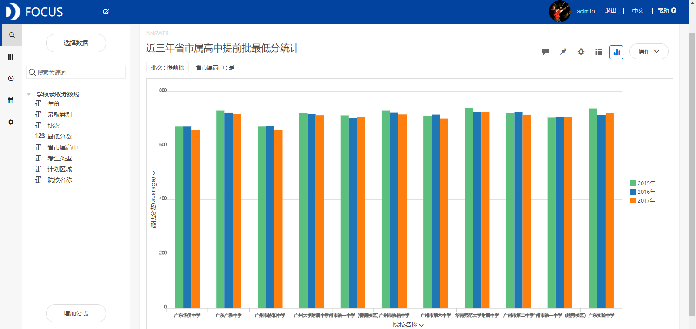
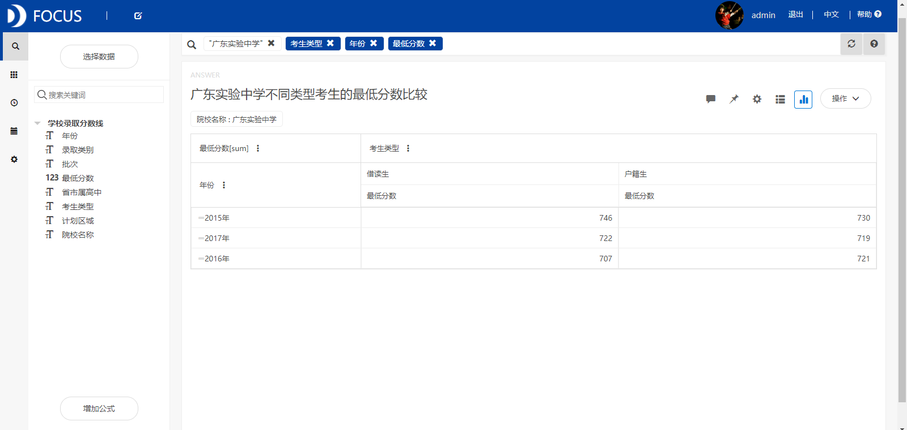
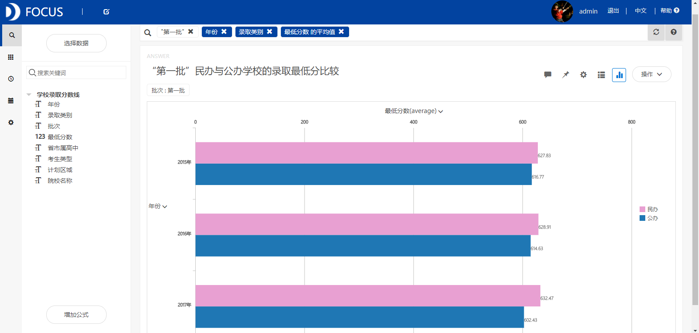
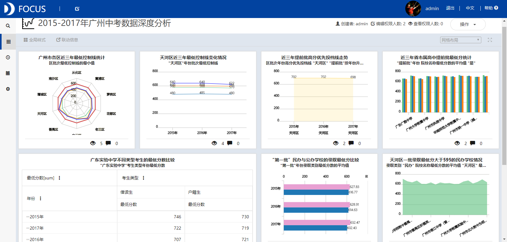

**目的：**对广州近三年来各批次各校的录取分数线进行整理和分析，以此来帮助更多的家长和孩子顺利地度过中考。

**摘要：**本文通过分析2015-2017年广州中考数据得出了以下结论：天河区提前批高分优先投档线有略微的下降，但下降的幅度不大，可以较好把握。大多数省市属高中在高分优先投档线以上完成了招生计划，省市属院校的录取分数线较稳定。广东实验中学户籍生和借读生的分数线均呈现下降趋势，两者的差距逐渐缩小，这意味着借读生的学位竞争减弱。民办学校的录取分数线普遍地高于公办学校，民办学校成为报考热点。

**关键词：**Datafocus,广州中考,最低分数线

**一、案例背景**

有人通过调查清华北大的学生发现，名校学生就读的小学和初中都籍籍无名，但是就读的高中普遍都是名校。这是因为一个好的高中可以带给学生优质的师资力量、浓郁的学习环境、开明的管理理念、良好的校园秩序、开阔的人生眼界、丰富的机会等，从而体现出中考对于一个考生未来发展的重要意义。

**二、案例问题**

本次案例首先基于2015-2017年广州中考各批次的录取分数线数据，研究广州市不同区各批次的最低录取分数线和高分优先投档线的变化情况。然后比较和分析广州市各高中院校在不同批次、录取类别、考生类型等条件下的最低录取分数。

**三、案例分析**

将分析的“各批次录取分数线汇总”和“学校录取分数线”CSV文件导入到Focus系统中。

**（一）广州市各批次录取分数情况**

**1.各区近三年最低控制线统计**

从图1中我们可以看出广州市各区的中考提前批和第三批的最低控制线没有太大的差异，而天河区第一批和第二批的最低控制线显著地高于其他地区。 

图1 广州市各区近三年最低控制线统计

**2.天河区各批次最低控制线变化情况**

筛选出天河区的录取分数线数据，分析2015-2017年该区各批次最低控制线的变化趋势。从图2中我们看到，提前批和第一、二批的最低控制线均呈现下降的趋势。 

图2 天河区最低控制线变化情况

**3.天河区提前批高分优先投档线走势**

从图3中可以看到近三年天河区提前批高分优先投档线有略微的下降，但下降的幅度不大，可以较好把握。该线基本保持在700前后，所以今年填报志愿的投档线可以702分为参考线。 

图3 近三年提前批高分优先投档线走势

**（二）提前批最低录取分数汇总**

**1.省市属高中提前批最低分统计**

筛选出省市属高中的最低录取分数线，比较这些院校近三年的录取最低分。从图4中可以看到，大多数省市属高中在高分优先投档线以上完成了招生计划，省市属院校的录取分数线较稳定。这就提醒2018年的考生想要顺利被心仪学校录取，除了在志愿填报技巧上下功夫之外，更重要的还是要把成绩提上去。****

图4 近三年省市属高中提前批最低分统计

**2.广东实验中学不同类型考生的最低分数比较**

筛选出广东实验中学的录取分数数据，比较不同考生类型的最低分数线。从图5中发现该校户籍生和借读生的分数线均呈现下降趋势，两者的差距逐渐缩小，这意味着借读生的学位竞争减弱。 

图5 广东实验中学不同类型考生的最低分数比较

**（三）第一批最低录取分数汇总**

**1.民办与公办学校的录取最低分比较**

从图6中发现近三年民办学校的录取分数线普遍地高于公办学校，民办学校成为报考热点，这源于广州市的异地中考政策，“四个三”让许多不满足条件的考生往民校集中，成为民校生源主力军。  图6 民办与公办学校的录取最低分比较

**2.天河区录取最低分大于595的民办学校统计**

天河区一批录取的最低分为595分，因此筛选出最低分数大于595分的民办学校。从图7中可以看到黄冈中学广州学校、中山大学附属中学、广州大学附属实验中学和广东实验中学附属天河学校的录取分数线在天河区是相对较高的。****

图7 天河区一批录取最低分大于595的民办学校情况

**（三）数据看板**

最后将这7个结果图导入“2015-2017年广州中考数据深度分析”数据看板中，操作结果如下： 

图8 数据看板

**四、结论**

广州市天河区提前批高分优先投档线有略微的下降，但下降的幅度不大，可以较好把握。大多数省市属高中在高分优先投档线以上完成了招生计划，省市属院校的录取分数线较稳定。广东实验中学户籍生和借读生的分数线均呈现下降趋势，两者之间的差距逐渐缩小，借读生的学位竞争有所减弱。近三年民办学校的录取分数线普遍地高于公办学校，民办学校成为报考热点，这源于广州市的异地中考政策，“四个三”让许多不满足条件的考生往民校集中，成为民校生源主力军。

**五、对策建议**

省市属高中的高分优先投档线基本保持在700前后，所以今年填报志愿的投档线可以702分为参考线。大多数省市属高中在高分优先投档线以上完成了招生计划，省市属院校的录取分数线较稳定。这就提醒2018年的考生想要顺利被心仪学校录取，除了在志愿填报技巧上下功夫之外，更重要的是要把成绩提上去。民办学校成为高考热点的情况在短期内不会改变，因此今年报考学校的考生要预估好成绩，抛开不稳定因素，不以变化幅度大的学校录取分数线为参考标准。而是要以多个分数线，结合最新的情况报道综合考量。
