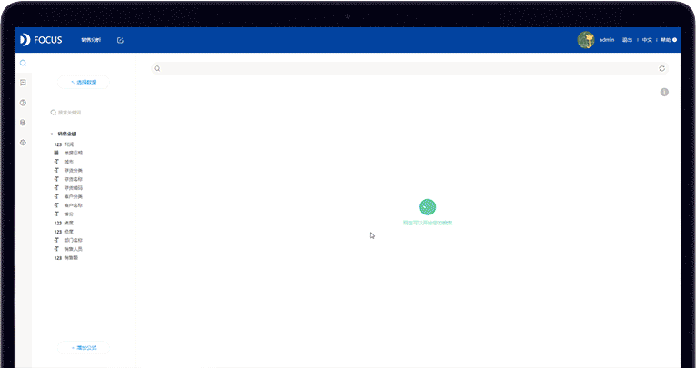

原始数据的质量和维度不一定能满足数据分析的需求。因此，将原始数据导入到DataFocus系统后，还需要对数据表以及数据进行进一步的处理，以便更高效地完成数据分析。在DataFocus中，既保留了其余平台的数据处理功能，也有很多独创性、便捷性的数据处理方式。下面就一起了解一下吧。

**1\. 创建关联关系**

在企业实际应用中， 需要分析的数据往往来自于多个不同的数据表，例如分析企业全面的销售情况， 则需要对销售订单数据表、销售交货数据表、 销售发货数据表等一系列销售相关的数据表进行联合查询分析，不能只单独查看分析某一个数据表。

因此我们需要为相关的数据表创建关联关系。通俗地讲，相当于Excel中的Vlookup功能。即通过多个表之间的某一列或者某几列进行匹配，然后将这几个表关联起来。

关联方式支持一对一、一对多、多对一以及多对多，关联类型可以分为内连接、左连接、右连接，最多可以有5层级的关联关系。创建关联关系后，就可以支持跨表查询与分析，轻松实现不同数据来源数据的联立分析。

**2\. 中间表的应用**

DataFocus的中间表，可以帮助用户轻松筛选数据列，用来将复杂的数据表简化。如选取某几列创建中间表，再用此中间表进行分析，可以提升效率。

或者将通过公式计算得到的数据列保存为中间表中的原生维度，从而提高系统分析效率。

还可以通过创建中间表，将有关联关系的多张数据表中的列整合成一个中间表，实现了不同数据源数据的快速整合与处理。

_图：创建中间表_

**3\. 灵活的公式应用**

公式是最常用的数据处理手段。可以通过公式轻松创建原始数据中没有的新维度，如比率等。

DataFocus Cloud 支持在搜索页面添加公式，可以嵌套使用，包括聚合公式、分析公式、格式转换公式、日期公式、逻辑操作符、文本公式等。在创建公式时，支持智能提示功能，用户可以选择系统提示词来创建公式。

_图：灵活的公式应用_

**4\. 行列转换/列拆分**

行列转换与列拆分是数据处理的基础功能，DataFocus Cloud的特点在于操作简单、快速，而且可以将拆分结果保存为中间表，不破坏原表的结构。

**5\. 快速筛选过滤**

DataFocus Cloud支持多种数据筛选过滤方式。除了常规的勾选过滤之外，DataFocus还提供了**在搜索框中输入筛选条件进行过滤的方式，另外复制粘贴筛选值可以实现批量筛选**，比市面上大多数数据分析工具更全面、更方便、更灵活。

_图：搜索框筛选过滤_

**注：文末福利来了！DataFocus Cloud正在火热公测中，现邀请产品体验官免费试用，在云端感受数据分析的乐趣！**
