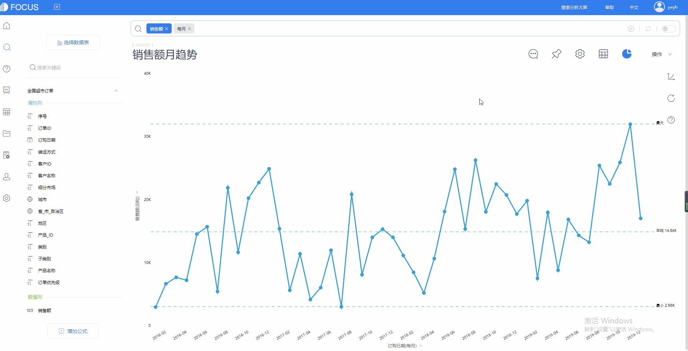
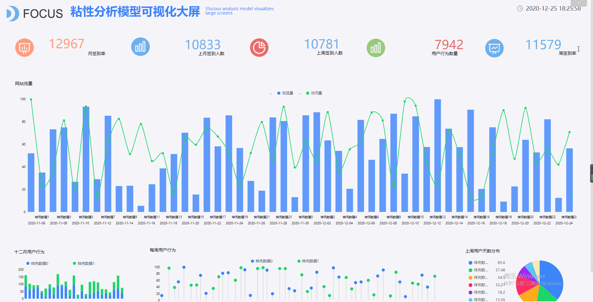
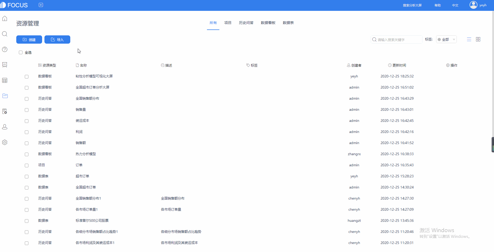

海量数据的迁移就像是候鸟因季节不同周期性而进行的大规模迁徙。

数据由一个环境转移到另一个环境，如果没有一款强大的工具，那就会像候鸟迁徙一样需要漫长的等待时间。不仅是时间成本大，同时如果需要繁琐复杂的操作步骤也会是一件特别头疼的事情。

除了数据的迁移，信息的传递与分享也是企业中关键的一环。

数据分析，不仅要获得从数据中挖掘出来的宝藏信息，还要及时地把这个信息传递、分享给其他人。不被看见的信息价值为0，而被传递后的信息会带来成倍的价值。

因此，一款优秀的数据分析工具不仅能帮助您更快更容易地数据分析，还应该帮助您轻松完成数据迁移以及信息的传递与分享。

DataFocus Cloud，零成本高效率数据迁移，支持免登录查看历史问答或可视化大屏，还支持跨平台掌握数据动态，为您的数据分析更贴心地服务。

数据迁移随心所欲

有时候我们的数据因为各种变化需要更换一个环境，或者你需要取出数据分析信息即刻使用。DataFocus Cloud可以帮助你随心所欲地导出你所需要的历史问答、数据看板。

支持将历史问答以csv或图片格式导出，如图所示。

 支持将数据看板以PDF形式导出。

你还可以直接批量导出历史问答、数据看板，更快更高效。

免登录查看信息

如果你想把信息分享给还没有使用DataFocus的小伙伴，大多数软件都只能靠截图。

而DataFocus Cloud可以将当前历史问答或数据看板生成外部查看地址，复制地址分享给其他用户查看。该用户无需登陆DataFocus Cloud账号，即刻查看地址，为您直接跳过复杂的步骤。

内部分享信息

企业内部往往更需要信息的分享，以便进一步的沟通交流得到更多的信息。

DataFocus可以帮助您将历史问答分享给系统内部的其他用户或角色，并且可对被分享用户或角色设置编辑或查看权限。而收到分享的用户将会收到系统提示。

支持钉钉、企业微信

DataFocus Cloud现已完美匹配钉钉、企业微信，便于用户随时掌握数据动态，及时制定措施及方针。

填写配置信息连接完成后，打开钉钉或企业微信可以在应用中打开DataFocus Cloud，随时随地查看数据动态。

DataFocus Cloud助您更快地传递、共享信息，更有效提升信息价值。

那么问题来了，这样一款软件在哪里可以使用呢？
