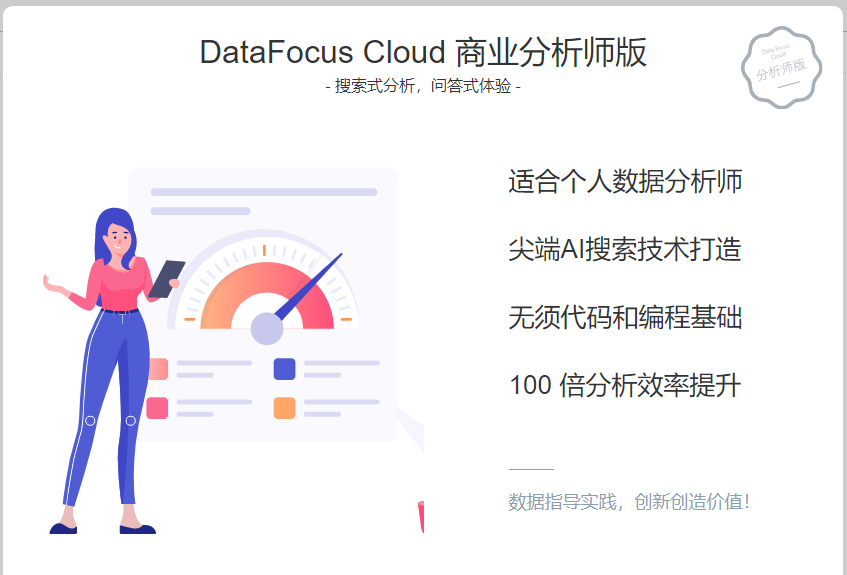

DataFocus Cloud推出了更强大的功能来帮助您更快更轻松地完成数据分析。DataFocus Cloud包括商业分析师版、企业共享版和企业专享版三个不同的版本。全部功能包括开箱即用、智能分析、云端数仓、多终端支持等，助您以无与伦比的速度理解数据并获得见解。

**2020年12月18日，DataFocus Cloud商业分析师版正式测试上线！**

快来看看DataFocus的亮点功能有哪些~

> 开箱即用

DataFocus Cloud颠覆了传统作业模式，采用**AAAS（Analysis as a services）分析即服务模式**。

传统模式下，厂商通过License将软件产品部署到企业内部多个客户终端实现交付。而DataFocus Cloud定义了一种新的交付方式，让数据分析进一步回归服务本质，即分析本身成为服务。

企业部署信息化软件的本质是为了自身的运营管理服务，软件的表象是一种业务流程的信息化，本质还是第一种服务模式，DataFocus Cloud改变了传统软件服务的提供方式，减少本地部署所需的大量前期投入，进一步突出信息化软件的服务属性，符合未来信息化软件市场的主流交付模式。

DataFocus Cloud简单的部署下，您无需购买任何硬件，只需要简单地在云端注册登录即可。另外不需要软件的升级、维护和管理人员，也不需要为维护和管理人员支付额外费用。

您连接到网络，就可以访问系统。

> **云端数仓**

DataFocus Cloud自带基于云计算、支持大规模并行处理的数据仓库，给予您无限扩展的计算和存储资源支持。

使用云数据仓库，您能够快速在云端搭建TB级-PB级数据仓库，无需关注集群的管理以及繁重的运维工作。通过在控制台的操作，即可实现集群管理、监控维护等工作。

DataFocus Cloud支付的费用远低于自建数据库所需的成本，使用很低的价格就可以得到一整套专业的数据库支持服务。

如今数仓上云已被行业看作未来发展趋势，这极大降低了成本和使用门槛，尤其当数据需要迁移，则要收取一笔昂贵的费用，而推出在云上的部署可减轻企业对某一厂商的依赖，更灵活自由地使用。

安全方面还解决了备份、容灾等问题。此外，用户集群独立部署支持 VPC 隔离，数据访问安全多重保障。

> **智能分析**

DataFocus Cloud一贯延续了原有搜索式分析的产品亮点，通过链接企业各种数据源，为您整合所有的数据资产。在此基础上， 您只需要通过搜索问答的方式向它提问。精通业务的非工程技术人员，经过半小时的培训，即可熟练掌握， 7分钟即可开发一个完整的数据可视化大屏。

> **多终端支持**

DataFocus Cloud支持多个终端，无论是电脑、平板，还是手机终端，您可以通过浏览器、企业微信随时、随地、随意选择终端进行数据分析。

> **总结**

DataFocus Cloud是在保留搜索式分析、可视化图表原版功能的基础上进行的一次变革创新，颠覆传统作业模式，采用AAAS（Analysis as a services）分析即服务模式，为企业提供敏捷、高效的数字化基础设施以及软件运行平台，免去传统软件高昂的硬件安装和运维成本，引领BI进入云时代。
