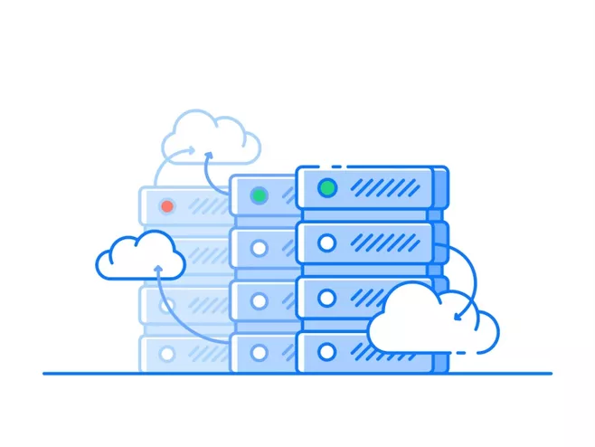

人工智能、SaaS部署、搜索、数据分析、云时代、可视化，这些词能组合成什么? 是DataFocus Cloud！首款SaaS部署的中文自然语言搜索式数据分析产品，重磅来袭！

在原来的搜索式分析、交互式体验的基础上，DataFocus又在创新上更近一步，将整个系统搬到了云端，帮助用户省去复杂的安装步骤，直接像使用搜索引擎一样，方便、快捷地使用数据分析工具，成为数据精英之路，只需一步！

**更智能：AI驱动**

搜索是典型的人工智能产品。用户主动输入“关键词”，搜索引擎对关键词语义分析、关联度匹配及结果排序，本身就是机器的学习过程。人工智能时代，搜索将不限于搜索框、不限于设备、不限于屏幕，搜索会变得无时不在、无处不在，其市场规模之大会远超任何人的想象。

而DataFocus，就将搜索技术创新性地运用到了数据分析领域，创造出了**同时支持中英文自然语言搜索、属于数据分析领域的搜索引擎**。DataFocus的智能AI可以理解关于数据的问题，并以丰富的图表直接回答关于数据的问题。DataFocus使用起来像谷歌、百度搜索一样简单，学习成本非常低，系统的机器学习模块能够自动学习用户的输入习惯，给出相应的提示，**让整个系统在使用过程中越来越智能**。

2018年的产品发布会之后，DataFocus产品团队持续深耕NLP顶层技术、AI深度交互技术，让AI成为产品的核心驱动力。

**更便捷：SaaS部署**

早在1999年，Salesforce 就提出了"软件已死"的口号，开创了软件即服务（SaaS）模式。SaaS模式在中国经过10多年的发展，逐渐被越来越多企业接受。而在数据分析领域，**DataFocus继续做行业的引导者，快速响应发展趋势，DataFocus Cloud版应运而生。**

使用DataFocus Cloud，不再需要购买任何硬件，只需在云端注册登录即可。另外不需要软件的升级管理，也不需要为维护和管理人员支付额外费用，极大地降低了企业的运营成本。而针对个人用户推出的“商业分析师版”，能够很好地满足个人数据分析需求，让人人成为数据精英。

**更高效：云数仓**

尽管大数据这个概念十分热门，但回到现实中，很多企业仍然面临着苦恼的数据问题。对于运行多年的企业系统，数据量以几何倍数增长，普通BI系统难以承受。数据耦合度高，多系统并行回归困难，关联性差导致隐性风险增加，数据孤岛化等等。

虽然不少企业都想使用大数据技术，但却因为使用技术门槛高、维护难、人力成本高

而望而却步。

DataFocus Cloud为了解决这些问题，自带基于云计算、支持大规模并行处理的数据仓库，给企业提供无限扩展的计算和存储资源支持。使用云数据仓库，能够快速在云端搭建TB级-PB级数据仓库，无需关注集群的管理以及繁重的运维工作，这极大地降低了成本和使用门槛，尤其当数据需要迁移时，省去昂贵的费用。

更多功能详解，欢迎回顾DataFocus Cloud线上直播发布会，和DataFocus一起引领数据分析云时代！
