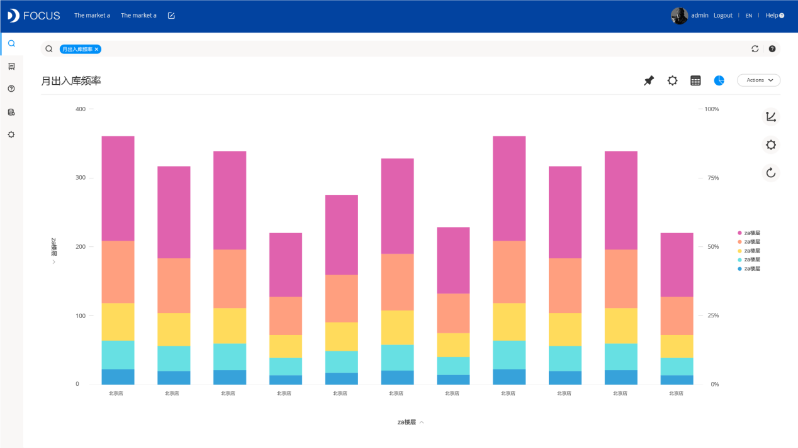
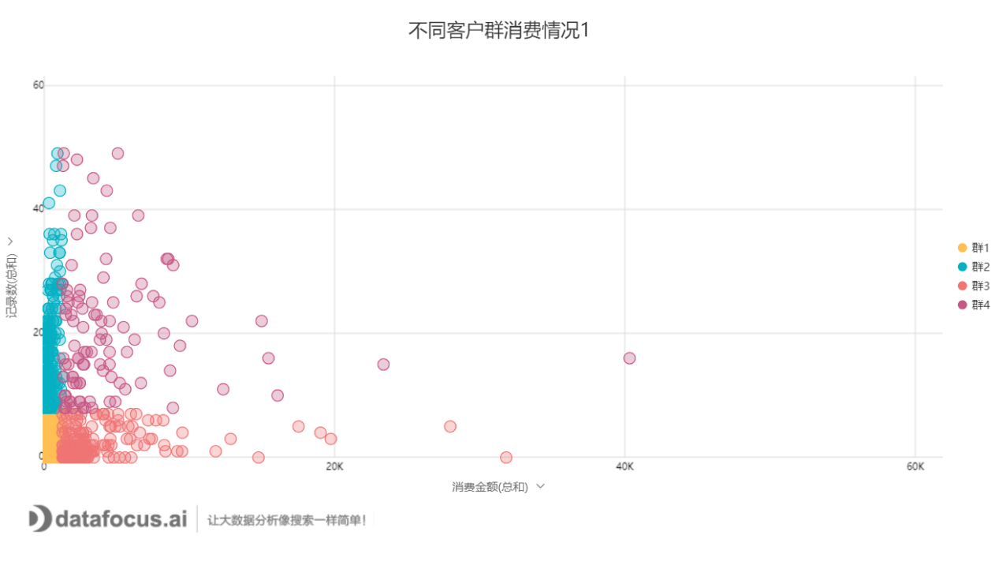

Datafocus发布全球首个中文自然语言数据分析系统

有了AI加持的商业智能，企业大数据分析迎来无限可能：不需IT支持，所有角色可以在分秒内直接搜索想要的分析报表；不需冗长等待，可以在一场电影的时间完成部署；不需繁琐调整，可以处理实时多变的需求 

在数字时代，被行业定义为“中国BI的未来”的中文自然语言搜索引擎，即将在杭州正式亮相。8月3日，Datafocus 2018年度“重新定义BI”发布会将在杭州市滨江区智慧e谷盛大举办。据悉，Datafocus基于自主研发的NLP顶层技术、AI深度交互技术和雪花模型等专利算法技术，可以为企业带来真正高效、快捷、便利的大数据分析应用体验，从而让商业智能更智  **像搜索一样简单**

**全面挖掘的AI为企业大数据分析省时、省力、省钱**

AI是人工智能（Artificial Intelligence）的缩写。它是[研究](https://baike.baidu.com/item/%E7%A0%94%E7%A9%B6/1883844" \t "_blank)、[开发](https://baike.baidu.com/item/%E5%BC%80%E5%8F%91/9400971" \t "_blank)用于[模拟](https://baike.baidu.com/item/%E6%A8%A1%E6%8B%9F/7698898" \t "_blank)、[延伸](https://baike.baidu.com/item/%E5%BB%B6%E4%BC%B8/7834264" \t "_blank)和扩展人的[智能](https://baike.baidu.com/item/%E6%99%BA%E8%83%BD/66637" \t "_blank)的理论、方法、技术及应用系统的一门新的技术科学。AI的主要目标是使机器能够胜任一些通常需要人类智能才能完成的复杂工作，尤其是在BI领域，数据量骤增、需求多变、人工成本、数据打通等问题都需要人为不断的解决和优化，而自然语言搜索引擎却能让此类问题迎刃而解。

**解决BI在To B领域关于定制化项目制及标准化产品式的矛盾**

业内人士介绍，目前的BI产品存在一个悖论，即用户需求的个性化和产品本身的标准化。项目制的BI几乎完全基于客户个性化需求，而技术人员日日夜夜将因客户的多变需求而疲于奔命，客户也无法实时得到相应结果。标准化的BI产品（如SaaS版本）又难以满足客户的个性化需求。于是乎，自然语言搜索能够很好的解决此悖论。在此之前，自然语言搜索的核心技术几乎全部掌握在海外企业手中，Microsoft（微软）在其产品Power BI中提到：自然语言搜索仅支持英文。

DataFocus依托自身技术优势，积极开发打磨的同时，携手产业合作伙伴，从架构到产业链，从数据搜索、语义解析、机器学习、可视化、内存计算、分布式引擎，到最后简洁明了的DataFocus系统，共同攻破了一道道技术及研发难题，打造了高度智能化的商业解决方案，实现了亿级数据秒级响应，在中国商业智能领域取得了突破性进展。

DataFocus总裁王碧波表示，耐心研发，高度打磨，是为了更好的服务于客户、服务于市场，最终实现行业乃至产业共赢。在“数字中国”发展框架下，DataFocus将持续通过创新、开放、协同，与产业各界共同推进在大数据、云计算、人工智能、商业智能等信息领域的新突破，在当今的信息技术革命浪潮中，走出一条创新之路、弯道超车之路。

最后，欢迎各位莅临DataFocus 2018年度产品发布会，共同见证中国商业智能大数据分析领域的新变革。（发布会图片） 
